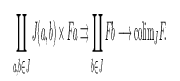
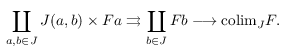

Here's a fun one: when previewing LaTeX fragments via AUCTeX's
`preview.el` library (whether it be in a .tex buffer, or—via
[org-auctex]—in Org) things get _really_ messed up when one or more
monitors are set up in portrait mode.

<!--more-->

When you have two monitors oriented vertically, previews might end up
looking something like this:

<p style="text-align:center;">
  
</p>

With the perhaps more common setup of one vertical and one horizontal
monitor, you could instead get the charming

<p style="text-align:center;">
  
</p>

Imagine a whole page of this—things get pretty funky.  Being a boring
person, I would rather prefer the much more ordinary looking

<p style="text-align:center;">
  
</p>

Thankfully, this isn't so complicated.  Looking into `preview.el`, we
get the geometry of the frame from `preview-get-geometry`.  At least,
this is what `preview-generate-preview` calls before delegating the
heavy lifting to some internal functions.  After staring at the former
function for a while, one can single out `preview-get-dpi` as the main
culprit.  It seems to calculate the "resolution" of the preview:

``` emacs-lisp
  (defun preview-get-dpi ()
    (let* ((monitor-attrs (frame-monitor-attributes))
           (mm-dims (cdr (assoc 'mm-size monitor-attrs)))
           (mm-width (nth 0 mm-dims))
           (mm-height (nth 1 mm-dims))
           (pixel-dims (cl-cdddr (assoc 'geometry monitor-attrs)))
           (pixel-width (nth 0 pixel-dims))
           (pixel-height (nth 1 pixel-dims)))
      (cons (/ (* 25.4 pixel-width) mm-width)
            (/ (* 25.4 pixel-height) mm-height))))
```

Monitor details are returned by the `frame-monitor-attributes` function;
its output for a horizontal monitor is

``` emacs-lisp
  '((name . "DP1")
    (geometry 0 0 1920 1080)
    (workarea 0 0 1920 1080)
    (mm-size 530 300)
    (frames <<omitted>>)
    (source . "XRandR 1.5"))
```

While the same monitor in "vertical-mode" returns

``` emacs-lisp
  '((name . "DP1")
    (geometry 0 0 1080 1920)
    (workarea 0 0 1080 1920)
    (mm-size 530 300)
    (frames <<omitted>>)
    (source . "XRandR 1.5"))
```

Crucially, the physical width and height of the monitor don't change,
but the _geometry_—the pixel width and height—does; you can `C-h f
display-monitor-attributes-list RET` for more information.  This means
that in portrait mode, we actually compare the pixel _width_ of the
monitor with its physical _height_, as well as its pixel height with its
width.  Naturally, and depending on the specific setup, this produces
too narrow or too wide previews.

The solution is to only compare the comparable values.  Indeed,
overriding the built-in `preview-get-dpi` function with

``` emacs-lisp
  (defun preview-get-dpi ()
    (-let (((&alist 'mm-size (mw mh)
                    'geometry (_ _ pw ph))
            (frame-monitor-attributes)))
      (cons (/ (* 25.4 (max pw ph)) (max mw mh))
            (/ (* 25.4 (min pw ph)) (min mw mh)))))
```

produces the correct behaviour!  This implicit assumption—that monitors
are generally wider than they are tall—of `preview-get-dpi` should
probably be fixed; I will report it as an Emacs bug.

As an aside, this is an excellent opportunity to see the ergonomic
benefits of the [dash.el] library.  Compare the readability of the
"fixed" implementation using `-let` to the original one above.  I
certainly know which of the two I'd rather write!

[org-auctex]: https://github.com/karthink/org-auctex
[dash.el]: https://github.com/magnars/dash.el
