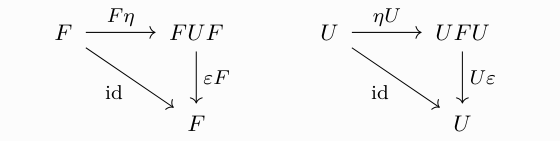
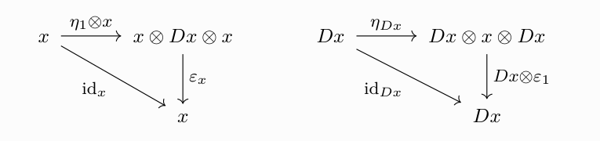

I have a new preprint [on the arXiv][the paper]!  It is joint work with
Sebastian Halbig, and concerns itself with the interplay of different
structures on monoidal categories that give rise to a notion of
"duality".  At five pages, it is a very short paper; yet I'd still like
to give a little teaser as to what kind of question we sought to answer.

[the paper]: https://arxiv.org/abs/2301.03545

<!--more-->

# Setting the scene

We mainly concerned ourselves with three notions of *duality* for
(non-symmetric!)  [monoidal] categories: [closed monoidal] categories,
[\*-autonomous][^1] categories, and [rigid (monoidal)] categories.  It
is well-known that these concepts are all connected in the following
way.

> 1. Every \*-autonomous category is closed monoidal.
>    For all $x, y \in \mathcal{C}$, the internal-hom $[x, y]$
>    is given by $D^{-1}(Dy \otimes x)$, where $D$ is the duality
>    functor.
>
> 2. Every rigid monoidal category is \*-autonomous.  The internal-hom
>    then simplifies to $[x, y] = y \otimes x^*$, where ${-}^*$ is the
>    duality functor.

An obvious next question one could ask is: does this already
characterise rigid and \*-autonomous categories?  More explicitly, are
there any conditions one could impose on the internal-hom, such that
closedness already implies rigidity?  What about \*-autonomy?

# \*-autonomy

We'll start with a positive result for \*-autonomy.  So the question is
this: given a closed monoidal category $\mathcal{C}$ in which the
internal-hom is given by tensoring with another object, is this category
already \*-autonomous?

More formally, is it true that $\mathcal{C}$ is \*-autonomous if
for all $x \in \mathcal{C}$, there exists an object
$Dx \in \mathcal{C}$, such that there is an adjunction
$$
  {-} \otimes x \dashv {-} \otimes Dx?
$$

Almost!  In good cases, we can recover what we want from just a little
extra condition:

> Let $\mathcal{C}$ be a monoidal category.  Suppose that for all
> $x \in \mathcal{C}$ there exist objects
> $Lx, Rx \in \mathcal{C}$, such that we have adjunctions
> $$
>   {-} \otimes Lx  \dashv  {-} \otimes x  \dashv  {-} \otimes Rx.
> $$
> Then $\mathcal{C}$ is \*-autonomous.

Using the notion of a \*-autonomous category of [[BD13]]—that is, for
every $x \in \mathcal{C}$ the functor $\mathcal{C}({-} \otimes x, 1)$ is
representable by $Dx$—this becomes an exercise in "Yoneda Yoga".  More
precisely, one uses the fact that the Yoneda embedding is fully faithful
a lot.  Try it yourself!

# Rigidity

At first sight, it's not even clear there is anything to show for
rigidity.  Something one is immediately tempted to do is to conjecture
the following:

> A closed monoidal category $\mathcal{C}$ is rigid monoidal
> if for all $x \in \mathcal{C}$ we have
> $[x, {-}] \cong {-} \otimes Dx$, for some object assignment
> $D \colon \mathrm{Ob}\,\mathcal{C} \to \mathrm{Ob}\,\mathcal{C}$.

This seems sensible; after all, the snake identities of an adjunction
look almost completely the same as the ones for a dual![^2] However, if
one sits down and actually writes down the diagrams, something doesn't
quite fit.  As a reminder, suppose we have an adjunction
$F\colon \mathcal{C} \leftrightarrows \mathcal{C} : \! U$ with unit
$\eta \colon \mathrm{Id}_{\mathcal{C}} \Longrightarrow U F$
and counit
$\varepsilon \colon F U \Longrightarrow \mathrm{Id}_{\mathcal{C}}$.
The snake identities for this adjunction look like

In particular, we get two such diagrams if we apply everything to the
monoidal unit $1 \in \mathcal{C}$.  Specialised to the adjunction
${-} \otimes x \dashv {-} \otimes Dx$ the above then becomes

These are just the snake identities for duals if we make the definitions
$\mathrm{ev}_x ≔ \varepsilon_1$ and $\mathrm{coev}_x ≔ \eta_1$, right?
Wrong!  In the latter case we, for example, require that
$$
  (x \otimes \varepsilon_1) \circ (\eta_1 \otimes x) = \mathrm{id}_x.
$$
However, the above diagram does *not* say that!  It says that the
relation
$$
  \varepsilon_x \circ (\eta_1 \otimes x) = \mathrm{id}_x
$$
holds.  This means that we would have to impose the additional
conditions that $\varepsilon$ and $\eta$ are morphisms of modules; i.e.,
$\varepsilon_x \overset{\scriptsize{!}}{=} x \otimes \varepsilon_1 = x \otimes \mathrm{coev}_x$,
as well as a dual statement.  This is not the case in general.

Finding a counterexample now works by exploiting exactly this fact: we
write down a syntactic category $\mathcal{D}$ that is generated by a
family of morphisms
$$
  \eta_{m, n} \colon m \to m \otimes n \otimes n
  \qquad \text{and} \qquad
  \varepsilon_{m, n} \colon m \otimes n \otimes n \to m,
$$
and impose relations guaranteeing the naturality of these arrows.  There
is a subcategory $\mathcal{C}$ of $\mathcal{D}$ in which we additionally
require $\eta$ and $\varepsilon$ satisfy the snake equations of an
adjunction.  One can now show that the category $\mathcal{C}$ is closed
monoidal, with the appealing adjunction
$$
  {-} \otimes n \dashv {-} \otimes n.
$$
However, it is not rigid!  The proof exploits certain strong monoidal
functors to the category of finite-dimensional vector spaces, and shows
that the subset of arrows *in $\mathcal{D}$* that contains one of the
snake identities for duals is (i) closed under exactly these relations,
and (ii) all morphisms in this set have length at least two.  Hence, if
we project any morphism down to $\mathcal{C}$, it can't possibly be the
identity, and thus the snake identities for duals do not hold.  If you
want more details, check [the paper]!

[\*-autonomous]: https://ncatlab.org/nlab/show/star-autonomous+category
[[BD13]]: https://zbmath.org/1370.18007
[closed monoidal]: https://ncatlab.org/nlab/show/closed+monoidal+category
[monoidal]: https://ncatlab.org/nlab/show/monoidal+category
[rigid (monoidal)]: https://ncatlab.org/nlab/show/rigid+monoidal+category
[the paper]: https://arxiv.org/abs/2301.03545

[^1]: Or rather, a non-symmetric variant of it called an *r-category* in
      [[BD13]].

[^2]: This is not a coincidence; for example, adjoints in the monoidal
      category $([\mathcal{C}, \mathcal{C}], \circ, \mathrm{Id})$ are
      exactly duals!.
