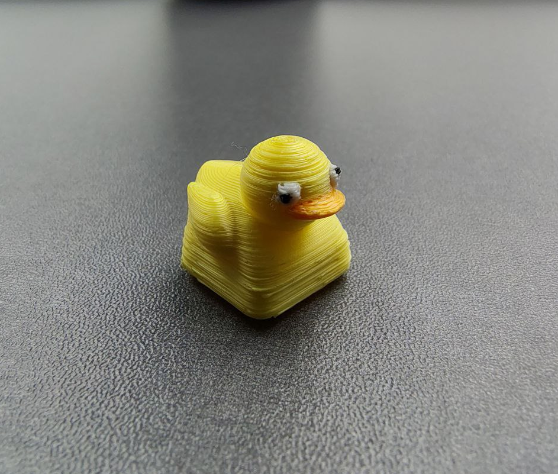
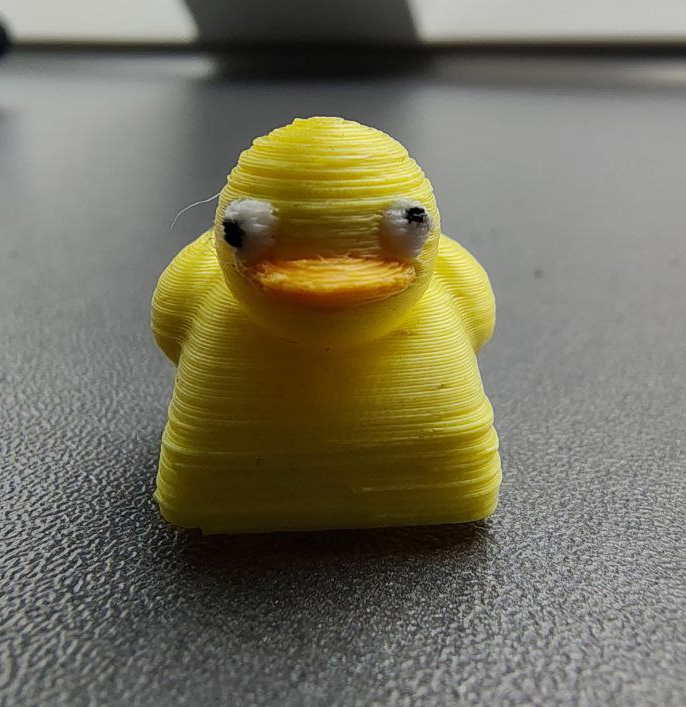

I have a duck on my keyboard now.[^1]

<!--more-->

I got it from the mechanical keyboard meetup at
[39C3](https://events.ccc.de/congress/2025/infos/startpage.html). It's
straight out of a—judging by the quality of the print—cheap 3D printer,
and looks like just about the derpiest duck one can imagine:

<figure>
  
  
</figure>

What does it do? Since the key is in one of the
[inaccessible-ish](https://tony-zorman.com/posts/atreus-review.html#physical-layout)
positions on the Atreus, and hitting the duck all the time is quite
mean, I think there's only one obvious choice.[^2]

<p>
  <video width="100%" controls>
    <source src="../images/duck/duck.mp4"
              type="video/mp4">
  </video>
</p>

<div style="text-align: center;">
  
</div>

The implementation is what one would expect, but if you're still reading
this I might as well show you some hacky code. The basic flow is quite
simple: upon pressing (or holding down) the key, generate some unique
key combination, match on that combination in my XMonad configuration,
and defer the rest to a bash script.

I already have a [tap dance](https://docs.qmk.fm/features/tap_dance)
setup with QMK; the basic idea is that each tap dance key `TDKEY`
defines a function like the following:

``` c
typedef enum { // Tap dance state
  TD_NONE, TD_UNKNOWN, TD_SINGLE_TAP, TD_SINGLE_HOLD, TD_DOUBLE_TAP,
} td_state_t;


static td_state_t TDKEY_state = TD_NONE;

void TDKEY_finished(tap_dance_state_t *state, void *user_data) {
  TDKEY_state = cur_dance(state);
  switch (TDKEY_state) {  // what to do on key press
  case TD_SINGLE_TAP : …; break;
  case TD_SINGLE_HOLD: …; break;
  case TD_DOUBLE_TAP : …; break;
  default:                 break;
  }
}

void TDKEY_reset(tap_dance_state_t *state, void *user_data) {
  switch (TDKEY_state) {  // what to do on key release
  case TD_SINGLE_TAP : …; break;
  case TD_SINGLE_HOLD: …; break;
  case TD_DOUBLE_TAP : …; break;
  default:                 break;
  }
  TDKEY_state = TD_NONE;
}
```

For example, I mapped the keys to output `M-C-S-v 2`—I figured that even
with my crazy keybindings it's quite unlikely I'll ever press that by
accident.

My [xmonad.hs](https://codeberg.org/slotThe/dotfiles/src/branch/main/xmonad/xmonad.hs)
then just needs support for that keybinding

``` haskell
  ("M-C-S-v 2", spawn "~/.scripts/duck.sh")
```

and then the script does something like

``` shell
if ! xdotool search --name --classname duckmpv; then
    mpv --x11-name=duckmpv ~/duck/rick-roll.webm &
    p=/sys/devices/platform/tuxedo_keyboard/leds/white:kbd_backlight/brightness
    for _ in {0..10}; do
        for i in {1..5} {4..0}; do echo "$i" > "$p"; sleep .03s; done
    done
fi
```

The relevant diffs for
[QMK](https://github.com/slotThe/qmk_firmware/commit/3841ac9f09fba488f3abf9b138dfee264e707b93),
and [the rest](https://codeberg.org/slotThe/dotfiles/commit/826295572b54e06b2aaa8719283d162782566228)
of my config are available.

[^1]: {-} This is basically the entire post. I'm just, unexpectedly,
      *really* excited about this.

[^2]: {-} 󠀠

      I normally have the Atreus sitting directly on my laptop keyboard
      (with it disabled), but of course I wanted to showcase the
      backlight party as well.
