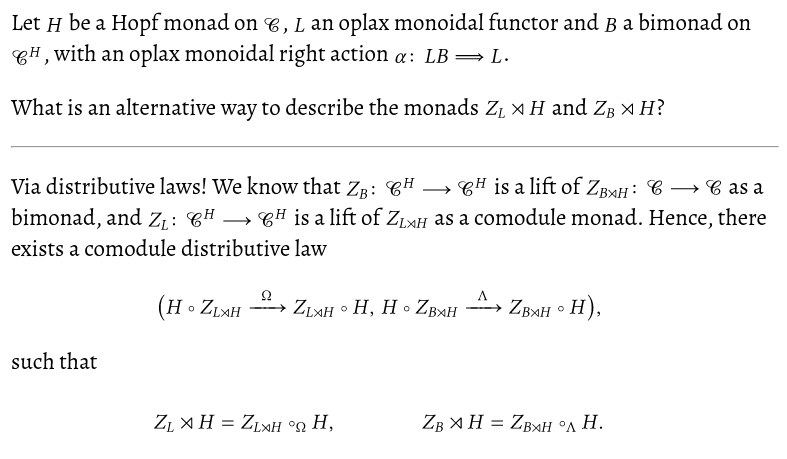

<p></p>
Recently, I've been quite invested in learning maths with [Anki][anki].
Sadly, there are relatively few good resources out there on how to
twist Anki's LaTeX pipeline into something generally acceptable,
without having to rely on MathJax.
As such, this post collects some bits and pieces from all over,
hoping to weave them together into something coherent.

<!--more-->

[^10]Note that I will only concerns myself with
"how to make LaTeX work to an acceptable degree",
instead of
"how to write mathematics notes".
The latter is extremely dependent on the desired outcome,
types of maths that one studies,
experience of the person writing the notes, and so on.
Too many facets for me—or anyone, really—to give blanket recommendations.

A lot of things here are rehashes of [Unhewn Thought's][anki-post]
post about the same thing,
as well as the official [Anki documentation](https://docs.ankiweb.net/math.html#latex)
on the matter.
As always, this post is mostly about reminding myself about some details in two months' time.

# MathJax is not enough

Anki fully supports MathJax as a backend for its LaTeX previewing system.
This is great for most users:
MathJax is trivial to set up, and fits snugly into the generated HTML<!--
-->—there's a reason it's used so widely all over the internet!

However,
especially for personal notes like these,
MathJax might be amongst the worst solutions for me:
its [macro support](https://docs.mathjax.org/en/latest/input/tex/extensions.html)
is awkward at best,
and since it only implements maths macros,
many of the packages that I'm using on a daily basis are not available at all.
I for one am certainly not going to rewrite my bespoke [style file][latex-styles],
just so I get something that half-works with MathJax,
when I could be using the real thing instead!

# Actually writing LaTeX

To get this out of the way:
I have absolutely no opinions on how to *write* LaTeX with Anki.
I haven't ever actually composed a note inside of the program,
and I'm doubtful that I ever will.

Instead, I write all of my notes in Org and then export them via [anki-editor][anki-editor].
This is very convenient,
as it means that I have all of the key bindings and snippets available that I normally write LaTeX with.[^4]
Plus, rough edges that one would otherwise have to care about,
like `}}` inside of maths closing the current cloze deletion,
are solved completely by `anki-editor` without me even having to think about them.[^12]
As an added bonus,
Org mode's [new LaTeX preview functionality](https://www.youtube.com/watch?v=n-AfvuV-bYo) is just fantastic,
and makes crafting notes quite fun!

# Aligning fragments vertically

One thing that MathJax does *very* well is its pixel-perfect alignment of LaTeX fragments.
In contrast, the default alignment is really rather bad.
It can, however, be somewhat improved by using CSS to vertically centre the image:

``` css
img[src*="latex"] {
  vertical-align: middle;
}
```

It looks like this:[^9]



Very far from perfect, but readable.
Since this seems to be the only drawback with not using MathJax,
I'll take it.
Content over form—at least in this case.

# Preview generation with `preview.sty`

The `preview` package is specifically designed for these kinds of previews.
Originally written for [AUCTeX](https://www.gnu.org/software/auctex/),
it has made its way into all TeX distributions that I know of.
In addition to being used all over Emacs,
`preview` is being employed by quite a few other programs as well.

Amongst intangible benefits such as familiarity,
I chose `preview` mostly because
it "correctly" tightens display maths environments not just to the maths itself,
but to the whole line.
Operationally this means that display maths is automatically centred on my Anki card,
even if the rest of the text is left-aligned.[^7]

To use `preview.sty` in this way,
one simply has to include it Anki's LaTeX preamble—`C-S-n` and then "Options"—and wrap the whole document (i.e., the formula being rendered) with the `preview` environment:

``` tex
%%% Header
\documentclass{article}
\usepackage[active,tightpage]{preview}
\begin{document}
% Remove extra space above display maths.
\setlength{\abovedisplayskip}{0pt}
\begin{preview}
```

``` tex
%%% Footer
\end{preview}
\end{document}
```

For this to work smoothly, I also highly recommend to enable SVG support,
and to tweak Anki's LaTeX compilation pipeline.
The handy [Edit LaTeX build process] addon can be used for that purpose.
My `svgCommands` settings look like this:[^3]

     "svgCommands": [
          [
              "latex",
              "-interaction=nonstopmode",
              "tmp.tex"
          ],
          [
              "dvisvgm",
              "--page=1-",
              "--optimize",
              "--clipjoin",
              "--relative",
              "--bbox=preview",
              "--no-fonts",
              "tmp.dvi",
              "-o",
              "tmp.svg"
          ]
      ]

The generated LaTeX might be too small,
though fixing this just involves a small CSS modification to the `latex` class:

``` css
.latex {
  zoom: 160%;
}
```

If you want to dig deeper into how Anki generates maths, I recommend looking at
[latex.py](https://github.com/ankitects/anki/blob/c29125939db1dbb9ef48d42f425eb70abaee53ad/pylib/anki/latex.py),
[latex.rs](https://github.com/ankitects/anki/blob/c29125939db1dbb9ef48d42f425eb70abaee53ad/rslib/src/latex.rs),
and the
[`.tex` Generation](https://unhewn-thoughts.org/anki/guide-on-using-latex-xetex-luatex-with-anki.html#tex-generation)
section in Unhewn Thought's blog post.[^6]

## Complete preamble

My complete preamble is not much larger than what I have shown above;
it merely also includes my [personal style file][LaTeX-styles].

``` tex
%%% Header
\documentclass{article}
\usepackage[type=org,math=fancy]{$HOME/.tex/styles/style}
\usepackage[active,tightpage]{preview}
\usepackage{xcolor}
\begin{document}
\setlength{\parindent}{0in}
\setlength{\abovedisplayskip}{0pt}
\begin{preview}
```

``` tex
%%% Footer
\end{preview}
\end{document}
```

# Conclusion

With these relatively straightforward tweaks,
Anki's LaTeX integration is really plug and play—I can just use my whole style file as-is,
no extra care needed.
Nice.

[anki]: https://apps.ankiweb.net/index.html
[anki-post]: https://unhewn-thoughts.org/anki/guide-on-using-latex-xetex-luatex-with-anki.html
[Edit LaTeX build process]: https://ankiweb.net/shared/info/937148547
[anki-editor]: https://github.com/anki-editor/anki-editor
[LaTeX-styles]: https://github.com/slotThe/latex-styles

[^3]: {-} For compatibility reasons with all of my papers (and other notes) I use `latex` here.
      In case you are not bound by these restrictions—or more adventurous than me—I would recommend you use lualatex instead.

[^4]: See, for example,
      [here](https://tony-zorman.com/posts/my-phd-workflow.html#digital-notes),
      [here](https://tony-zorman.com/posts/emacs-potpourri.html#latex),
      [here](https://tony-zorman.com/posts/pretty-latex.html),
      or
      [here](https://gitlab.com/slotThe/dotfiles/-/blob/master/emacs/lisp/hopf-latex-math.el?ref_type=heads).

[^6]: {-} It should be noted that Anki—thankfully—caches previews by hashing their contents,
      and reuses the same SVG every time it encounters a LaTeX fragment with the same hash.
      Thus, if you want to completely regenerate everything, just delete the respective directory.
      For me, this is `~/.local/share/Anki2/User 1/collection.media/`.

[^7]: One could solve this by making `anki-editor` output an extra `div` that it only wraps display maths with<!--
      -->—and I have done that in the past—but using `preview.sty` feels much cleaner to me.

[^9]: {-} As you can see, I haven't bothered with fancy CSS to make the cards pretty. Content over form.

[^10]: {-} I will not waste the reader's time with an introduction of what Anki is or why spaced repetition is useful;
       [other](https://gwern.net/spaced-repetition)
       [people](https://augmentingcognition.com/ltm.html)
       have done a much better job at that than I ever could.

[^12]: For the specific example of maths and cloze deletions,
       one needs to set `anki-editor-break-consecutive-braces-in-LaTeX`.
       This should probably be the default—and perhaps it will be in the future!
