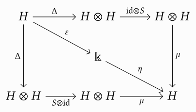
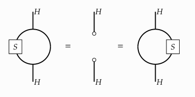

I did all of Advent of Code 2017 in BQN so you don't have to.
Let me tell you about that in as few as 20'000 words.[^60]

<!--more-->

# The setup

Advent of Code is a yearly puzzle-coding-challenge-thing,
in which one has to solve two riddles every day from the 1st until the 25th of December,
with the second part of each puzzle being unknown until one solves the first one.
I've found it to be a great way to learn the basics of a language—how it "feels".

The puzzles are accompanied by an endearing—and at times pretty funny—story.
I will, however, leave out most of it for this post,
as I feel like it would distract too much from the point I'm trying to make.

## Conventions throughout the article

One thing I will not leave out is the full solution for every day.
Normally this would result in a rather large amount of code having to be shown for the later days,
but BQN's terseness saves us here:
excluding comments and empty lines, all days combined are just under 300 lines of code!
I will be a tiny bit economical with the different parts, though;
think of every heading as introducing its own namespace.
For example,
in the code block solving the first part of every day I will generally include parsing the input.

``` bqn
inp ← …
# Hypothetical solution for first part
inp - 1
```

The second part will then freely refer to `inp` without me having to define it again.

``` bqn
# Second part
inp + 1
```

## Who reads all of this anyways?

A surprisingly hard question is who this article is for.
Someone new to Advent of Code, but familiar with BQN?
The other way around?
New to both?
Familiar with both?
The answer—as is so often the case—is that I don't know.
Realistically, I'm actually talking to my present and future self here<!--
-->—writing about things is a great way to solidify understanding—<!--
-->so the article will be structured accordingly:
I will talk about BQN's core concepts and language features,
but put the more dreary parts of that exposition in collapsible boxes,
for people who either already know, or don't care.

Keep in mind that I started solving these puzzles to learn the language.
Further, BQN is my very first array programming language,[^2]
so my understanding of a lot of concepts is still quite shallow.
The official documentation is really quite good, so I will link to it a lot.
As mentioned, the tangents in which I talk about language features are more for my own understanding.
Still, perhaps they are useful in case someone who does not know BQN has somehow found their way here,
and didn't run away after seeing the Unicode characters.
As such, the focus of this post should be on how I<!--
-->—as a total newcomer to this kind of thing—<!--
-->approach solving problems in such an unusual language;
what works and what doesn't, that kind of thing.
In short, I want to impart the *vibe* of the language to the reader<!--
-->—and that AOC is actually a lot of fun![^33]

## Acknowledgements

I want to explicitly thank the super welcoming
[community](https://mlochbaum.github.io/BQN/community/index.html)
that this language has!
Next to fantastic sites such as [BQNcrate]<!--
-->—a great way to pick up on idiomatic ways to write certain things—<!--
-->there is a
[#bqn:matrix.org](https://app.element.io/#/room/%23bqn:matrix.org)
matrix room, which is part of the larger
[#array:matrix.org](https://app.element.io/#/room/%23array:matrix.org) space.
Someone knowledgeable is always there to answer your stupid questions.
Special thank to
Marshall Lochbaum (the creator of the language!),
dzaima, and
brian\_e.
Without them a lot of solutions presented here would be even uglier than they already are.
A separate big thanks goes out to dzaima (again!)
for sending me lots of code improvements and suggestions for this post.

# A crash course on syntax

Here is an entirely too short crash course on the syntax of the language,
with a bit of semantics sprinkled in here and there.
Throughout, I will present most examples in a REPL-esque fashion;
input is indented by 4 spaces, and output is flush to the left.
Line comments in BQN start with `#`.

``` bqn
    1+4+6 # Everything normal so far…
11
    2×4+6 # …but actually not!
20
```

That last one probably already needs explanation.
First, multiplication is `×`, instead of `*` as in most other languages.
More importantly, however: there is no precedence for mathematical operators!
BQN is evaluated (strictly) from right to left,
and most of the time this is also the direction you should read expressions in.

Assigning values to variables works with *define* (`←`):

``` bqn
    v ← 2×4+6
20
```

A block is something in between curly braces,
containing several assignments and expressions separated by line breaks, or, alternatively, the `⋄` character.
Further, a block starts its own [namespace][namespace];
nothing all that surprising coming from almost any other language.

``` bqn
    v ← 2×4+6
20
    {v←0 ⋄ v}
0
    v
20
```

I will talk a little bit more about namespaces later,
but let's not get too hung up on that right now.
Instead, let's talk about functions.
A user-defined function is something in curly braces that mentions the special names `𝕨` and `𝕩`,
standing in for the left and right argument to it.[^22]
Functions are always infix, and can only be called with either one or two arguments.
In the former case, the function takes its argument on the right and `𝕨` will be given a special value:
*nothing* ([`·`](https://mlochbaum.github.io/BQN/doc/expression.html#nothing))!.

``` bqn
    1 {𝕨+𝕩} 2
3
    1 {𝕨-𝕩} 2
¯1
    2 {𝕨⋆𝕩} 8  # Careful: exponentiation!
256
    {√𝕩} 9     # Could also just write √9
3
```

I should note that the `⋆` above is the Unicode code point `0x22C6` (STAR OPERATOR),
and not just a normal asterisk.

Because Greek is much cooler than Latin,
BQN calls functions taking one argument *monadic*,[^29]
and ones taking two arguments *dyadic*.
When in doubt, just substitute "unary" and "binary" in your head.
One thing that might seem very confusing at the start is that
many functions are actually overloaded depending on whether they are called monadically or dyadically<!--
-->—often with seemingly unrelated (or only barely so) functions!

``` bqn
    # Dyadic ×; N.b. we use the upper minus ¯ here because ¯2 is its own
    # number literal. We could also use the function -, but then (because
    # remember everything is evaluated right to left) we would have to
    # use parentheses: (-2)×4. Otherwise, the expression would be parsed
    # as -(2×4).
    ¯2×4
¯8
    ׯ2 # Monadic × is the signum function!
¯1
    ×2
1
    ×0
0
```

The signum function hints at a fundamental design decision that basically all array languages share:
instead of a name,
all builtin functions are given a unique symbol.
However, the documentation of each of them does mention a pronounceable name as well,
so that it's easier to talk to other people about a given piece of code.

``` bqn
    ↕9                 # Monadic ↕: Range. Gives you the integer range [0, 𝕩-1].
⟨ 0 1 2 3 4 5 6 7 8 ⟩
    7↕(↕9)             # Dyadic ↕: Windows. Create all windows of size 𝕨 in 𝕩.
                       # N.b: the parentheses are not technically needed.
┌─
╵ 0 1 2 3 4 5 6
  1 2 3 4 5 6 7
  2 3 4 5 6 7 8
                ┘
```

In particular, the above examples showcase how BQN displays *vectors* (or *lists*) and *arrays*.
Definitionally, vectors are "rank 1 arrays"—we will talk about what exactly this means when we talk about major cells.[^40]
We can define our own arrays in a few different ways,
the two most important ones being

``` bqn
    ⟨1,2,3,4⟩ # Using list notation
⟨ 1 2 3 4 ⟩
    1‿2‿3‿4   # Using strand notation
⟨ 1 2 3 4 ⟩
```

Here's another example of monadic and dyadic uses of functions:

``` bqn
    r←↕9
⟨ 0 1 2 3 4 5 6 7 8 ⟩
    ⌽r                 # Monadic ⌽: Reverse.
⟨ 8 7 6 5 4 3 2 1 0 ⟩
    3⌽r                # Dyadic ⌽: Rotate. Rotates 𝕩 by 𝕨 places to the
                       # left (to the right if 𝕨 is negative).
⟨ 3 4 5 6 7 8 0 1 2 ⟩
```

This takes some time getting used to.
However, after a while you really start to think that
[notation as a tool for thought](https://dl.acm.org/doi/pdf/10.1145/1283920.1283935)
has a point.[^28]
I believe BQN's creator once called the syntax "scribbles on a whiteboard", and honestly that's my feeling about it too<!--
-->—with the slight addendum that blackboards are obviously vastly superior to whiteboards.

One more piece of syntax that we have to discuss before diving into day 1: modifiers.
These are *things* that take either one or two functions, and spit out a new, modified, one.
I would imagine that this comes from the APL tradition and is actually not strictly needed,
given that BQN supports [higher order functions](https://mlochbaum.github.io/BQN/doc/functional.html).
However, since these things have their own precedence and binding rules, the separate concept may nonetheless be useful.

We can write our own modifiers by using `𝔽` and `𝔾` inside of a block,
but for most of this article we will only use the builtin ones.
Monadic modifiers take their function argument *to the left*,
and are not called monadic any longer,
but 1-modifiers.
Likewise, modifiers taking two functions are called 2-modifiers.

``` bqn
    1 - 3  # Normal subtraction
¯2

    1 -˜ 3 # ˜ is the *flip* or *swap* 1-modifier:
           # it takes a dyadic function and returns
           # one with its arguments flipped.
2
    3 - 1
2

    -˜ 3  # If a flipped function is called with
          # only one argument, it gets duplicated.
0
    3 - 3
0

    {𝕩+1}∘{𝕩-3} 4 # ∘ is the function composition 2-modifier called *atop*.
                  # Called monatically, 𝔽∘𝔾 𝕩 is just 𝔽𝔾𝕩
2
    1 {𝕩+1}∘{𝕩-𝕨} 4 # Called dyadically, 𝕨 𝔽∘𝔾 𝕩 transforms to 𝔽(𝕨𝔾𝕩)
4
    1 +⟜1∘- 4     # ⟜ is *after*: 𝔽⟜𝔾 𝕩 evaluates to 𝕩𝔽(𝔾𝕩).
                  # If a constant or variable is given as 𝔽 or 𝔾,
                  # it is promoted to its constant function.
                  # The whole expression associates as 1 (+⟜1)∘- 4,
                  # and so evaluates to (+⟜1) (1-4) = (1-4)+1.
¯2
```

Besides this being quite a lot to take in,
you might have already noticed something strange in the last example:
how come `+⟜1∘-` is parsed like `(+⟜1)∘-` when I previously said everything is evaluated right to left?
While there are no precedence rules among functions or among modifiers,
the latter does [bind tighter](https://mlochbaum.github.io/BQN/doc/syntax.html#precedence) than the former.
Additionally, modifiers associate left to right, instead of right to left:
given functions `F`, `G`, and `H`, then `F∘G∘H` is parsed as `(F∘G)∘H` instead of `F∘(G∘H)`.
As you can imagine, getting used to reading BQN expressions takes quite some time.
It gets better, though, I promise.

Something to ease the pain:
there is a purely syntactic way to decide whether a given symbol is a (builtin) function, 1-, or 2-modifier![^58]
Thankfully, someone thought about this, and there is a consistent morphology to the chosen symbols:

  + 1-modifiers are always superscripts;
  + 2-modifiers always contain an *unbroken* circle; and
  + everything else is a function.

For example, `× + - ⋆ ⌽ ⍉ ⊔ ≢` are functions (remember the unbroken part),
`˘ ¨ ⁼ ´` are 1-modifiers,
and `∘ ⍟ ⚇ ◶ ⌾` are 2-modifiers.
Quite neat, I think.

This should be plenty to get a feeling for the language.
Anything more will be introduced as needed.[^30]

# Days 1–5
## [Day 1](https://github.com/slotThe/advent/blob/master/aoc2017/bqn/day01.bqn)

Let's get into the swing of things!
Day 1 starts with us getting sucked into Santa's computer,
where we have to solve a captcha, proving we're not human.

For part one,
we are given a (circular) list of numbers,
and are asked to identify repeating digits, starting from the beginning
(i.e., all digits that match the next element).
For example, in `311223` this would be `1`, `2`, and `3` (in that order).
Our input is a long string of digits
that we first have to convert to a long string of numbers:

``` bqn
inp ← '0'-˜ ⊑ •FLines"../inputs/day01.txt"
```

Reading the input line-by-line and converting it to a vector works via the builtin `•FLines` function.[^39]
The only other function we haven't see so far is
*first* [`⊑`](https://mlochbaum.github.io/BQN/doc/pick.html),
which gives us the first element in the list—our input is on a single long line.
Much more interesting is the `'0'-˜` part,
which immediately gives me a chance to talk about character–number conversions in BQN.

<details><summary>Affine characters in BQN</summary>

The [documentation](https://mlochbaum.github.io/BQN/tutorial/expression.html#character-arithmetic)
says that characters reside in an affine space,[^8]
which is a good guide on what kinds of operations we have access to:

  1. `(+) : Num  → Char → Char`, adding a number to a character gives a character:

     ``` bqn
         97+@   # @ is the literal "null" character;
                # i.e., '\0' in most other languages.
     'a'
     ```

  2. `(-) : Char → Num  → Char`, subtracting a number from a character gives a character:

     ``` bqn
         'a'-32
     'A'
     ```

  3. `(-) : Char → Char → Num`, subtracting two characters gives a number:

     ``` bqn
         'a'-@
     97
         '0'-@
     48
         'a'-'0'
     49
     ```

Since the numbers from 0 to 9 are ordered sequentially in UTF-8,
this in particular gives a neat way to transform a vector of characters<!--
-->—also known as a string—<!--
-->into a vector of digits:
simply subtract `'0'` from them!

``` bqn
    '9'-'0'
9
    "1939102"-'0'
⟨ 1 9 3 9 1 0 2 ⟩
```

The last example shows another important feature of pretty much all array oriented languages:
[scalar pervasion](https://mlochbaum.github.io/BQN/doc/arithmetic.html#pervasion).
Simply put, arithmetic functions like `-` know how to "penetrate" arrays,
in that they apply to each element individually, instead of to the whole thing as one.
In this case, the scalar `'0'` is "duplicated" and supplied to all elements of the string `"1939102"`.
</details>

After the input is parsed, the solution is not so complicated:[^3]

``` bqn
+´ inp/˜ inp= ¯1⌽inp
```

We *rotate* ([`⌽`](https://mlochbaum.github.io/BQN/doc/reverse.html#rotate))
the whole list by 1 to the right,
and then compare it with its original (`inp= -1⌽inp`).
This creates a *Boolean mask*: a list with the same length as `inp`, only consisting of zeros and ones.
We can use this to pick the elements of the list corresponding to 1 with
*replicate* ([`/`](https://mlochbaum.github.io/BQN/doc/replicate.html#replicate)).

``` bqn
    # "Only give me the elements of 𝕩
    # that correspond to 1's in 𝕨".
    ⟨1,1,0,1,1,0⟩ / ↕6
⟨ 0 1 3 4 ⟩
```

All that's left is to sum up the numbers by using
+-*fold* ([`` ` ``](https://mlochbaum.github.io/BQN/doc/fold.html#fold)),
which is just a right fold over the list.
A few more notes:

  1. Boolean masks are an important concept to internalise,
     and will often be used to filter results, or serve as control flow<!--
     -->—BQN does not have a builtin if-then-else expression!

  2. *Swap* ([`˜`](https://mlochbaum.github.io/BQN/doc/swap.html)),
     as seen in the [crash course on syntax](#a-crash-course-on-syntax) makes an appearance again.
     Recall that this 1-modifier simply takes a function, and returns a function with its arguments flipped,
     so `X f˜ Y` is the same as `Y f X`.
     When given only one argument, *swap* becomes *self* and duplicates its argument: `f˜ Y` is `Y f Y`.
     The modifier mostly exists to allow the reading order to flow more naturally from right to left.
     Without it, we would have to write the above expression as `+´(inp=-1⌽inp)/inp`.[^10]

---

Part two is basically the same,
only a number doesn't consider its first successor,
but the one that's exactly halfway around the list.
Adjusting for this just means that we have to adjust how much we shift before comparing:

``` bqn
+´ inp/˜ inp= (¯2÷˜≠inp)⌽inp
```

Even in this simple example,
one can already see what goes into writing code in this language:
aim for branchless, array-based, solutions rather than iterating through elements.
However, if you ever miss `if-then-else` or `while` constructs,
[you can make your own](https://mlochbaum.github.io/BQN/doc/control.html).

## [Day 2](https://github.com/slotThe/advent/blob/master/aoc2017/bqn/day02.bqn)

Today we have to help some programs repair a corrupted spreadsheet.
Our puzzle input is a table of numbers, like so:

```
5 9 2 8
9 4 7 3
3 8 6 5
```

For part one we have to calculate the smallest and largest values of all rows in the table.
This is easy enough once we have the data in a usable format;
however, getting to that format is actually the much more interesting part of the day.
For one, we have to learn how to split strings!
For these kinds of partitioning tasks, BQN sports the very general
*group* ([`⊔`](https://mlochbaum.github.io/BQN/doc/group.html))
function.
Briefly, `X⊔Y` groups `Y` according to the indices supplied by `X`,
while omitting elements that are associated to `¯1`.
For example, in

``` bqn
    1‿0‿¯1‿1 ⊔ "abcd"
⟨ "b" "ad" ⟩
```

both `a` and `d` are associated to the same index, `1`, so they are grouped together;
`b` is alone (and in front of `a` and `d` because it is associated to index `0`);
and `c` is omitted.
The strategy is, then, to somehow associate `¯1` to the separator in the input, and have all digits of a number be associated to the same index.
If you want you can black box that such a `Split` function exists;
if not, feel free to peruse the insert below.

<details>
<summary>The long and painful walkthrough</summary>

We start by checking which elements of the given string match the separator,
and call it `ws`.
I will use a string with a space separator for illustrative purposes, but the function itself is really quite general.

``` bqn
    ' ' { ws←𝕨=𝕩 } "13 259 39999 4"
⟨ 0 0 1 0 0 0 1 0 0 0 0 0 1 0 ⟩
   ```

Now, a
+-*scan* ([`` ` ``](https://mlochbaum.github.io/BQN/doc/scan.html))
yields a running sum, indicating when we encounter a separator.

``` bqn
    ' ' { +`ws←𝕨=𝕩 } "13 259 39999 4"
⟨ 1 1 2 2 2 2 3 3 3 3 3 3 4 4 ⟩
```

This looks a bit weird, but the `ws←𝕨=𝕩` is an inline assignment—we do the comparison `𝕨=𝕩`, call the result `ws`, and then scan over it.
In this way, we can refer to `ws` again at a later point.
It's not the best style to write code this way, but here it kind of fits.
If we just *group*ed the string now, we
would get the separators "attached" to the word that follows them:

``` bqn
    ' ' { 𝕩⊔˜+`ws←𝕨=𝕩 } "13 259 39999 4"
⟨ "13" " 259" " 39999" " 4" ⟩
```

One thing we can do,
since `ws` gives us the positions of the separators,
is to
*negate* ([`¬`](https://mlochbaum.github.io/BQN/doc/logic.html))
the entire vector and multiply it with what we already have.
This would turn all separators into zeros in the output:

``` bqn
    ' ' { (¬ws)×+`ws←𝕨=𝕩 } "13 259 39999 4"
⟨ 0 0 0 1 1 1 0 2 2 2 2 2 0 3 ⟩
```

Now we can't differentiate between the separators and our first word!
However, there is an easy fix for this;
we just take the original `ws`, which—remember—contains the positions of the separators,
and subtract it from the result that we have:

``` bqn
    ' ' { ws-˜(¬ws)×+`ws←𝕨=𝕩 } "13 259 39999 4"
⟨ 0 0 ¯1 1 1 1 ¯1 2 2 2 2 2 ¯1 3 ⟩
```

And that's it!

``` bqn
    ' ' { 𝕩⊔˜ws-˜(¬ws)×+`ws←𝕨=𝕩 } "13 259 39999 4"
⟨ "13" "259" "39999" "4" ⟩
```

If you wanted to make it unreadable (see the bit on trains below), you could also write it as

``` bqn
    ' ' ((⊢-˜¬×+`)∘=⊔⊢) "13 259 39999 4"
⟨ "13" "259" "39999" "4" ⟩
```

We can bind that to a function `Split` and be on our way![^12]
</details>

The input separates each number by a tab,
so we just need `'\t' Split input`, right?

Wrong!

BQN's characters and strings are almost completely void of any kind of escaping mechanism.
That is to say, besides for double quotes, which are inserted by duplicating them,
every character entered into a string it interpreted verbatim.
Indeed, `'\t'` is not even a valid character,
as it actually comprises two characters: `'\'` and `'t'`!
To write a tab we either need to actually insert a tab character,[^13]
or make use of the "affine" part of affine characters:

``` bqn
    '	'
'	'
    @+9
'	'
```

Because both `Split` and `tab←@+9` will be needed quite a few times this year,
let's put it into a small utility file.
We can use BQN's system function `•Import` to import a namespace<!--
-->—which I don't want to get into right now, but it works as one would expect—<!--
-->from somewhere.
Parsing the input and solving part one is straightforward:

``` bqn
⟨Split, tab⟩ ← •Import "../../util/bqn_util/util.bqn"
inp ← >(•ParseFloat¨ tab⊸Split)¨ •FLines "../inputs/day02.txt"

+´ (⌈´-⌊´)˘ inp
```

…except that this solution uses two new concepts that we haven't seen before:
multidimensional arrays, and tacit programming!

<details>
<summary>Arrays</summary>
The fateful day has come that we need to talk about arrays in this array language.
I will probably not do this topic justice here, so [have a link][bqn:arrays] to the BQN array docs.
For now, let's look at an array as a blob with the following properties:

- It has a *rank*, which is its number of axes.
  Pictorially, it is the number of dimensions one can walk in.
  The *leading axis* is the first one.

- It has a *shape*, which is the number of positions that it has along each of its axes.

- It has *elements*, which are the values at every position.

One can query the *rank* of an array with monadic
[`=`](https://mlochbaum.github.io/BQN/doc/shape.html)
and the *shape* with monadic
[`≢`](https://mlochbaum.github.io/BQN/doc/shape.html).

For example,

``` bqn
    10+↕9
⟨ 10 11 12 13 14 15 16 17 18 ⟩
```

is an array of *rank* `1` with *shape* `⟨9⟩`.
At every possible position (0–9), we find a corresponding element: `10` for 0, `11` for 1, etc.

We can use *reshape* to create a higher-dimensional array from a flat vector:

``` bqn
    3‿3⥊↕9
┌─
╵ 0 1 2
  3 4 5
  6 7 8
        ┘
   ```

This is an array of *rank* `2` with *shape* `⟨3 3⟩`.
The element at position `1‿1` (notice how we have two indices to specify) is `4`.

Why am I blabbering on about this when everyone intuitively knows what an array is?
Because this is *really* important:
arrays are an intrinsic concept.
Many things that seem intuitive at first,
coming from another language, are just not true in BQN.

- Lists of lists are not equivalent to higher-dimensional arrays:

  ``` bqn
      a ← ⟨⟨1,2⟩,⟨3,4⟩⟩
  ⟨ ⟨ 1 2 ⟩ ⟨ 3 4 ⟩ ⟩
      b ← >a              # monadic > is called *merge*
                          # and creates an array from a list
  ┌─
  ╵ 1 2
    3 4
        ┘
     b≡a
  0
  ```

- Piggybacking off of that: "depth is not rank".
  The type of the elements is not at all important in determining the arrays rank.

  ``` bqn
     =1‿2‿3‿4‿5 # vector
  1
     =3‿3⥊↕9    # matrix
  2
     m←1‿(3‿4)‿(2‿2⥊↕4) # Nested array
  ┌─
  · 1 ⟨ 3 4 ⟩ ┌─
              ╵ 0 1
                2 3
                    ┘
                      ┘
     =m # The rank of the elements does
        # *not* affect the rank of the array.
  1
  ```

A *cell* of an array is just a subarray of any size.
Now, a *major cell* of an array of rank `n` is a cell of rank `n-1` that leaves out the leading axis.
For example, `3‿3⥊↕9` has three major cells, `⟨0 1 2⟩`, `⟨3 4 5⟩`, and `⟨6 7 8⟩`.

This concept is quite central to the way a lot of array primitives work,
in that they often only apply to the first axis of the argument.
The 1-modifier
*cells* ([`˘`](https://mlochbaum.github.io/BQN/doc/rank.html))
changes a function to instead operate on the major cells of its argument.
For example, we already saw that *reverse* reverses lists.
If we have more dimensions, we instead reverse along the leading axis:

``` bqn
    m←3‿3⥊↕9
┌─
╵ 0 1 2
  3 4 5
  6 7 8
        ┘
    ⌽m   # Reverse the first axis of m
┌─
╵ 6 7 8
  3 4 5
  0 1 2
        ┘
    ⌽˘m  # Reverse each major cell separately
┌─
╵ 2 1 0
  5 4 3
  8 7 6
        ┘
```

</details>

<details>
<summary>Tacit programming</summary>
If you, after reading this far,
thought that BQN was really a little too verbose for you,
[you're in luck](https://mlochbaum.github.io/BQN/doc/tacit.html)!

The basic idea of trains is deceptively simple.
Pick your favourite algebraic structure with a binary operation, say a monoid.
Given two monoid morphisms \(f, g \colon M \to N\), we can define another map
\[
  f \cdot g \colon M \to N, \qquad (f \cdot g)(x) \defeq f(x) \cdot g(x).
\]
It is an easy exercise to prove that this is again a morphism of monoids.

What BQN now does is twofold:
first, it takes the expression \(f \cdot g\), and allows it to be called both monadically and dyadically.
Second, it allows one to replace the operation in the middle with any dyadic function whatsoever.

Train syntax is essentially just "writing functions after each other".[^50]
This in particular does not use any blocks, so you can't refer to named arguments at all.
More explicitly, we have the following two relationships:

```
(FGH)y  ≡  (Fy)G(Hy)   and   x(FGH)y  ≡  (xFy)G(xHy)
```

Replace `G` with \(\cdot\) in the first of these and you essentially have the above mathematical notation.

Since this train is composed of three functions, it is called a *3-train*.
Naturally, *2-trains* also exist; these are just 3-trains in which the function `F` is *nothing*
([`·`](https://mlochbaum.github.io/BQN/doc/expression.html#nothing)):

```
(GH)y  ≡  GHy   and   x(GH)y  ≡  G(xHy)
```

For example, suppose we wanted to write a function that takes two arrays `X` and `Y` and gives us back only those major cells of `X` that do not exist in `Y`.[^25]
Sort of like a set difference for arrays.
We just need a few functions for this purpose:
*negate* ([`¬`](https://mlochbaum.github.io/BQN/doc/logic.html)) and
*member of* ([`∊`](https://mlochbaum.github.io/BQN/doc/search.html#member-of)),
which do what you would expect them to.

Additionally, we will make use of the scalar pervasion of *member of*,
where for every element in `𝕨`, we test whether it is in `𝕩`.

``` bqn
    ".b#d.#zz#" ∊ ".#"
⟨ 1 0 1 0 1 1 0 0 1 ⟩
```

Let's now write the function with and without trains:

``` bqn
    W1 ← {(¬𝕨∊𝕩)/𝕨}   # no trains at all
    W2 ← (¬∊)/⊣       # A 3-train whose left argument is a 2-train
    W3 ← ¬∘∊/⊣        # A single 3-train because of precedence

    3‿1⥊⟨(↕9)W1⟨2,5,1⟩, (↕9)W2⟨2,5,1⟩, (↕9)W3⟨2,5,1⟩⟩
┌─
╵ ⟨ 0 3 4 6 7 8 ⟩
  ⟨ 0 3 4 6 7 8 ⟩
  ⟨ 0 3 4 6 7 8 ⟩
                  ┘
```

That last example used the
*atop* ([`∘`](https://mlochbaum.github.io/BQN/doc/compose.html#atop))
2-modifier; one of several
[combinators](https://mlochbaum.github.io/BQN/doc/tacit.html#combinators)
that BQN sports to complement this syntax.
I will generally introduce them on a call by need basis;
*atop* is basically a 2-train as a modifier:

```
F∘G𝕩  ≡  FG𝕩   and   𝕨F∘G𝕩  ≡  F(𝕨G𝕩)
```

The `(¬∊)/⊣` example above shows that trains can "stack".
Parentheses are really important here, by the way, since
depending on whether the overall length of an expression is even or odd
things may get parsed as a 2- or 3- train!
This is horribly confusing at first, but thankfully BQN has an `)explain` system function that prints the parse tree of an expression:

```
    )explain (¬∊)/⊣
 (¬∊)/⊣
   │  │
  ¬∊  │
  └──/⊣
╶────┘

    )explain ¬∘∊/⊣
 ¬∘∊/⊣
 │ │ │
 ¬∘∊ │
  └─/⊣
╶───┘
```

Playing around with this was immensely helpful for me in the beginning.
</details>

The 1-modifier
*each* ([`¨`](https://mlochbaum.github.io/BQN/doc/map.html))
does what it says on the tin—it's comparable to `map` in many other languages.
Parsing the input works as expected,
in that we split each line on the tab character,
and parse all the resulting sequences of digits as numbers.
All that's left to do is to assembly the table in to a rank two array.
By means of *cells* we get the maximum and minimum for every row<!--
-->—using the `⌈´-⌊´` train, which is a great one to reason through—<!--
-->and sum up the resulting vector to get our answer.

---

Part two asks a bit of a different question:
instead of the smallest and largest number in each row,
we instead need to find the two (unique) numbers such that one evenly divides the other,
and take the result of that division.

I didn't think too hard about this and just decided to brute-force a solution.
The idea is to proceed row-wise and first create a division table for each row with `÷⌜˜`.
This uses the 1-modifier
*table* ([`⌜`](https://mlochbaum.github.io/BQN/doc/map.html#table)),
which is essentially a generalised outer product in the sense of linear algebra.
Written out explicitly, this definition is equivalent to `{ 𝕩÷⌜𝕩 }`:
it applies the given function to every element of `𝕩` on the left and all of `𝕩` on the right
and makes that one row in a new matrix (or, table, hence the name).
Since arithmetic functions support scalar pervasion,
this ends up giving us the division table we want:

```
    (÷⌜˜) ⟨2, 4, 8, 16⟩
┌─
╵ 1 0.5 0.25 0.125    # 2÷2  2÷4  2÷8  2÷16
  2   1  0.5  0.25    # 4÷2  …
  4   2    1   0.5    # 8÷2  …
  8   4    2     1    # 16÷2 …
                   ┘
```

As the problem explicitly says,
there will be exactly one pair of *different* numbers where one evenly divides the other.
As such, we just need to select an integer<!--
-->—e.g., some number that's equal to its floor—<!--
-->that is not one:

``` bqn
Two ← {
  t ← ÷⌜˜𝕩            # Division table
  ⊑((1≠t)∧t=⌊t)(/○⥊)t # Select integer that is not 1
}
+´ Two˘ inp
```

As before, selection is done with `/` (*replicate*).
We use *over*, `○`, which is one of the combinators mentioned earlier, to
*deshape* ([`⥊`](https://mlochbaum.github.io/BQN/doc/reshape.html#deshape))
the array beforehand,
as *replicate* only operates on vectors and not arrays.[^4]
Briefly, one has that `𝕨(𝔽○𝔾)𝕩` is `(𝔾𝕨)𝔽(𝔾𝕩)`.
We then just have to pick the first element of the array,
which we know will have exactly one match.
All that's left to do is to apply the function `Two` to all rows of `inp`,
which is but a *cells* away, and sum up the result.

[bqn:arrays]: https://mlochbaum.github.io/BQN/doc/array.html

## [Day 3](https://github.com/slotThe/advent/blob/master/aoc2017/bqn/day03.bqn)

Day 3 asks us to implement an experimental memory layout: an infinite spiral grid.

```
17  16  15  14  13
18   5   4   3  12
19   6   1   2  11
20   7   8   9  10
21  22  23---> ...
```

Part one is all about calculating the
[Manhattan distance](https://en.wikipedia.org/wiki/Taxicab_geometry)[^5]
between the start point `1` in the middle of the grid, and wherever we end up with after taking
as many steps as our puzzle input demands.
As such, parsing is straightforward.

``` bqn
inp ← •ParseFloat⊑•FLines"../inputs/day03.txt"
```

I found no good array solution for this,
so I just stared hard at the spiral until noticing the general pattern in which we are moving:
`R U 2L 2D 3R 3U 4L 4D 5R 5U…`.
The function that outputs all of the coordinates we've been to looks like this:

``` bqn
Coords ← { # 2×𝕩: Number of steps to go.
  dirs ← (2×𝕩)⥊⟨0‿1, 1‿0, 0‿¯1, ¯1‿0⟩ # r u l d
  natnat ← ∾(↕⋈¨↕)𝕩                   # 0 0 1 1 2 2 3 3 …
  +`∾natnat{<˘𝕨‿2⥊𝕩}¨dirs             # expand
}
```

We create the `R U 2L 2D…` pattern in two steps,
first assembling the directions and then the associated numbers.
Notice that if `𝕨` is larger than the length of `𝕩`, *reshape* duplicates `𝕩` until it fits:

``` bqn
    5⥊⟨1,2,3⟩
⟨ 1 2 3 1 2 ⟩
    {(2×≠𝕩)⥊𝕩} ↕5       # Monadic ≠ is *length*
⟨ 0 1 2 3 4 0 1 2 3 4 ⟩
    (2×≠)⊸⥊ ↕5          # Bonus: the same thing tacitly
⟨ 0 1 2 3 4 0 1 2 3 4 ⟩
```

The train `↕⋈¨↕` is interesting because of the middle component, `⋈¨`.
It's what one might call `zip` in other languages.[^66]
In the last line, we first use *reshape* to replicate the vector `𝕩` exactly `𝕨` times:

``` bqn
    3 {𝕨‿2⥊𝕩} 0‿1
┌─
╵ 0 1
  0 1
  0 1
      ┘
   ```

Then, since we actually want a nested vector instead of a rank two array,
*enclosing* ([`<`](https://mlochbaum.github.io/BQN/doc/enclose.html))
every major cell creates
[unit arrays](https://mlochbaum.github.io/BQN/doc/enclose.html)
out of the individual cells.
Each of these is an array of shape `⟨⟩` containing the thing we enclosed as its only element.
This reduces the rank of the outer array by one, yielding the desired flat structure.

``` bqn
    3 {<˘𝕨‿2⥊𝕩} 0‿1
⟨ ⟨ 0 1 ⟩ ⟨ 0 1 ⟩ ⟨ 0 1 ⟩ ⟩
    = 3 {<˘𝕨‿2⥊𝕩} 0‿1         # rank
1
    ≢ 3 {<˘𝕨‿2⥊𝕩} 0‿1         # shape
⟨ 3 ⟩
    ≡ 3 {<˘𝕨‿2⥊𝕩} 0‿1         # depth
2
```

Walking around the grid can now be simulated by summing up every individual move.
Scanning over the array keeps all intermediate steps,
which is useful since we are looking for a specific index:

``` bqn
    steps ← ∾ 3‿2 {<˘𝕨‿2⥊𝕩}¨ ⟨0‿1, ¯1‿0⟩
⟨ ⟨ 0 1 ⟩ ⟨ 0 1 ⟩ ⟨ 0 1 ⟩ ⟨ ¯1 0 ⟩ ⟨ ¯1 0 ⟩ ⟩
   +`steps
⟨ ⟨ 0 1 ⟩ ⟨ 0 2 ⟩ ⟨ 0 3 ⟩ ⟨ ¯1 3 ⟩ ⟨ ¯2 3 ⟩ ⟩
   ```

All that's left is to *pick* the right coordinate
(keeping in mind we skip the starting position),
and calculate the Manhattan distance.

``` bqn
+´| (inp-2) ⊑ Coords 1000 # ⇒ 552
```

The `1000` above is a magic number,
because the whole thing is really naturally a lazy infinite stream,[^6]
but that's not how BQN works.

---

Part two modifies how the spiral is constructed.
Instead of just being the ascending natural numbers,
a more elaborate iterative process is given:
for every number,
sum up the values of all the neighbours of a cell at the time of its creation.
With an initial seed of `1`, this would look like

```
    147  142  133  122   59
    304    5    4    2   57
    330   10    1    1   54
    351   11   23   25   26
    362  747  806--->   ...
```

Our task is to find the first number that's bigger than our input.

Again, no array-oriented solution presented itself to me,
so I just did the obvious thing: for the point under consideration,
generate a list of all neighbours,
see whether they appear in the grid already,
sum the values of those that do,
and associate the point with that value in the grid.

In this case, "grid" actually means hash map—yup, we have those.
BQN exposes a simple interface under the `•HashMap` system value.
The function names—`Has`, `Get`, `Set`, and so on—are relatively self-explanatory.

``` bqn
N ← { x‿y: ⥊(x+⟨¯1, 0, 1⟩)⋈⌜(y+⟨¯1, 0, 1⟩) }
```

We first calculate all of the neighbours of a given point,
represented as a vector with two elements.
The `x‿y:` part at the start of the function is a
[header](https://mlochbaum.github.io/BQN/doc/block.html#block-headers),
which I guess I should go into now.

<details><summary>Headers</summary>
At the most basic level,
headers can be used to name the arguments of, say, a function,
instead of using the special names `𝕨` and `𝕩`:

``` bqn
    17 {left_arg 𝕊 right_arg: left_arg} 42
17
    17 {left_arg 𝕊 right_arg: right_arg} 42
42
```

The colon ends the header, and begins the body of the block.
The `𝕊` here is just a way to signal that the block is a function, instead of something else.
Recursion can then be done by calling `𝕊` with some arguments, the same as with "anonymous" blocks.
We can also give the function a name:

``` bqn
    { Fib n: n<2? n;
      Fib n: (Fib n-1) + Fib n-2
    } 17
1597
```

This example already highlights a few more features—and shortcomings—of blocks.
First, a block can contain multiple bodies, separated by `;`, as well as multiple headers associated to them.
When such a block is called,
its headers are checked for compatibility with the arguments,
until something appropriate is found (otherwise you get an error).

Additionally, predicates in the form of `n<2?` appear.
Basically, this only evaluates the rest of the body if the predicate is true; otherwise, it jumps to the next header.
Control flow!
This is at the same time syntactically nice (chaining is quite concise: `𝕩<2? 6=+´𝕩? …`),
but also forces us to repeat the header in the "else" branch,
as everything after `;` is in a new scope.
This is especially annoying with more elaborate headers,
but even here it feels unnecessarily verbose.

Headers can also do some light destructuring:

``` bqn
    {x‿y: x} ⟨1, 2⟩    # Ok, vector should have exactly two elements
1
    {x‿y: x} ⟨1, 2, 3⟩ # Too long
Error: No header matched argument
    {x‿y: x} ⟨1⟩       # Too short
Error: No header matched argument
```
</details>

The rest of `N` is straightforward.
Add all possible directions to every coordinate individually,
pair them up again in a table,
and flatten everything down to a vector with coordinate entries.

``` bqn
    ⥊(2+⟨¯1, 0, 1⟩)⋈⌜(3+⟨¯1, 0, 1⟩)
⟨ ⟨ 1 2 ⟩ ⟨ 1 3 ⟩ ⟨ 1 4 ⟩ ⟨ 2 2 ⟩ # Line break for clarity
  ⟨ 2 3 ⟩ ⟨ 2 4 ⟩ ⟨ 3 2 ⟩ ⟨ 3 3 ⟩ ⟨ 3 4 ⟩ ⟩
```

Let's get to simulating!

``` bqn
Sim ← { # 𝕨 = grid = (x‿y)→n, …; 𝕩 = coords = ⟨x‿y, …⟩
  (¯1⊑𝕨.Values@)>inp?           # Newest value larger than input?
    ¯1⊑𝕨.Values@;
  grid 𝕊 coords:
    p‿cs ← 1(↑⋈↓)coords ⋄ p⊑↩   # Point and rest
    p grid.Set +´0⊸grid.Get¨N p # Get neighbour sums and set for point
    grid 𝕊 cs                   # Recurse
}
```

We smuggle a bit of control flow into `Sim` via the header `(¯1⊑𝕨.Values@)>inp?`
that checks whether the value added last is larger than the input,
in which case we are done.
Otherwise, we divide the list into a head and a tail with `1(↑⋈↓)`,
compute the neighbours for the head,
look each of them up in the grid,
sum the results together,
and assign that to the point under consideration.
Then we just recurse to handle the other coordinates.

All that's left to do is to supply a source of coordinates, and a fresh hash map with `1` at index `0‿0`.

``` bqn
{h←⟨⟩•HashMap⟨⟩ ⋄ 0‿0 h.Set 1 ⋄ h} Sim Coords 10 # ⇒ 330785
```

## [Day 4](https://github.com/slotThe/advent/blob/master/aoc2017/bqn/day04.bqn)

Today we are asked to validate some passphrases (our puzzle input).
One such phrase comprises some completely lowercase words separated by spaces: `x y`, `aa bb eix`, and so on.
Our input is a list of these things

```
sayndz zfxlkl attjtww cti sokkmty brx fhh suelqbp
xmuf znkhaes pggrlp zia znkhaes znkhaes
nti rxr bogebb zdwrin
sryookh unrudn zrkz jxhrdo gctlyz
```

Part one wants us to calculate how many passphrases do not contain duplicate words.
BQN essentially gives us everything we need for this: we
*sort* ([`∧`](https://mlochbaum.github.io/BQN/doc/order.html#sort))
each passphrase,
use
*mark firsts* ([`∊`](https://mlochbaum.github.io/BQN/doc/selfcmp.html#mark-firsts))
to mark the first occurrences of every element,
and then check that the resulting vector we get is all ones:

``` bqn
⟨Split⟩ ← •Import "../../util/bqn_util/util.bqn"
+´ ∧´∘∊∘(' '⊸Split)¨ •FLines"../inputs/day04.txt" # ⇒ 383
```

Easy.

---

Part two slightly expands on this;
instead of being unique, words in a passphrase now only have to be unique up to permutation.
This means that no word may be the anagram of another word.
Solving this only requires a small adjustment to the above solution,
in that we now have to sort every word before using *mark firsts*:

``` bqn
+´ ∧´∘∊∘(∧¨)∘(' '⊸Split)¨ •FLines"../inputs/day04.txt" # ⇒ 265
```

The actually interesting bit about this day was how to combine these two solutions,
which involved writing my first real 1-modifier:

``` bqn
_Sol ← { +´ (∧´∊∘𝔽∘(' '⊸Split))¨ •FLines "../inputs/day04.txt" }
⊢  _Sol # ⇒ 383
∧¨ _Sol # ⇒ 265
```

<details><summary>The underscore in the name is syntactically relevant.</summary>
I've not mentioned this until now,
but BQN has a pretty cute system in order to achieve its
[context free grammar](https://mlochbaum.github.io/BQN/doc/context.html);
namely, [syntactic roles](https://mlochbaum.github.io/BQN/doc/expression.html#syntactic-role).
Think of it sort of like a language enforced version of
[Hungarian notation](https://en.wikipedia.org/wiki/Hungarian_notation)<!--
-->—trust me, it's not as horrendous as it sounds!

First, here's a fun one:
the following variants all refer to *the same* identifier: `foo`, `fOo`, `FOO`, `___f_o____o`, `_foo_`.
Quite outrageous, but the only way this system can work.

There are just a few roles one needs to keep track of:
subjects like variables, spelled with an initial lower case letter;
functions, featuring an initial upper case letter;
1-modifiers, starting with an underscore;
and 2-modifiers, starting and ending with an underscore.
Keep in mind that builtin functions, 1-modifiers, and 2-modifiers also have consistent syntactic features.
This means that you can decide to which role any identifier belongs by just looking at it,
which can be very useful when trying to decide how an expression should be parenthesised.

The roles themselves are pretty self-explanatory;
functions take variables as their right and left inputs,
modifiers operate on functions, and so on.
The fact that roles can change is how
[functional programming](https://mlochbaum.github.io/BQN/doc/functional.html)
works in BQN:

``` bqn
    ⟨ט,√⟩ {𝕎𝕩}⌜ 1‿4‿9
┌─
╵ 1 16 81
  1  2  3
          ┘
```

The function `{𝕎𝕩}` a priori takes two subjects—as all functions do—but then just turns around and treats the left one as a function.
Since we give it a list of functions, this works and we can apply it to the right arguments.
It's important that we supplied a list here, btw; `ט {𝕎𝕩} 4` would not work, since `ט` has a function role.
In that case, we need to work with variables:

``` bqn
    Square ← ט
ט
    square {𝕎𝕩} 4
16
```

Honestly, I find this system super interesting,
and quite expressive.
It might be a bit confusing at first,
so I would encourage the reader who made it this far to peruse BQN's entire
[expression syntax article](https://mlochbaum.github.io/BQN/doc/expression.html).

</details>

We can supply a function to `_Sol` that additionally transforms the individual words, before doing the uniqueness check.
Then, for part one the supplied function may simply be
*identity* ([`⊢`](https://mlochbaum.github.io/BQN/doc/identity.html)),
which does what it says on the tin.

## [Day 5](https://github.com/slotThe/advent/blob/master/aoc2017/bqn/day05.bqn)

Day 5 asks us to walk through a maze of self-rewriting jump instructions.
Concretely, this means that we are given a vector of numbers,
indicating how far (and in which direction) the jump is; for example,

```
2
0
0
1
2
0
1
-4
```

After having jumped, the number at the last instruction is increased by one.
For part one we have to find out when we would exit the vector.
There is no real algorithm to speak of here, so we can just verbatim do what the instructions ask of us:

``` bqn
inp ← •ParseFloat¨ •FLines "../inputs/day05.txt"
¯1⊑{ 𝕊i‿s: # index‿step
  inp (1⊸+)⌾(i⊸⊑)↩  # Increase offset
  ⟨1-˜i+i⊑inp, s+1⟩ # Subtract one from new index; we just increased the offset
}•_while_{ 𝕊i‿s: (i<≠inp)∧i≥0 } 0‿0   # ⇒ 351282
```

There are nevertheless a few interesting things about the solution:
`inp F↩` *modifies* `inp` with the result of calling `F inp`.[^62]
Much more interestingly, however, we can use
*under* ([`⌾`](https://mlochbaum.github.io/BQN/doc/under.html))
to change only a part of the input vector.
How it works in this "structural mode"[^11] is that `𝔽⌾𝔾 𝕩`
replaces the part of `𝕩` that's picked out by `𝔾𝕩`
with the result of `𝔽𝔾𝕩`.
As such, it first focuses in on the structure with `𝔾`, applies `𝔽`,
and then somehow "undoes" the first transformation,
such that the result of `𝔽` gets embedded into the original array.

The `•_while_` 2-modifier is used for iteration:
`𝔽•_while_𝔾 𝕩` checks `𝔾v`, where `v` is initially `𝕩`, to see if it should keep iterating;
if yes, it essentially does `v 𝔽↩` and goes back to `𝔾v` (where `v` is now updated!).
I have to say that I would much rather think in terms of recursive functions,
but—alas—the standard implementation of BQN, `cbqn`, does not support tail call optimisation.

---

With that done, we have part two waiting for us.
Now, how an instruction changes after we jumped depends on its value:
if it's three or more, we decrease it by one;
otherwise, we proceed as before and increase it by one.

``` bqn
¯1⊑ {𝕊 i‿s: # index‿step
  n ← i+i⊑inp
  inp ((3≤i⊑inp)⊑⟨1⊸+, ¯1⊸+⟩)⌾(i⊸⊑)↩
  ⟨ n, s+1 ⟩
}•_while_{ 𝕊i‿s: (i<≠inp)∧i≥0 } 0‿0  # ⇒ 24568703
```

This is another neat example of how to use Boolean expressions for control flow:
depending on the result of `3≤i⊑inp`, we *pick* the correct function to apply.

Wrapping this in a function that works for both days is not super interesting,
only that we need to find a value `t` such that `t≤i⊑inp` will always be false.
BQN has the aptly named `∞` for that,
which is an infinity according to IEEE 754—BQN really only deals with `f64`'s.
While we're at it, we can add the instruction set as an additional argument to `Sim`,
so that we don't have to mutate the input directly.

``` bqn
Sim ← { thresh 𝕊 ins‿i‿s: # instructions‿index‿step
  n ← i+i⊑ins
  ins ((thresh ≤ i⊑ins)⊑⟨1⊸+, ¯1⊸+⟩)⌾(i⊸⊑)↩
  ins‿n‿(s+1)
}
¯1⊑ ∞ Sim •_while_ { ·𝕊ins‿i‿s: (i<≠ins)∧i≥0 } inp‿0‿0 # ⇒ 351282
¯1⊑ 3 Sim •_while_ { ·𝕊ins‿i‿s: (i<≠ins)∧i≥0 } inp‿0‿0 # ⇒ 24568703
```

# Days 6–10
## [Day 6](https://github.com/slotThe/advent/blob/master/aoc2017/bqn/day06.bqn)

Today we are tasked with redistributing blocks in a memory bank.
Concretely, we are given a vector like `⟨0, 2, 7, 0⟩` and,
in every step,
we look for the maximal element `m`, and "redistribute" its value by adding one to each successor in the circular list until `m` steps have been taken.
For example, the first few redistributions with the above start look like this:

``` bqn
⟨0, 2, 7, 0⟩  →  ⟨2, 4, 1, 2⟩  →  ⟨3, 1, 2, 3⟩
```

Notice in particular that the redistribution starts by "emptying" the bank with the highest value,
so `⟨0, 2, 7, 0⟩` is first transformed into `⟨0, 2, 0, 0⟩`, then into `⟨0, 2, 0, 1⟩`, then into `⟨1, 2, 0, 1⟩`, and so on.
At some point, we will—so the problem says—reach a configuration that we were already in before,
and part one asks us to find the number of cycles before that happens.

Parsing is the easy part, as the input just comprises a bunch of numbers on the first line:

``` bqn
⟨Split, tab⟩ ← •Import "../../util/bqn_util/util.bqn"
inp ← •ParseFloat¨ tab Split ⊑•FLines "../inputs/day06.txt"
```

The only interesting part of the solution is, I guess,
the encoding of the redistribution.
The basic idea is to take a number `n` at position `i`,
create a vector of 1's of length `n`,
pad with `i` zeros on the left,
and then press that into the length of the vector.

``` bqn
    v←⟨0,2,7,0⟩         # Test vector with max 7 at position 2
⟨ 0 2 7 0 ⟩
    ¯7∾7⥊1              # Shape of 1's and ¯7
⟨ ¯7 1 1 1 1 1 1 1 ⟩
    (2⥊0)∾¯7∾7⥊1        # Pad with zeros up to index
⟨ 0 0 ¯7 1 1 1 1 1 1 1 ⟩
    ↑‿4⥊(2⥊0)∾¯7∾7⥊1    # Reshape to dimensions of v, and use fills
┌─
╵ 0 0 ¯7 1
  1 1  1 1
  1 1  0 0
           ┘
   +˝↑‿4⥊(2⥊0)∾¯7∾7⥊1   # Sum up columns
⟨ 2 2 ¯6 2 ⟩
    v + ⟨ 2, 2, ¯6, 2 ⟩ # And we get the second step!
⟨ 2 4 1 2 ⟩
```

<details><summary>Fills and special symbols for *reshape*</summary>
As you may have noticed, we gave the symbol `↑` to *reshape* above.
Ordinarily, this is the *take* (or *prefixes*) function, but here it stands in as a special symbol to alter the behaviour of *reshape*.
This, as well as various other values, is documented
[here](https://mlochbaum.github.io/BQN/doc/reshape.html#computed-lengths),
the relevant excerpt being

> `↑` rounds the length up, but uses the argument's fill for the needed extra elements.

---

[Fill elements](https://mlochbaum.github.io/BQN/doc/fill.html)
are basically certain "default" values of a given array.
Operations on the array might make use of them if the array would otherwise end up having holes in it.
Atomically, they are either `0` (for numbers) or `' '` (for characters),
and higher dimensional arrays—being inductively defined in BQN—can inherit from this.
A canonical example is *take* when the number of elements to be taken is longer than the length of the argument:

``` bqn
    3‿3⥊↕9
┌─
╵ 0 1 2
  3 4 5
  6 7 8
        ┘
   4↑3‿3⥊↕9
┌─
╵ 0 1 2
  3 4 5
  6 7 8
  0 0 0
        ┘
```

This is also how things like *nudge* decide what to pad the array with.

``` bqn
    1+↕9
⟨ 1 2 3 4 5 6 7 8 9 ⟩
    »1+↕9
⟨ 0 1 2 3 4 5 6 7 8 ⟩
    «1+↕9
⟨ 2 3 4 5 6 7 8 9 0 ⟩
```

---

Reshaping may also use a fill element,
if the dimensions of the reshape are not exactly divisible by the shape of the original array:

``` bqn
  3‿↑ ⥊ 7⥊1 # After running out of 1's, use 0's for padding
┌─
╵ 1 1 1
  1 1 1
  1 0 0
        ┘
```
</details>

To keep track of the already seen configurations,
we could again use a hash map as in [day 3](#day-3).
However, the number of configurations isn't actually that large, so a normal list suffices.
Appropriately generalising the above construction nets us the result for part one:

``` bqn
s‿d ← { seen‿xs:
    m ← ⌈´xs              # max elements -> to be redistributed
    ⟨ seen∾<xs, xs+ +˝↑‿(≠xs)⥊(0⥊˜⊑xs⊐m)∾⟨-m⟩∾m⥊1 ⟩
    #                 reshape  before     at  after
  } •_while_ {
    seen‿xs: ⊑¬(<xs)∊seen # while not seen
  } ⟨⟩‿inp
≠s                        # ⇒ 7864
```

---

Part two is just a slight variation on this idea:
we now also have to calculate the exact cycle length.
Since `•_while_` does not actually add the last memory bank state `d` to the vector `s`,
this just involves checking for `d`'s index in `s`
and subtracting that from the vectors' length:

``` bqn
⊑(≠s)-s⊐<d # ⇒ 1695
```

Notice how we need to *enclose* `d` before using
*index of* ([`⊐`](https://mlochbaum.github.io/BQN/doc/search.html#index-of)).
Since `d` is a vector itself, the pervasive aspect of *index of* would otherwise ruin our day.

## [Day 7](https://github.com/slotThe/advent/blob/master/aoc2017/bqn/day07.bqn)

This day has us study a tree of programs.
To every program, one associates a weight and a (possibly empty) number of children.
Our input is in the form of an adjacency list:

```
ktlj (57)
fwft (72) -> ktlj, cntj, xhth
qoyq (66)
padx (45) -> pbga, havc, qoyq
```

More visually, such a tree can be written as

```
                gyxo
              /
         ugml - ebii
       /      \
      |         jptl
      |
      |         pbga
     /        /
tknk --- padx - havc
     \        \
      |         qoyq
      |
      |         ktlj
       \      /
         fwft - cntj
              \
                xhth
```

Part one asks us for the root node.
Parsing is a bit ad-hoc, but not all that complicated:
for a single line of the form `a (7) -> b, c`,
we first split every line by whitespace,
use the first and second entry in the resulting vector verbatim,
drop the `->`, and
split the rest on `,`.

``` bqn
⟨Split⟩ ← •Import "../../util/bqn_util/util.bqn"
inp ← {
  ws ← ' ' Split 𝕩
  ⟨ ⊑ws, •BQN 1⊑ws, ','Split∾3↓ws ⟩ # name‿weight‿children
}¨ •FLines"../inputs/day07.txt"
# ⇒ ⟨ ⟨"mmqyju" 156 ⟨"rjzvwv" "noybkx"⟩⟩ … ⟩
```

The `•BQN` function is something like `eval` in lisps, or `⍎` in APL:
it evaluates the given string
(though, unlike APL, it does so in an isolated environment)
and returns the result, whatever it may be.
This is how we get away with parsing `"(8)"` to `8`,
which is something that an ordinary `•ParseFloat` would fail at.

The root node can be found without thinking about the tree at all:
just check which node does not appear as a child of another one.

``` bqn
root ← ⊑ (⊑¨inp)(¬∘∊/⊣)(∾¯1⊑¨inp) # ⇒ "svugo"
#        nodes  not-in  children
```

Recall the "not-in" idiom `¬∘∊/⊣` from when we talked about trains.

---

Part two now makes use of the weights, which we haven't at all needed so far.
Our goal is to balance the tower of programs, so that the children of every node sum up to the same value.
For example, given the input

```
pbga (66)
xhth (57)
ebii (61)
havc (66)
ktlj (57)
fwft (72) -> ktlj, cntj, xhth
qoyq (66)
padx (45) -> pbga, havc, qoyq
tknk (41) -> ugml, padx, fwft
jptl (61)
ugml (68) -> gyxo, ebii, jptl
gyxo (61)
cntj (57)
```

for the root, `tknk`, we would get the following sums of children:

- `ugml` + (`gyxo` + `ebii` + `jptl`) = 68 + (61 + 61 + 61) = 251
- `padx` + (`pbga` + `havc` + `qoyq`) = 45 + (66 + 66 + 66) = 243
- `fwft` + (`ktlj` + `cntj` + `xhth`) = 72 + (57 + 57 + 57) = 243

The problem tells us that, actually, only one program has the wrong weight.
Above, that'd be `ugml`, which would have to change from weight `68` to `60`—the answer.

``` bqn
h ← ⟨⟩•HashMap⟨⟩ ⋄ { n‿w‿ch: n h.Set w‿ch }¨inp # name -> weight, children
M ← =´2↑⊑¨ # Do the first two elements have matching cumulative weights?
SpotOutlier ← {
  w‿ch ← h.Get 𝕩
  sums ← ∧𝕊¨ch       # Sort by ascending w+wc
  { 𝕊⟨⟩: w‿w;        # No children
    𝕊s : M s? M⌽s?   # All child nodes's weights match
      ⟨w++´⊑¨s, w⟩;
    𝕊s : M s?        # Last weight is higher than the [o]ther[w]eights
      wwc‿mw←¯1⊑s ⋄ ow‿·←  ⊑s ⋄ (mw-wwc-ow)!0;
    𝕊s : M⌽s?        # First weight is lower than the [o]ther[w]eights
      wwc‿mw←  ⊑s ⋄ ow‿·←¯1⊑s ⋄ (mw-wwc-ow)!0
  } sums
}

SpotOutlier⎊•CurrentError root # ⇒ 1152
```

This looks like a lot of code, but the underlying recursive algorithm is not so complicated:

  - For all children of the given node,
    create tuples of the total weight of each child `c` (including `c`'s children) and `c`'s own weight,
    and sort the resulting list in ascending order.
    This split of "weight" and "weight with children" is necessary,
    since we want to adjust the weight of the node at the end.
  - Then, we check for the only conditions that can occur.[^59]
    + If the list is empty that means there are no children and the node is leaf,
      so we hit the base case.
    + If the weights of all children match,
      then we return the weight of the node and its children.
    + Otherwise, the weight that doesn't match is singled out,
      and the correct weight the node should have is thrown as an exception.

Yes, feeling like a Python programmer, exceptions are used for control flow!
Since we immediately want to exit the function, no questions asked,
this seems as good a time as any to do something like that.
The *assert* function [`!`](https://mlochbaum.github.io/BQN/doc/assert.html#assert)
throws an exception if its right argument is not `1`.
In case it's supplied a left argument, this is the value of the exception.
In the call to `SpotOutlier`, we can use the
*catch* ([`⎊`](https://mlochbaum.github.io/BQN/doc/assert.html#catch)) 2-modifier to catch the exception.
Since *catch* doesn't actually know anything about the error<!--
-->—only that one occurred—<!--
-->we need the system value `•CurrentError` to access it.

## [Day 8](https://github.com/slotThe/advent/blob/master/aoc2017/bqn/day08.bqn)

Today we have to help the CPU simulate a small language,
consisting of simple register instructions like the following:

```
b inc 5 if a > 1
a inc 1 if b < 5
c dec -10 if a >= 1
c inc -20 if c == 10
```

The instructions are given in a pretty rigid form;
abstractly, one has something like

```
«register» «operation» «number» if «register» «comparison» «number»
```

where `«operation»` is one of `inc dec`, and `«comparison»` is one of `> < >= == <= !=`.
Part one asks us what the largest value in any register is after executing each instruction once.

Perhaps unexpectedly, there is a relatively obvious bijection between the instruction syntax and the relevant BQN code!

- A number is a number.
  Due to the right hand side only being zero or one,
  we don't even need to change `-20` into `¯20`,
  but can keep `-` as a function.
- A register is a variable holding a number.
- A register operation is a call to *modify* for that register.
- A comparison is a comparison.
- An `if` instruction is a multiplication of the condition with the "then branch".
  Since BQN is evaluated right to left,
  this works on-the-nose and no extra parentheses are needed.

Here are some sample translations:

```
b inc 5   if a  > 1   ↔  b+↩5   × a>1
a inc 1   if b  < 5   ↔  a+↩1   × b<5
c dec -10 if a >= 1   ↔  c-↩-10 × a≥1
c inc -20 if c == 10  ↔  c+↩-20 × c=10
```

Pretty neat, huh?
The plan is clear: transform every line into its equivalent BQN code,
and evaluate everything with `•BQN`.
We have previously seen this function on [day 7](#day-7),
where it's essentially used as a shorthand for `•ParseFloat`—now we really want it to execute some code!
Let's first split every instruction into a list of its constituent words.

``` bqn
⟨Split⟩←•Import"../../util/bqn_util/util.bqn"
inp ← ' '⊸Split¨ •FLines"../inputs/day08.txt"
# e.g., "c inc -20 if c == 10" → ⟨"c", "inc", "-20", "if", "c", "==", "10"⟩
```

Now we can replace every element with its BQN equivalent.

``` bqn
C ← { # Convert instruction 𝕩 to BQN code
  from ← ⟨"if", "dec", "inc", ">=", "==", "<=", "!="⟩
  to   ← ⟨"×" , "-↩" , "+↩" , "≥" , "=" , "≤" , "≠" , ⊢⟩ # last is fallthrough
  {⊑from⊐<𝕩}◶to¨𝕩
}
```

This can be conveniently done with the
*choose* ([`◶`](https://mlochbaum.github.io/BQN/doc/choose.html)) 2-modifier.
Abstractly, `𝔽◶𝕘 𝕩` applies `𝔽` to `𝕩`, which should return an index.
It then *picks* that index from the list `𝕘` (remember syntactic roles?).
This should result in a function `G`, which is then applied to `𝕩`, yielding the final result:

``` bqn
_choose_ ← {
  g ← (𝔽𝕩)⊑𝕘
  G𝕩
}
```

In this specific example, for each string in `𝕩`,
we first get its index in the `from` vector.
If the element is not found, then *index of* returns the length of the vector—an invalid index—instead.
Then, we apply the picked function in `to` to the element we started with.
In almost all cases, what's being picked from `to` is actually a string, which is interpreted as the constant function on that value, so nothing happens.
In case the element is not found, however, we apply *identity*, in order to not lose any information.

``` bqn
    {⊑from⊐<𝕩}¨⟨ "d", "dec", "683", "if", "qn", "==", "0" ⟩
⟨ 7 1 7 0 7 4 7 ⟩
    {⊑from⊐<𝕩}◶to¨⟨ "d", "dec", "683", "if", "qn", "==", "0" ⟩
⟨ "d" "-↩" "683" "×" "qn" "=" "0" ⟩
```

Let's get to simulating!
As I said before, `•BQN` evaluates everything in a rather sandboxed environment.
While it's possible to inject some variable definitions into the namespace it uses,
it seemed easiest to me to just shove everything we need into a single invocation of the function.
That means lots of tasty string manipulation.

``` bqn
r ← ∊⊸/ ⊑¨inp        # all registers   ⇒ ⟨ "d" "rak" … ⟩
•BQN ∾⟨
  ∾ ∾⟜"←0⋄"¨r        # zero everything ⇒ "d←0 ⋄ rak←0 ⋄ …"
  (∾⟜"⋄"⊸∾)´(∾C)¨inp # instructions    ⇒ "d-↩683×qn=0 ⋄ d-↩-220×h=0 ⋄ …"
  "⋄⌈´"∾(∾⟜"‿"⊸∾)´r  # get max         ⇒ "⋄⌈´d‿rak‿…"
⟩ # ⇒ 4416
```

---

Part two instead asks us for the largest value that is ever held in any register during the execution of the program.
This introduces some notational, if not conceptual, difficulties—but nothing we can't manage!
Simply introduce an additional register that contains this information,
and update it after every "normal" instruction.

``` bqn
•BQN ∾⟨
  "h_r←0⋄"∾∾∾⟜"←0⋄"¨r # zero everything ⇒ "h_r←0 ⋄ d←0 ⋄ rak←0 ⋄ …"
  (∾⟜"⋄"⊸∾)´({∾𝕩∾"⋄h_r⌈↩"∾⊑𝕩}C)¨inp
                      # Check highest after every instruction
                      # ⇒ "d-↩683×qn=0 ⋄ h_r⌈↩d ⋄ d-↩-220×h=0 ⋄ h_r⌈↩d…"
  "⋄ h_r"
⟩ # ⇒ 5199
```

## [Day 9](https://github.com/slotThe/advent/blob/master/aoc2017/bqn/day09.bqn)

Today, we need to clean up garbage from a stream of characters like `{<{o"i!a,<{i<a>e}`.
There are a few special characters that one needs to watch out for:
`{` and `}` delimit a group,
`<` and `>` start and end garbage,
and `!` ignores the next symbol.
We are given a few examples of self-contained pieces of garbage:

> - `<<<<>`, because the extra < are ignored.
> - `<{!>}>`, because the first > is canceled.
> - `<!!>`, because the second ! is canceled, allowing the > to terminate the garbage.
> - `<!!!>>`, because the second ! and the first > are canceled.

By assumption, the whole input is one big group;
part one asks how many small groups are contained in it.
Groups are counted according to their depth, so `{{{}}}` gets a score of `1+2+3`,
and `{{},{}}` gets a score of `1+2+2`.

My solution here is actually quite crude and not all that interesting.
My first idea was to use regular expressions to clean up the stream<!--
-->—seems like a good fit—<!--
-->but, alas, `cbqn` does not support any sort of regexp, as far as I can tell.
Oh well.
Doing it in a single pass would be nice, though,
so let's do what any psychopath would,
and simply pattern match on the hard-coded invariants:

``` bqn
Solve ← {
  𝕩⊑ 0‿0‿0‿0‿0 { # char 𝕊 inGarbage?‿ignored?‿depth‿score‿garbageCount
    '{' 𝕊 0‿i‿d‿s‿c: 0‿0‿(d+¬i)‿s‿c;
    '}' 𝕊 0‿i‿d‿s‿c: 0‿0‿(d-¬i)‿(s+d׬i)‿c;
    '!' 𝕊 g‿0‿d‿s‿c: g‿1‿d‿s‿c;
    '<' 𝕊 0‿0‿d‿s‿c: 1‿0‿d‿s‿c;
    '>' 𝕊 1‿i‿d‿s‿c: i‿0‿d‿s‿c;
    cr  𝕊 g‿i‿d‿s‿c: g‿0‿d‿s‿(c+g∧¬i)
  }´ ⌽•FChars"../inputs/day09.txt"
}
Solve ¯2 # ⇒ 16869
```

It works, I guess.
Some of the invariants are packed inside of one clause;
e.g., the line

``` bqn
'{' 𝕊 0‿i‿d‿s‿c: 0‿0‿(d+¬i)‿s‿c;
```

adds one to the depth only if the character is not ignored
(`d+¬i` evaluates to `d` for `i=1`, and to `d+1` in case `i=0`).

---

Part two asks us to find all non-cancelled characters hiding within the garbage.
There are some special rules in that we don't want to count the enclosing `<>`'s,
but other than that this is pretty straightforward (and already included in `Solve`):

``` bqn
Solve ¯1 # ⇒ 7284
```

## [Day 10](https://github.com/slotThe/advent/blob/master/aoc2017/bqn/day10.bqn)

On day 10 we are asked to implement a custom hashing algorithm, based on knots.
The basis of the algorithm is a "pinch and twist" move.

```
  4--5   pinch   4  5           4   1
 /    \  5,0,1  / \/ \  twist  / \ / \
3      0  -->  3      0  -->  3   X   0
 \    /         \ /\ /         \ / \ /
  2--1           2  1           2   5
```

Rather bravely, the problem… just gives us the instructions on how to do this with a flat list.

> To achieve this, begin with a list of numbers from 0 to 255, a current position which begins at 0 (the first element in the list), a skip size (which starts at 0), and a sequence of lengths (your puzzle input). Then, for each length:
>
> - Reverse the order of that length of elements in the list, starting with the element at the current position.
> - Move the current position forward by that length plus the skip size.
> - Increase the skip size by one.

Part one essentially asks us to simulate our input,
and to multiply the first two numbers in the resulting list.
As written above, the puzzle input looks like `3, 4, 1, 5`, and represents the sequence of lengths.
We can (ab)use `•BQN` again to directly parse this into a vector.

``` bqn
inp ← •BQN '⟨'∾'⟩'∾˜ ⊑•FLines"../inputs/day10.txt"
```

Simulating one round works as described above.

``` bqn
# One round; 𝕨: one length; 𝕩: ⟨list of marks, position, skip size⟩
R ← { n 𝕊 xs‿p‿ss:
  l←≠xs
  ⟨ ⌽⌾((l|p+↕n)⊸⊏)xs , l|p+n+ss , ss+1 ⟩
}
×´ 2↑ ⊑ (↕256)‿0‿0 R´ ⌽inp # ⇒ 13760
```

The only thing we have to keep in mind is that indexing has to be circular.
Due to the fantastic *under* 2-modifier, this is all pretty ergonomic.

---

Part two now wants us to implement the whole hashing algorithm.
Here's essentially what we have to do:

  - Treat our input a bit differently, to get a different "length" vector;
  - repeat the algorithm from part one exactly 64 times, keeping the index and skip size intact across runs;
  - from the 256 numbers in the vector, create blocks of 16 numbers each and XOR them together; and
  - convert each of the resulting 16 bytes into their hex representation.

Regarding the first point: we now treat every character—including the commas—of the input string as a separate input number.
So given `1,2,3` as an input, we would first transform it to `49 44 50 44 51` before continuing.
Additionally, we have to append the magic numbers `17 31 73 47 23` to the input.
This neatly showcases one of the many uses for affine characters:[^34]

``` bqn
inp2 ← ⌽ ⟨17, 31, 73, 47, 23⟩∾˜ @-˜ ⊑•FLines"../inputs/day10.txt"
```

Since BQN does not have any format strings,
one has to implement base conversions from scratch.
Here is one from decimal to hexadecimal, specialised to one byte—always two characters, padded with `0` if need be:[^61]

``` bqn
DecToHex ← { "0123456789abcdef" ⊏˜ 16(⌊∘÷˜ ⋈ |)𝕩 }
```

Finally, we get to XORing!
One thing that bit me here is that BQN does not support bit operations on unsigned types, only signed and float.
As such, even though all of the numbers are 8-bit unsigned integers, we have to operate on 16-bit *signed* integers instead.

``` bqn
X ← ⊑⋈⊸(16•bit._xor)´ # XOR two 16 bit signed ints together
```

*Enlist*
([`⋈`](https://mlochbaum.github.io/BQN/doc/pair.html))
is needed here because at least one of the inputs to `•bit.xor` should have rank larger than zero
(no, I don't know why).
We can now assemble all the pieces together:

``` bqn
∾ DecToHex∘X¨ 16(/⥊˜)⊸⊔ ⊑ R´⟜inp2⍟64 (↕256)‿0‿0
# ⇒ "2da93395f1a6bb3472203252e3b17fe5"
```

I think the `n (/⥊˜)⊸⊔ xs` is quite cute.
We first *reshape* the number `n` into a vector `n n …` of length `n`,
and then use *indices* to create a list like `0 0 0 … 1 1 1 … n n n …`,
with each number appearing exactly `n` times.
Then we can use the vanilla *group* function to partition the given list into that many chunks.
This obviously only makes sense in this specific scenario; still, cute.

# Days 11–15
## [Day 11](https://github.com/slotThe/advent/blob/master/aoc2017/bqn/day11.bqn)

This day wants us to walk some steps on a [hexagonal grid](https://en.wikipedia.org/wiki/Hexagonal_tiling).
The coordinate system is defined like this:

```
  \ n  /
nw +--+ ne
  /    \
-+      +-
  \    /
sw +--+ se
  / s  \
```

Part one asks us to follow our input<!--
-->—which is a string of instructions where to walk, like `ne,sw,ne,s,…`—<!--
-->and then calculate a Manhattan-type distance from from the origin to the stopping point.

The difficult part here would be to find a comprehensible coordinate system to represent hexagonal grids.
Thankfully—or sadly?—I remember doing the exact same thing in a previous year.
I wanted to use
[HECS](https://en.wikipedia.org/wiki/Hexagonal_Efficient_Coordinate_System)
just for the name, but since all we really do is to calculate neighbours,
an [axial](https://www.redblobgames.com/grids/hexagons/#coordinates-axial)[^36] coordinate system seems like a safer bet.
Basically, since a hex grid has three major axes that one can walk along,
we embed the grid in a cube with standard Cartesian coordinates `x y z`, with the additional constraint that `0=x+y+z`.
This in particular means that we don't actually have to care about `z` at all.
Given any coordinate, it's neighbours have the following offsets:

```
    \ 0,¯1 /
     \    /
¯1,0  +--+  1,¯1
     /    \
 ---+      +---
     \    /
¯1,1  +--+  1,0
     /    \
    / 0, 1 \
```

The Manhattan distance in this encoding is just the sum of the two coordinates.

``` bqn
⟨Split⟩ ← •Import "../../util/bqn_util/util.bqn"
dirs ← "n"‿"ne"‿"se"‿"s"‿"sw"‿"nw"
movs ← ⟨ 0‿¯1, 1‿¯1, 1‿0, 0‿1, ¯1‿1, ¯1‿0 ⟩
pts ← {⊑movs/˜(<𝕩)⍷dirs}¨ ','Split ⊑•FLines "../inputs/day11.txt"
+´| +´pts # ⇒ 707
```

We immediately translate each direction into a coordinate using a combination of *find*
([`⍷`](https://mlochbaum.github.io/BQN/doc/find.html))
and *replicate*,
and that's basically it.

---

Part two is a slight variation of this idea:
what is the furthest away we have ever been during this process?
This just means that, instead of a *fold* over the list,
we use a *scan* and take the maximum distance.

``` bqn
⌈´ +´∘|¨ +`pts # ⇒ 1490
```

## [Day 12](https://github.com/slotThe/advent/blob/master/aoc2017/bqn/day12.bqn)

It's another graph problem!
Today, we have to help a village of processes to communicate via pipes.
The input datum is an adjacency list of nodes and their neighbours.

```
0 <-> 2
1 <-> 1
2 <-> 0, 3, 4
3 <-> 2, 4
4 <-> 2, 3, 6
5 <-> 6
6 <-> 4, 5
```

Parsing this is not terribly difficult:

``` bqn
inp ← (⊑⋈2⊸↓)∘(•BQN¨)∘(' '⊸Split)¨•FLines"../inputs/day12.txt"
# ⇒ ⟨ ⟨0,⟨2⟩⟩, ⟨1,⟨1⟩⟩, ⟨2,⟨0,3,4⟩⟩, … ⟩
```

We first split each line on spaces, and then `•BQN` the whole thing.
This is convenient for two reasons:
it parses numbers followed by commas, like `10,`, as numbers,
and interprets the `<->` part as a train, so we don't even have to do any further filtering.

The first part wants us to find the path-component of `0`.
One could now think hard about how to efficiently encode a graph in BQN for these path finding types of problems…
or one could brute force the solution.
Since the input graph is not that big,
let's just do the latter.
Starting from `0`, maintain a list of neighbours that are known to connect to it.
Then fold over the adjacency list and add the neighbours of every vertex we've already seen along the way.
In code (monadic `⍷` is called *deduplicate* and does what it says on the tin):

``` bqn
Group ← { # 𝕩: adjacency list: ⟨ ⟨n, neighbours⟩, … ⟩
  ⟨0⟩ { v‿ns 𝕊 seen: ⊑v∊seen? ⍷seen∾ns; 𝕩 }´ 𝕩
}
```

Now, the above snippet does not work at all, because obviously the list does not have to be in order.
Consider

```
3 <-> 1
2 <-> 0, 1
1 <-> 1, 3
0 <-> 2
```

Calling `Group` on this input would result in `⟨ 0 2 1 ⟩`,[^37] even though `3` is also part of the group!
To fix this we could… just run the algorithm until nothing changes?
Yes, that sounds perfectly sensible.

We need a helper 1-modifier `Fix`, which performs the iteration for us.[^38]

``` bqn
_Fix ← { 𝔽∘⊢⍟≢⟜𝔽_𝕣∘⊢⍟≢⟜𝔽𝕩 }
```

<details>
<summary>I'm sure you wanted to see another gory walkthrough by someone who has no idea what they're talking about.</summary>
Let's first start with the simpler expression

``` bqn
_Fix ← { 𝕊∘⊢⍟≢⟜𝔽𝕩 }
```

the rest is just some icing on top.
The parse tree for this does not look so bad:

```
    )explain {𝕊∘⊢⍟≢⟜𝔽𝕩}
{𝕊∘⊢⍟≢⟜𝔽𝕩}
{│ │ │ ││
 𝕊∘⊢ │ ││
  └─⍟≢ ││
    └─⟜𝔽│
      ├─𝕩
──────┘

```

Thus, fully parenthesised and without *after*, it looks like

``` bqn
{ 𝕩((𝕊∘⊢)⍟≢)𝔽𝕩 }
```

at which point even a simpleton like me may guess that it will execute something like
`𝕊𝔽𝕩 if 𝕩≢𝔽𝕩 else 𝕩` (remember that using Boolean expression for control flow is a thing).

The problem with this code is, again, that BQN does not support tail recursion.
Let's now look at the real deal.

``` bqn
_Fix ← { 𝔽∘⊢⍟≢⟜𝔽_𝕣∘⊢⍟≢⟜𝔽𝕩 }
```

Fully parenthesised this is

``` bqn
_Fix ⇐ { (((((((𝔽∘⊢)⍟≢)⟜𝔽)_𝕣)∘⊢)⍟≢)⟜𝔽)𝕩 }
```

In particular, notice how we already understand almost all of this modifier!
The `𝔽∘⊢⍟≢⟜𝔽` part is the same as before, only we now don't recurse,
but build up another level of "apply `𝔽`".
The rest sort of also works as before—the outer *after* has the same shape—so
we are looking at

``` bqn
_D ← {𝔽∘⊢⍟≢⟜𝔽} # Double F
_Fix ← {𝕩(((𝔽_D _𝕣)∘⊢)⍟≢)𝔽𝕩}
```

So if `𝕩≢𝔽𝕩`, we change the function `𝔽` to essentially `𝔽𝔽`, and then recurse.
This happens on every iteration, so we actually go from `𝔽` to `𝔽𝔽` to `𝔽𝔽𝔽𝔽`, and so on.
In short, we bring down the stack size to \(\log n\) instead of \(n\).
Neat.
</details>

Equipped with `_Fix`,
we can swiftly change the definition of `Group` to solve part one:

``` bqn
Group ← {
  { v‿ns 𝕊 seen: ⊑v∊seen? ⍷seen∾ns; 𝕩 }´⟜𝕩 _Fix ⟨0⟩
}
≠Group inp # ⇒ 380
```

Because we fold over the same list every time,
we can glue it to the right side of the function using *after*.

---

Part two tasks us with finding all of the connected components of the graph,
instead of just the one containing `0`.
For that we first need to adjust our `Group` function a little; instead of the hard-coded `0`,
let's search for the group of the first node in the given adjacency list.

``` bqn
Group ← { # 𝕩 = ⟨ ⟨0,⟨2⟩⟩, ⟨1,⟨1⟩⟩, ⟨2,⟨0,3,4⟩⟩, … ⟩
  { v‿ns 𝕊 seen: ⊑v∊seen? ⍷seen∾ns; 𝕩 }´⟜𝕩 _Fix ⟨⊑⊑𝕩⟩
}
```

Now, we can successively obtain a single connected component, and delete it from the graph.
Since the graph is undirected, this just means looking for the nodes in our list.
For iteration, `•_while_` can be used as before:

``` bqn
c ← 0
{ c +⟜1↩ ⋄ (⊑¨⊸(¬∊)/⊣)⟜Group 𝕩 } •_while_ (⟨⟩⊸≢) inp
c            # ⇒ 181
```

The result of `Group` applied to `𝕩`
is a single connected component,
so we want to throw out all of these nodes.
After that, just increment the counter and move on.
The whole thing stops when the list is empty—easy!

## [Day 13](https://github.com/slotThe/advent/blob/master/aoc2017/bqn/day13.bqn)

We need to make our way across a firewall without being detected by packet scanners.
The firewall is represented by layers, each of which has a certain depth to it.
For example, given the input

```
0: 3
1: 2
4: 4
6: 4
```

one can visualise the firewall like this:

```
 0   1   2   3   4   5   6
[ ] [ ] ... ... [ ] ... [ ]
[ ] [ ]         [ ]     [ ]
[ ]             [ ]     [ ]
                [ ]     [ ]
```

In each layer, there is a scanner starting at the top.
Every tick, it moves one layer down, bouncing off the bottom and coming up again.
We start in an imagined layer `¯1` at the very top.
Part one asks us to calculate how often we are *caught*—that is, overlap with a scanner.
Let's quickly go through the first few steps of the simulation for the above input:

```
Initial state:
     0   1   2   3   4   5   6
 () [S] [S] ... ... [S] ... [S]
    [ ] [ ]         [ ]     [ ]
    [ ]             [ ]     [ ]
                    [ ]     [ ]

Tick 1 (not caught):
 0   1   2   3   4   5   6
( ) [ ] ... ... [ ] ... [ ]
[S] [S]         [S]     [S]
[ ]             [ ]     [ ]
                [ ]     [ ]

Tick 2 (caught):
 0   1   2   3   4   5   6
[ ] (S) ... ... [ ] ... [ ]
[ ] [ ]         [ ]     [ ]
[S]             [S]     [S]
                [ ]     [ ]
```

You get the idea.
For every layer \(l\) of size \(n\),
the question whether the probe is caught in step \(l\) is equivalent to \(2(n - 1) \equiv 0 \mod l\),
where we need to subtract \(2\) due to the bouncing off mechanic.
To get the score of a collision, multiply \(l\) and \(n\) together.
We can just verbatim copy this to BQN.

``` bqn
⟨Split⟩ ← •Import "../../util/bqn_util/util.bqn"
inp ← (•BQN¨':'⊸Split)¨ •FLines "../inputs/day13.txt"
+´{l‿n: l×n×0=l|˜2×n-1}¨inp # ⇒ 1316
```

---

Part two wants us to not get caught;
however, the only thing we can control is our starting time.
This would be a pretty cool problem if it were not brute forcable.
Alas, it is.

``` bqn
+⟜1 •_while_ {𝕊d: ⊑0∊{l‿n: (l+d)|˜2×n-1}¨inp} 0 # ⇒ 3840052
```

The algorithm is the same as above,
only that we now have an additional delay to factor into the equation.
We iterate until we find a delay `d` such that `0` is not a member of `{l‿n: (l+d)|˜2×n-1}¨inp`;
i.e., such that we are not caught by any sensor.

## [Day 14](https://github.com/slotThe/advent/blob/master/aoc2017/bqn/day14.bqn)

Today we are asked to defragment a disk,
represented by a 128×128 grid,
with each square being either used or free.
It's built like this:
given our input, e.g., `"abc"`,
create strings `"abc-0"` through `"abc-127"`.
For each of them, run the knot hash function from [day 10](#day-10),
convert every single hex
[nibble](https://en.wikipedia.org/wiki/Nibble)
to its 4-digit binary representation—e.g., for `"0f"` we would get `"00001111"`—<!--
-->and merge things together into a big 128×128 matrix.
The finished grid might look a little bit like this:

```
##.#.#..-->
.#.#.#.#
....#.#.
#.#.##.#
.##.#...
##..#..#
.#...#..
##.#.##.-->
|      |
V      V
```

To get the grid representation, we first need to rewrite our solution for day 10,
and export a function to compute the knot hash of the given argument.

``` bqn
KnotHash ⇐ {
  ls ← ⌽ ⟨17, 31, 73, 47, 23⟩∾˜ 𝕩-@
  ∾ DecToHex∘X¨ 16(/⥊˜)⊸⊔ ⊑ R´⟜ls⍟64 (↕256)‿0‿0
}
•Show KnotHash inp2 # ⇒ "2da93395f1a6bb3472203252e3b17fe5"
```

Nothing too unusual here,
only that exporting from a namespace works by binding with *export*
([`⇐`](https://mlochbaum.github.io/BQN/doc/namespace.html))
instead of *define*.
We can now import this function as we did for ones in the utility file,[^41]

``` bqn
⟨Split,_Fix⟩ ← •Import "../../util/bqn_util/util.bqn"
⟨KnotHash⟩ ← •Import "./day10.bqn"
```

and translate the recipe above into BQN code.

``` bqn
grid ← {
  HexToBin ← {  𝕊p: p𝕊⟨⟩;              # Start
               0𝕊r: r«4⥊0;             # End: pad with zeros
               p𝕊r: (⌊p÷2)𝕊(r∾˜2|p)    # Conversion
             }¨∘("0123456789abcdef"⊸⊐) # Convert hex to decimal, then to binary
  Start ← (⊑•FLines"../inputs/day14.txt")∾"-"∾•Fmt
  Row ← ∾∘HexToBin∘KnotHash
  >Row∘Start¨↕128
}
```

Not too many new things here.
`HexToBin` essentially runs on the same logic as a more verbose version of `DecToHex` from day 10,[^65]
and the `•Fmt` function just pretty-prints the given value to a string.
This is, however, the first time that we see an ambivalent function definition<!--
-->—one that can be called both monadically and dyadically.
The monadic case is used in lieu of an internal worker function,
like what Haskell people often call `go`.
This could have also been achieved with a construct like `{…}⟜⟨⟩¨…`, but I feel like that wouldn't read as nicely.

Part one just asks us how many cells are alive:

``` bqn
+´⥊grid # ⇒ 8222
```

We need to convert the matrix into a vector first, because *fold* only works on vectors.
Alternatively, we could have also summed up all major cells separately with *insert*
([`˝`](https://mlochbaum.github.io/BQN/doc/fold.html)),
and then summed up the resulting vector.

``` bqn
+´+˝grid # ⇒ 8222
```

---

Part two is more interesting, and is probably among the top three parts for me in terms of fun.
Instead of simply counting the number of alive cells, we now need to find the number of distinct *regions*—<!--
-->live cells adjacent to each other in any of the four cardinal directions.
For example, the grid shown above would have the following regions[^42]

```
11.2.3..-->
.1.2.3.4
....5.6.
7.8.55.9
.88.5...
88..5..8
.8...8..
88.8.88.-->
|      |
V      V
```

So, what do we do?
This question reminds me a little bit of a game of life–type situation,
only that we don't have to evolve the grid.
Starting with

``` bqn
    m ← 3‿3⥊0‿0‿1‿1‿1‿0‿1‿0‿0
┌─
╵ 0 0 1
  1 1 0
  1 0 0
        ┘
```

the first step is to associate a unique number with each `1` in the grid.
One way of doing this is to *deshape* the array into a vector, and then take a +-*scan* of it.
This will only increase when another `1` is encountered:

``` bqn
    +`⥊m
⟨ 0 0 1 2 3 3 4 4 4 ⟩
   3‿3⥊+`⥊m
┌─
╵ 0 0 1
  2 3 3
  4 4 4
        ┘
```

If we now multiply with the original matrix,
all of the zeros will kill the redundant numbers in that representation.

``` bqn
    um ← m×3‿3⥊+`⥊m
┌─
╵ 0 0 1
  2 3 0
  4 0 0
        ┘
```

Packing this up into its own function,
a clever user of *under* takes care of all of the de- and reshaping for us.

``` bqn
+`⊸×⌾⥊
```

Now, the idea is to proceed in the following way:
take the maximum of every cell with its four neighbours<!--
-->—to get group the cell should belong to if it's alive—<!--
-->and then multiply by the original value of the cell, to again make sure we only care about live cells.
Now, because BQN is an array language, we can do all of this for the whole array at the same time!
We can use *nudge* in either direction to get the North and South neighbour (remember that first axis stuff?),
and *nudge* *cells* to get the East and West one:

``` bqn
    m ← 3‿3⥊1
┌─
╵ 1 1 1
  1 1 1
  1 1 1
        ┘
   ⟨«,»,«˘,»˘⟩{𝕎𝕩}¨<m
┌─
· ┌─        ┌─        ┌─        ┌─
  ╵ 1 1 1   ╵ 0 0 0   ╵ 1 1 0   ╵ 0 1 1
    1 1 1     1 1 1     1 1 0     0 1 1
    0 0 0     1 1 1     1 1 0     0 1 1
          ┘         ┘         ┘         ┘
                                          ┘
```

There are a few things going on here.
First, we use BQN's
[functional programming capabilities](https://mlochbaum.github.io/BQN/doc/functional.html),
which work just about as one would expect.[^56]
Second, we need to *enclose* `m` and make it a
[unit array](https://mlochbaum.github.io/BQN/doc/enclose.html),
as otherwise *each* is trying to match up the major cells of `m` with the elements of our vector (the functions).
We don't want that, and making `m` a unit will correctly "duplicate" it to each function instead.
Finally, *nudge* correctly inserts the fill elements for the edge cases;
our grid is only 128×128 and we are not on a torus.[^43]

Now, we can just compare every neighbour with the original value,
and kick out the zeros.
Using our `um` array from above:

``` bqn
    (×um)×⌈´⟨«,»,«˘,»˘,⊢⟩{𝕎𝕩}¨<um
┌─
╵ 0 0 1
  4 3 0
  4 0 0
        ┘
```

For kicking out the zeros we have to use
*signum* ([`×`](https://mlochbaum.github.io/BQN/doc/arithmetic.html)),
so as to not falsify the group.
Now, you may notice that this process hasn't converged yet; `3` is in the same group as `4`,
but there wasn't enough time for it to be swallowed up yet.
But we have a `_Fix` for that, don't we?

``` bqn
    { (×𝕩)×⌈´⟨«,»,«˘,»˘,⊢⟩{𝕎𝕩}¨<𝕩 }_Fix um
┌─
╵ 0 0 1
  4 4 0
  4 0 0
        ┘
```

To get the number of regions,
we just have to pull everything together<!--
-->—and remember to subtract one, for `0`'s region.

``` bqn
{ 𝕊g:
  g (+`⊸×⌾⥊)↩
  g {(×𝕩)×⌈´⟨»˘,«˘,»,«,⊢⟩{𝕎𝕩}¨<𝕩}_Fix↩
  1-˜+´∊⥊g # Count all unique numbers minus 0
} grid     # ⇒ 1086
```

## [Day 15](https://github.com/slotThe/advent/blob/master/aoc2017/bqn/day15.bqn)

For day 15 we have to help a pair of duelling generators decide which of them is malfunctioning.
Each generator produces a value in the following way:
take the previous value, multiply it by `16807` (generator A) or `48271` (generator B),
and then keep the remainder of dividing the resulting product by `2147483647`.[^44]
Our puzzle input comprises the initial seeds whence this process starts.
The task for part one is to check whether the lowest 16 bits of both of these numbers match up,
and count the number of times this happens after 40 million pairs.

Parsing is simple.

``` bqn
⟨Split⟩ ← •Import "../../util/bqn_util/util.bqn"
a‿b ← •ParseFloat∘(¯1⊸⊑)∘(' '⊸Split)¨ •FLines "../inputs/day15.txt"
```

The rest is similarly straightforward.
One could drop down to bit-wise operations again,
but the lowest 16 bits of \(x\) and \(y\) matching up is equivalent to \(x \equiv y \mod 2^{16}\);
let's do that instead.

``` bqn
S ← { 𝕊a‿b‿n:
  na ← 2147483647|a×16807
  nb ← 2147483647|b×48271
  nn ← na =○(65536⊸|) nb
  ⟨na,nb,n+nn⟩
}
S⍟40e6 a‿b‿0 # ⇒ 631
```

We use *over*
([`○`](https://mlochbaum.github.io/BQN/doc/compose.html))
to apply this transformation to the two arguments,
and then check for equality (i.e., `𝕨𝔽○𝔾𝕩` is `(𝔾𝕨)𝔽(𝔾𝕩)`).

---

Part two asks us to change up the algorithm, so that generator A only considers multiples of 4,
and generator B only cares about multiples of 8.
That is, both generators independently generate numbers until these conditions are met,
and only then are these numbers compared.
We also only have to check 5 million pairs, instead of the 40 million of part one.
First and foremost, this means that we have to decouple the comparison aspect from the generation of the numbers.

``` bqn
Gen ← { fac 𝕊 n:
  res ← ⟨⟩
  {res∾↩2147483647|(¯1⊑⥊𝕩)×fac}⍟40e6 n
  res 65536⊸|↩
}
as ← 16807 Gen a
bs ← 48271 Gen b
```

The calculations are the same as in part one, only now we use *change* to build a list that we can return.
Luckily, simply generating 40 million pairs as above and filtering for the right properties works out for us here.

``` bqn
F ← 5e6↑(0⊸=|)/⊢
+´(8 F bs)=(4 F as) # ⇒ 279
```

# Days 16–20
## [Day 16](https://github.com/slotThe/advent/blob/master/aoc2017/bqn/day16.bqn)

This day involves analysing the dance of a few programs.
Part one is about mutating a small vector—characters `'a'` through `'p'`—according to the puzzle input,
which is a single line that looks a bit like this:

```
s11,x10/2,pl/d,…
```

The valid moves are:

  - `sA` rotates the vector `A` positions to the right.
  - `xA/B` exchanges the positions `A` and `B`.
  - `pA/B` exchanges the characters `A` and `B`.

So starting with just `abcd`, the sequence `s1,x3/4,pe/b` would go

```
abcd  →  eabcd  →  eabdc  →  baedc
```

Parsing the moves is not terribly complicated.
The cool thing is that we can use BQN's functional programming facilities again
and immediately translate the instructions above into functions to be applied!

``` bqn
⟨Split⟩ ← •Import "../../util/bqn_util/util.bqn"
P ← {
  a‿"s": (-•ParseFloat a)⊸⌽;                # sA
  a‿"x": ⌽⌾((•ParseFloat¨'/'Split a)⊸⊏);    # xA/B
  a‿"p": { 𝕊xs: ⌽⌾((xs⊐∾'/'Split a)⊸⊏) xs } # pA/B
}
inp ← ⌽ P∘(1⊸(↓⋈↑))¨ ','Split ⊑•FLines"../inputs/day16.txt"
# Reverse because we want to fold over the list later.
```

Since the format of the instructions is so predictable,
we can just match on the first character and decide where to go from there.
Also, the `1(↓⋈↑)` idiom returns as a useful tool yet again.
Do note the `xs⊐∾…` in the third line; we want to get the indices of the *characters*
in the string, and not the indices of a substring of length one; compare:

``` bqn
    '/'Split"a/b"
⟨ "a" "b" ⟩
    ∾'/'Split"a/b"
"ab"
    "abcde"⊐'/'Split"a/b" # ⊐ returns ≠𝕨 if it can't find 𝕩 in 𝕨
⟨ 5 5 ⟩
    "abcde"⊐∾'/'Split"a/b"
⟨ 0 1 ⟩
```

With all of that in place,
we can successively apply all the functions to the seed value `abcdefghijklmnop`.

``` bqn
('a'+↕16){𝕎𝕩}´inp # ⇒ "eojfmbpkldghncia"
```

---

Part two asks us to keep the result of part one, `"eojfmbpkldghncia"`,
and repeat the whole dance one billion times.
Now, that number is obviously much too large to simulate the whole thing.
Instead, let's try to find a loop.

``` bqn
h  ← ⟨⟩•HashMap⟨⟩
d  ← {𝕎𝕩}´⟜inp•_while_{ (𝕩h.Set@) ⊢ ¬h.Has𝕩 } ('a'+↕16) # dup
di ← ⊑(h.Keys@)⊐<d                                      # dup index
{𝕎𝕩}´⟜inp⍟(di+(h.Count@)|10e9-di) d # ⇒ "iecopnahgdflmkjb"
```

I used a hash map here since I figured the loop was still going to be substantial
(it wasn't—oh well).
The test function supplied to while `•_while_` (ab)uses the fact that,
while `⊢` only ever returns `𝕩`,
it actually evaluates both of its arguments.
Remember that evaluation happens right-to-left, though;
`(¬h.Has𝕩) ⊣ 𝕩h.Set@` wouldn't work!

At the end, the loop returns the first duplicate it found,
so all that's left to do is to simulate that many steps upfront,
and then whatever we have left over.[^45]
The little `@`'s after the function calls to `h.Count` and `h.Keys`
(but not to `h.Set`, as we need to associate some kind of value to the keys—that value just happens to be the null character)
function as dummy arguments.
To return something,
the upper case (function) variants need to be called,
but the argument is actually ignored.
This is a bit ugly, but sort of how BQN's "object system"<!--
-->—which really rather seems like an accident of having a module system and syntactic roles—<!--
-->works.

## [Day 17](https://github.com/slotThe/advent/blob/master/aoc2017/bqn/day17.bqn)

Today we have to escape a deadly spinlock!
To do that, we have to simulate a circular buffer with the following rules:

> [The spinlock] starts with a circular buffer containing only the value 0, which it marks as the current position.
> It then steps forward through the circular buffer some number of steps (your puzzle input) before inserting the first new value, 1, after the value it stopped on.
> The inserted value becomes the current position.
> Then, it steps forward from there the same number of steps, and wherever it stops, inserts after it the second new value, 2, and uses that as the new current position again.

All in all, we have to insert the numbers 0 to 2017 in this way.
For example, suppose our puzzle input was `3`.
Using `()` to indicate the current position, the list would grow thusly:

```
(0)  →  0 (1)  →  0 (2) 1  →  0 2 (3) 1  →  …
```

Part one asks us for the value after 2017 in the final buffer.

With a puzzle input of \(n\) and a position \(p\) in step \(i\),
the stepping forward process is just \(1 + (p + n \mod i)\)<!--
-->—the list is exactly of length \(i\) in that step—<!--
-->and inserting after the element means adding one.
As such, a straightforward solution for part one looks like this:

``` bqn
n ← •ParseFloat⊑•FLines"../inputs/day17.txt"
((1+⊑)⊐⟜2017)⊸⊑ ¯1⊑ { 𝕊i‿p‿b:         # index, position, buffer
  np←1+i|p+n ⋄ ⟨i+1,np,(np↑b)∾i∾np↓b⟩
}⍟2017 1‿0‿⟨0⟩                        # ⇒ 1487
```

However, this feel immensely unsatisfactory to me.
Repeatedly breaking apart an array and assembling it again (`(np↑b)∾i∾np↓b`) sort of signals that something must be amiss.
Instead, it would be much better to not have to care about the position at all,
always insert the element at the front, and rotate the array instead.
After entirely too much thinking, something pops up.
Say we only looked at the small example above of going from `(0)` to `0 2 (3) 1`.
Again starting with `⟨0⟩`,
we can do the following:

``` bqn
    Rot ← { xs𝕊i: i∾(3+1)⌽xs }
(function block)
    ⟨0⟩ Rot 1
⟨ 1 0 ⟩
    (⟨0⟩ Rot 1) Rot 2
⟨ 2 1 0 ⟩
    ((⟨0⟩ Rot 1) Rot 2) Rot 3
⟨ 3 1 0 2 ⟩
```

The final result, `3 1 0 2` is indeed—up to circular permutation—the same as `0 2 3 1`!
The `3+1` comprises the step size `3`, and keeps track of the fact that we need to insert the value after the index.
Even more, the final inserted value will be the head of the vector,
so getting the element at index `1` is what we want—no more *select*ing stuff.
Do note that walking to the *right* in terms of indices translates to rotating the buffer to the *left* (i.e., using positive numbers).
We can pack this function up in a fold, yielding an alternative solution for part one:[^46]

``` bqn
1⊑⟨0⟩{𝕨∾(n+1)⌽𝕩}´⌽1+↕2017 # ⇒ 1487
```

---

Part two now wants us to identify the value following `0`—after fifty million iterations!
This is much too big to simulate in the same way as the first part.
Instead, we can come back to the formula \(1 + (p + n \mod i)\)
that predicts the index at which a given number is going to be inserted.
We can use a *scan* over the vector to get that index for each insertion.
Since the steps are increasing, the solution looks for the last time a `1` was inserted.

``` bqn
⊑ (≠-⊐⟜1∘⌽) 0{1+𝕩|n+𝕨}`1+↕50e6 # ⇒ 25674054
```

<details>
<summary>This is the first time that we use a non-associative scan, so a few words of warning.</summary>
While *fold* is consuming its input array in the same direction as BQN's evaluation model—right-to-left—*scan* is evaluating its argument left-to-right!

``` bqn
    ⟨10, 10-15, (10-15)-9⟩ ≡ -`⟨10,15,9⟩
1
    ⟨10, 10-15, 10-15-9⟩   ≡ -`⟨10,15,9⟩
0
```

As such, the default argument in a scan is given as the initial *left* argument,
instead of the initial right one as in a fold:

``` bqn
    ⟨20-10, (20-10)-15, ((20-10)-15)-9⟩ ≡ 20-`⟨10,15,9⟩
1
    (10-(15-(9-20))) = 20-´⟨10,15,9⟩
1
```

The reason this is done is more of a pragmatic one,
from what I can tell:
left scans are simply more common than right ones.

One may argue the same for left over right folds, actually,
but I suppose the æsthetics of having `20-´⟨10,15,9⟩` be `10-15-9-20` won out there.
</details>

Other than that, the train `≠-⊐⟜1∘⌽` computes the first occurrence of `1` in the reversed vector,
and then corrects the index by subtracting it from the length of the vector.

## [Day 18](https://github.com/slotThe/advent/blob/master/aoc2017/bqn/day18.bqn)

Today we have to simulate some assembly in order to play music!
The computer has 16 registers, all starting at 0,
with the instructions being as follows:

> - `snd X` plays a sound with a frequency equal to the value of `X`.
> - `set X Y` sets register `X` to the value of `Y`.
> - `add X Y` increases register `X` by the value of `Y`.
> - `mul X Y` sets register `X` to the result of multiplying the value contained in register `X` by the value of `Y`.
> - `mod X Y` sets register `X` to the remainder of dividing the value contained in register `X` by the value of `Y` (that is, it sets `X` to the result of `X` modulo `Y`).
> - `rcv X` recovers the frequency of the last sound played, but only when the value of `X` is not zero. (If it is zero, the command does nothing.)
> - `jgz X Y` jumps with an offset of the value of `Y`, but only if the value of `X` is greater than zero. (An offset of `2` skips the next instruction, an offset of `-1` jumps to the previous instruction, and so on.)

Our input consists of one instruction on each line; for example:

```
set a 1
add a 2
mul a a
mod a 5
…
```

Part one asks us what value is recovered the first time an `rcv` instruction is actually executed
(i.e., called with a non-zero argument).
Let's first to some parsing.

``` bqn
⟨Split⟩←•Import"../../util/bqn_util/util.bqn"
inp ← •ParseFloat⎊⊢¨∘(' '⊸Split)¨•FLines "../inputs/day18.txt"
```

Note the `•ParseFloat⎊⊢`.
We've used *catch* before on [day 7](#day-7), but for a different reason.
Here, we use it as a shorthand to parse a number if possible, and return the argument as-is otherwise.

``` bqn
    •ParseFloat⎊⊢¨ ' 'Split"set a 102"
⟨ "set" "a" 102 ⟩
```

Simulating an instruction is easy—if verbose—for the most part;
the only slight challenge is that we have instructions along the lines of `mul a 2`, as well as `mul a a`;
in the latter case, we first need to get the current value out of register `a` before execution.
An easy way to do this is to match on the
[`•Type`](https://mlochbaum.github.io/BQN/spec/system.html#operation-properties)
of the argument.
The function returns `1` for integers,
in which case we just take the value;
otherwise, we can look it up as a register.

``` bqn
V ← { 1=•Type 𝕩? 𝕩; (⊑𝕩-"a")⊑𝕨 } # [V]alue, 𝕨=arr, 𝕩=el
```

The registers `a…p` are translated into indices `0…15` in the usual way.
All that's left to do is to write a change modifier.
It takes the vector of registers, a function `F`, and an `x‿y` pair,
and changes `x` to `x F y`.
*Under* is quite nice for these sorts of things.

``` bqn
_C ← { regs F _𝕣 x‿y: F⟜(regs V y)⌾((⊑x-"a")⊸⊑) regs } # [C]hange
```

Finally, here is the rest of the simulation.

``` bqn
snd ← 0
SD ← { 𝕊⟨ix,regs,ins‿x‿y⟩:
  { 𝕊"set": ⟨ix+1, regs  ⊢_C x‿y⟩;
    𝕊"add": ⟨ix+1, regs  +_C x‿y⟩;
    𝕊"mul": ⟨ix+1, regs  ×_C x‿y⟩;
    𝕊"mod": ⟨ix+1, regs |˜_C x‿y⟩;
    𝕊"jgz": 0<regs V x? ⟨ix+regs V y, regs⟩;
    𝕊"jgz": ⟨ix+1, regs⟩
  } ins
}
One ← {
  𝕊⟨ix,regs,ins‿x⟩:
    { 𝕊"snd": snd↩regs V x ⋄ ⟨ix+1, regs⟩;
      𝕊"rcv": snd!0=regs V x ⋄ ⟨ix+1, regs⟩
    } ins;
  SD 𝕩
}
```

Quite a lot of code![^53]
However, nothing very interesting happening here;
we use *assert* (`!`) in the same way as in [day 7](#day-7),
only that we now have a genuine condition to test.
Recall that `𝕨!𝕩` checks whether `𝕩` is 1.
If it is, nothing happens;
if it's not, an exception with value `𝕨` is thrown.
We use it here so that we immediately exit upon receiving[^55] our first recovery signal.
As in any other "simulate indexing into this array"–type situations,
`•_while_` is used for iteration,
only this time we have to wrap the whole thing inside of *catch*.

``` bqn
{ 𝕊i‿r: One⟨i,r,i⊑inp⟩
}•_while_{
  𝕊i‿·: (i≥0)∧i<≠inp
}⎊•CurrentError ⟨0,16⥊0⟩ # ⇒ 9423
```

---

Part two informs us that we actually completely misunderstood the instructions.
In reality, the assembly is about simulating a concurrent system comprising of program `0` and program `1`.
The simulations run completely separately,
save for the "send" and "receive"—instead of "sound" and "recover"—instructions they use to communicate:

> - snd X sends the value of X to the other program. These values wait in a queue until that program is ready to receive them. Each program has its own message queue, so a program can never receive a message it sent.
> - rcv X receives the next value and stores it in register X. If no values are in the queue, the program waits for a value to be sent to it. Programs do not continue to the next instruction until they have received a value. Values are received in the order they are sent.

Further, program `1` starts with a `1` in its last register.
Our task is to simulate both programs until they deadlock<!--
-->—both are stuck on `rcv` calls but both send queues are empty—<!--
-->and count the number of times program `1` pushed something to program `0`'s queue.

Are you ready to simulate concurrency in an array language?
I wasn't.
Anyways, my idea was to run both programs in lockstep, with two lists of additional state that we have to keep track of.
This is only important for `snd` and `rcv`—the other instructions don't have to change.

``` bqn
Two ← { # my queue, other queue, index, registers, instruction
  # Push to other queue.
  𝕊⟨my,ot,ix,rs,"snd"‿x⟩: ot∾↩rs V x ⋄ ⟨my, ot, ix+1, rs⟩;
  # Don't advance on empty queue.
  𝕊⟨⟨⟩,ot,ix,rs,"rcv"‿x⟩: ⟨⟨⟩,ot,ix,rs⟩;
  # Pop from my queue.
  𝕊⟨my,ot,ix,rs,"rcv"‿x⟩: q‿qs ← 1(↑⋈↓)my ⋄ ⟨qs, ot, ix+1, rs⊢_C⟨x,⊑q⟩⟩;
  𝕊⟨my,ot,ix,rs,ins⟩    : ⟨my,ot⟩∾SD⟨ix,rs,ins⟩
}
```

Now all we have to do is take a deep breath and write the following code.

``` bqn
# Concurrency at home:
⊑{ 𝕊s1‿q0‿q1‿i1‿r1‿i2‿r2‿xs:
  ⟨q0,q1,i1,r1⟩ ↩ Two⟨q0,q1,i1,r1,i1⊑xs⟩
  old0 ← ≠q0
  ⟨q1,q0,i2,r2⟩ ↩ Two⟨q1,q0,i2,r2,i2⊑xs⟩ # q0 and q1 swap here
  ⟨s1+old0<≠q0,q0,q1,i1,r1,i2,r2,xs⟩
}•_while_{ 𝕊·‿q0‿q1‿i1‿·‿i2‿·‿xs:
  ∨´⟨ q0≢⟨⟩, q1≢⟨⟩, "rcv"≢⊑i1⊑xs, "rcv"≢⊑i2⊑xs ⟩
} ⟨0, ⟨⟩,⟨⟩, 0,(15⥊0)∾0, 0,(15⥊0)∾1, inp⟩ # ⇒ 7620
```

`s1` keeps track of how many times program `1` sent a signal;
the two `q`'s are the queues; and
the two `i`'s and `r`'s correspond to the respective indices and registers.
We simulate the whole thing until a deadlock occurs as per the above considerations.
Technically, I guess, both programs could also run to completion,
so there would have to be some extra index shenanigans in the check,
but this doesn't happen for my input so I'm going to pretend it never does.

## [Day 19](https://github.com/slotThe/advent/blob/master/aoc2017/bqn/day19.bqn)

For day 19 we have to help a network packet traverse a routing diagram.
The diagram we get is pretty self-explanatory; an example
(the real path is much more complicated)
looks like this:

```
     |
     |  +--+
     A  |  C
 F---|----E|--+
     |  |  |  D
     +B-+  +--+
```

The question lets us know that there will be a unique line connected to the top,
which is our starting point.
This in particular means that we will start out going down.
Letters are simply passed through, and the path we can take is always unique;
we only change directions when absolutely necessary.

Part one asks what letters we see in order.
This is a straightforward simulation, so let's get to it;
first, parsing and massaging the input:

``` bqn
⟨Split⟩←•Import"../../util/bqn_util/util.bqn"
inp ← ⌽⍉∘({(' '⥊˜≠𝕩)∾⌽⍉𝕩}⍟3) >•FLines"../inputs/day19.txt"
```

We pad the input matrix with spaces on the right, bottom, and left, in order to make changing directions easier.
This way, we only have to check if the next cell is a space character;
since we never move into that space, we don't have to special case indexing around the edges of the array.

<details><summary>The `⌽⍉` bit is a neat trick to compute all rotations of a matrix.</summary>

When padding the input,
we essentially want to rotate the matrix by 90 degrees three times,
and add spaces afterwards.
It is well known that every rotation is merely the product of two reflections,
like
*reverse* ([`⌽`](https://mlochbaum.github.io/BQN/doc/reverse.html#reverse)) and
*transpose* ([`⍉`](https://mlochbaum.github.io/BQN/doc/transpose.html)).

``` bqn
    m ← 3‿3⥊↕9
┌─
╵ 0 1 2
  3 4 5
  6 7 8
        ┘
    ⍉m
┌─
╵ 0 3 6
  1 4 7
  2 5 8
        ┘
    ⌽m
┌─
╵ 6 7 8
  3 4 5
  0 1 2
        ┘
```

Depending on whether we rotate or transpose first,
we turn either right or left.

``` bqn
    m
┌─
╵ 0 1 2
  3 4 5
  6 7 8
        ┘
    ⌽⍉ m
┌─
╵ 2 5 8
  1 4 7
  0 3 6
        ┘
    ⍉⌽ m
┌─
╵ 6 3 0
  7 4 1
  8 5 2
        ┘
```

Doing this four times gives us every rotation of the matrix:

``` bqn
    (⍉⌽)⍟(↕4) m
┌─
· ┌─        ┌─        ┌─        ┌─
  ╵ 0 1 2   ╵ 6 3 0   ╵ 8 7 6   ╵ 2 5 8
    3 4 5     7 4 1     5 4 3     1 4 7
    6 7 8     8 5 2     2 1 0     0 3 6
          ┘         ┘         ┘         ┘
                                          ┘
```

Padding all of the sides can be done during this rotation
by just adding the elements with which to pad in the right quantity (the number of major cells) to every side:

``` bqn
    {((≠𝕩)⥊0)∾⌽⍉𝕩}⍟4 m  # Pad every side
┌─
╵ 0 0 0 0 0
  0 0 1 2 0
  0 3 4 5 0
  0 6 7 8 0
  0 0 0 0 0
            ┘
```

</details>

Changing direction involves picking the unique (per the question) next direction to go in.
In particular, we never want to turn around.

``` bqn
ND ← { pos 𝕊 dir:
  ds ← (<¯1×dir)(¬∘⍷/⊢)⟨1‿0, 0‿1, ¯1‿0, 0‿¯1⟩ # Not where we came from
  ds/˜' '≠inp⊑˜ds+<pos                        # Not empty space
}
```

Notice how the result of `ND` is still a list—when it's empty,
we know that we have reached the end.
Getting the path now simply involves simulating what we need to simulate.

``` bqn
path ← {
  ·‿pth‿pos ← { 𝕊dir‿pth‿pos:
      {' '=inp⊑˜dir+pos? dir(⊑pos⊸ND)↩;@} # Change direction if necessary
      ⟨dir, pth∾pos⊑inp, pos+dir⟩
  }•_while_{
    𝕊dir‿·‿pos: 0< ≠pos ND dir   # While we can move somewhere
  } ⟨1‿0, "", ⟨1, ⊑'|'⊐˜1⊏inp⟩⟩  # Unique start
  pth∾pos⊑inp                    # Add last position to final path
}
```

We just continue going into the same direction until the next cell would be a space.
In that case, we correct and move on until we can't move anymore.
As said above, the start is the unique `|` connected to the top;
the index is quickly obtained with *index of* after a *first cell*,
to get the first major cell (row, in this case).

All that's left to do is to get all letters from the path:

``` bqn
∊⟜('A'+↕26)⊸/ path # ⇒ "RUEDAHWKSM"
```

---

Part two is short and sweet—probably a breather from yesterday—and asks us for the length of the path.

``` bqn
≠path # ⇒ 17264
```

## [Day 20](https://github.com/slotThe/advent/blob/master/aoc2017/bqn/day20.bqn)

Today, we have to help the GPU simulate particles.
Our input consists of the particle positions,
together with their velocity and acceleration.

```
p=<-3770,-455,1749>, v=<-4,-77,53>, a=<11,7,-9>
p=<1430,195,-903>, v=<-123,60,20>, a=<5,-5,1>
p=<-2964,-3029,2594>, v=<-8,157,7>, a=<9,-3,-8>
…
```

Part one asks us the following, slightly handwavy, question.

> Which particle will stay closest to position <0,0,0> in the long term?

Before thinking about this too much, let's first parse the input.

``` bqn
P←{p‿r←3(↑⋈↓)𝕩 ⋄ v‿a←3(↑⋈↓)r ⋄ ⟨p,v,a⟩}
inp←{P•BQN'⟨'∾𝕩∾'⟩'}∘(∊⟜("-,"∾'0'+↕10)⊸/)¨•FLines"../inputs/day20.txt"
```

Very dirty!
We first filter every line, only keeping the important bits for processing,
and then parse the whole thing as a list.

``` bqn
    (∊⟜("-,"∾'0'+↕10)⊸/) "p=<-3770,-455,1749>, v=<-4,-77,53>, a=<11,7,-9>"
"-3770,-455,1749,-4,-77,53,11,7,-9"
```

Now, "in the long term" is a bit of a flexible formulation,
but what the question essentially wants us to recognise is that a higher acceleration always wins<!--
-->—doesn't matter how fast the other particle started.
In particular, if we want to find out which particle will stay closest to the origin,
we need to find the one that has the smallest acceleration.
I will discuss two ways of doing this, each slightly flawed in its own way.

First, my input has the neat property that there is a unique particle with a smallest total acceleration.
In such cases, part one just amounts to picking that.

``` bqn
⊑∘(⊢⊐⌊´) {+´|¯1⊑𝕩}¨ inp # ⇒ 376
```

`{+´|¯1⊑𝕩}` computes the maximal acceleration,
and `(⊢⊐⌊´)` is a neat train to pick the index of the minimal element.

In the absence of a unique particle with smallest total acceleration,
things get a bit more complicated.
One would have to include velocity and direction of travel into the equation,
which is much harder than to just simulate everything "for a bit".

``` bqn
U←{p‿v‿a: ⟨p+v+a, v+a, a⟩}
⊑(⊢⊐⌊´)(+´|)∘⊑∘(U⍟1000)¨inp # ⇒ 376
```

Get the absolute value of each position after 1000 steps,
and then compute the minimum as before.

---

Part two wants us to take care of "colliding" particles—those whose positions match up at any point in time.
Since I'm not going to solve quadratic equations, let's also just simulate this one "long enough".

``` bqn
≠{(∊∧1⌽∊)∘(⊑¨)⊸/ ∨U¨𝕩}⍟1000 inp # ⇒ 574
```

We advance every particle in the input by one,
sort the resulting list by position,
and kick out all particles that are equal to any adjacent ones.

<details><summary>The `∊∧1⌽∊` part is probably reasonably obfuscated, so let's go through it.</summary>

First, one could write that piece of code in a slightly different—perhaps more understandable—way:[^47]

``` bqn
(≢˘⟜«)∧(≢˘⟜»)
```

This very symmetrical looking expression checks which elements in a given vector
are unequal to their successor and predecessor:

``` bqn
    (≢˘⟜«) ⟨1,1,3,⟨4⟩,⟨4⟩⟩
⟨ 0 1 1 0 1 ⟩
    (≢˘⟜») ⟨1,1,3,⟨4⟩,⟨4⟩⟩
⟨ 1 0 1 1 0 ⟩
    ((≢˘⟜«)∧(≢˘⟜»)) ⟨1,1,3,⟨4⟩,⟨4⟩⟩
⟨ 0 0 1 0 0 ⟩
```

The first thing to notice is that, in a sorted list,
a number not being equal to its predecessor just means that it's the first occurrence of that number in the vector:

``` bqn
    (≢˘⟜») ⟨1,1,3,4,4,4,5,6,6⟩
⟨ 1 0 1 1 0 0 1 1 0 ⟩
    ∊ ⟨1,1,3,4,4,4,5,6,6⟩
⟨ 1 0 1 1 0 0 1 1 0 ⟩
    ∊ ⟨1,1,3,4,4,5,6,6⟩
⟨ 1 0 1 1 0 1 1 0 ⟩
   (≢˘⟜») ⟨1,1,3,4,4,5,6,6⟩
⟨ 1 0 1 1 0 1 1 0 ⟩
```

The more interesting questions is how to capture that a number is not equal to its successor.
For that, one can still use *mark firsts* and then simply *rotate* the vector by one to the left.
This will instead give you the last occurrence of every element in the vector.

``` bqn
    (≢˘⟜«) ⟨1,1,3,4,4,4,5,6,6,7⟩
⟨ 0 1 1 0 0 1 1 0 1 1 ⟩
   1⌽∊ ⟨1,1,3,4,4,4,5,6,6,7⟩
⟨ 0 1 1 0 0 1 1 0 1 1 ⟩
```

Thus, to get the unique elements of our sorted list, `∊∧1⌽∊` will do![^63]

</details>

# Days 21–25
## [Day 21](https://github.com/slotThe/advent/blob/master/aoc2017/bqn/day21.bqn)

In today's very array-oriented problem,
we have to help a program create art by repeatedly enhancing an image.
The following is our starting pattern:

```
.#.
..#
###
```

The task says to apply the following two simple rules over and over again.

> - If the size [of the array] is evenly divisible by 2, break the pixels up into 2x2 squares, and convert each 2x2 square into a 3x3 square by following the corresponding enhancement rule.
> - Otherwise, the size is evenly divisible by 3; break the pixels up into 3x3 squares, and convert each 3x3 square into a 4x4 square by following the corresponding enhancement rule.

An "enhancement rule" look like `../.# => ##./#../...`, where `/` signals a line break.
An important part of the problem is that not only does `../.#` match this pattern, but also any rotation or flip of it,
which means the following configurations are all matches:

```
..     .#     #.     ..
.#     ..     ..     #.
```

Note that regardless of how the match is formed, the output pattern is never rotated or flipped.

Beginning with the above starting configuration and applying enhancement rule `.#./..#/### => #..#/..../..../#..#`,
we end up with

```
#..#
....
....
#..#
```

Applying rule `../.# => ##./#../...` to each of the four 2×2 squares, we get

```
##.##.
#..#..
......
##.##.
#..#..
......
```

and so on.

Part one asks us to simulate the whole thing five times,
and determine how many `#`'s are in the resulting grid.
Let's start by parsing a single enhancement line:

``` bqn
⟨Split⟩ ← •Import "../../util/bqn_util/util.bqn"
P ← { # Parse a line into from‿to pairs
  f‿t ← '='Split𝕩 ⋄ f ¯1⊸↓↩ ⋄ t 2⊸↓↩
  >∘(".#"⊸⊐¨)∘('/'⊸Split)¨ f‿t
}
```

This isn't too surprising; we first essentially split on `" => "` in an awkward way,[^52]
split every individual array on `/`,
change the dots and hashes to zeros and ones,
and *merge* each of the vectors into a proper array.

``` bqn
    P ".../.../... => ...#/#.##/.##./#..#"
┌─
· ┌─        ┌─
  ╵ 0 0 0   ╵ 0 0 0 1
    0 0 0     1 0 1 1
    0 0 0     0 1 1 0
          ┘   1 0 0 1
                      ┘
                        ┘
```

Since all rotations and flips are valid for the pattern match,
we might as well immediately "expand" each of the substitutions into all eight possibilities.
This essentially boils down to applying every transformation of the
[dihedral group](https://en.wikipedia.org/wiki/Dihedral_group#Matrix_representation)
\(D_4\) of the square to our array.
One way to do this is to compute all of the rotations,
and all of the rotations with reversed rows.
We already saw that we can use `(⍉⌽)⍟(↕4)` to obtain all rotations on [day 19](#day-19),
and reversing the rows is easy enough to do with `⌽˘`:

``` bqn
    ⟨⌽˘,⊢⟩{𝕎𝕩}⌜(⍉⌽)⍟(↕4) >⟨⟨1,2⟩,⟨3,4⟩⟩
┌─
╵ ┌─      ┌─      ┌─      ┌─
  ╵ 2 1   ╵ 1 3   ╵ 3 4   ╵ 4 2
    4 3     2 4     1 2     3 1
        ┘       ┘       ┘       ┘
  ┌─      ┌─      ┌─      ┌─
  ╵ 1 2   ╵ 3 1   ╵ 4 3   ╵ 2 4
    3 4     4 2     2 1     1 3
        ┘       ┘       ┘       ┘
                                  ┘
```

We now just have to do some plumbing to associate every one of the resulting eight input patterns to the same output.

``` bqn
E ← { 𝕊 f‿t: (⥊⟨⌽˘,⊢⟩{𝕎𝕩}⌜(⍉⌽)⍟(↕4)f)⋈¨<t }
```

<details><summary>For example (line wrapped for readability):</summary>

``` bqn
┌─
· ┌─
  · ┌─      ┌─
    ╵ 1 0   ╵ 0 0 1
      0 1     1 0 0
          ┘   1 1 0
                    ┘
                      ┘
  ┌─
  · ┌─      ┌─
    ╵ 1 0   ╵ 0 0 1
      0 1     1 0 0
          ┘   1 1 0
                    ┘
                      ┘
  ┌─
  · ┌─      ┌─
    ╵ 0 1   ╵ 0 0 1
      1 0     1 0 0
          ┘   1 1 0
                    ┘
                      ┘
  ┌─
  · ┌─      ┌─
    ╵ 0 1   ╵ 0 0 1
      1 0     1 0 0
          ┘   1 1 0
                    ┘
                      ┘
  ┌─
  · ┌─      ┌─
    ╵ 1 0   ╵ 0 0 1
      0 1     1 0 0
          ┘   1 1 0
                    ┘
                      ┘
  ┌─
  · ┌─      ┌─
    ╵ 0 1   ╵ 0 0 1
      1 0     1 0 0
          ┘   1 1 0
                    ┘
                      ┘
  ┌─
  · ┌─      ┌─
    ╵ 1 0   ╵ 0 0 1
      0 1     1 0 0
          ┘   1 1 0
                    ┘
                      ┘
                        ┘
```
</details>

Now, as you can imagine by either thinking about or looking at the output,
there are usually a lot of duplicates in this list.
We can fix this by using
*deduplicate* ([`⍷`](https://mlochbaum.github.io/BQN/doc/selfcmp.html#deduplicate))
to only keep the first occurrence of every major cell.

``` bqn
E ← { 𝕊 f‿t: (⍷⥊⟨⌽˘,⊢⟩{𝕎𝕩}⌜(⍉⌽)⍟(↕4)f)⋈¨<t }
inp ← ∾ E∘P¨ •FLines"../inputs/day21.txt"
```

Next up is enhancing the grid as described.
Let's do this generically:
given an array, a target `k` (for `k×k` subarrays),
and a list of `k×k → (k+1)×(k+1)` substitutions,
perform one enhancement step.[^51]

``` bqn
Widen ← { k‿substs 𝕊 grid:
  ∾{ 𝕊sg: # A k×k submatrix of `grid'
    1⊑⊑ (sg≡⊑)¨⊸/substs
  }¨ (2⥊<⌊k÷˜↕≠grid)⊔grid
}
```

*Group* is used to partition the grid into the necessary `k×k` subarrays:
`⌊k÷˜↕≠grid` creates a vector like `⟨0,…,0, 1,…,1 …, n,…,n⟩`,
where `n = ((≠grid)÷k)-1` and each number appears exactly `k` times:

``` bqn
    (⌊3÷˜↕21)
⟨ 0 0 0 1 1 1 2 2 2 3 3 3 4 4 4 5 5 5 6 6 6 ⟩
    (⌊7÷˜↕21)
⟨ 0 0 0 0 0 0 0 1 1 1 1 1 1 1 2 2 2 2 2 2 2 ⟩
```

We can then use the fact that the left argument to *group* can be a nested vector,
where each element corresponds to one axis of the right argument;
see [multidimensional grouping](https://mlochbaum.github.io/BQN/doc/group.html#multidimensional-grouping).
For the simple partition that we want, doubling the vector suffices.

``` bqn
    2⥊<⌊3÷˜↕6
⟨ ⟨ 0 0 0 1 1 1 ⟩ ⟨ 0 0 0 1 1 1 ⟩ ⟩
    (2⥊<⌊3÷˜↕6)⊔(6‿6⥊↕36)
┌─
╵ ┌─           ┌─
  ╵  0  1  2   ╵  3  4  5
     6  7  8      9 10 11
    12 13 14     15 16 17
             ┘            ┘
  ┌─           ┌─
  ╵ 18 19 20   ╵ 21 22 23
    24 25 26     27 28 29
    30 31 32     33 34 35
             ┘            ┘
                            ┘
```

The rest of the code is kind of straightforward;
in `{𝕊sg: 1⊑⊑ (sg≡⊑)¨⊸/substs}` we look for the substitution that fits the current subset of the grid<!--
-->—we are guaranteed by the question that we have exactly one such match—<!--
-->and take the enhancement (`1⊑`).
This already has the right shape in that the resulting array consists of `(k+1)×(k+1)` blocks in the right order,
so we just need to *join* everything together.

``` bqn
    t ← ⟨2, {2=≠⊑𝕩}¨⊸/inp⟩ {
      k‿ss𝕊g: {𝕊sg: 1⊑⊑ (sg≡⊑)¨⊸/ss}¨ (2⥊<⌊k÷˜↕≠g)⊔g
    } [[1,1,0,1],[0,1,1,0],[1,1,0,1],[0,0,0,1]]
┌─
╵ ┌─        ┌─
  ╵ 1 1 0   ╵ 0 0 1
    0 0 1     1 0 0
    1 0 1     1 1 0
          ┘         ┘
  ┌─        ┌─
  ╵ 0 1 0   ╵ 0 1 0
    1 1 0     1 1 0
    1 1 1     1 1 1
          ┘         ┘
                      ┘
    ∾t
┌─
╵ 1 1 0 0 0 1
  0 0 1 1 0 0
  1 0 1 1 1 0
  0 1 0 0 1 0
  1 1 0 1 1 0
  1 1 1 1 1 1
              ┘
```

When plugging everything together we just need to make sure to pass the right substitutions to `Widen`
(and to have the case for `2` come before that for `3`).

``` bqn
Sim ← { # Only take valid substitutions.
  0=2|≠𝕩? ⟨2, {2=≠⊑𝕩}¨⊸/inp⟩ Widen 𝕩;
  0=3|≠𝕩? ⟨3, {3=≠⊑𝕩}¨⊸/inp⟩ Widen 𝕩
}

start ← >".#"⊸⊐¨⟨".#.", "..#", "###"⟩
+´⥊ Sim⍟5  start # ⇒ 155
```

---

Part two asks us to instead simulate 18 enhancement steps.

``` bqn
+´⥊ Sim⍟18 start # ⇒ 2449665
```

## [Day 22](https://github.com/slotThe/advent/blob/master/aoc2017/bqn/day22.bqn)

Today we are tasked with helping a computer cluster fend off a virus.
Our puzzle input is a populated part of an infinite grid:

```
..#
#..
...
```

The virus starts square in the middle, looking up.

Part one has two types of cells, clean (`.`) and infected (`#`),
and wants us to count the number of cells that have been infected (at any point) after 10'000 steps.
A single step in the simulation proceeds according to the following rules:

> - If the current node is infected, it turns to its right. Otherwise, it turns to its left. (Turning is done in-place; the current node does not change.)
> - If the current node is clean, it becomes infected. Otherwise, it becomes cleaned. (This is done after the node is considered for the purposes of changing direction.)
> - The virus carrier moves forward one node in the direction it is facing

We will use a hash map to simulate the infinite grid.
Parsing is easy this time:

``` bqn
inp ← >•FLines "../inputs/day22.txt"
Start ← {⟨(⥊↕≢inp)•HashMap𝕩, 0, ⌊(≢inp)÷2, ¯1‿0⟩}
```

Note the unusual coordinates:
since I don't want to change the "direction" in the array itself,
up, right, down, and left are `¯1‿0`, `0‿1`, `1‿0`, and `0‿¯1`, respectively.
For the simulation, we also need the ability to change direction.
The idea is to get the index of `𝕩` in a list of directions,
add `𝕨` mod 4 (to turn `𝕨` steps to the right),
and *pick* the element at that index.

``` bqn
Turn ← { # Given direction 𝕩, turn 𝕨 steps to the right.
  ts ← ⟨¯1‿0, 0‿1, 1‿0, 0‿¯1⟩
  (⊑4|𝕨+ts⊐<𝕩)⊑ts
}
```

The simulation now just does what the rules say.

``` bqn
Sim ← { 𝕊g‿i‿p‿d:     # grid, index, position, direction
  pv ← 0 g.Get p      # Don't keep track of clean (= 0) cells.
  nd ← ({𝕊0:¯1;𝕩}pv) Turn d
  p g.Set ¬pv         # New value for p.
  ⟨g, i+0=pv, p+nd, nd⟩
}

1⊑ Sim⍟10_000 Start(⥊".#"⊐inp) # ⇒ 5460
```

Since we want to turn left when we see a clean cell,
we have to have a substitution like `0→¯1`,
which is what `{𝕊0:¯1;𝕩}` accomplishes.
We again don't keep track of additional clean cells by supplying a default argument to `Get`, in case `p` is not found.

---

Part two wants us to simulate the same thing, but instead of two we now have four states to keep track of:
clean, weakened, infected, and flagged—in that order.
We also have to simulate everything for 10'000'000 instead of only 10'000 steps,
and the rules are a bit different:

> - Decide which way to turn based on the current node:
>   + If it is clean, it turns left.
>   + If it is weakened, it does not turn, and will continue moving in the same direction.
>   + If it is infected, it turns right.
>   + If it is flagged, it reverses direction, and will go back the way it came.
> - Modify the state of the current node, as described above [clean → weakened → infected → flagged → clean …].
> - The virus carrier moves forward one node in the direction it is facing.

After some staring one figures out that while the infected state has moved from `1` to `2`, the whole thing just switches out numbers mod 2 for numbers mod 4.
Looking at our `Sim` function,
we only need to change a few things to make it more generic:

``` bqn
# mod‿infectedTarget‿TurnOffset 𝕊 grid‿infectCount‿position‿direction
Sim ← { m‿t‿TO 𝕊 g‿i‿p‿d:
  pv ← 0 g.Get p      # Don't keep track of clean (= 0) cells.
  nd ← (TO pv) Turn d
  p g.Set m|pv+1      # New value for p.
  ⟨g, i+t=pv, p+nd, nd⟩
}

# Part one still works:
1⊑ ⟨2, 0, {𝕊0:¯1;𝕩}⟩ Sim⍟10_000 Start(⥊".#"⊐inp) # ⇒ 5460
```

Some bits of additional state, like the modulus used or which number we want to count in the end, are needed.
Other than that, though, it's the same function as before.

``` bqn
1⊑ ⟨4, 1, -⟜1⟩ Sim⍟10_000_000 Start(⥊". #"⊐inp) # ⇒ 2511702
```

## [Day 23](https://github.com/slotThe/advent/blob/master/aoc2017/bqn/day23.bqn)

Today we have to help an experimental coprocessor to not halt and catch fire.
This again boils down to simulating some small assembly language—or so one would think.
The instruction set is similar to that of [day 18](#day-18):

> - `set X Y` sets register `X` to the value of `nY`.
> - `sub X Y` decreases register `X` by the value of `Y`.
> - `mul X Y` sets register `X` to the result of multiplying the value contained in register `X` by the value of `Y`.
> - `jnz X Y` jumps with an offset of the value of `Y`, but only if the value of `X` is not zero. (An offset of 2 skips the next instruction, an offset of -1 jumps to the previous instruction, and so on.)
>
> Only the instructions listed above are used. The eight registers here, named `a` through `h`, all start at 0.

Part one asks us how many times the `mul` instruction is invoked.
My solution is this one:

``` bqn
63×63 # ⇒ 3969
```

Oh yeah.

---

So what's that all about?
Well, originally the code looked very different<!--
-->—almost an exact copy-paste of what we did for day 18—<!--
-->but part two reveals what the task actually wants us to do.

> You flip the switch, which makes register `a` now start at `1` when the program is executed.
>
> Immediately, the coprocessor begins to overheat. Whoever wrote this program obviously didn't choose a very efficient implementation. You'll need to optimize the program if it has any hope of completing before Santa needs that printer working.
> The coprocessor's ultimate goal is to determine the final value left in register `h` once the program completes. Technically, if it had that... it wouldn't even need to run the program.

This is a very big nudge into the direction of "go and read the assembly".
There are, I suppose, several ways to go about finding the solution.
The sane one might be to translate the assembly into a more human readable form,[^48]
and then try to see patterns in this simpler representation (remember notation as a tool for thought?).
Instead, I employed a trusted method that I learned from studying maths for too long:
stare at it until it makes sense.

<details><summary>Here's the input if you want to give it a try.</summary>
```
set b 65
set c b
jnz a 2
jnz 1 5
mul b 100
sub b -100000
set c b
sub c -17000
set f 1
set d 2
set e 2
set g d
mul g e
sub g b
jnz g 2
set f 0
sub e -1
set g e
sub g b
jnz g -8
sub d -1
set g d
sub g b
jnz g -13
jnz f 2
sub h -1
set g b
sub g c
jnz g 2
jnz 1 3
sub b -17
jnz 1 -23
```
</details>

[^49]
After quite a lot of staring, one figures out that `h` will fill up with all non-primes between `106500` and `123500` in steps of `17`.

``` bqn
+´{1≠+´0=𝕩|˜↕⌈√𝕩}¨+⟜17⍟(↕1+17÷˜123500-106500) 106500 # ⇒ 917
```

## [Day 24](https://github.com/slotThe/advent/blob/master/aoc2017/bqn/day24.bqn)

The penultimate day wants us to build a bridge to get across a
[bottomless pit](https://knowyourmeme.com/memes/bottomless-pit-supervisor).
Our puzzle input comprises components that we have to connect to each other:

```
0/2
2/2
2/3
3/4
3/5
0/1
10/1
9/10
```

We start at `0`; the "ports" of connected components have to match up, but only up to rotation:
`0/2—2/3—4/3` is a valid bridge.
The only restriction we have in that regard is that a port can only be used once,
so `0/2—2/3—2/4` is not valid.
Part one asks us for the strongest bridge we can make of our input (without replacement),
where the strength is just all ports added together.
Parsing is trivial:

``` bqn
⟨Split,_Fix⟩ ← •Import"../../util/bqn_util/util.bqn"
inp ← •ParseFloat¨∘('/'⊸Split)¨ •FLines"../inputs/day24.txt"
```

This creates a nested vector like `⟨⟨0 2⟩ ⟨2 2⟩ ⟨2 3⟩ …⟩`.
For selecting a part, we want to match a number against that list and pick all ports where at least one port matches that number:

``` bqn
    Sel ← (>∊¨)/⊢
(function block)
    0 Sel inp      # Starting states
⟨ ⟨ 50 0 ⟩ ⟨ 28 0 ⟩ ⟨ 0 33 ⟩ ⟩
```

For each of these starting states, we can formulate a naturally recursive algorithm:
given a target value `t` and a list `xs` of components, do the following:

  - if no components match `t`, return `0`;
  - otherwise, recurse on each match
    (using the value that `t` didn't match as the new target),
    pick the maximum over all branches,
    and add the value of the current match to it.

``` bqn
SM ← ¬∘∊/⊣ # Set minus
Sim ← { t Rec xs:
  {(+´𝕩)+ 0⌈´ (𝕩⊑˜t=⊑𝕩)Rec xs SM⟨𝕩⟩}¨ t Sel xs
}
```

We use our old friend `¬∘∊/⊣` to take care of the "without replacement" part of the whole thing,
`𝕩⊑˜t=⊑𝕩` picks the number that did not match `t` for the recursion, and
the maximum over all branches has a default value of `0`, which is supplied in case the list is empty.

To complete part one we just have to pick the maximum over all starting values:

``` bqn
⌈´∾{𝕊0‿b: b+ b Sim inp SM⟨0‿b,b‿0⟩}∘∧¨0 Sel inp # ⇒ 1656
```

We sort the starting values for easier pattern matching,
and then just have to take some extra care of actually removing it from the list.

---

Part two wants us to get the strongest bridge only amongst those that are longest overall.
For example, given the bridges

- `0/1—10/1—9/10`
- `0/2`
- `0/2—2/3—3/5`
- `0/2—2/2—2/3—3/4`
- `0/2—2/2—2/3—3/5`

for part one `0/1—10/1—9/10` would win with a score of `31`,
and for part two `0/2—2/2—2/3—3/5` would win with a score of `19`.
Conceptually, this is sort of the same code, only with more bookkeeping.

``` bqn
Sim2 ← { i‿t Rec xs: # Step i, target value t, list xs
  {i‿(+´𝕩)+ ⊑∨ (<0‿0)∾ ⟨i+1, 𝕩⊑˜t=⊑𝕩⟩ Rec xs SM ⟨𝕩⟩}¨t Sel xs
}
1⊑⌈´∾{𝕊0‿b: 0‿b⊸+¨ 1‿b Sim2 inp SM ⟨0‿b,b‿0⟩}∘∧¨0 Sel inp # ⇒ 1642
```

Instead of just the current strength, we also keep track of the depth.
The maximum thus has to prefer the first index of that tuple to the second one.
Thankfully, the default
*sort down* ([`∨`](https://mlochbaum.github.io/BQN/doc/order.html#sort))
already does this,
which gives us our answer for part two.

If we really wanted to, we could now combine these two solutions,
and even get rid of the `SM` and `Sel` functions, because why have human readable names if you could use funny symbols?

``` bqn
_sol ← { Mx _𝕣:               # Max function Mx
  ⌈´∾{ 𝕊0‿b:
    b+ 1⊑¨ 1‿b { i‿t Rec xs:  # Step i, Target value t, list xs
      {⟨i,+´𝕩⟩+ Mx ⟨i+1, 𝕩⊑˜t=⊑𝕩⟩Rec xs(¬∘∊/⊣)⟨𝕩⟩}¨t((>∊¨)/⊢)xs
    } inp(¬∘∊/⊣)⟨0‿b,b‿0⟩
  }∘∧¨0((>∊¨)/⊢)inp
}

{0⌈´1⊑¨𝕩}    _sol # ⇒ 1656
{⊑∨(<0‿0)∾𝕩} _sol # ⇒ 1642
```

## [Day 25](https://github.com/slotThe/advent/blob/master/aoc2017/bqn/day25.bqn)

Appropriately, for the final day we have to simulate a Turing machine!
Actually, it starts with a parsing problem:
the transition function of the Turing machine is given in the following format:

```
In state A:
  If the current value is 0:
    - Write the value 1.
    - Move one slot to the right.
    - Continue with state B.
  If the current value is 1:
    - Write the value 0.
    - Move one slot to the left.
    - Continue with state C.
```

Some additional information,
like the starting state and the number of iterations we should simulate the machine for,
is also given.
Frankly, on the last day I have no intention of doing a bunch of parsing in a language which is, in my opinion, not at all suited for that kind of task.
Since the transition function is small enough, however, we can do what we did two days ago and just… inspect the input.

``` bqn
tape←⟨⟩•HashMap⟨⟩
G←0⊸tape.Get   # Get
W←tape.Set     # Write
A←B←C←D←E←F←⊢  # Forward declarations!
A↩{ix𝕊0: ix W 1 ⋄ ⟨ix+1,B⟩; ix𝕊1: ix W 0 ⋄ ⟨ix-1,C⟩}
B↩{ix𝕊0: ix W 1 ⋄ ⟨ix-1,A⟩; ix𝕊1: ix W 1 ⋄ ⟨ix+1,D⟩}
C↩{ix𝕊0: ix W 1 ⋄ ⟨ix+1,A⟩; ix𝕊1: ix W 0 ⋄ ⟨ix-1,E⟩}
D↩{ix𝕊0: ix W 1 ⋄ ⟨ix+1,A⟩; ix𝕊1: ix W 0 ⋄ ⟨ix+1,B⟩}
E↩{ix𝕊0: ix W 1 ⋄ ⟨ix-1,F⟩; ix𝕊1: ix W 1 ⋄ ⟨ix-1,C⟩}
F↩{ix𝕊0: ix W 1 ⋄ ⟨ix+1,D⟩; ix𝕊1: ix W 1 ⋄ ⟨ix+1,A⟩}
```

The tape is just a hash map that only keeps track of the non-zero entries.
Each of the states is a separate function that takes the current index and the value at that index,
and gives back the next index and state.
To solve part one, we just have to simulate this for the appropriate amount of time and then count the number of ones still on the tape.

``` bqn
{𝕊i‿Sim: i Sim G i}⍟12_919_244 0‿A
+´tape.Values@ # ⇒ 4287
```

There is probably a more array-oriented solution to this:
the transition function of this Turing machine is something like
\[
  \delta\colon Q \times \Gamma \to Q \times \Gamma \times \{ \mathrm{L}, \mathrm{R} \},
\]
where \(Q \defeq \{\, \mathrm{A,B,C,D,E,F} \,\}\) and \(\Gamma \defeq \{\, 0, 1 \,\}\).
In particular,
for any of the 12 possible inputs, one obtains a single 3-tuple as an output.
This means that one should be able to use an array of shape `⟨6, 2⟩` to solve this problem,
where every element would be a vector of length `3`, indicating the new state, tape cell, and direction.
Alternatively, I suppose, an array of shape `⟨6, 2, 3⟩` also works
(and [would be flat](https://saltysylvi.github.io/blog/flat1.html)).
I haven't explored this further, but it would probably be fun to implement—I will leave it as an exercise for the eager reader.

---

As every year, part two is a freebie if one has completed all of the puzzles up until now,
as it asks for the 49 stars collected so far to reboot the printer.
Nice.

[^2]: I flirted with APL for about a week before picking up BQN,
      but the dialect that everyone seems to use is Dyalog APL,
      and I didn't have the guts to commit to a proprietary language implementation.

[^3]: {-} All whitespace here, and indeed in most places, is completely redundant.
      I choose to still include it, to "logically group" certain operations.
      It helps me with reading the code, anyways.

[^4]: Don't want to somehow end up with an array that has holes in it!

[^5]: In two dimensions this is \(|x_1 - x_2| + |y_1 - y_2|\);
      or, as \(y\) is always the origin, just \(|x_1|+|x_2|\).

[^6]: Guess which other language I like to program in!

[^8]: The "reside in" is crucial.
      There are many definitions of affine space, here is a simple one:
      an *affine space* comprises a set $A$ and a vector space $V$,
      such that the underlying abelian group of $V$ acts freely and transitively on $A$.

      What I actually want to say now is that $A$ the set of Unicode codepoints,
      and $V$ is the field of "numbers".
      This, however, falls quite flat almost immediately.
      Even leaving aside all the "floating points are evil" rhetoric,
      we can only reasonably act on a character with an integer.
      Now, ℤ is just a ring, not a field, and indeed has no hope of being a vector space over any field.
      Rather, one should talk about characters forming an affine *module* over ℤ,
      which would at least be a bit more formal.

      "Reside in" can now mean that we embed both ℤ and the set of Unicode codepoints into bigger structures,
      such that the restriction to them yields the action we care about.
      This could, for example, be the regular action of ℝ on itself,
      but I personally don't think that this helps much with reasoning about the original action.

      I swear I will stop with the maths at some point.

[^10]: Or, if you wanted to make it extra confusing,
       as `+´⊢/⊢=¯1⊸⌽`,
       but we'll get to that later on.

[^11]: There is also a "computational" *under*,
       in which the BQN implementation tries to find a right inverse to the given function.
       It's a pretty interesting modifier.

[^12]: Note that the actual implementation of `Split` I'm using is

       ``` bqn
       Split ⇐ (¬-˜⊢×·+`»⊸>)∘≠⊔⊢
       ```

       which is subtly different in its behaviour.
       I leave it as an exercise for the reader—or my future self—to figure out how exactly this version differs to the one I just explained,
       and what problem it fixes.

[^13]: E.g., Emacs supports this by means of `quoted-insert` (`C-q`).

[^22]: Depending on your font, `𝕨` and `𝕩` might not look so different from `w` and `x`:
       the former really are the blackboard bold variants of the respective letters.

[^25]: This is a primitive in APL, dyadic `~`,
       but it's easy enough to remember that it doesn't feel all that bothersome to write it out in BQN.

[^28]: Beyond the headline that is;
       the fact that notation influences one's thoughts seems obviously true to me.
       Please indulge me for a second (or don't and go back to the main text) and let me derail this post about BQN with maths.
       There is an abundance of different notations one might use to talk about Hopf-ish objects in monoidal categories.
       Don't worry about actually understanding the maths, btw, just look at the notation.
       Suppose we have maps
       \(\mu \colon H \otimes H \to H\), \(\Delta\colon H \to H \otimes H\), \(S\colon  H\to H\), and \(\varepsilon \colon H \to \Bbbk\), for \(H \in \mathsf{Vect}_{\Bbbk}\).
       Assume that this map satisfies
       \[
           \mu \circ (S \otimes \mathrm{id}) \circ \Delta
           = \eta \circ \varepsilon
           = \mu \circ (\mathrm{id} \otimes S) \circ \Delta.
       \]
       First of all, notice how there are already lots of notational decisions that could have been written up differently!
       One might omit all of the \(\circ\)'s, and just write \(\mu(S \otimes \mathrm{id})\Delta\),
       or highlight the symmetry between two of the maps and write \(\nabla\) instead of \(\mu\).

       Even more extreme, however, are the following alternative ways of writing the same equation.
       One might also express it

       - in *Sweedler notation* by
         \[
           S(a_{(1)})a_{(2)} = \varepsilon(a) 1 =  a_{(1)}S(a_{(2)});
         \]
       - with *commutative diagrams*:
         
         and
       - with *string diagrams*:
         

       Needless to say, these all look *vastly* different,
       each—in my opinion—enabling a certain mode of thought better than the others.
       For example, I happen to like the string diagrammatic version the best,
       and try to use it as often as possible.
       However, try doing that when you have to juggle 10+ strings!
       At that point, Sweedler notation becomes extremely concise and much easier to reason about.

       Let's get back to that array programming thing, though.

[^29]: No relation.

[^30]: {-} The grouping of days is mostly done so the TOC doesn't completely explode,
       while retaining some sort of directional aid.
       In either case, it's probably fastest to just `C-f` for the respective day.

[^33]: This sentence is also true for the axiom of choice;
       jokes on you, constructivists!

[^34]: {-} I'm reversing the list because we have to right fold over it later.

[^36]: This is a phenomenal article, btw, definitely give it a read.

[^37]: Or `⟨0 2⟩`, depending in which direction your list points.

[^38]: Unlike APL, BQN's *repeat* operator does not support this out of the box.

[^39]: The `•` is not a separate function, but really part of the name `•FLines`.
       All names starting with that symbol are [system values]—<!--
       -->things provided by the BQN interpreter that are not the builtin primitives.
       We will see other important system values, like `•HashMap` or `•Type`, a bit later.

[^40]: Perhaps it is unwise to postpone actually talking about arrays in an array language,
       but I feel like if this gets even longer I will lose the one reader who gets this far.

[^41]: Indeed, `utils.bqn` just looks like

       ``` bqn
       Split ⇐ (¬-˜⊢×·+`»⊸>)∘≠⊔⊢
       _Fix  ⇐ { 𝔽∘⊢⍟≢⟜𝔽_𝕣∘⊢⍟≢⟜𝔽𝕩 }
       tab   ⇐ @+9
       lf    ⇐ @+10
       ```

[^42]: {-} Region `8` just extends beyond the bounds of the part of the grid that we see and loops back around.

[^43]: In that case, using *rotate* would be more appropriate.

[^44]: Notice that \(2147483647 = 2^{31} - 1\)
       so this challenge was doable even for esolangs
       that only support signed 32bit integers.
       Nice touch.

[^45]: My loop happens to start with at 0,
       but I don't know if this is universal across all inputs.

[^46]: I suppose inserting `i` in the back of the array would be cheaper:

       ``` bqn
       ¯2⊑⟨0⟩{𝕨∾˜(-n+1)⌽𝕩}´⌽1+↕2017
       ```

       However, this doesn't really matter;
       we need a different solution for part two either way.

[^47]: This is modulo some shenanigans when `0` is the first element of the list,
       but let's completely ignore that case for the purposes of this exposition.
       Indeed, since we are dealing with a vector of three numbers and the fill element is still `0`,
       this does not affect the actual solution.

[^48]: There's a great (apocryphal) anecdote about John von Neumann
       shouting at his PhD students because they were writing assembly.
       Obviously, this just wasted resources because it was much too high-level,
       and they should have written their programs directly in binary instead.
       A more civilised age.

[^49]: {-} There always seems to be at least one day each year where inspecting one's input is the expected way to solve the problem.
       Honestly, I'm not sure what to think of that;
       I used to really dislike these days, but this one was unexpectedly fun.
       It *is* a breath of fresh air after over 20 days of solving puzzles, I guess.
       However, it also helps that doing these problems "out of season"
       is a lot more relaxed than trying to bash out both parts before work every day.

[^50]: Technically, it's
       ["any function expression with multiple functions or subjects in it"](https://mlochbaum.github.io/BQN/doc/train.html#longer-trains),
       which means a string of functions and subjects that ends with a function.

[^51]: Note that this is all under the assumption that `k` divides `n`.

[^52]: A version of `Split` that splits on subarrays would have probably been useful here.
       Certainly something to write before this year's event.

[^53]: In fact, since simulating these instructions is so verbose,
       the file contains 36 lines of pure code (without comments or empty lines)!
       This is not only 15 more lines than the second place, [day 7](#day-7),
       but a big anomaly in general;
       the average is around 12 lines, and the median is 11:

       ``` bqn
           ((+´÷≠)⋈{(⌊2÷˜≠𝕩)⊑∨𝕩}){•BQN"⟨"∾𝕩∾"⟩"}1⊑•SH⟨
             "/bin/sh"
             "-c"
             "tokei -f «path» \
               | awk '{ print $3 }' \
               | head -n-3 | tail -n25"
           ⟩
       ⟨ 11.6 11 ⟩
       ```

[^55]: Foreshadowing.

[^56]: We can't just use `⟨«,»,«˘,»˘⟩¨<x`
       because the [syntactic role] of a list is a subject,
       which can't be applied as a function.

[^58]: This is actually also true for the respective user-defined analogues,
       but let's talk about [that](https://mlochbaum.github.io/BQN/doc/expression.html#syntactic-role) later.

[^59]: That's actually false: this algorithm doesn't provide a general solution,
       as it banks on the fact that a node never contains two children
       (in which case we would have to try both branches).
       It works for my input, though, so I figured this was good enough.
       Let's say that tree manipulations are not necessarily my favourite thing to do in an array language.

[^60]: If you're impatient, I think I had the most fun on days
       [8](https://tony-zorman.com/posts/aoc-in-bqn.html#day-8),
       [14](https://tony-zorman.com/posts/aoc-in-bqn.html#day-14),
       [17](https://tony-zorman.com/posts/aoc-in-bqn.html#day-17), and
       [21](https://tony-zorman.com/posts/aoc-in-bqn.html#day-21).

[^61]: {-} For example,

       ``` bqn
           DecToHex 15
       "0f"
           DecToHex 32
       "20"
       ```

[^62]: I mean, not really—arrays in BQN are immutable.
       But we can at least pretend it does that.

[^63]: After writing this, I saw that [BQNcrate] suggests `∊∧∊⌾⌽`,
       which should also work for non-sorted lists.

[^65]: That is, the first version of that code, before dzaima told me how to clean it up:

       ``` bqn
       DecToHex←{
         𝕩{ 0𝕊n: n∾˜(2-≠n)⥊'0';
            x𝕊n: (⌊x÷16)𝕊(n∾˜"0123456789abcdef"⊑˜16|x)
         }""
       }
       ```

[^66]: Dzaima alerted me to the fact that `∾(↕⋈¨↕)𝕩` as a whole is probably better written as `2/↕𝕩`,
       using the magic of
       *replicate* ([`/`](https://mlochbaum.github.io/BQN/doc/replicate.html#replicate)).

       ``` bqn
           2/↕6
       ⟨ 0 0 1 1 2 2 3 3 4 4 5 5 ⟩
       ```

       However, since I wanted to showcase `zip`,
       I will keep the slightly longer version in the main text.

[namespace]: https://mlochbaum.github.io/BQN/doc/namespace.html
[system-value]: https://mlochbaum.github.io/BQN/spec/system.html
[syntactic role]: https://mlochbaum.github.io/BQN/doc/expression.html#syntactic-role
[BQNcrate]: https://mlochbaum.github.io/bqncrate/
