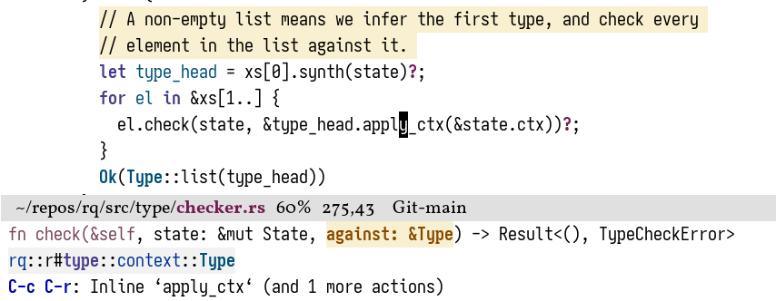
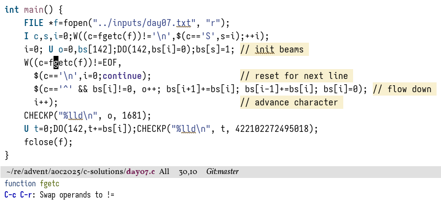
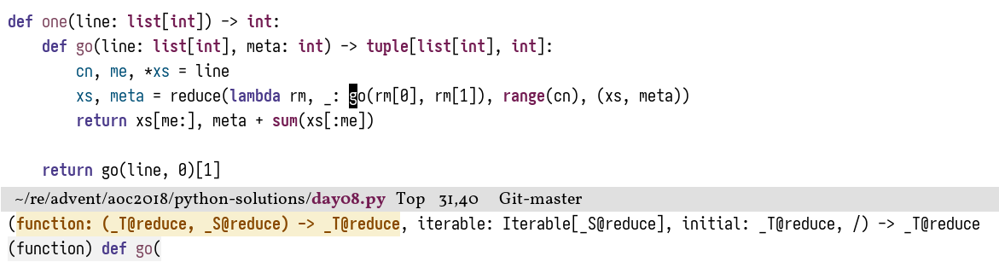
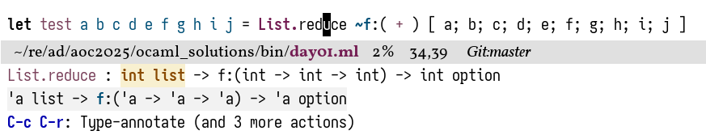
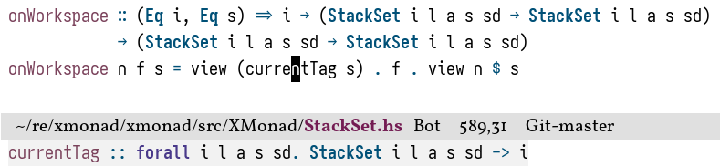
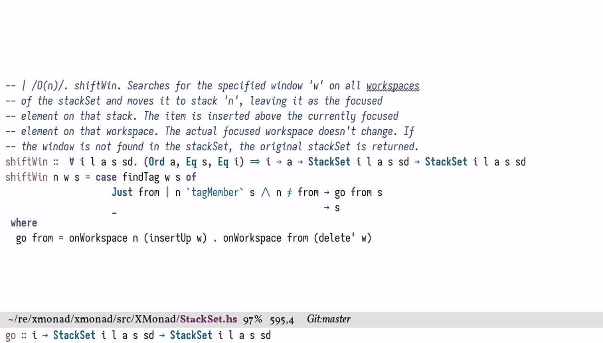

In an
[earlier post](https://tony-zorman.com/posts/fixing-lsp-mode.html)
I talked about making the hover signatures for
[lsp-mode](https://emacs-lsp.github.io/lsp-mode/)
a little bit more useful.
Out of the completely irrational desire to use more built-in packages,
I've recently switched to
<abbr title="[E]macs Poly[glot]">[eglot](https://www.gnu.org/software/emacs/manual/html_node/eglot/index.html)</abbr>
as my LSP client of choice,
which however has the same inclination for showing hover information I don't care about by default.

<!--more-->

I won't assume that you have read the lsp-mode post,
so let's quickly remind ourselves of the general problem:

> L<span class="small-caps">sp</span> clients have the option of showing useful things on hover.
> In most languages, there is an obvious candidate for this: the type signature of the thing at point.
> Sadly—for some languages—the implementation of the feature is… not great.

This still holds true two years later,[^1]
but this is as good of an excuse as any to become a bit more familiar with the eglot codebase.
Plus, customising Emacs is just *so much fun*.

---

Different language servers behave a bit differently here,
but the default for all of them is pretty "meh".[^2]

+ `rust-analyzer` shows where the thing comes from

  <picture>
    <source srcset="../images/eglot-hover/rust-analyzer1.png" media="(prefers-color-scheme: light)">
    <source srcset="../images/eglot-hover/rust-analyzer1-dark.png" media="(prefers-color-scheme: dark)">
    
  </picture>

  I will draw your attention to the second line in the minibuffer;
  the first is just additional context,[^3]
  and the third are available code actions.
  What eglot shows me is that `apply_ctx` is a method of the `Type` type,
  sitting in `./type/context.rs`,
  with `./` being the root of the crate.

+ `clangd` shows the vague type

  <picture>
    <source srcset="../images/eglot-hover/clangd1.png" media="(prefers-color-scheme: light)">
    <source srcset="../images/eglot-hover/clangd1-dark.png" media="(prefers-color-scheme: dark)">
    
  </picture>

+ `(based)pyright` shows something completely useless

  <picture>
    <source srcset="../images/eglot-hover/pyright1.png" media="(prefers-color-scheme: light)">
    <source srcset="../images/eglot-hover/pyright1-dark.png" media="(prefers-color-scheme: dark)">
    
  </picture>

+ `ocaml-lsp` sort of shows what I want to see

  <picture>
    <source srcset="../images/eglot-hover/ocaml-lsp1.png" media="(prefers-color-scheme: light)">
    <source srcset="../images/eglot-hover/ocaml-lsp1-dark.png" media="(prefers-color-scheme: dark)">
    
  </picture>

  …but only for short type signatures

  <picture>
    <source srcset="../images/eglot-hover/ocaml-lsp2.png" media="(prefers-color-scheme: light)">
    <source srcset="../images/eglot-hover/ocaml-lsp2-dark.png" media="(prefers-color-scheme: dark)">
    
  </picture>

+ Same issue with `haskell-language-server`

  <picture>
    <source srcset="../images/eglot-hover/hls1.png" media="(prefers-color-scheme: light)">
    <source srcset="../images/eglot-hover/hls1-dark.png" media="(prefers-color-scheme: dark)">
    
  </picture>

  <picture>
    <source srcset="../images/eglot-hover/hls2.png" media="(prefers-color-scheme: light)">
    <source srcset="../images/eglot-hover/hls2-dark.png" media="(prefers-color-scheme: dark)">
    
  </picture>

---

What I'd like to achieve instead is a type signature—if I want to know where the thing comes from I can just `M-.` it.

<picture>
  <source srcset="../images/eglot-hover/rust-analyzer2.png" media="(prefers-color-scheme: light)">
  <source srcset="../images/eglot-hover/rust-analyzer2-dark.png" media="(prefers-color-scheme: dark)">
  
</picture>

---

<picture>
  <source srcset="../images/eglot-hover/clangd2.png" media="(prefers-color-scheme: light)">
  <source srcset="../images/eglot-hover/clangd2-dark.png" media="(prefers-color-scheme: dark)">
  
</picture>

---

<picture>
  <source srcset="../images/eglot-hover/pyright2.png" media="(prefers-color-scheme: light)">
  <source srcset="../images/eglot-hover/pyright2-dark.png" media="(prefers-color-scheme: dark)">
  
</picture>

---

<picture>
  <source srcset="../images/eglot-hover/ocaml-lsp3.png" media="(prefers-color-scheme: light)">
  <source srcset="../images/eglot-hover/ocaml-lsp3-dark.png" media="(prefers-color-scheme: dark)">
  
</picture>

---

<picture>
  <source srcset="../images/eglot-hover/hls3.png" media="(prefers-color-scheme: light)">
  <source srcset="../images/eglot-hover/hls3-dark.png" media="(prefers-color-scheme: dark)">
  
</picture>

---

In case anyone finds this useful,
I've packaged the source code of this article as [eglot-hover](https://codeberg.org/slotThe/eglot-hover).
It may need some adjustments depending on the language server implementation,
but at least for the ones shown above it should work as-is.

Onto the fun part.

The good<!--
-->—or bad, depending on your inclination—<!--
-->thing about lsp-mode is that it's almost unnecessarily configurable just by user options.
This includes hover signatures:
`lsp-clients-extract-signature-on-hover` is just a `cl-defmethod`,
which one can trivially override depending on the name of the currently active language server (one of its arguments).

Eglot doesn't actually do any displaying itself,
but instead delegates to the built-in <abbr title="Emacs Lisp Documentation, except now it's fully generic">ElDoc</abbr>.
Scrolling through eglot's code, we can find integration functions like this:

``` emacs-lisp
(defun eglot-hover-eldoc-function (cb &rest _ignored)
  "A member of `eldoc-documentation-functions', for hover."
  (when (eglot-server-capable :hoverProvider)
    (let ((buf (current-buffer)))
      (eglot--async-request
       (eglot--current-server-or-lose)
       :textDocument/hover (eglot--TextDocumentPositionParams)
       :success-fn
       (eglot--lambda ((Hover) contents range)
        (eglot--when-buffer-window buf
          (let* ((info (unless (seq-empty-p contents)
                         (eglot--hover-info contents range)))
                 (pos (and info (string-match "\n" info))))
            (while (and pos (get-text-property pos 'invisible info))
              (setq pos (string-match "\n" info (1+ pos))))
            (funcall cb info :echo pos))))
       :hint :textDocument/hover))
    t))
```

How exactly to handle the callback `cb` is documented in `eldoc-documentation-functions`,
but that's actually not super important for this application.
We don't want to add anything to eglot's already generated hover signature,
but completely replace it in certain contexts,
which essentially boils down to redefining `pos`.
A priori, this is a buffer position up until which the docstring will be shown;
as you can see above, the default implementation is to just show the first "real" line.
While `pos` is named as if it should always be a number,
it gets passed into the callback as a value for the `:echo` key.
Quoting the `eldoc-documentation-functions` documentation:

> `:echo`, controlling how eldoc-display-in-echo-area should
> present this documentation item in the echo area, to save
> space.  If VALUE is a string, echo it instead of DOCSTRING.  If
> a number, only echo DOCSTRING up to that character position.
> If skip, don't echo DOCSTRING at all.

The value can be a string, in which case that string is displayed verbatim.
Hence, the only thing we need to do is to [monkey patch](https://en.wikipedia.org/wiki/Monkey_patch) `eglot-hover-eldoc-function`,
match on the name of the current major mode,
and extract the "correct" signature ourselves if needed.

Suppose we are given the magic functions
`eglot-hover--get` to extract the signature out of the response that the LSP server sends,
as well as `eglot-hover--hl-string` to highlight the resulting string.
Then, matching just on [rustic-mode](https://github.com/emacs-rustic/rustic),
the final change is rather small:

``` emacs-lisp
(defun eglot-hover-eldoc-function (cb &rest _ignored)
  (when (eglot-server-capable :hoverProvider)
    (let ((buf (current-buffer)))
      (eglot--async-request
       (eglot--current-server-or-lose)
       :textDocument/hover (eglot--TextDocumentPositionParams)
       :success-fn
       (eglot--lambda ((Hover) contents range)
         (eglot--when-buffer-window buf
           (let* ((info (unless (seq-empty-p contents)
                          (eglot--hover-info contents range)))
                  (echo
                   ; ∨∨∨∨∨∨∨∨∨∨∨∨∨∨∨∨∨∨∨∨∨∨∨∨∨∨∨∨∨∨∨∨∨∨∨∨∨∨∨∨∨∨∨∨∨∨∨∨∨∨∨∨∨∨∨∨∨∨∨
                   (if (and (eq major-mode 'rustic-mode) (stringp info))
                       (eglot-hover--hl-string
                        (eglot-hover--get "rust" (substring-no-properties info))
                        major-mode)
                   ; ∧∧∧∧∧∧∧∧∧∧∧∧∧∧∧∧∧∧∧∧∧∧∧∧∧∧∧∧∧∧∧∧∧∧∧∧∧∧∧∧∧∧∧∧∧∧∧∧∧∧∧∧∧∧∧∧∧∧∧
                     (let ((pos (and info (string-match "\n" info))))
                       (while (and pos (get-text-property pos 'invisible info))
                         (setq pos (string-match "\n" info (1+ pos))))
                       pos))))
             (funcall cb info :echo echo))))
       :hint :textDocument/hover))
    t))
```

Since we're not returning a buffer position, we have a lot more freedom to highlight the string as we want.
For example, in `haskell-mode` I prettify some symbols (`forall` becomes `∀`, `\` becomes `λ`, and so on),
and these would otherwise get lost when just the buffer position is sent to ElDoc.

The actual implementation of `eglot-hover--hl-string` and `eglot-hover--get` is relatively straightforward,
and just involves some markdown mangling.
It originally started with some Rust-specific code given in
[emacs-lsp/lsp-mode#1740](https://github.com/emacs-lsp/lsp-mode/pull/1740),
and was then generalised to fit other LSP servers.
You can try throwing servers not listed above at it as well,
but since the implementation is relatively brittle it'll probably need some adjustments.[^4]

``` emacs-lisp
(defun eglot-hover--hl-string (str mode)
  "Syntax highlight STR according to MODE."
  (with-temp-buffer
    (insert str)
    (delay-mode-hooks (funcall mode))
    (-each #'funcall
      (--remove (-contains? '(nil
                              rustic-setup-lsp
                              eglot--managed-mode
                              eldoc-mode
                              flymake-mode-off)
                            it)
                (--mapcat (ignore-errors (symbol-value it))
                          delayed-mode-hooks)))
    (font-lock-ensure)
    (buffer-string)))
```

``` emacs-lisp
(defun eglot-hover--get (lang str)
  "Get LANGs hover information in STR."
  (cl-flet ((join (sep strings)
              ;; This shields against Python shenanigans like
              ;;
              ;; def f(
              ;;   a,
              ;;   b
              ;; )
              (--reduce (concat acc
                                (if (or (s-suffix? "(" acc)
                                        (s-prefix? ")" it))
                                    it
                                  (concat sep it)))
                        strings)))
    (let* ((start (concat "```" lang))
           (groups (--filter (or (s-equals? start (car it))
                                 (s-equals? start (cadr it)))
                             (-partition-by #'s-blank?
                                            (s-lines (s-trim str)))))
           (name-at-point (symbol-name (symbol-at-point)))
           (type-sig-group (car
                            (--filter (--any? (s-contains? name-at-point it)
                                              it)
                                      groups))))
      (->> (or type-sig-group (car groups))
           (--drop-while (not (s-prefix? start it)))
           (-drop 1)                    ; ``` LANG
           (-drop-last 1)               ; ```
           (-map #'s-trim)
           (--filter (not (s-matches? comment-start-skip it)))
           (join " ")
           (s-chop-suffixes '("," "```" "``` ---"))))))
```

That's pretty much it—you can now enjoy having useful hover information!

---

In case you want to
[manually add type signatures](https://tony-zorman.com/posts/fixing-lsp-mode.html#bonus-adding-type-signatures)
then this is similarly straightforward,
provided one knows the correct incantations:

``` emacs-lisp
(defun +haskell-type-sig-at-point ()
  (interactive)
  (let ((s (-> (eglot--request
                (eglot--current-server-or-lose)
                :textDocument/hover (eglot--TextDocumentPositionParams))
               (plist-get :contents)
               (plist-get :value)
               ((lambda (s) (eglot-hover--get "haskell" s)))
               (eglot-hover--hl-string 'haskell-mode))))
    (back-to-indentation)
    (insert s)
    (haskell-indentation-newline-and-indent)))
```

<picture>
  <source srcset="../images/eglot-hover/type-sig.gif" media="(prefers-color-scheme: light)">
  <source srcset="../images/eglot-hover/type-sig-dark.gif" media="(prefers-color-scheme: dark)">
  
</picture>

[^1]: See, among others probably,
      [emacs-lsp/lsp-haskell#151](https://github.com/emacs-lsp/lsp-haskell/issues/151),
      [emacs-lsp/lsp-haskell#187](https://github.com/emacs-lsp/lsp-haskell/pull/187),
      [emacs-lsp/lsp-mode#4362](https://github.com/emacs-lsp/lsp-mode/issues/4362),
      [haskell/haskell-language-server#4724](https://github.com/haskell/haskell-language-server/issues/4724), and
      [emacs-lsp/lsp-mode#1740](https://github.com/emacs-lsp/lsp-mode/pull/1740).

[^2]: To be clear, I don't think these are shortcomings of the individual language servers,
      it's just that there's a mismatch with the integration into Emacs's LSP client landscape.
      Breaking long things into several lines is quite normal, after all.

[^3]: I do like eglot's default behaviour of showing that we're inside of a function call and
      which argument is currently being filled in!

[^4]: {-} Needs at least `cl-lib.el`, `dash.el`, and `s.el` to work.
