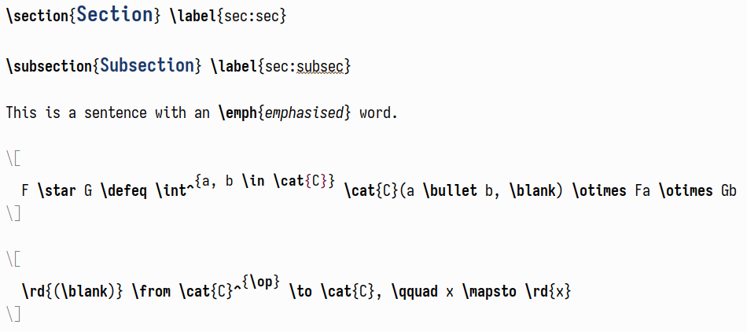
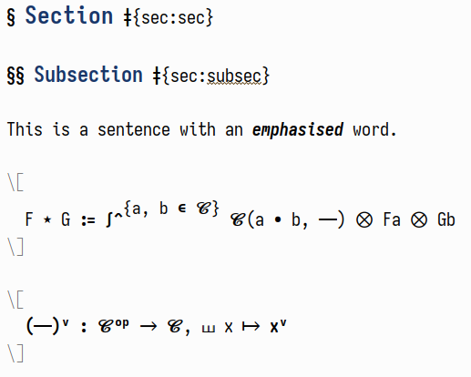
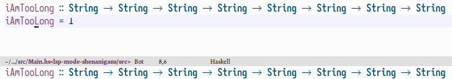

Emacs is the "extensible text editor", and it wouldn't be fun if one
didn't at least try to take advantage of that, right?  Having just
written a [README][cfg:emacs:readme] for my Emacs configuration, I
thought it might be nice to somewhat expand on certain ideas and give a
little context to some snippets that have accumulated over time.

While there is a post about [my version][posts:query-replace] of the
`query-replace` function, most other tidbits have only seen the light of
day in places like the "Weekly Tips, Tricks, &c." thread on Reddit.  In
the spirit of hosting my content somewhere that I actually control,
I chose to showcase these again here, hoping that other people may also
find some of this stuff useful.[^2]

<!--more-->

# `frame-inhibit-implied-resize`

This variable is interesting for all the people who, for one reason or
another, care about the startup time of their Emacs session.  Even more
if one uses a tiling window manager, as then Emacs doesn't get a say in
how big its frame will be anyway.  An excerpt from the documentation:

> Whether frames should be resized implicitly.
>
> If this option is nil, setting font, menu bar, tool bar, tab bar,
> internal borders, fringes or scroll bars of a specific frame may
> resize the frame in order to preserve the number of columns or lines
> it displays.  If this option is t, no such resizing is done.

I always wondered why startup time skyrocketed whenever I changed the
default font to something else—surely opening a font and using it can't
be that expensive!  What I didn't realise was that what I set was
slightly larger than Emacs's default font, which I reckon was some kind
of monospace fallback on my system.  Setting
`frame-inhibit-implied-resize` to `t` will thusly prevent Emacs from
trying to—futilely, since I use [XMonad]—resize its frame in order to
"preserve the number of columns or lines it displays".  The upshot is
that this cuts my startup time from just over 1 second to about 0.8
seconds.  This may not seem like much, but it's literally [setting a
single variable][cfg:emacs:inhibit] in my `early-init.el`—pretty good
value for money.

# `pixel-scroll-precision-mode`

This is pretty old news by now, but I wanted to take the opportunity to
again praise `pixel-scroll-precision-mode`.  My day job is being a [PhD
student in maths][posts:phd-workflow], which means that I write a lot of
LaTeX and also use Org extensively for taking notes.  While ordinary
LaTeX entry in Org works quite well, commutative diagrams are a pain
more often than not.  In fact, It's much easier to draw them with a tool
like [quiver], make a screenshot, and then include the resulting picture
in the file.  However, now we have the problem that Emacs treats
pictures as very large single characters—the result is a scrolling
experience that's very far from optimal.  This is _exactly_ where
`pixel-scroll-precision-mode` comes in and saves the day, but see the
difference for yourself:

<p>
  <video width="100%" controls>
    <source src="../images/emacs-potpourri/pixel-scroll-precision-mode.mp4" type="video/mp4">
  </video>
</p>

# Quickly insert images in `org-roam`

Speaking of inserting images into Org; how does one do that, exactly?
Doing everything by hand seems like a slog: select an arbitrary
rectangle on the screen, take a screenshot of it, move the resulting
picture into the correct directory, give it an appropriate name, and
insert a link to it into the current buffer.  This sounds like a lot of
busywork for something that I ideally don't want to think about at all;
thankfully, most of this can be nicely automated.

``` emacs-lisp
(defun slot/org-roam-insert-image ()
  "Select and insert an image at point."
  (interactive)
  (let* ((file-name (format "%s-%s.png"
                            (file-name-sans-extension (buffer-name))
                            (cl-random (expt 2 31))))
         (path (format "%s/%s/%s" org-roam-directory "images" file-name)))
    ;; The mouse movement via xdotool is needed because otherwise, if
    ;; unclutter is active, the pointer will remain hidden.  Uff.
    (call-process "xdotool" nil 0 nil "mousemove_relative" "--" "-1" "0")
    (let ((scrot-exit (call-process "scrot" nil nil nil
                                    "-z" "-f" "-s" "--file" path)))
      (when (= scrot-exit 0)
        (insert (format "[[../images/%s]]" file-name))))))
```

All it needs is `xdotool` for moving the mouse (though, if you don't use
`unclutter` then this may well be deleted) and `scrot` for actually
taking the screenshot.  Pretty convenient.  If `scrot` is too low-tech
for you, then the above snippet probably also works with `flameshot` or
a similar tool.

# LaTeX

## LaTeX for the lazy mathematician

I am pretty impatient when it comes to LaTeX entry.  So impatient that I
have created a few "now you're really taking it too far"-type of
functions.  To be honest, they kind of delight me.

First, the following is an override for the `self-insert-command`, which
enables faster entry of one-character math symbols:

``` emacs-lisp
(defun slot/LaTeX-self-insert (&optional arg char)
  "`self-insert-command' for LaTeX mode.
If the previous word is just a single character, surround it with
dollar signs.  If already in math mode, do nothing.  If the
character is a single `a', do nothing.

If called with a single \\[universal-argument], just call
`self-insert-command'."
  (interactive "P")
  (pcase arg
    ('(4) (self-insert-command 1))
    (_ (let ((ppoint (save-excursion (backward-word)       (point)))
             (ipoint (save-excursion (back-to-indentation) (point)))
             (word   (word-at-point)))
         (unless (or (length> word 1)   ; longer than a single character
                     (not word)
                     (= ipoint ppoint)  ; the first thing on a new line
                     (equal "a" word)
                     (number-at-point)
                     (texmathp))
           (-let (((open . close) math-delimiters-inline))
             (backward-char)
             (insert open)
             (forward-char 1)
             (insert close)))
         (self-insert-command 1 char)))))
```

Bound to `<SPC>` (and also things like `.` and `-`), it enables one to
write `"foo T<SPC>"` and have Emacs insert `"foo $T$ "` instead—very
convenient, and much faster even than having a snippet to insert dollars
based on some condition.

The laziness continues with me not wanting to write `\blank` so
often.[^3] I could also create an auto-expanding snippet for this, but
wouldn't it be _much better_ to insert it on a double tap of the space
bar instead?  I think so!

``` emacs-lisp
(defun slot/LaTeX-space (&optional arg)
  "Insert a space; or not.
In case the previous character was already a space, insert
\\blank instead."
  (interactive "P")
  (if (and (= ?\s (char-before)) (texmathp))
      (insert "\\blank ")
    (slot/LaTeX-self-insert arg ?\s)))
```

Now, writing something like `"C(<SPC><SPC>,<SPC><SPC>)"` in math-mode
nicely inserts `"C( \blank , \blank )"`.  Because the space bar is so
easy to press, this is again marginally faster than having to write
something like `"C(bln,bln)"`.

Together with auto-expanding snippets, this enables reasonably fast
LaTeX entry:


More examples can be found in the [post][posts:phd-workflow:entry] about
my research workflow.

## Prettify LaTeX buffers

This story is interesting enough that I've written a whole [post][posts:prett-latex] about it<!--
-->—go check it out!
Long story short, one can transform a buffers like this



into one like this



# ERC

I recently switched from WeeChat to [ERC][emacs:erc] for IRC.  It's
really great so far, but some things felt a bit lackluster out of the
box.  As such, my [ERC config][cfg:emacs:erc] has already grown quite a
bit.[^1] The following are a few tweaks that improve my experience
greatly.

## Mark the current frame as urgent

One feature I was dearly missing was the ability to set [urgency
hints][x11:urgent] in the case I get highlighted/pinged.  This is
essentially the window telling your window manager or desktop
environment that it wants your attention.  You can then execute an
action based on this urgency hint.  Thankfully, Emacs is extensible, so
hacking this behaviour into ERC wasn't actually all that complicated.

``` emacs-lisp
(defun slot/mark-emacs-urgent ()
  "Mark the current frame as urgent."
  (let* ((WM-HINTS "WM_HINTS")
         (hints (seq--into-list
                 ;; By default this returns a string/vector.
                 (x-window-property WM-HINTS nil WM-HINTS nil nil t))))
    ;; Urgency flag: (1L << 8) == 256
    ;; Source (as always): https://tronche.com/gui/x/xlib/ICC/client-to-window-manager/wm-hints.html
    (setcar hints (logior (car hints) (lsh 1 8)))
    (x-change-window-property WM-HINTS hints nil WM-HINTS 32)))

(defun slot/beep-on-match (match-type _nickuserhost message)
  "Beep and mark the frame as urgent on highlight."
  (let ((visible-bell nil))
    (slot/mark-emacs-urgent)
    (erc-beep-on-match match-type _nickuserhost message)))

(add-hook 'erc-text-matched-hook #'slot/beep-on-match)
```

And that's really it!  Now ERC correctly sends an urgency hint whenever
I get highlighted.  Note that, [as we found out][x11:reparenting], if
you use a reparenting window manager (you probably do if you use a
desktop environment) you might have to give `x-change-window-property`
above an extra `t` argument.

## Don't highlight quite so much

Having configured quite a few regular expressions for when I get
highlighted, things can get quite overwhelming at times.  For example,
when ERC starts up it prints `/users` in every channel buffer.  Of
course, I'm a user in a channel that I'm in, so Emacs happily starts
beeping and throwing around urgency hints—not a good experience.  This
also clutters the `ERC Keywords` buffer (which is built-in and akin to
WeeChat's `highmon.pl`).

Thankfully, however, there is a straightforward hack around this: just
check the message for certain regular expression first and do nothing
when they are present.

``` emacs-lisp
(defun slot/erc-ignore-highlight (msg)
  "Don't highlight me when these things happen."
  (let ((message (s-trim-left msg))
        (channel (or (erc-default-target) "")))
    (--any? (s-prefix? it message)
            `("*** Users on"
              "*** Your new nickname is"
              "*** Welcome to the"
              ,(concat "*** " channel ": topic set by")))))
```

All that's left to do is to thread this function through to
`erc-log-matches` and the above-defined `slot/beep-on-match`:

``` emacs-lisp
(defun slot/erc-log-matches (match-type nickuserhost message)
  "Log matches to extra buffer, unless they are annoying."
  (unless (slot/erc-ignore-highlight message)
    (erc-log-matches match-type nickuserhost message)))

(defun slot/beep-on-match (match-type _nickuserhost message)
  "Beep and mark the frame as urgent on highlight."
  (let ((visible-bell nil))
    (unless (slot/erc-ignore-highlight message)
      (slot/mark-emacs-urgent)
      (erc-beep-on-match match-type _nickuserhost message))))

;; As before, now add the appropriate hooks to `erc-text-matched-hook'.
```

If it works, it works, right?

# Inserting links

Next to being a user, I also spend way too much time working on XMonad.
As such, I often help people coming into our IRC or posting on the
subreddit with their problems.  More often than not one needs to link to
the same resources over and over again—why not write something so that I
don't have to dig up these links again and again?

I currently have a set-up where I can link to every XMonad module, all
of my blog posts, as well as selected extra sites, like our tutorial and
installation instructions.  Depending on the given universal argument, a
different link style is used, to accomodate for different platforms.

``` emacs-lisp
(defun slot/get-xmonad-modules ()
  "Get all XMonad modules in the form (NAME . DOC-URL)."
  (let* ((xmonad-cabal "~/repos/xmonad/xmonad-contrib/xmonad-contrib.cabal")
         (hackage "https://hackage.haskell.org/package/xmonad-contrib/docs/")
         (modules (shell-command-to-string
                   (format "tail -n +50 %s | grep -E \" XMonad\\.*\""
                           xmonad-cabal))))
    (->> (s-lines modules)
         (-drop-last 1)                 ; empty line
         (--map (s-trim (s-replace "exposed-modules:" "" it)))
         (--map (cons it
                      (concat hackage (s-replace "." "-" it) ".html"))))))

(defun slot/get-posts ()
  "Get all of my blog posts in the form (NAME . URL)."
  (let* ((website "https://tony-zorman.com/")
         (base-path "~/repos/slotThe.github.io/")
         (posts (directory-files-recursively (concat base-path "posts/")
                                             ".md$")))
    (--map (with-temp-buffer
             (insert-file-contents-literally it)
             (search-forward "title: ")
             (cons                      ; Name . URL
              (string-replace "\"" "" (buffer-substring (point)
                                                        (point-at-eol)))
              (concat website (string-trim it base-path ".md") ".html")))
           posts)))

(defun slot/often-used-links (&optional arg)
  "Choose a link and insert it into the buffer in .md format.
This is quite useful, since many people happen to have very
similar problems when, for example, first starting out with
xmonad."
  (interactive "P")
  (-let* ((links
           (-concat '(("tutorial" . "https://xmonad.org/TUTORIAL.html")
                      ("install"  . "https://xmonad.org/INSTALL.html")
                      ("xmonad.hs". "https://gitlab.com/slotThe/dotfiles/-/blob/master/xmonad/.config/xmonad/src/xmonad.hs"))
                    (slot/get-xmonad-modules)
                    (slot/get-posts)))
          (choice (completing-read "Link: " (mapcar #'car links)))
          ((name . link) (assoc choice links)))
    (insert "[" name "]")
    (if arg
        (insert "(" link ")")
      (save-excursion (insert "\n\n[" name "]: " link)))))
```

I bind this to `C-c l` in `markdown-mode`; it looks like this:


# A macro for `repeat-mode`

I've written a macro for Emacs's `repeat-mode`, which allows you to
execute repeated commands without having to press the same prefix over
and over again.  For example, one can set this up for Org navigation
commands such that `C-c C-n n n` executes `org-next-visible-heading`
three times.  A great introduction to `repeat-mode` can be found
[here][posts:people:repeat-mode].

There are [lots][emacs:repeat-mode:1] of [packages][emacs:repeat-mode:2]
around that define different macros which probably work much better than
the one below.  Even [use-package] now sports a `:repeat-map` keyword
now.  However, obviously the one I wrote feels the most natural to _me_,
so it's being kept around regardless.

``` emacs-lisp
(defmacro defrepeatmap (sym pairs &optional docstring)
  "A macro for defining `repeat-map's.
Defines a new repeat-map called SYM with the given DOCSTRING.
The keys are derived via the list PAIRS, whose elements are cons
cells of the form (KEY . DEF), where KEY and DEF must fulfill the
same requirements as if given to `define-key'.

If the key only consists of a single character; i.e., is already
bound and a repeat map is created afterwards, simply add it to
the repeat-map SYM.  If not, globally bind KEY to DEF and only
insert the last character of DEF into the repeat map SYM."
  (declare (indent 1) (debug t))
  `(progn
     (defvar ,sym
       (let ((kmap (make-sparse-keymap)))
         (--each ,pairs
           (-let (((key . fun) it))
             (if (length= key 1)
                 (define-key kmap (kbd key) fun)
               (bind-key (kbd key) fun)
               (define-key kmap (kbd (s-right 1 key)) fun))))
         kmap)
       ,docstring)
     ;; Tell the keys they are in a repeat map.
     (--each (mapcar 'cdr (cdr ,sym))
       (put it 'repeat-map ',sym))))
```

The following would, for example, bind `mc/mark-next-like-this-word` to
`M-s s` globally and to `s` in the created `mc-repeat-map`.  Likewise,
`mc/mark-next-word-like-this` is bound to `.` in that map, and so on.

``` emacs-lisp
(defrepeatmap mc-repeat-map
    '(("M-s s" . mc/mark-next-like-this-word)
      ("C-M-." . mc/mark-next-word-like-this)
      ("C-M-," . mc/mark-previous-word-like-this)
      ("C->"   . mc/skip-to-next-like-this)
      ("C-<"   . mc/skip-to-previous-like-this))
    "`repeat-mode' keymap to repeat `multiple-cursors' bindings.")
```

This may be too implicit for many people, but for me it's just right—and
that's sort of the point of all of this, right?

# Warn on empty subjects

Emacs's `notmuch` package has this fantastic concept of an *attachment check*:
adding `notmuch-mua-attachment-check` to `notmuch-mua-send-hook` will,
before sending the message,
check whether the regular expression in `notmuch-mua-attachment-regexp` matches.
If yes—and no attachment has been added—it will alert the user,
asking whether one really wants to send that email;
otherwise, everything goes through smoothly.
Due to some personal idiosyncrasies,
I needed a variant of this to check for empty subjects,
lest I become one of those people who sends emails like that.
As always, Emacs delivers.

The code for `notmuch-mua-attachment-check` is relatively straightforward,
and worth a look if we want to imitate this kind of behaviour for other headers.
A simplified[^4] version goes as follows:

``` emacs-lisp
(defun notmuch-mua-attachment-check ()
  "Signal an error an attachement is expected but missing.

Signal an error if the message text indicates that an attachment
is expected but no MML referencing an attachment is found.

Typically this is added to `notmuch-mua-send-hook'."
  (when (and
         ;; When the message mentions attachment...
         (save-excursion
           (message-goto-body)
           ;; Limit search from reaching other possible parts of the message
           (let ((search-limit (search-forward "\n<#" nil t)))
             (message-goto-body)
             (re-search-forward notmuch-mua-attachment-regexp search-limit t)))
         ;; ...but doesn't have a part with a filename...
         (save-excursion
           (message-goto-body)
           (not (re-search-forward "^<#part [^>]*filename=" nil t)))
         ;; ...and that's not okay...
         (not
          (y-or-n-p "Attachment mentioned, but no attachment - is that okay?")))
    ;; ...signal an error.
    (error "Missing attachment")))
```

There is nothing fancy happening here,
so it's not terribly difficult to adapt it to other settings.
As I said in the beginning,
I need it to check for subjects,
due to the bad habit of only adding a subject once the email is already written—only sometimes I forget.
Instead of trying to change my habits—which is hard!—it sounds much easier to modify Emacs to suit my needs.

The strategy is exactly the same as for `notmuch-mua-attachment-check`;
check for a certain regular expression, whitespace, and say something if it matches the current subject:

``` emacs-lisp
(defun notmuch-mua-subject-check ()
  (or (save-excursion
        (message-goto-subject)
        (message-beginning-of-header t)
        (not (looking-at-p "[[:blank:]]*$")))
      (y-or-n-p "No subject given – still send?")
      (error "No subject")))
```

All one has to do is to execute this before sending a mail:

``` emacs-lisp
(add-hook 'notmuch-mua-send-hook #'notmuch-mua-attachment-check)
```

and we're good to go.

# Sane type signatures with lsp-mode

By default, `lsp-mode`s type signatures for certain languages are… not great.


However, with a bit of hacking around this turns out to be quite fixable:



[The full post with all the code is here](https://tony-zorman.com/posts/fixing-lsp-mode.html).

# Eshell

## Integrating zsh's history into eshell

If you use zsh and eshell together, you—like me—will soon be annoyed at the fact that the two programs use separate history files.
However, unification is not as easy as `(setq eshell-history-file-name "~/.config/zsh/zsh_history")`,
since zsh stores its history file in a metafied format.[^5]
This means that,
on the eshell side,
we have to make sure unmetafy the history file before writing to it.

[The implementation and more details can be found here](https://tony-zorman.com/posts/eshell-zsh-history.html).

## Integrating zoxide with eshell

[Zoxide](https://github.com/ajeetdsouza/zoxide) is a rewrite
of the original [`z`](https://github.com/rupa/z) shell script
to quickly jump around directories.[^7]
Basically, it keeps a history of your most visited directories<!--
-->—ranked by [frecency](https://github.com/ajeetdsouza/zoxide/wiki/Algorithm)—<!--
-->and jumps to the best match.
Think of it as a more general version of `cd` that learns from your habits.

Below is the most basic integration of zoxide with eshell,
which has however been enough for me;
at least for the time being.

``` emacs-lisp
(advice-add 'eshell/cd :around
  (lambda (cd &rest args)
    "On directory change, add the path to zoxide's database."
    (let ((old-path (eshell/pwd))
          (_ (apply cd args))
          (new-path (eshell/pwd)))
      (when (and old-path new-path (not (string= old-path new-path)))
        (shell-command-to-string (concat "zoxide add " new-path))))))

(defun eshell/n (dir)
  "Navigate to a previously visited directory."
  (eshell/cd
   (string-trim (shell-command-to-string (concat "zoxide query " dir))))
  (eshell/ls))
```

# Parentheses-aware yanking

Normally, when you have an expression like

``` emacs-lisp
(insert-for-yank
 (current-kill
  (cond
   ((listp arg) 0)
   ((eq arg '-) -2)
   (t (1- arg)))))
```

and you try to copy the last line and insert it again,
it will be returned exactly as-is:

``` emacs-lisp
   (t (1- arg)))))

```

While this is expected behaviour, it gravely messes with awesome tools like paredit.
As I'm in the habit—using the power of [whole-line-or-region](https://github.com/purcell/whole-line-or-region)—of lazily copying with with `M-w` all the time,
this posits a problem.[^6]

The solution, thankfully, does not involve all that much code.
[You can read about it here](https://tony-zorman.com/posts/yanking.html).

# Make `join-line` handle comments sanely

By default, the `join-line` function does not handle comments at all,
and is thus quite useless for a majority of cases


However,
with a bit of [monkey-patching],
one can get a result that approximated a sane solution!
[Here is the corresponding post for this](https://tony-zorman.com/posts/join-lines-comments.html).

[XMonad]: https://xmonad.org
[cfg:emacs:erc]: https://gitlab.com/slotThe/dotfiles/-/blob/460060b7b5e164e6b892397e264b0da470ed74c9/emacs/.config/emacs/lisp/erc-config.el
[cfg:emacs:inhibit]: https://gitlab.com/slotThe/dotfiles/-/blob/460060b7b5e164e6b892397e264b0da470ed74c9/emacs/.config/emacs/early-init.el#L51
[cfg:emacs:readme]: https://gitlab.com/slotThe/dotfiles/-/tree/master/emacs
[emacs:ement]: https://github.com/alphapapa/ement.el
[emacs:erc]: https://www.gnu.org/software/emacs/erc.html
[emacs:repeat-mode:1]: https://tildegit.org/acdw/define-repeat-map.el
[emacs:repeat-mode:2]: https://github.com/mmarshall540/repeaters
[monkey-patching]: https://en.wikipedia.org/wiki/Monkey_patch
[posts:people:repeat-mode]: https://karthinks.com/software/it-bears-repeating/
[posts:phd-workflow:entry]: ./my-phd-workflow.html#digital-notes
[posts:phd-workflow]: ./my-phd-workflow.html
[posts:prett-latex]: ./pretty-latex.html
[posts:query-replace]: https://tony-zorman.com/posts/query-replace-many.html
[quiver]: https://q.uiver.app/
[use-package]: https://github.com/jwiegley/use-package
[x11:reparenting]: https://old.reddit.com/r/emacs/comments/xjyuni/weekly_tips_tricks_c_thread/ipfjlw0/
[x11:urgent]: https://tronche.com/gui/x/xlib/ICC/client-to-window-manager/wm-hints.html

[^1]: Though it's still much smaller than whatever it is that WeeChat
      auto-generates :)

[^2]: I am aware of the futility of this—Reddit is almost certainly
      going to be around longer than my personal site will.  And yet,
      this feels "more correct" in some way.

[^3]: This is a placeholder that's often used when not wanting to
      explicitly quantify over an argument.

[^4]: Looking for an attachment is complicated insofar as there are some ways the regular expression might match,
      which however *don't* indicate that anything needs to be done.
      The real code looks at this by observing text properties of the matches.
      However, this is not important for what follows, so I simply omitted it.

      If you're interested:

      ``` emacs-lisp
      ;; When the message mentions attachment...
      (save-excursion
        (message-goto-body)
        ;; Limit search from reaching other possible
        ;; parts of the message
        (let ((search-limit
               (search-forward "\n<#" nil t)))
          (message-goto-body)
          (cl-loop
           while (re-search-forward
                   notmuch-mua-attachment-regexp
                   search-limit t)
           ;; For every instance of the "attachment"
           ;; string found, examine the text
           ;; properties.  If the text has either a
           ;; `face' or `syntax-table' property then
           ;; it is quoted text and should *not*
           ;; cause the user to be asked about a
           ;; missing attachment.
           if (let ((props (text-properties-at
                            (match-beginning 0))))
                (not (or (memq 'syntax-table props)
                         (memq 'face props))))
           return t
           finally return nil)))
      ```

      Alternatively, check the source code of `notmuch-mua-attachment-check` directly.

[^5]: For whatever reason, when any character from the `0x80`–`0x9F` range is encountered
      the "Meta character" `0x83` is inserted and the following character gets XORed with 32.

[^6]: Of course, the *real problem* is my lack of discipline,
      but I'm certainly not going to change my habits if I can instead change my editor around me!

[^7]: Eshell's own `cd=` command only keeps track of the last `n` directories without filtering or ranking anything.
      I know about [eshell-z](https://github.com/xuchunyang/eshell-z),
      but since I'm using zoxide within zsh anyways
      it seems prudent to not depend on an additional package here.
