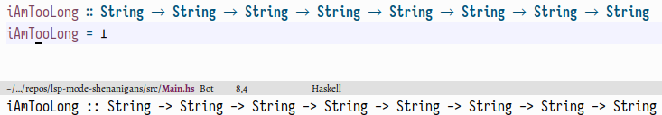
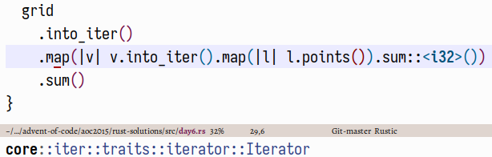
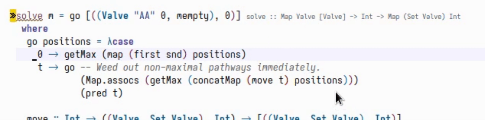
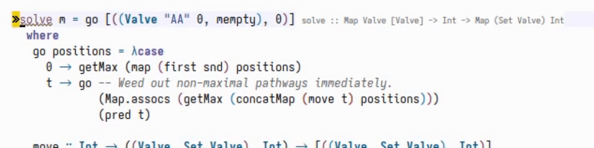

By now,
LSP servers have become the norm for editor-agnostic language support.
As expected, Emacs features at least two packages that implement the protocol:
the built-in `eglot`,
and the third-party `lsp-mode`.
I will focus on the latter in this post.

L<span class="small-caps">sp</span> clients have the option of showing useful things on hover.
In most languages, there is an obvious candidate for this:
the type signature of the thing at point.
Sadly—for some languages—the implementation of the feature is… not great.
Buggy even, one might say.[^5]
Taking this as an excuse to talk about Emacs's infinite customisability,
there is of course a way to fix this within the bounds of our configuration.
Let's do that!

<!--more-->

# The problem

Take any Haskell function with a long enough type signature, like the
following:

``` haskell
iAmTooLong :: String -> String -> String -> String -> String -> String -> String -> String
iAmTooLong = undefined
```

By default, lsp-mode[^1] will display the following type signature
in the echo-area
when hovering over the function name:


That's… not correct.
Executing `lsp-describe-thing-at-point` immediately reveals the problem;
the request we get back looks like this:

    ``` haskell
    iAmTooLong :: String
    -> String
    -> String
    -> String
    -> String
    -> String
    -> String
    -> String
    ```

    Defined at »PATH«

The type signature is so long that the server breaks it into several lines.
Lsp-mode uses `lsp-clients-extract-signature-on-hover` to extract a signature on hover—by default, it looks like this:

``` emacs-lisp
(cl-defgeneric lsp-clients-extract-signature-on-hover (contents _server-id)
  "Extract a representative line from CONTENTS, to show in the echo area."
  (car (s-lines (s-trim (lsp--render-element contents)))))
```

It just takes the first line of the first markdown code block.
While this works for simple type signatures,
it obviously falls flat in more complicated scenarios.
However, this being a generic function,
there's the possibility to overload it depending on the major mode.

# Fixing Haskell type signatures

The strategy seems pretty clear:
extract the whole block instead of only the first line.
This is swiftly done:[^2]

``` emacs-lisp
(defun slot/lsp-get-type-signature (lang str)
  "Get LANGs type signature in STR.
Original implementation from https://github.com/emacs-lsp/lsp-mode/pull/1740."
  (let* ((start (concat "```" lang))
         (groups (--filter (s-equals? start (car it))
                           (-partition-by #'s-blank? (s-lines (s-trim str)))))
         (name-at-point (symbol-name (symbol-at-point)))
         (type-sig-group (car
                          (--filter (s-contains? name-at-point (cadr it))
                                    groups))))
    (->> (or type-sig-group (car groups))
         (-drop 1)                    ; ``` LANG
         (-drop-last 1)               ; ```
         (-map #'s-trim)
         (s-join " "))))
```

We can now override the method with our own implementation:

``` emacs-lisp
(cl-defmethod lsp-clients-extract-signature-on-hover
  (contents (_server-id (eql lsp-haskell))) ; Only for Haskell.
  "Display the type signature of the function at point."
  (slot/lsp-get-type-signature "haskell" (plist-get contents :value)))
```

This already looks *fine*, but something is still amiss.



There is no syntax highlighting!
Thankfully, this is not very difficult to fix;
the idea is to paste the string into a temporary buffer,
activate `haskell-mode`,
and grab the propertised string from that.
The only thing to take care of is that we dont want to run `lsp-mode` and friends *again* in the temporary buffer.

``` emacs-lisp
(defun slot/syntax-highlight-string (str mode)
  "Syntax highlight STR in MODE."
  (with-temp-buffer
    (insert str)
    ;; We definitely don't want to call certain modes, so delay the mode's
    ;; hooks until we have removed them.
    (delay-mode-hooks (funcall mode))
    (-map #'funcall
          (--remove (-contains? '(lsp-mode lsp-deferred) it)
                    (-mapcat #'symbol-value delayed-mode-hooks)))
    ;; Now we can propertise the string.
    (font-lock-ensure)
    (buffer-string)))
```

Lsp-mode also provides a function for this, `lsp--render-string`,
but that one does not try to load all of the "safe" hooks for the major mode.
However, I have some `pretify-symbols-mode` configuration for Haskell
which I would very much like to take effect.

All in all, we have

``` emacs-lisp
;; Fixes https://github.com/emacs-lsp/lsp-haskell/issues/151
(cl-defmethod lsp-clients-extract-signature-on-hover
  (contents (_server-id (eql lsp-haskell)))
  "Display the type signature of the function at point."
  (slot/syntax-highlight-string
   (slot/lsp-get-type-signature "haskell" (plist-get contents :value))
   'haskell-mode))
```

This works quite nicely:


# Fixing Rust hovers

One of the above code snippets already mentions [lsp-mode#1740],
which is not about Haskell, but Rust,
a language that I also occasionally dabble in.
The basic issue here goes like this:
by default, `lsp-mode` shows the following hover information.



Much like the user who opened the mentioned pull-request,
I really don't care about this.
Instead, I'd much rather see


which looks much more useful to me.

Luckily, this is exactly the same situation as in the Haskell case,
which we already fixed.
Writing

``` emacs-lisp
(cl-defmethod lsp-clients-extract-signature-on-hover
  (contents (_server-id (eql rust-analyzer))) ; Only for Rust.
  "Display the type signature of the function at point."
  (slot/syntax-highlight-string
   (slot/lsp-get-type-signature "rust" (plist-get contents :value))
   'rustic-mode))
```

works out of the box.
Nice.

[lsp-mode#1740]: https://github.com/emacs-lsp/lsp-mode/pull/1740

# Bonus: adding type signatures

Here's another problem that we've solved *en passant*:
lsp-mode has code-lens support[^3],
which enables one to add type signatures by clicking on the relevant button:



However, this ostensibly requires me to use the mouse,[^6]
and—more importantly—the above GIF also shows that local functions do not have such a code lens attached to them.
I quite like type signatures for local definitions,
so that's a bit of a shame.

Fixing this is not terribly difficult either;
the hardest thing is having to look through lsp-mode's codebase so one actually knows which functions to call.
When defining the overrides for `lsp-clients-extract-signature-on-hover`, the LSP response was free,
whereas now we want to create a request for the thing at point.

``` emacs-lisp
(defun slot/lsp-get-type-signature-at-point (&optional lang)
  "Get LANGs type signature at point.
LANG is not given, get it from `lsp--buffer-language'."
  (interactive)
  (-some->> (lsp--text-document-position-params)
    (lsp--make-request "textDocument/hover")
    lsp--send-request
    lsp:hover-contents
    (funcall (-flip #'plist-get) :value)
    (slot/lsp-get-type-signature (or lang lsp--buffer-language))))
```

Once we have the type signature at point,
all that's left is to insert it into the buffer.[^4]

``` emacs-lisp
(defun slot/lsp-haskell-type-signature ()
  "Add a type signature for the thing at point.
This is very convenient, for example, when dealing with local
functions, since those—as opposed to top-level expressions—don't
have a code lens for \"add type signature here\" associated with
them."
  (interactive)
  (let* ((value (slot/lsp-get-type-signature-at-point "haskell")))
    (slot/back-to-indentation)
    (insert value)
    (haskell-indentation-newline-and-indent)))
```

Bind that to a key and you're good to go!



[^1]: And also eglot, judging from a cursory test.

[^2]: Even more so because smart people have already written this for me;
      see the docstring.

[^3]: Incidentally, this is the only reason that I use lsp-mode over eglot.
      There is a
      [stalled PR](https://github.com/joaotavora/eglot/pull/71)
      from five years ago,
      but that never led anywhere.
      *Someone* should pick this back up, I suppose.

[^4]: {-} For when hovering inexplicably breaks again,
      this also enables for a quick definition of "show the type signature of the thing at point":

      ``` emacs-lisp
      (defun slot/lsp-show-type-signature ()
        "Show the type signature for the thing at
      point.  This is essentially what
      `lsp-clients-extract-signature-on-hover'
      does, just as an extra function."
        (interactive)
        (message
         (slot/syntax-highlight-string
          (slot/lsp-get-type-signature-at-point)
          major-mode)))
      ```

      This can, again, be bound to a key for convenient access.

[^5]: I have reported this as a bug [here](https://github.com/emacs-lsp/lsp-haskell/issues/151),
      but that issue seems to have stalled,
      so here we are.

[^6]: Lsp-mode also features the `lsp-avy-lens`,
      so this is not really an actual problem.
