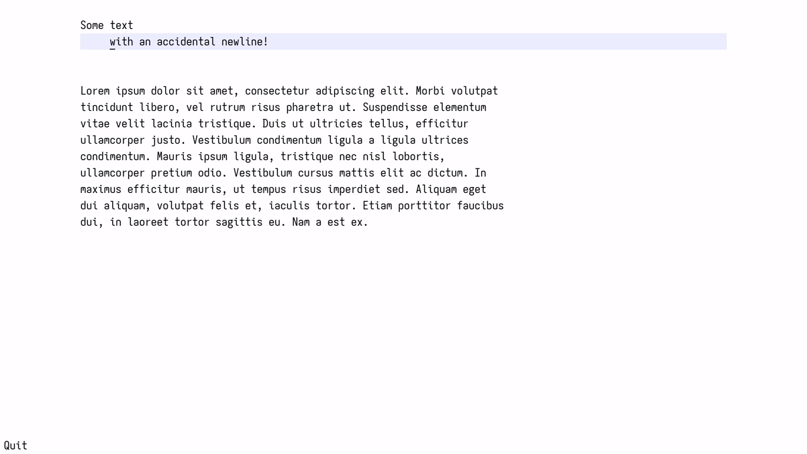
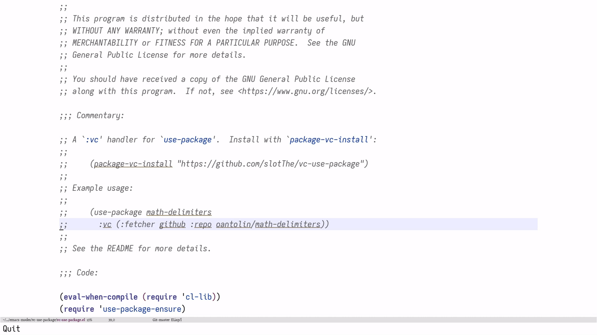

Emacs's `join-line` function,
upon execution,
joins the current line onto the previous one,
deleting any extraneous whitespace.
Alternatively, it can also sensibly act on a whole region of text.
This is quite useful,
though sadly the function does not handle comments very gracefully by default;
let's fix that.

<!--more-->

Actually an alias for `delete-indentation`,
`join-line`'s behaviour is perhaps more easily seen
rather than explained.[^8]



However, the default implementation of that function is quite oblivious to comments—in the sense that it doesn't care about them at all!


This is a bit annoying, though thankfully it's not difficult to fix!
`delete-indentation` already has some code that removes a possibly-present `fill-prefix`[^2] variable:

``` emacs-lisp
(defun delete-indentation (&optional arg beg end)
  …
  (let ((prefix (and (> (length fill-prefix) 0)
                     (regexp-quote fill-prefix))))
    (while (and (> (line-beginning-position) beg)
                (forward-line 0)
                (= (preceding-char) ?\n))
      (delete-char -1)
      ;; If the appended line started with the fill prefix,
      ;; delete the prefix.
      (if (and prefix (looking-at prefix))
          (replace-match "" t t))
      (fixup-whitespace))))
```

Adjusting this to my idiosyncratic preferences is quite straightforward:
just set `fill-prefix` to the current comment syntax[^3], and let the function do the rest.

``` emacs-lisp
(advice-add 'delete-indentation :around
  (lambda (old-fun &optional arg beg end)
    (let ((fill-prefix comment-start))
      (funcall old-fun arg beg end))))
```

Pretty neat, huh?
Sadly, this does not quite work yet!



The point is that `comment-start` for `emacs-lisp-mode` is simply `"; "`,
but by convention comments on their own line get two such semicolons instead.
This is also not difficult to fix,
but requires [monkey-patching] `delete-indentation` itself,
rather than just having to advise it.
Ostensibly all we have to do is to change[^4]

``` emacs-lisp
(if (and prefix (looking-at prefix))
  …)
```

to

``` emacs-lisp
(while (and prefix (looking-at prefix))
  …)
```

While we're at it,
we might as well remove the advice and hard-code the `fill-prefix` into the function.
Modulo some minor details,
this gives us the finished product,
which works as expected in all situations I've cared to try it in![^7]

``` emacs-lisp
(defun delete-indentation (&optional arg beg end)
  "Join this line to previous and fix up whitespace at join.
If there is a fill prefix, delete it from the beginning of this
line.
With prefix ARG, join the current line to the following line.
When BEG and END are non-nil, join all lines in the region they
define.  Interactively, BEG and END are, respectively, the start
and end of the region if it is active, else nil.  (The region is
ignored if prefix ARG is given.)

When joining lines, smartly delete comment beginnings, such that one
does not have to do this by oneself."
  (interactive
   (progn (barf-if-buffer-read-only)
          (cons current-prefix-arg
                (and (use-region-p)
                     (list (region-beginning) (region-end))))))
  ;; Consistently deactivate mark even when no text is changed.
  (setq deactivate-mark t)
  (if (and beg (not arg))
      ;; Region is active.  Go to END, but only if region spans
      ;; multiple lines.
      (and (goto-char beg)
           (> end (line-end-position))
           (goto-char end))
    ;; Region is inactive.  Set a loop sentinel
    ;; (subtracting 1 in order to compare less than BOB).
    (setq beg (1- (line-beginning-position (and arg 2))))
    (when arg (forward-line)))
  (let* ((comment (string-trim-right comment-start))
         (prefix-start (and (> (length comment-start) 0)
                            (regexp-quote comment)))
         ;; A continuation of a comment. This is important for
         ;; languages such as Haskell, where -- starts a comment
         ;; and --- still is one.
         (prefix-cont (and prefix-start
                           (regexp-quote (substring comment 0 1))))
         (prev-comment?                 ; Comment on previous line?
          (save-excursion
            (forward-line -1)
            (back-to-indentation)
            (search-forward prefix-start (pos-eol) 'no-error))))
    (while (and (> (line-beginning-position) beg)
                (forward-line 0)
                (= (preceding-char) ?\n))
      (delete-char -1)
      (unless (save-excursion (forward-line -1) (eolp))
        (delete-horizontal-space)
        ;; Delete the start of a comment once.
        (when (and prev-comment? prefix-start (looking-at prefix-start))
          (replace-match "" t t)
          ;; Look for continuations.
          (while (and prefix-cont (looking-at prefix-cont))
            (replace-match "" t t)))
        (fixup-whitespace)))))
```

If you're interested in a diff with the original function, you can find that below.

<details>
  <summary>Click</summary>
``` diff
@@ -6,7 +6,10 @@
 When BEG and END are non-nil, join all lines in the region they
 define.  Interactively, BEG and END are, respectively, the start
 and end of the region if it is active, else nil.  (The region is
-ignored if prefix ARG is given.)"
+ignored if prefix ARG is given.)
+
+When joining lines, smartly delete comment beginnings, such that one
+does not have to do this by oneself."
   (interactive
    (progn (barf-if-buffer-read-only)
           (cons current-prefix-arg
@@ -24,14 +27,28 @@
     ;; (subtracting 1 in order to compare less than BOB).
     (setq beg (1- (line-beginning-position (and arg 2))))
     (when arg (forward-line)))
-  (let ((prefix (and (> (length fill-prefix) 0)
-                     (regexp-quote fill-prefix))))
+  (let* ((comment (string-trim-right comment-start))
+         (prefix-start (and (> (length comment-start) 0)
+                            (regexp-quote comment)))
+         ;; A continuation of a comment. This is important for
+         ;; languages such as Haskell, where -- starts a comment
+         ;; and --- still is one.
+         (prefix-cont (and prefix-start (regexp-quote (substring comment 0 1))))
+         (prev-comment?                 ; Comment on previous line?
+          (save-excursion
+            (forward-line -1)
+            (back-to-indentation)
+            (search-forward prefix-start (pos-eol) 'no-error))))
     (while (and (> (line-beginning-position) beg)
                 (forward-line 0)
                 (= (preceding-char) ?\n))
       (delete-char -1)
-      ;; If the appended line started with the fill prefix,
-      ;; delete the prefix.
-      (if (and prefix (looking-at prefix))
-          (replace-match "" t t))
-      (fixup-whitespace))))
+      (unless (save-excursion (forward-line -1) (eolp))
+        (delete-horizontal-space)
+        ;; Delete the start of a comment once.
+        (when (and prev-comment? prefix-start (looking-at prefix-start))
+          (replace-match "" t t)
+          ;; Look for continuations.
+          (while (and prefix-cont (looking-at prefix-cont))
+            (replace-match "" t t)))
+        (fixup-whitespace)))
```
</details>

[monkey-patching]: https://en.wikipedia.org/wiki/Monkey_patch

[^2]: This is a "String for filling to insert at front of new line, or nil for none."

[^3]: This is helpfully provided by the `comment-start` variable.

[^4]: {-} 󠀠

    Notice that the `if` in the code is really a `when`.

[^7]: {-} 󠀠

      It is in moments like these that I'm extremely glad about<!--
      -->—albeit a bit scared of—<!--
      -->Emacs's infinite customisability.
      If something doesn't work to your liking,
      just overwrite a builtin function;
      what's the worst that could happen?

[^8]: {-} 󠀠

      In daily usage, I have this bound to `C-u C-w`,
      where `C-w` itself is bound to what's essentially `backward-kill-word`;
      see [here](https://gitlab.com/slotThe/dotfiles/-/blob/5929dc10bcbdf0d3531bd6f9940f54f8294a27a3/emacs/lisp/hopf-keybindings.el#L131)
      for the full function.
