I just handed in my dissertation,[^1]
which is more or less the culmination of the last three and a half years of my (mathematical) life.
While the maths itself is perhaps relatively inaccessible to the general public,
some of the typesetting considerations that went into the document might not be.

<!--more-->

For reference, here are a few pages of how the end product looks like:

<figure>
  <a href="../images/phd-typesetting/look1.pdf">
  
  </a>
</figure>
<figure>
  <a href="../images/phd-typesetting/look2.pdf">
  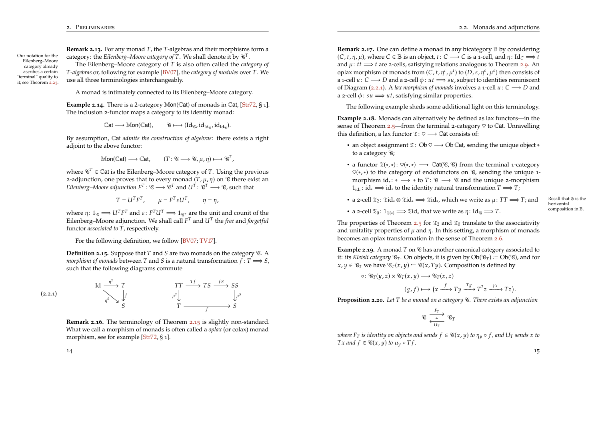
  </a>
</figure>

While this post really is about typography,
I will say that making LaTeX
[acceptably fast](https://tony-zorman.com/posts/speeding-up-latex.html)
for these kinds of medium-sized documents really helped preserve an epsilon of sanity.
Fiddling around with preamble precompiling and externalisation is—while painful—definitely worth it.

# The document class

I flip-flopped between the only two relevant contenders:
[memoir](https://ctan.org/pkg/memoir)
and
[KOMA-script](https://ctan.org/pkg/koma-script) (which features the `scrbook` class).
In the end, memoir won solely because I found the manual more pleasant to read,
and thus had an easier time customising things.[^2]
I also had the feeling that memoir laid a more heavy emphasis on typographical considerations,
but this might be because I didn't read the KOMA-script manual as closely.
This choice did probably not matter all that much in the grand scheme of things,
but I'm quite happy with memoir and would recommend it for any kind of book-length project.

# The page layout

The default `a4paper` page layout that memoir has is *fine*,
though `\isopage`—inspired by page dimensions suggested by Robert Bringhurst—yields a nicer looking printout in my opinion.
This is especially true with a slightly larger font size,
which is more or less mandatory if you have to print something in as big of a format as A4.

[^6]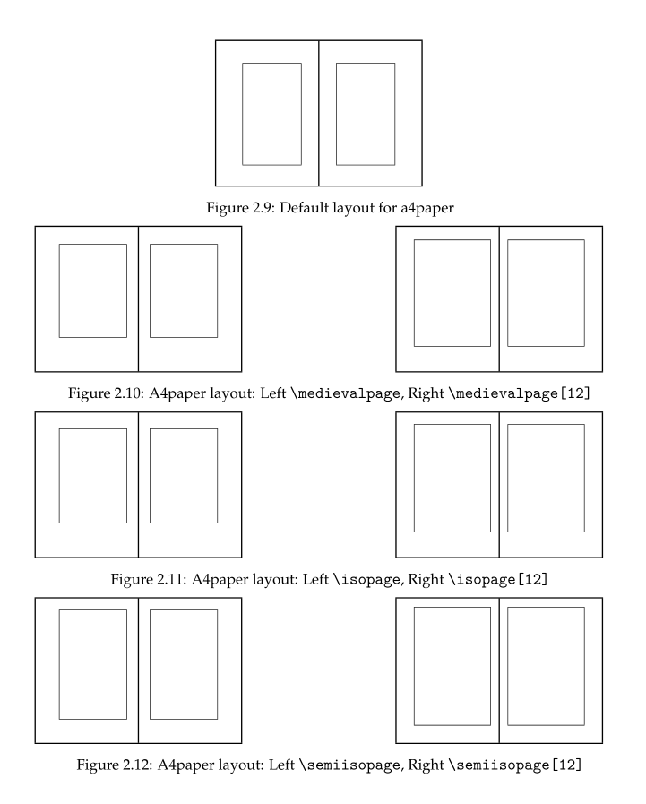

Being a little bit wider, it is also good for long-ish formulas and large-ish diagrams,
of which my thesis has more than enough.
Together with my chosen fonts below,
the final page layout results in a maximum of about 72 characters per line.
This is on the higher side of what I would prefer,
but either increasing the font size or decreasing the margins
would impede too much on the actual content,
so I kept it this way.

Sidenotes—much more on that later—are constrained to a maximum of around 21 characters via

``` tex
\setmarginnotes{17pt}{80pt}{\onelineskip}
```

This is quite narrow,
much narrower than the sidenotes on this website for example,
but still workable.
It certainly helps me to not go overboard with them,
which is not advisable anyways given the context of a dissertation in mathematics;
their mere existence probably stretches my
[novelty budget](https://shimweasel.com/2018/08/25/novelty-budgets)
quite a bit.

## Chapter headings

For chapter headings memoir features a `bringhurst` chapter style,
which however doesn't include the chapter number besides it:

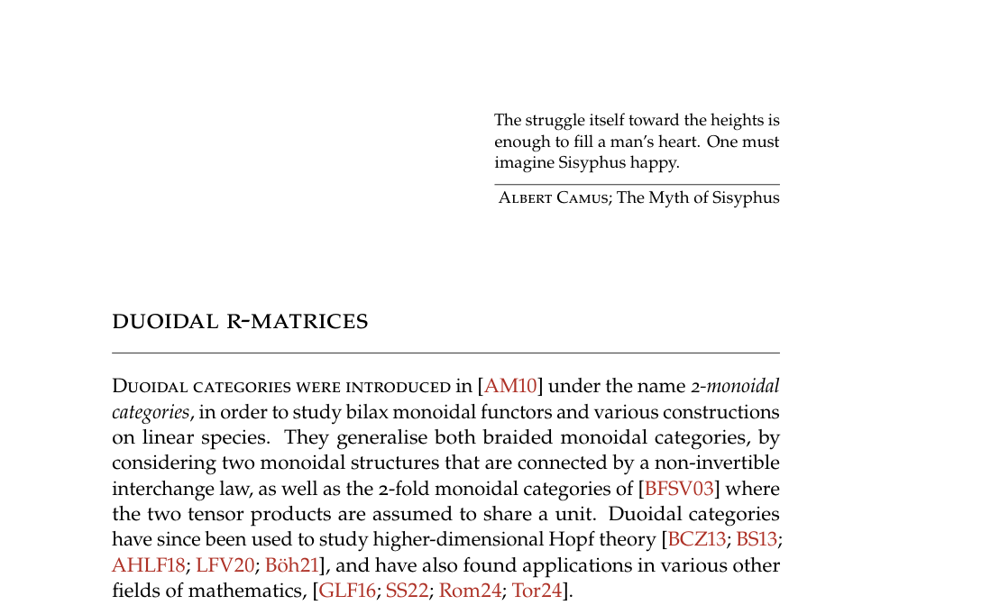

The famous book [@bringhurst92:el-typ] puts a rather large number in the margin,
which is also what I ended up going with (see the first double page in this post).
Thankfully, this is not difficult to fix—so much so that someone on TeX.Stack​exachange has
[already done it](https://tex.stackexchange.com/questions/88895/bringhurst-chapter-style-in-memoir).
The exact `bringhurst.sty` file I used is [here](../images/phd-typesetting/bringhurst.txt);
to use it just replace the call to `\chapterstyle` with a call to `\usepackage`:

``` tex
\usepackage{bringhurst}% Instead of \chapterstyle{bringhurst}
```

## The margin

As you can probably tell from this website,[^7] I *love* sidenotes.
Sadly, this is about where one hits their first bump,
in that memoir and the
[sidenotes](https://ctan.org/pkg/sidenotes) package
are incompatible.
For example, both define a `\sidecaption` command,
and both import `changepage`, although with different options.
However, LaTeX's error messages are actually comprehensible in these cases,
so patching the sidenotes package is straightforward.
<details>
  <summary>Here is the diff</summary>
``` diff
diff --git a/sidenotes.sty b/sidenotes.sty
index df6a772..cdb866d 100644
--- a/sidenotes.sty
+++ b/sidenotes.sty
@@ -7,7 +7,6 @@
 \RequirePackage{marginnote} % Provides an offset option for the marginals instead of a float
 \RequirePackage{caption} % Handles the captions (in the margin)
 \RequirePackage{xparse} % New LaTeX3 syntax to define macros and environments
-\RequirePackage[strict]{changepage} % Changepage package for symmetric twoside handling
 \ExplSyntaxOn
 \keys_define:nn { sidenotes }
   {
@@ -88,51 +87,6 @@
 }
     {\@sidenotes@placemarginal{#2}{\textsuperscript{#1}~#3}}
 }
-\DeclareCaptionStyle{sidecaption}{font=footnotesize}
-\NewDocumentCommand \sidecaption {s o o m}
-{
-  \captionsetup{style=sidecaption}
-  \IfBooleanTF{#1}
-  { % starred
-    \IfNoValueOrEmptyTF{#2}
-    {\marginnote{\caption*{#4}}}
-    {\marginnote{\caption*{#4}}[#2]}
-  }
-  { % unstarred
-  \IfNoValueOrEmptyTF{#2}
-    {\def\@sidenotes@sidecaption@tof{#4}}
-    {\def\@sidenotes@sidecaption@tof{#2}}
-  \IfNoValueOrEmptyTF{#3}
-    {\marginnote{\caption[\@sidenotes@sidecaption@tof]{#4}}}
-    {\marginnote{\caption[\@sidenotes@sidecaption@tof]{#4}}[#3]}
-  }
-}
-\newsavebox{\@sidenotes@marginfigurebox}
-\DeclareCaptionStyle{marginfigure}{font=footnotesize}
-\NewDocumentEnvironment{marginfigure} { o }
-{
-  \begin{lrbox}{\@sidenotes@marginfigurebox}
-    \begin{minipage}{\marginparwidth}
-      \captionsetup{type=figure,style=marginfigure}
-}
-{
-    \end{minipage}%
-  \end{lrbox}%
-  \@sidenotes@placemarginal{#1}{\usebox{\@sidenotes@marginfigurebox}}
-}
-\newsavebox{\@sidenotes@margintablebox}
-\DeclareCaptionStyle{margintable}{font=footnotesize}
-\NewDocumentEnvironment{margintable} { o }
-{
-  \begin{lrbox}{\@sidenotes@margintablebox}
-    \begin{minipage}{\marginparwidth}
-      \captionsetup{type=table,style=margintable}
-}
-{
-    \end{minipage}
-  \end{lrbox}
-  \@sidenotes@placemarginal{#1}{\usebox{\@sidenotes@margintablebox}}
-}
 \AtBeginDocument{%
 \newlength{\@sidenotes@extrawidth}
 \setlength{\@sidenotes@extrawidth}{\marginparwidth}
```
</details>

The `\sidenote` command now works as expected;
I wrote a small wrapper that additionally sets sidenotes ragged left or right,
depending on the parity of the page.

``` tex
\usepackage{sidenotes}  % Local one.
\usepackage{mparhack}
\renewcommand*{\marginfont}{\scriptsize}
\renewcommand{\note}[1]{%
  \sidenote{%
    \scriptsize
    \checkoddpage%
    \ifoddpage%
      \raggedright%
    \else
      \raggedleft%
    \fi
    {#1}%
  }%
}
```

<figure>
  <a href="../images/phd-typesetting/look3.pdf">
  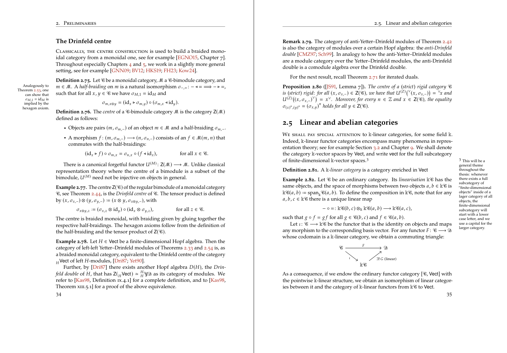
  </a>
</figure>

Interestingly, I don't actually use the `\sidecaption` implementation of either memoir or sidenotes,
but chose to roll my own:

``` tex
% Mandatory argument contains the label text and the label itself;
% the optional argument moves the label text around.
\renewcommand{\scaption}[2][0cm]{%
  \marginnote{%
    \vspace{#1}%
    \caption{%
      \checkoddpage%
      \ifoddpage%
        \raggedright%
      \else
        \raggedleft%
      \fi
      {#2}%
    }%
  }
}
```

This is probably less code than what it would take to customise memoir's `\sidecaption` to do what I want,
and I get more control over the actual typesetting on top of it.
The price one pays is that the usage of `\scaption` is a tad unintuitive,
in that the `\label` of the figure has to go inside of the caption:

``` tex
\begin{figure}[htbp]
  \centering
  \tikzfig{the-figure}
  \scaption[3cm]{%
    The caption.%
    \label{fig:the-label}%
  }
\end{figure}
```

However, I think the end result looks quite nice:[^4]

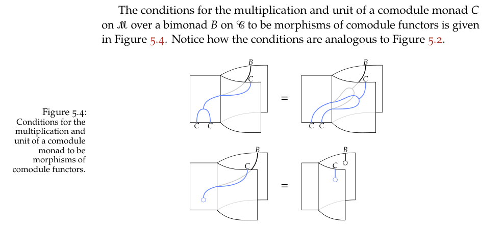

---

Another thing I did was pushing equation numbers into the margin.
Instead of

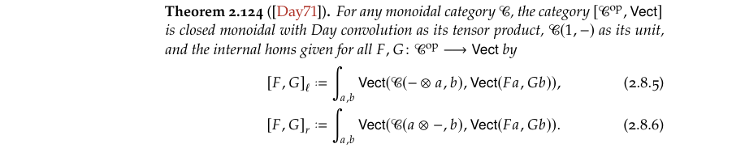

my thesis instead displays such an equation as

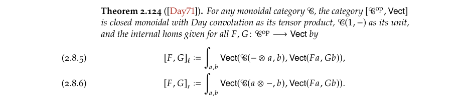

which in particular means that equation numbers are sometimes on the left of the page,
depending on where the margin is.
This is quite nice for larger diagrams or longer formulas,
which nevertheless still have to have an equation number.
Figures now neither need to intrude upon the margin,
nor be scaled quite so aggressively.

<figure>
  <a href="../images/phd-typesetting/equations-in-margin.pdf">
  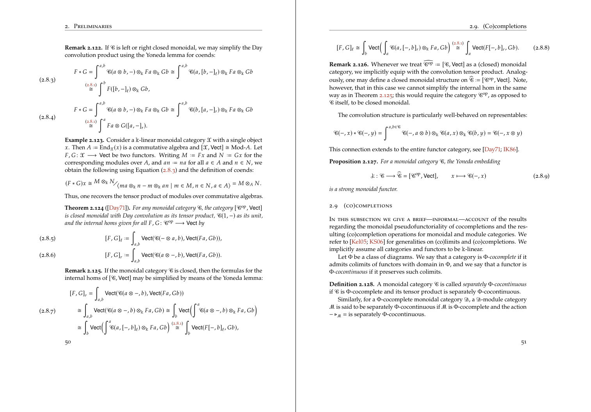
  </a>
</figure>

The code for this is a bit more involved, but luckily TeX.Stackexchange has us covered yet again!

``` tex
% Protrude equation numbers into the margin.
%
% Sources:
%   - https://tex.stackexchange.com/questions/258574/placing-the-equation-number-in-the-left-hand-margin
%   - https://www.overleaf.com/learn/latex/Page_size_and_margins
\makeatletter
\let\oldmaketag@@@\maketag@@@%
\def\oldtagform@#1{\oldmaketag@@@{(\ignorespaces#1\unskip\@@italiccorr)}}
\renewcommand{\eqref}[1]{\textup{\oldtagform@{\ref{#1}}}}
\newlength{\width@@}
\def\maketag@@@#1{\hbox{\hskip1sp\m@th\llap{%
      \normalfont#1%
      \settowidth{\width@@}{#1}%
      \checkoddpage\ifoddpage\hspace{-\the\width@@-\the\marginparsep}
      \else\hspace{\textwidth+\the\marginparsep+.1cm}\fi
    }}}
\makeatother
```

# Picking fonts

For the default calligraphic font, I settled on `boondoxupr` from the excellently documented `mathalfa` package.
It changes the default Computer Modern alphabet

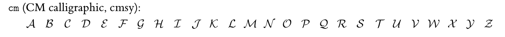

to

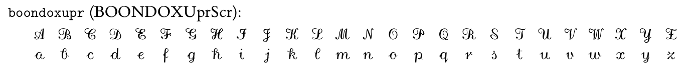

I also went ahead and chose a Fraktur font that is slightly less bold—`esstix`.

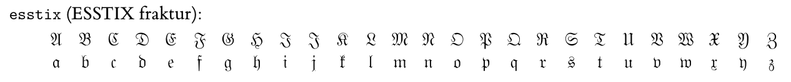

However, much more important than that is a good text font.
For me, there are two top contenders here,
which is [Libertinus](https://github.com/alerque/libertinus)—<!--
-->provided by the [libertinus](https://ctan.org/pkg/libertinus) package—<!--
-->on the one hand

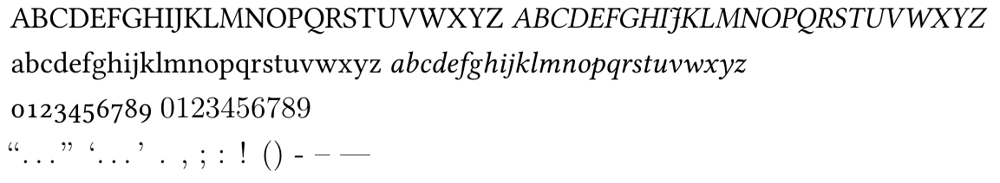

and Palatino—or a clone of it, in the form of [newpx](https://ctan.org/pkg/newpx)—on the other:

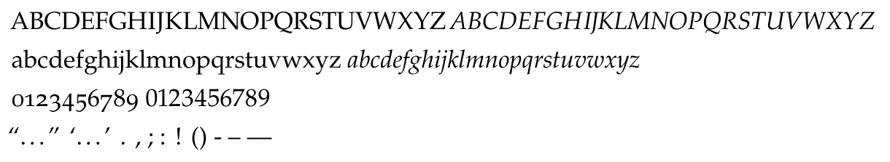

Libertinus has one critical flaw,
which is that the italic *f* extends way too far to the right.
This clashes quite significantly with `boondoxupr`

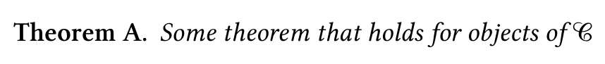

and the issue only gets exacerbated once [microtype](https://ctan.org/pkg/microtype) comes into play and squashes those spaces even more.
Palatino, while not perfect, fairs much better here:

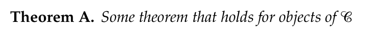

As I didn't want to manually check every occurrence of *f* at the end of a word and potentially add a thin space after it,
the choice was forced upon me.[^11]
There are lots of knobs to turn with the `newpxtext` and `newpxmath` packages,
the full code looks like this:

``` tex
\usepackage[osf,scosf,theoremfont,tighter,largesc,trueslanted,p]{newpxtext}
\usepackage[varqu,varl,scaled=.98]{zi4}% inconsolata for mono
\linespread{1.05}% A bit more leading
\usepackage{textcomp}
\usepackage[amsthm,upint]{newpxmath}
\usepackage[cal=boondoxupr,frak=esstix,frakscaled=0.95]{mathalfa}
```

Some options should be self-explanitory<!--
-->—like `tighter` or the `amsthm` compatibility—<!--
-->while other might require some further explanation.

- `osf` and `scosf` make sure to enable
  [oldstyle figures](https://en.wikipedia.org/wiki/Text_figures)
  everywhere-is, even within small caps,
  and `largesc` slightly increases the size of small caps,
  to more accurately model the size used by Linotype's version of Palatino
  (the default value here is really more petite caps than small caps).

- `theoremfont` changes the default font used for the plain theorem style of amsthm,
  which I use for theorems, corollaries, and the like.
  It keeps the text itself in italics, but uses upright figures, parentheses, and punctuation symbols.
  For example, with this option, you get
  theorem statements like this

  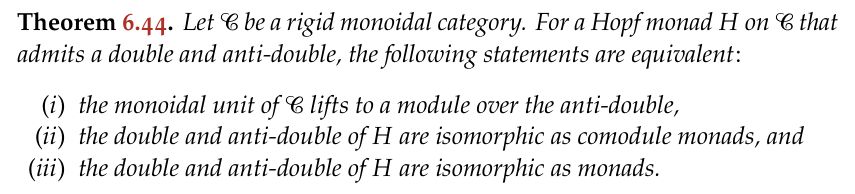

  instead of (notice the parentheses surrounding the numbering or the colon)

  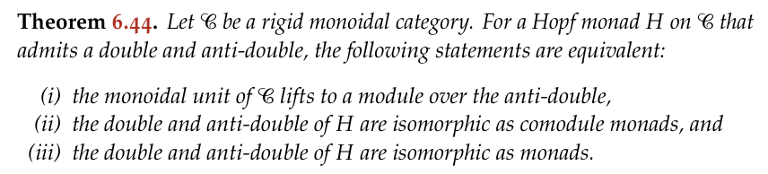

- `p` uses proportional figures (numbers) instead of tabular ones.

The [newpx manual](https://ctan.ebinger.cc/tex-archive/fonts/newpx/doc/newpxdoc.pdf)
doesn't read quite as nicely as that of mathalfa or memoir,
but it's still worth a read to get a feeling for all of the different options that exist.

---

In terms of
[microtype](https://ctan.org/pkg/microtype)
I'm actually quite happy with the default settings.
I merely added a little bit more
[tracking](https://en.wikipedia.org/wiki/Letter_spacing)
to <span class="small-caps">small caps</span> and
[protrusion](https://en.wikipedia.org/wiki/Hanging_punctuation)
to sub and superscripts:[^9]

``` tex
\usepackage[tracking=true]{microtype}
\SetTracking{encoding=*,shape=it*}{10}
\SetTracking{encoding=*}{10}
\SetProtrusion%
  {encoding=T1,size={7,8}}
  {1={ ,750},2={ ,500},3={ ,500},4={ ,500},5={ ,500},
    6={ ,500},7={ ,600},8={ ,500},9={ ,500},0={ ,500}}
```

---

One important change has to be made to `biblatex` when using a font's oldstyle figures:
the references in the main text should nevertheless use
[lining figures](https://en.wikipedia.org/wiki/Text_figures).
That is, instead of

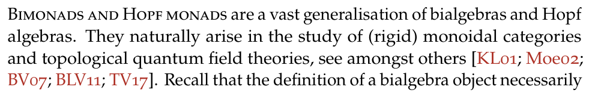

we rather want[^10]

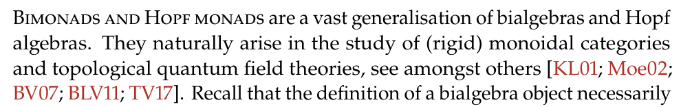

Luckily, it's pretty easy to change the field format:

``` tex
\DeclareFieldFormat{labelalpha}{\liningnums{#1}}
```

# Miscellaneous thoughts

Small macros like the following
(inspired by [this answer](https://tex.stackexchange.com/questions/422/how-do-i-repeat-a-theorem-number))
were rather large quality of life improvements:

``` tex
\makeatletter
\newtheorem*{rep@theorem}{\rep@title}
\newenvironment{reptheorem}[1]{%
  \def\rep@title{\cref{#1}}\begin{rep@theorem}%
}{%
  \end{rep@theorem}%
}
\makeatother
```

This creates an environment with an immediate reference to an already existing theorem, proposition, and so on,
which you might want to use in an introduction—much more sightly than something like *Theorem (Theorem x.y)*.
One can use it just like a regular `theoremstyle`:

``` tex
% Label should exist elsewhere.
\begin{reptheorem}{cor: pivotal_from_central_anti_central}
  Let \(\cat{C}\) be a rigid monoidal category.
  If \(\cat{C}\) admits a central Hopf monad \(\mathfrak{D}(\cat{C})\)
  and an anti\hyp{}central comodule monad \(\mathfrak{Q}(\cat{C})\),
  then it is pivotal if and only if
  \(\mathfrak{D}(\cat{C}) \cong \mathfrak{Q}(\cat{C})\)
  as monads.
\end{reptheorem}
```

This will then be typeset like so, with a link to the actual result:

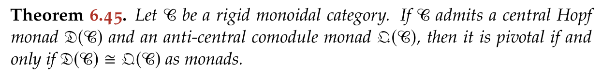

This taught me a bit more about how `amsmath` environments work under the hood.
Plus, using `cleveref` saves one from having to define many different commands like `reptheorem`, `repcorollary`, and so on<!--
-->—no going around obsessively checking whether a theorem invariably became a proposition a while ago.

---

A general advice I have—and also got from an older PhD student—is to start early.[^5]
Even just streamlining and unifying notation takes more time than ones thinks,
especially if one also cares at least an epsilon about typography.
What thankfully cuts down on the time needed is that LaTeX has been around for a long time,
and most package manuals (that I've read) are quite high quality,
so chances are that someone else will probably have solved your super specific problem already.
Still, start early.

---

Lastly, I will just leave the following *very important* bibLaTeX configuration here.

``` tex
\DeclareDelimFormat{finalnamedelim}{% Force Oxford comma
  \ifnumgreater{\value{liststop}}{2}{,}{}%
  \addspace\bibstring{and}\space}
```

[^1]: {-} The thesis is available [here](https://tony-zorman.com/dissertation.pdf),
      and you can also check out the [full source code](https://github.com/slotThe/dissertation).
      For more information, also check [here](https://tony-zorman.com/research#theses).

      This post is also available as an
      [article](https://tug.org/TUGboat/tb46-3/tb144zorman-thesis.html)
      in [TUGboat 46:3](https://tug.org/TUGboat/tb46-3/).
      I've made the [source code](https://codeberg.org/slotThe/tb144)
      for the LaTeX version available as well.

[^2]: It is also much more extensive. Both manuals clock in at around 600 pages,
      but the memoir manual is only about one class!
      There are also a bunch of concrete and extensive examples, which are very good to learn from.

[^4]: Additionally setup with the `caption` package:

      ``` tex
      \usepackage{caption}
      \captionsetup{%
        style=base,%
        labelfont=footnotesize,%
        textfont=scriptsize,%
      }
      ```

[^5]: Thanks, Florian!

[^6]: {-} The different default page layouts for A4 paper, taken from the memoir manual.

[^7]: Unless you're on mobile, I suppose.

[^9]: {-} Don't forget the usual incantation to disable protrusion for the table of contents, though:

      ``` tex
      \newcommand{\TOC}{
        \microtypesetup{protrusion=false}
        \tableofcontents
        \microtypesetup{protrusion=true}
      }
      ```

[^10]: {-} Also pictured:
       [rubrication](https://gwern.net/red)
       and starting sections with a few bits of small caps,
       which I think I picked up from Edward Tufte.

[^11]: *Update on 2025-09-13*: I recently found out about the `mathic` option of the `mathtools` package,
       which applies some italics correction to the `\(…\)` inline maths environment.
       Using that, the above comparison becomes

       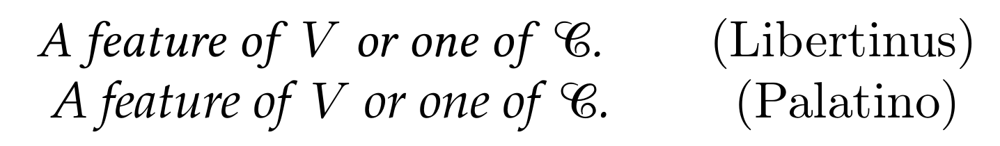

       which looks much better in both cases!
       This means one again has the power—and pain—of choice.
       I still think that, for this kind of technical text,
       the look and feel of an old-style font such as Palatino just fits the general "vibe" better,
       but your mileage may vary.
