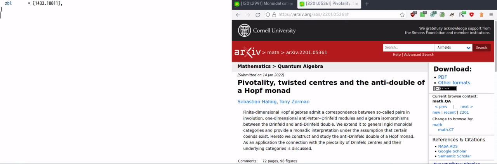

After reading [Gilles Castel]'s excellent blog post about his research
workflow, I decided that it was as good a time as any to write about
mine—deeming it novel enough to hopefully contribute something to the
discussion.

Just like Castel, I'm a new PhD student in mathematics, which means no
lab work and—in my case—no code.  Just you and your inability to
understand basic concepts.  As such, I often scribble things down on
paper or a blackboard first and, when sufficiently convinced that the
information is worth keeping around, type it up.  Typesetting something
is a surprisingly effective way to catch errors in handwritten
manuscripts!

As basically my entire digital life happens in either [Emacs] or
[XMonad], my setup is very heavily skewed in that direction; I will make
use of these tools almost every step of the way.  As such, there is a
lot of tangential almost relevant bits that I could cover here.
However, since these aren't directly related to my _research_
workflow—and there is a lot of great resources out there already—I
decided to not do this here.[^1]

# High Level Structure

## Topics

XMonad has a module called [TopicSpace], which upgrades the X11
workspace—virtual desktop—concept to so-called topics.  These are
workspaces with a "theme" associated to them; for example, I have a
topic for every project that I'm currently working on.  This results in
a very clean separation of concerns.  Plus, I always know where my
windows are!

Every topic has a directory and a "startup hook", firing when the topic
is switched to and empty, associated to it.  While most convenient for
programming related tasks—e.g., spawn `ghcid` in the relevant directory
or automatically build and open this website—it's also quite convenient
for mathematical projects.

I have set up special keybindings to bring up an Emacs session in the
topic directory, or spawn a terminal there.  Switching to topics is done
fuzzily via the XMonad prompt, which means I only have to type a few
characters to get to my destination.  This makes it feasible to have 30
topics, instead of the usual 9 or so, in the first place.  As a result,
it's rather fast to go from thinking about a certain problem to working
on it.  When I'm already inside a project, I leverage Emacs's built-in
`project.el` library to search through files and the like.


## Files

Here I keep things relatively simple; I have a big "library" directory
in which essentially all books or papers that I've ever read reside.
This may sound a bit chaotic, but since I never interact with this
as-a-directory it is actually the easiest and cleanest solution for me.

To keep a bit of order, all files are named in a consistent and
descriptive way: `authors_title.pdf`, where `authors` is a list of last
names of all authors separated by hyphens and `title` is the title of
the work, also separated by hyphens.  For example:

        pastro-street_double-of-a-monoidal-category.pdf

Also in this directory are `.xopp` files, when I scribble on the
relevant PDFs in [xournalpp]; more on that later.

Instead of navigating to it, all interaction with the library is done
via [hmenu], a small wrapper around [dmenu] to facilitate this kind of
behaviour.  I merely have to press `M-y`[^2] and can then fuzzy search
through the directory.  Once I've made a choice, PDFs are automatically
opened in [zathura] and `.xopp` files are opened in xournalpp.


My bibliography is organised in a similar spirit; see
[Citations](#citations).

# Note Taking

## Handwritten Notes

For handwritten notes I... use real paper!  A little elaboration is
probably in order, having talked about `.xopp` files and xournalpp
above.  I do have a Wacom tablet lying around and I'm quite happy
annotating PDFs with it.  In lieu of printing everything out, this
alleviates a little bit of the usual pain with reading papers, like
coming back to one three weeks later and getting stuck on the same
calculation as last time.  I do love those annotations!

However, there is just something deeply psychologically pleasing about
ordinary pen and paper—nothing beats drawing up the first version of
many ideas there.  It's a very "pure" experience: there's no noise or
distractions, nothing that could break, no additional layer of
abstraction between you and the maths.  Chalkboards—but not whiteboards,
with their ever empty markers—fall into this category as well,
especially when collaborating with others.

Not without my quirks (as I'm sure you've noticed), I'm a bit picky
about the particular writing setup.  It's either completely white A5[^3]
paper, paired with a good (mechanical) pencil/a very fine pen, or very
thick dotted paper, paired with a fountain pen.

Quite enjoying the experience, I tend to write quite a lot of
manuscripts by hand first.  Of course, anything that's supposed to be
permanent should be typed up properly!

## Digital Notes

Not wanting to go insane, I use LaTeX for all of my digital digital note
taking.  My writing setup for `.tex` files is pretty similar to [Karthik
Chikmagalur]'s—whose excellent post you should definitely check out—so I
will not belabour the point too much here.  The tl;dr is [AUCTeX],
[CDLaTeX], and [aas].


In case you're not used to `prettify-symbols-mode`: the inserted LaTeX
code was

``` tex
\begin{definition} \label{def:day-convolution}
  The \emph{Day convolution} of two functors $F$ and $G$ is
  \[
    F * G \defeq
      \int^{C,D \in \cc} \cc(C \otimes D, \blank) \otimes FC \otimes GD.
  \]
\end{definition}
```

I do use some smaller packages not mentioned in Chikmagalur's article,
like [math-delimiters] and [change-env].  The former is for quickly
changing between inline and display math, complete with slurping
punctuation symbols into display math and barfing them out of inline
math.  For example, "`$1 + 1$.`" becomes "`\[1 + 1.\]`" (with line
breaks) and back.

The `change-env` package is for changing between different kinds of
environments, including display math, while offering to rename labels
across the project if necessary.  When deleting a label from an
environment, it also remembers this for the session![^4]


One very neat feature of AUCTeX that I find myself using more and more
often lately[^5] is the in-buffer preview.  Usually when writing a draft
I'm not that interested in how exactly something looks in the PDF—that
part comes later, believe me.  In cases like these, just calling
`preview-buffer` is quite convenient and lets me use the screen real
estate that a PDF viewer would have taken up for something else.


I always use pure LaTeX for writing papers, drafts, or presentations.
However, I also take lots of notes in [org-mode], which, as a crude
first approximation, is something like a markup language that's _very_
well integrated into Emacs.

For the actual note-taking, I use the venerable [org-roam]—a free
software alternative to the proprietary Roam Research program—to jot
down things that I'd like to remember for more than three days.
Org-roam describes itself as a "plain-text personal knowledge management
system", which fits the bill pretty well.  In short, it's a note taking
system in the spirit of the [Zettelkasten] method, which is essentially
about having lots of notes with lots of backlinks to related concepts:


In fact, using [org-roam-ui], one can even visualise the entire
Zettelkasten as an interactive and pretty graph in which notes become
nodes and backlinks become edges!

<div class="pure-g">
 <div class="pure-u-1-2">
  
 </div>
 <div class="pure-u-1-2">
  
 </div>
</div>

Org-roam [suggests
keybindings](https://github.com/org-roam/org-roam#configuration) for all
of the most important concepts: creating notes, inserting them, showing
all of the backlinks of a file, etc.  An important extra that I've added
is having two "types" of notes: `reference`s, where things that I
learned but are otherwise known reside, and `novel`s, where I put my own
ideas.

As I'm predisposed to quite easily forget details, I regularly engage
with my Zettelkasten, so as to keep things fresh in my mind.  Reading
through all of the notes that are relevant to what I'm currently working
on, creating new backlinks, filling in gaps, even deleting old
information and re-organising some local region of the graph.  Indeed, I
tag every new entry as a `draft` until further notice, forcing me to go
back there especially.  This results in pretty good recollection of the
most important facts, even with my brain.

# Staying Up To Date

I use [elfeed] to query the [arXiv] for new preprints that are of
interest to me.  Thankfully, the fields I'm subscribed to tend to be
moving slow-ish and so I can manage to at least read the abstract of
every paper that pops up in my feed.  There is also [a little bit of
elisp](https://gitlab.com/slotThe/dotfiles/-/blob/afa8fd39cea2647152038e3f4dd42f1dbd66c413/emacs/.config/emacs/lisp/rss.el#L61)
involved to print arXiv entries in a more readable way than the default
formatting.

When the abstract interests me, I usually directly download the paper
into my library and open it with zathura.  This is fully automated via
[arXiv-citation]—more on that later.  I merely have to press `C-c d`
while looking at a paper and magic happens!


In the above gif, on the right-hand side you can see a score associated
to each entry.  While reading every abstract has worked quite well for
me thus far, it's nice to get the papers that are "probably interesting"
high up, so that I'm more likely to notice them sooner rather than
later.  I use [elfeed-score] for this, which integrates seamlessly into
the rest of the machinery.  It compares certain features of the entry
(like the title and abstract) with a list of regular expressions,
increasing the total score of the entry every time it matches something.

Speaking of the arXiv, in XMonad I have bound `M-s a` to look up the
given string there.  Likewise, [zbmath] is searched with `M-s z`.  When
these commands get a "universal argument"—an Emacs concept that XMonad
borrowed—they automatically start a search with the current selection
instead.  Briefly, pressing `M-u` before a command can modify it in
different ways.  All of my search commands act on the [primary
selection] when given such an argument; `M-u M-s <letter>` will look up
the currently selected text on the relevant "search engine".  One
instance where this is very useful is for quickly switching between the
arXiv and zbmath:


## Citations

For citation management, I use a very simple system—no Zotero, JabRef,
or similar technology.  Concretely, this means that I have a blessed
bibliography file somewhere within my home directory and I either
symlink (when I'm writing something alone) or copy (when working with at
least one coauthor) the file into the relevant project directory.  In
case of a copy operation, I only have to update a single variable in
Emacs (`arXiv-citation-bibtex-files`), which is good enough for me and
doesn't seem to warrant a slightly more automated, yet probably much
more complicated solution.

Adding new citations is done via the now aptly named Emacs package
[arXiv-citation][^6], with [a bit of
plumbing](https://gitlab.com/slotThe/dotfiles/-/blob/afa8fd39cea2647152038e3f4dd42f1dbd66c413/xmonad/.config/xmonad/src/xmonad.hs#L576)
on the XMonad side to get Emacs going.  The basic idea is that—given an
arXiv or zbmath link—we first look up the paper on zbmath to see if it
was published and, if not, just use the arXiv data to construct our own
bibliography entry instead.  By default, my keybinding for this acts on
the primary selection, so I merely have to highlight the link, press
`M-o a`, sit back, and enjoy the show.  The following gif hopefully
helps drive home the point, also showcasing the format of a not yet
published paper and a published one.



# Final Thoughts

And that's it!  If nothing else, this post helped me to nail down some
ideas that I had lying around and got me to finally clean up and publish
many of the extensions talked about here—that's already a win in my
book.

I'm sure that some details will change over the course of the next three
years as I mature mathematically and my needs change, but overall I feel
pretty comfortable with this setup.

[AUCTeX]: https://www.gnu.org/software/auctex/
[CDLaTeX]: https://github.com/cdominik/cdlatex
[Emacs]: https://www.gnu.org/software/emacs/
[Gilles Castel]: https://castel.dev/post/research-workflow/
[Karthik Chikmagalur]: https://karthinks.com/software/latex-input-for-impatient-scholars/
[TopicSpace]: https://hackage.haskell.org/package/xmonad-contrib/docs/xmonad-actions-topicspace.html
[XMonad's OrgMode prompt]: https://hackage.haskell.org/package/xmonad-contrib/docs/XMonad-Prompt-OrgMode.html
[XMonad]: https://xmonad.org/
[Zettelkasten]: https://en.wikipedia.org/wiki/zettelkasten
[aas]: https://github.com/ymarco/auto-activating-snippets
[arXiv-citation]: https://github.com/slotthe/arxiv-citation
[arXiv]: https://arxiv.org/
[change-env]: https://github.com/slotthe/change-env
[dmenu]: https://tools.suckless.org/dmenu/
[elfeed-score]: https://github.com/sp1ff/elfeed-score
[elfeed]: https://github.com/skeeto/elfeed
[hmenu]: https://github.com/slotthe/hmenu
[khalel]: https://gitlab.com/hperrey/khalel
[math-delimiters]: https://github.com/oantolin/math-delimiters
[notmuch.el]: https://notmuchmail.org/
[org-mode]: https://orgmode.org/
[org-roam-ui]: https://github.com/org-roam/org-roam-ui
[org-roam]: https://www.orgroam.com/
[primary selection]: https://www.jwz.org/doc/x-cut-and-paste.html
[xournalpp]: https://xournalpp.github.io/
[zathura]: https://pwmt.org/projects/zathura/
[zbmath]: https://zbmath.org/

[^1]: If you'd like some examples: being employed at a university also
      means I have to worry a bit about efficiently dealing with
      bureaucracy ([notmuch.el]), keeping some sort of up-to-date
      calendar and readable todo-notes ([org-mode] and goodies, as well
      as integration via [XMonad's OrgMode prompt]), accessing the
      universities internal nextcloud server ([khalel] and `davfs2` or
      `TRAMP`), …  You get the idea.

[^2]: I will be using Emacs style notation throughout the entire
      article.  This means that, for example, `C-x a` should be read as
      "hold down control and press x, then release both and press a".
      You can of course safely ignore this, since the keys just serve
      illustrative purposes.  An important note for Emacs users, lest
      anyone be confused: in XMonad, `M-` usually does not__ refer to
      the Meta key, but to the `modMask` that the user specified.  This
      is indeed `<Alt>` by default, but many people understandably
      rebind this straight away to something that's less likely to
      interfere with other programs.  In my case, that's the Super key,
      so `M-s` means `<Super>-s` and not `<Alt>-s`.

[^3]: Although, admittedly, when drawing up very large diagrams I'm
      sometimes forced to switch to A4 paper in landscape mode.

[^4]: This is based on the hash of the contents of the environment—if
      that changes, the label is "lost"; though it can of course still
      be retrieved manually from the relevant hash map.

[^5]: This is, in part, due to the new `pixel-scroll-precision-mode` in
      Emacs 29, making use of XInput 2.4 functionality.  It makes
      scrolling through buffers that are quite dense with pictures
      rather smooth.

[^6]: Ostensibly, this should be an XMonad module, as it does not
      necessarily have anything to do with Emacs itself.  However, I had
      already written the elfeed integration and so the most annoying
      part (scraping the arXiv xml for certain bits) was already done.
      On the other hand, there are more Emacs than XMonad users, so
      perhaps doing it like this will help more people anyways.
