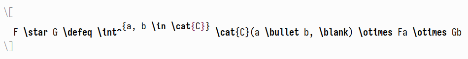
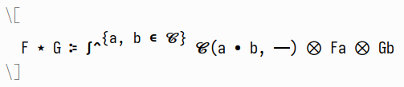
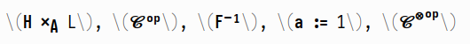
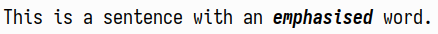
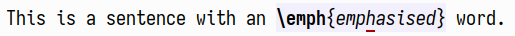

A friend recently confided in me that,
after years of using Emacs,
he was only now getting into using `prettify-symbols-mode` for editing LaTeX buffers!
After overwhelming him with more customisations related to this,
I realised that the topic<!--
-->—while seemingly easy on the surface—<!--
-->actually has a lot more depth to it than one would first imagine.

<!--more-->

# `prettify-symbols-mode`

If you've never come into contact with `prettify-symbols-mode` before,
I encourage you to just issue an `M-x prettify-symbols-mode RET` in a `LaTeX-mode` buffer.
The default `prettify-symbols-alist` that e.g. AUCTeX provides already includes a lot of symbols.
For the uninitiated,
it would display a buffer like this[^2]



as the already much more readable


Basically, `prettify-symbols-mode` is a home-cooked ligature system for Emacs,
because of course that exists.

However, the above already has some problems:
`\otimes` is quite small,
and thus barely discernible from `\bullet`,
and of course user-defined macros—like `\defeq` or `\cat`—don't get picked up on at all.
We can refine the displayed symbols by adding our own definitions to
the (buffer-local) `prettify-symbols-alist` variable:

``` emacs-lisp
(add-hook 'LaTeX-mode-hook
          (lambda ()
            (--map (push it prettify-symbols-alist)
                   '(("\\blank"      . ?—)
                     ("\\otimes"     . ?⨂) ; more visible
                     ("\\defeq"      . ?≔)
                     ("\\mathcal{C}" . ?𝓒) ; better looking
                     ("\\cat{C}"     . ?𝓒)))))
```

Executing that hook makes the above situation even prettier.



## Going further

Naturally<!--
-->—this being Emacs—<!--
-->substituting one symbol for another is not all that `prettify-symbols-mode` has to offer.
Digging into the documentation of `prettify-symbols-alist`,
the second entry of the cons pair can be[^1]

> […] a character, a string or a vector or list of integers and rules.
>
> If it is a character, it is an alternate character to display instead
> of the text in the region.
>
> If it is a string, the elements are alternate characters.  In
> this case, TAB element has a special meaning.  If the first
> character is TAB, the glyphs are displayed with left padding space
> so that no pixel overlaps with the previous column.  If the last
> character is TAB, the glyphs are displayed with right padding
> space so that no pixel overlaps with the following column.
>
> If it is a vector or list, it is a sequence of alternate characters and
> composition rules, where (2N)th elements are characters and (2N+1)th
> elements are composition rules to specify how to compose (2N+2)th
> elements with previously composed N glyphs.
>
> A composition rule is a cons of global and new glyph reference point
> symbols.  See the documentation of reference-point-alist for more
> details.

We've only used a plain character as the replacement so far,
but in fact we can supply a whole list of them,
with some rules on how everything should be glued together.
The gluing of each pair of glyphs is done according to the following diagram,
taken from the documentation of `reference-point-alist`:

      0----1----2 <---- ascent    0:tl or top-left
      |         |                 1:tc or top-center
      |         |                 2:tr or top-right
      |         |                 3:Bl or base-left     9:cl or center-left
      9   10   11 <---- center    4:Bc or base-center  10:cc or center-center
      |         |                 5:Br or base-right   11:cr or center-right
    --3----4----5-- <-- baseline  6:bl or bottom-left
      |         |                 7:bc or bottom-center
      6----7----8 <---- descent   8:br or bottom-right

A gluing instruction either comprises a cons pair of two locations<!--
-->—e.g., `(cr . cl)` to glue position 9 of the left glyph to position 11 of the right—<!--
-->or a list with some additional `x` and `y` offsets,
like `'(cr cl 0 10)`.

As an easy example,
consider `\defeq` from the above LaTeX snippet,
which is a better-looking version of the definitional equality symbol `:=`.[^7]
Sadly, the appropriate Unicode symbol `≔` does not look particularly nice in my font<!--
-->—simply fusing `:` and `=` together works quite well, however!
Defining

``` emacs-lisp
'("\\coloneqq" . (?: (cr cl -20 -8) ?=))
```

yields a decent approximation of what I would want the Unicode symbol to look like.
Here are some more examples of this in action:

``` emacs-lisp
'(("\\tak"         . (?× (br . cl) ?A))
  ("^{\\op}"       . (?ᵒ (tr tl -25 0) ?ᵖ))
  ("\\defeq"       . (?: (cr cl -20 -8) ?=))
  ("^{\\tensorop}" . (?​ (tr bl 0 80) ?⊗ (tr . tl) ?ᵒ (tr tl -25 0) ?ᵖ))
  ("^{-1}"         . (?​ (tr bl 0 100) ?- (cr . bl) ?¹)))
```



# Going too far: code folding

[^8]

The only thing that `prettify-symbols-mode` lacks is
being able to supply a function as a replacement,
in order to manipulate the matched symbol.

Enter code folding, which does not have this restriction.
Most often, it is used to hide parts of a definition or section,
in order to make the respective buffer more easily scannable for a human.
However, AUCTeX's machinery is set up in such a way
that one can supply an arbitrary function that transforms the matched text somehow.
This is extremely convenient for things like mathematical alphabets,
as then one does not have to hard-code all replacements.[^4]

The main variables to change here are
`TeX-fold-math-spec-list` and `TeX-fold-macro-spec-list`.
The parsing of `tex-fold.el` is fairly featureful;
the documentation for the latter variable tells the whole story.

> List of replacement specifiers and macros to fold.
>
> The first element of each item can be a string, an integer or a
> function symbol.  The second element is a list of macros to fold
> without the leading backslash.
>
> If the first element is a string, it will be used as a display
> replacement for the whole macro.  Numbers in braces, brackets,
> parens or angle brackets will be replaced by the respective macro
> argument.  For example "{1}" will be replaced by the first
> mandatory argument of the macro.  One can also define
> alternatives within the specifier which are used if an argument
> is not found.  Alternatives are separated by "||".  They are
> most useful with optional arguments.  As an example, the default
> specifier for \item is "[1]:||*" which means that if there is
> an optional argument, its value is shown followed by a colon.  If
> there is no optional argument, only an asterisk is used as the
> display string.
>
> If the first element is an integer, the macro will be replaced by
> the respective macro argument.
>
> If the first element is a function symbol, the function will be
> called with all mandatory arguments of the macro and the result
> of the function call will be used as a replacement for the macro.
>
> Setting this variable does not take effect immediately.  Use
> Customize or reset the mode.

Quite the functionality!
The simplest example is probably hiding the `\emph` macro,
which indicates emphasised text.[^11]

``` emacs-lisp
(setopt TeX-fold-macro-spec-list '(("{1}" ("emph"))))
```

This ends up looking like the following:



As with `prettify-symbols-mode`,
things unprettify when the point is on them.



Using these techniques,
we can define replacements for calligraphic letters
(or any other alphabet, like Fraktur or blackboard bold)
in a much more straightforward fashion.
First, we create a function to shift each codepoint in a string by a certain offset.[^5]

``` emacs-lisp
(defun slot/shift-string (offset word)
  "Shift the codepoint of each character in WORD by OFFSET.
Add an extra -6 shift if the letter is lowercase."
  (apply #'string
         (--map (pcase it
                  (?, ?,)   ; Allow things like \Hom(\mathbb{A,B})
                  (_ (+ (if (>= it ?a) (- it 6) it) offset)))
                word)))
```

Now, all that's left to do is to define some folds for mathematical alphabets,
and give them the right starting points:[^6]

``` emacs-lisp
(cl-flet ((start-at (pt)
            (- pt ?A)))
  (setq TeX-fold-math-spec-list
        `((,(lambda (c) (slot/shift-string (start-at ?𝔄) c)) ("mathfrak"))
          (,(lambda (c) (slot/shift-string (start-at ?𝓐) c)) ("mathcal")))))

;; For good measure
(setq LaTeX-fold-math-spec-list TeX-fold-math-spec-list)
```

Note that this again has the advantage of
making user-defined macros much easier to integrate into the whole system.
Above we have met the `\cat` macro[^9],
which should be displayed in much the same way as `\mathcal` is.
With code folding,
all this entails is to amend the respective line in `TeX-fold-math-spec-list`:

``` emacs-lisp
(,(lambda (c) (slot/shift-string (start-at ?𝓐) c)) ("mathcal" "cat"))
```

# Conclusion

Using everything in this article together—see
[here](https://gitlab.com/slotThe/dotfiles/-/blob/7b2885a8343327717c91818d1970576238184307/emacs/.config/emacs/lisp/hopf-latex-pretty-symbols.el)—<!--
-->one can transform a boring old LaTeX buffer


into something like this:


Nice.

[posts:phd-workflow]: ./my-phd-workflow.html

[^1]: {-} The citation itself is from the documentation of `compose-region`,
      as that is what the `CHARACTER` argument of `prettify-symbols-alist` can be.

[^2]: {-} If you don't have AUCTeX installed for some reason<!--
      -->—why are you reading this?—<!--
      -->then trying out the following snippet might also get the message across:

      ``` emacs-lisp
      (add-hook
       'emacs-lisp-mode-hook
       (lambda ()
         (setq-local prettify-symbols-alist
                     '(("lambda" . ?λ)))
         (prettify-symbols-mode)))
      ```

[^4]: This actually happens;
      just a small excerpt of the default `tex--prettify-symbols-alist`:

      ``` emacs-lisp
      ("\\mathcal{A}" . ?𝒜)
      ("\\mathcal{B}" . ?ℬ)
      ("\\mathcal{C}" . ?𝒞)
      ("\\mathcal{D}" . ?𝒟)
      ("\\mathcal{E}" . ?ℰ)
      ("\\mathcal{F}" . ?ℱ)
      ("\\mathcal{G}" . ?𝒢)
      ("\\mathcal{H}" . ?ℋ)
      ("\\mathcal{I}" . ?ℐ)
      ("\\mathcal{J}" . ?𝒥)
      ("\\mathcal{K}" . ?𝒦)
      ("\\mathcal{L}" . ?ℒ)
      ("\\mathcal{M}" . ?ℳ)
      ("\\mathcal{N}" . ?𝒩)
      ("\\mathcal{O}" . ?𝒪)
      ("\\mathcal{P}" . ?𝒫)
      ("\\mathcal{Q}" . ?𝒬)
      ("\\mathcal{R}" . ?ℛ)
      ("\\mathcal{S}" . ?𝒮)
      ("\\mathcal{T}" . ?𝒯)
      ("\\mathcal{U}" . ?𝒰)
      ("\\mathcal{V}" . ?𝒱)
      ("\\mathcal{W}" . ?𝒲)
      ("\\mathcal{X}" . ?𝒳)
      ("\\mathcal{Y}" . ?𝒴)
      ("\\mathcal{Z}" . ?𝒵)
      ```

[^5]: The
      [real function](https://gitlab.com/slotThe/dotfiles/-/blob/7b2885a8343327717c91818d1970576238184307/emacs/.config/emacs/lisp/hopf-latex-pretty-symbols.el#L77-L117)
      is a tad more complicated,
      as some codepoints are not where you expect them to be,
      so some sort of lookup table has to be consulted as well.

[^6]: {-} 󠀠

      󠀠

      Ideally, one would make use of the new `setopt` macro here,
      but the fact that `TeX-fold-math-spec-list` accepts functions in this way was only documented in
      [3c03ee08](https://git.savannah.gnu.org/cgit/auctex.git/commit/?id=3c03ee089a2b74d0d5a0285f983a9eba82dc04a5),
      which has not found its way to GNU ELPA yet.

[^7]: For the interested reader:

      ``` tex
      \newcommand*{\defeq}{%
        \mathrel{\vcenter{%
            \baselineskip0.5ex \lineskiplimit0pt
            \hbox{\scriptsize.}\hbox{\scriptsize.}}}%
        =}
      ```

      I think that this looks better than `amsmath`'s `\coloneq`.

[^8]: {-} **Disclaimer**:
      Pretty much all of the code in this section was written by
      [tecosaur](https://git.tecosaur.net/),
      from whose
      [configuration](https://tecosaur.github.io/emacs-config/config.html#editor-visuals)<!--
      -->—which I encourage you to check out—<!--
      -->I first learned about the fact that one can use AUCTeX's code folding in this way.

[^9]: Defined as

      ``` tex
      \newcommand*{\cat}[1]{%
        \ensuremath{\mathcal{#1}}%
      }
      ```

[^11]: {-} The `TeX-fold-macro-spec-list` can be used for any macro outside of math-mode.
       One application is to define
       prettier versions of `\[sub]section` commands,
       or even `\item`:

       ``` emacs-lisp
       (setopt
        TeX-fold-macro-spec-list
        '(("{1}" ("emph"))
          ("[1]:||►" ("item"))
          ("§ {1}" ("section" "section*"))
          ("§§ {1}" ("subsection" "subsection*"))
          ("¶ {1}" ("paragraph" "paragraph*"))))
       ```
