As a mathematician, I naturally have no idea how a computer *actually*
works. Of course, the easiest way to change that is to try and optimise
a 2000 year old algorithm. To not keep you in suspense, the learning
seems to be that some memory is just more equal than others.

<!--more-->

Concretely, the problem is finding all primes below a given threshold—a
deceptively simple problem that however has a few nifty approaches to
make things really go brrrr. In order to do that—and as an additional
challenge, I guess, given my weak grasp of the language—let's write some
good old C.[^3]

Note that there are a *lot* of these kinds of prime optimisation posts
out there, most of them better [and
funnier](https://www.youtube.com/watch?v=uJkoI5TnKzA) than this one. I'm
mostly writing this for myself, though this may prove useful to a rare
reader someday, [perhaps in a somewhat bizarre set of
circumstances](https://www.youtube.com/watch?v=zGM-wSKFBpo).

Special thanks to Kim Walisch's excellent
[primesieve](https://github.com/kimwalisch/primesieve) library, as well
as [the references
therein](https://github.com/kimwalisch/primesieve/blob/master/doc/ALGORITHMS.md),
which made this stuff really easy to learn. Also ngn's
[4.c](https://codeberg.org/ngn/k/src/branch/master/4.c) for some style
inspiration.

# Basic setup

The goal is to get as close to `primesieve -t1 1e9` as possible (which
completes in slightly over 100ms on my machine), using whatever
techniques might be most effective. This in particular means no
multi-core stuff, and I won't mess with [bucket
sieving](https://sweet.ua.pt/tos/software/prime_sieve.html) for large
primes. This is just to constrain the problem space a bit, for my own
sanity.

Additionally, I don't want to just count the primes using a
Legendre-type formula, which is what e.g.
[primecount](https://github.com/kimwalisch/primecount) does. In fact,
I'd like to materialise the full prime array (but see [Giving up on
rules](#giving-up-on-rules)), knowing full well that this will incur
some kind of performance penalty.

The [repo](https://codeberg.org/slotThe/primes) has some additional
constraints, like not using libc, that I'll deemphasise in this post.
You might see me importing `c.h` below somewhere, with a comment
explaining which functions I care about. Replace that with your
favourite combination of `math.h`, `stdlib.h`, etc.

## Benchmarking

You'll see some benchmarks every now and then, so let's talk about that.
This isn't going to be very fancy—if you're expecting that, prepare to
be disappointed.

I used the following flags when compiling; `clang` version is `21.1.8`:

```
clang -std=gnu23 -s -Wall -Wextra -O3 -march=native -no-pie -nostdlib \
      -fno-unwind-tables -fno-asynchronous-unwind-tables -Wl,-n \
      -fno-builtin -fno-stack-protector -masm=intel -op a.c
```

The actual benchmarking is done by a [simple Python
script](https://codeberg.org/slotThe/primes/src/branch/main/benchmark.py)
that executes the command as a subprocess three times, and takes the
best result:[^38]

``` python
def best_time(argv: list[str]) -> float | None:
    best = math.inf
    for _ in range(3):
        start = time.perf_counter()
        if not wait(subprocess.Popen(argv, stdout=subprocess.DEVNULL), 1.0):
            return None
        best = min(best, time.perf_counter() - start)
    return best
```

Because this will be important for L1 stuff later on, note that I have
48KiB of L1d cache, at least on some cores.[^30]

# Notation

So that we don't end up producing programs like [Clean Code's prime
generator](https://gerlacdt.github.io/blog/posts/clean_code/#the-ugly),
let's come up with some notation to make writing these functions more
uniform—a kind of [consistent
vocabulary](https://aplwiki.com/wiki/Whitney_C), if you will.

Instead of dumping an entire header file on you, I'll introduce these as
needed above the first code blocks that use them. If you'd rather read
through everything in one go, feel free to peruse
[a.h](https://codeberg.org/slotThe/primes/src/branch/main/a.h) directly.

``` c
typedef char C; typedef void V; typedef int I; typedef unsigned long long U;
```

Types are descriptive one-letter names; I don't have the patience to
read through a sea of `unsigned long long`s, when a simple `U` will do
the trick just as well.[^9]

``` c
#define TY       __typeof__
#define _(e...)  ({e;})
#define max(x,y) _(TY(x)$x=(x);TY(y)$y=(y);$x<$y?$y:$x)
#define min(a,b) _(TY(a)$a=(a);TY(b)$b=(b);$a<$b?$a:$b)
```

We'll need `min` and `max` at some point, so this is as good a time to
introduce them as any.[^40] Now, I realise this code might look like a
fever dream if you're not used to it, but bear with me here—I promise
that this strips away enough noise so the algorithms will be clearer to
read. The `({e;})` macro is a [GCC statement
expression](https://gcc.gnu.org/onlinedocs/gcc-7.1.0/gcc/Statement-Exprs.html).
It makes sequences of declarations and statements expression-valued, so
that `U a = _(x)` works, even if `x` is a complicated thing.

## Defining functions

Let's define a function template for all prime searching functions we'll
use. It should get an upper bound on the number, as well as an output
pointer to be filled in, and return the array of primes.

``` c
#define F(f,e...) U* f(U x,U*y){/*...*/}
```

Here, `f` is the function name, and `e` is the body. For now, let's say
we allocate a big bunch of memory, set some kind of counter, execute the
body, and then just return the array.[^4]

``` c
#include "c.h"    // calloc
#define R         return
#define M(x)      calloc(1,(x)+8)
#define F(f,e...) U* f(U x,U*y){U*a=M(/*...*/); U _a=0; *y=0; e; *y=_a; R a;}
#define A(x)      a[_a++]=x
```

In the body of the function, we can easily add a prime to the array by
just using `A(x)`, without having to worry about how this is managed
internally.

An important note about the `calloc` that I'm using (it's really
`mmap(2)`) is that it's zero-initialised. Since we'll often actually
allocate a `U` array and manipulate that, it's a good thing that [mmap
is page-aligned](https://man7.org/linux/man-pages/man2/mmap.2.html) as
well, I guess. The cheeky `+8` was revealed to me in a dream; it's so
that allocations like `M(x/8)` (which round down) don't accidentally
touch memory they're not supposed to.

---

Let's make two small optimisations right off the bat, so we won't have
to worry about that later on.

First, there obviously aren't $x$ primes between $1$ and $x$. There's a
nice [upper bound](https://www.jstor.org/stable/2371291) involving the
natural logarithm of $x$ given by $\pi(x) < x/(\log x - 4)$ for $x \ge
55$. We can thread that into the definition of `F`, where we fall back
to just `1` if the argument is too small for the upper bound to hold.

``` c
// log from c.h
#define F(f,e...) U* f(U x,U*y){U*a=M(8*(x/max(1,log(x)-4)));U _a=0;*y=0;e;*y=_a;R a;}
```

The other issue is with the definition—or, rather, the usage—of `A`. The
way it's written, you'd check for primality and then add the number if
that check succeeds: `if (is_prime(x)) A(x);`. However, this *really*
upsets the branch predictor, which is no good when trying to optimise
something. This is no big deal, though, as we can simply always write
the number into the slot `a[_a]` and only increase `_a` if the number
was prime.[^2]

``` c
#define A(x,y) a[_a]=(x);_a+=(y);//array access in F, advance by y
#define A1(x)  A(x,1)            //if you really mean it
```

We can use this macro like `A(x,is_prime(x))`. The branch predictor is
very happy about this indeed.[^1]

Let's write some prime functions, then.

# Iteration

As a baseline for both performance and reading the notation we've
introduced, let's start with just iteration—that is, the algorithm will
be of the shape

```
for i in 2..LIMIT:
  A(i,is_prime(i))
```

The simplest `is_prime(i)` function is just to go through every number
between `2` and `i`, and check if that's a divisor of `i`; if yes, `i`
is composite. In ordinary C, one might write

``` c
#include <stdbool.h>
bool is_prime(unsigned long long i) {
    bool p = i > 1; // is prime?
    for (unsigned long long j = 2; j < i; j++) {
        if (i % j == 0) {
            p = false;
            break;
        }
    }
    return p;
}
```

Let's introduce some more notation, to write this down in a more
succinct way.

``` c
#define I(s,c,n,e...) {for(U i=s;c;n){e;}}//Iterate
#define J(s,c,n,e...) {for(U j=s;c;n){e;}}//Jterate
#define $(x,y)        if(x){y;}else       //if-then-else
#define B(x,e)        $(x,e;break);       //break and execute
```

The `I` and `J` macros just make iteration shorter, so instead of

``` c
for (U j = 2; j < i; j++) {
    ...
}
```

one can write

``` c
J(2,j<i,j++,...)
```

The `if` and `break` macros are perhaps a bit more unhinged, but you'll
get used to them.[^19] Using these, the above `is_prime` function becomes

``` c
U is_prime(U i){C p=i>1;J(2,j<i,++j,B(i%j==0,p=0));R p;}
```

Much better! But seriously, I'm quite glad an algorithm this simple
doesn't take up 10 whole lines any more. We can even inline this into the
big algorithm, since the decider macro `A` takes a boolean condition.

``` c
F(triv,I(2,i<x,i++,C p=1;J(2,j<i,++j,B(i%j==0,p=0))A(i,p)))
```

Performance, however, is not great:

```
  alg          N        time (ms)
  --------------------------------
  triv       10,000      15.85
             14,592      32.00
             21,294      64.08
             31,072     114.61
             45,342     164.81
             66,164     314.35
             96,549     614.83
            140,887     >1s
```

This isn't too surprising—the algorithm has complexity
$\mathcal{O}(x^2)$ and is furthermore doing a bunch of extra work that
makes it quite inefficient. Let's try to fix that.

## The simple case

Two obvious things we can do to make `triv` faster are to only walk over
the odd numbers (we already know all even numbers are divisible by two),
and to check divisibility by numbers only up to $\sqrt{i}$
(equivalently, numbers $j$ such that $j^2 \le i$). The latter works
because if $n$ is composite then it clearly has to have a divisor $\le
\sqrt{n}$.

``` c
F(simp,A1(2);I(3,i<x,i+=2,C p=1;J(2,j*j<=i,++j,B(i%j==0,p=0))A(i,p)))
```

This looks much the same as `triv`, only that we start at `i=3` (and
thus have to forcefully add `2` to our list of primes), we advance
`i+=2`, and instead of `j<i` we check for `j*j<=i`. Here's a
side-by-side:

``` c
F(triv,      I(2,i<x,i++ ,C p=1;J(2,j  < i,++j,B(i%j==0,p=0))A(i,p)))
F(simp,A1(2);I(3,i<x,i+=2,C p=1;J(2,j*j<=i,++j,B(i%j==0,p=0))A(i,p)))
```


The plot comparing `triv` and `simp` looks kinda funny, actually:

[^21]
<picture>
  <source srcset="../images/primes/ts.png" media="(prefers-color-scheme: light)">
  <source srcset="../images/primes/ts-dark.png" media="(prefers-color-scheme: dark)">
  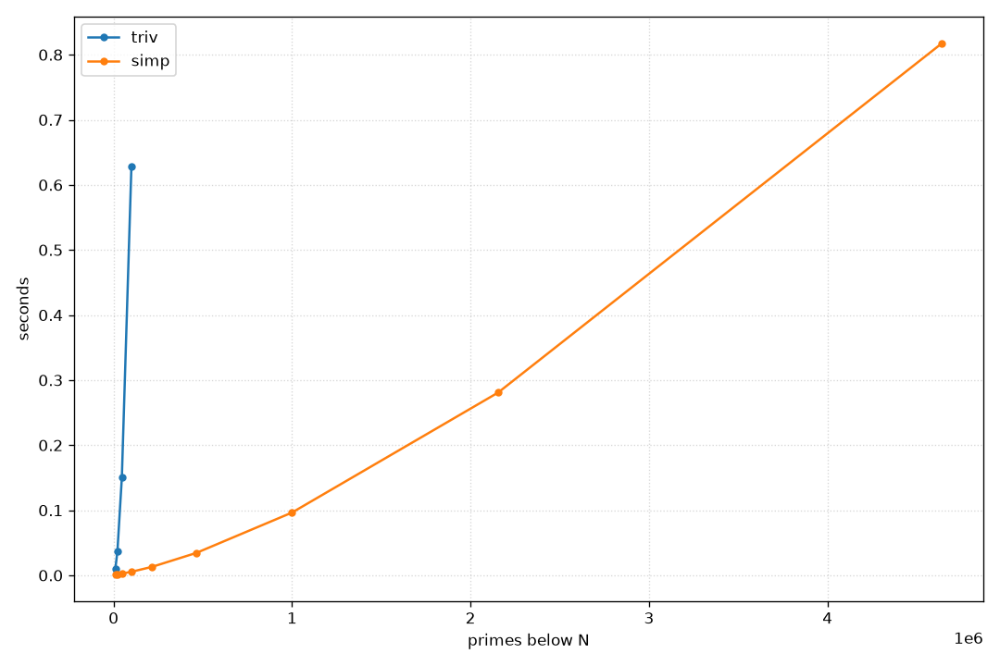
</picture>

However, only being able to check 5 million numbers in one second isn't
all that impressive on a modern computer. We've already seen a better
way, actually: just exclude numbers that we already know are composite.
This made us walk just the odd numbers in `simp`, and following this
train of thought leads straight to sieves.

# Sieving

The idea of sieving primes is quite old, still carrying the name of
[Eratosthenes](https://en.wikipedia.org/wiki/Eratosthenes), who
apparently came up with the first version of the algorithm. In fact, the
GIF on the Wikipedia page is quite good at explaining the basic idea:

[^11]


Start with the smallest prime, 2, and mark all multiples of it. After
having done so, advance to the next unmarked number—which must be prime
for size reasons—and do it all over again. When starting to mark the
multiples of a prime $p$, we don't have to start with $2p$ (since that
has already been marked), nor $3p$ if $p > 3$, and so on, so the first
composite number to be marked is actually $p^2$. In particular, the
marking can stop if $p^2 > n$, as by the same argument all remaining
unmarked numbers are guaranteed to be prime.

That's it for basic theory. The complexity is *obviously*
$\mathcal{O}(n\cdot\log\log n)$ ([primes are
weird](https://en.wikipedia.org/wiki/Divergence_of_the_sum_of_the_reciprocals_of_the_primes)),
which will be quite noticeable when compared with the iteration-based
techniques. This will also be the last time that we'll make any kind of
limit-based gains in this post; everything else will be implementation
details and awful hacking.

## A simple sieve

Let's just implement the above algorithm essentially verbatim:[^12]

``` c
F(era0,C*E=M(x);I(2,i*i<=x,++i,$(!E[i],J(i*i,j<x,j+=i,E[j]=1)))
 I(2,i<x,++i,A(i,!E[i])))
```

That's in fact all of it; let's read it character by character.

``` c
F(era0,C*E=M(x)
```

From now on, we'll call the array of numbers to check `E`, so whenever
you see that letter, the code will manipulate or otherwise involve that.
In particular, as a convention, all[^42] arrays in this project will have
upper-case names, so that one can easily distinguish them at a glance.

As said, the `M` macro gives back a zero-initialised array. Since all
numbers of the sieve should start out with "I'm prime", `0` means a
number is prime, and `1` means it's composite. Note that `E` is a
character array, so we're representing each `0` or `1` by one byte.

``` c
 I(2,i*i<=x,++i,$(!E[i],J(i*i,j<x,j+=i,E[j]=1)))
```

The outer and inner marking loops, as discussed before. Here's a blown-up version:

``` c
 I(2,i*i<=x,++i,  // For each number i starting from 2 such that i ≤ √x,
                  // or equivalently, i² ≤ x.
  $(!E[i],        // IF the number is prime (E[i]==0)
   J(i*i,j<x,j+=i,// THEN start the inner loop at i² in steps of i,
    E[j]=1)))     //  marking each i²,i+i²,2i+i²,... as composite
```

After we're done with all numbers, all that's left unchecked in `E` are
the primes, so we can add them to the output array:

``` c
 I(2,i<x,++i,A(i,!E[i]))
)//F(…
```

Compared to `simp`, `era0` is only a few characters longer

``` c
F(simp,A1(2);I(3,i<x,i+=2,C p=1;J(2,j*j<=i,++j,B(i%j==0,p=0))A(i,p)))
F(era0,C*E=M(x);I(2,i*i<=x,++i,$(!E[i],J(i*i,j<x,j+=i,E[j]=1)))I(2,i<x,++i,A(i,!E[i])))
```

The benchmark results are quite decisive, however.

[^22]
<picture>
  <source srcset="../images/primes/s0.png" media="(prefers-color-scheme: light)">
  <source srcset="../images/primes/s0-dark.png" media="(prefers-color-scheme: dark)">
  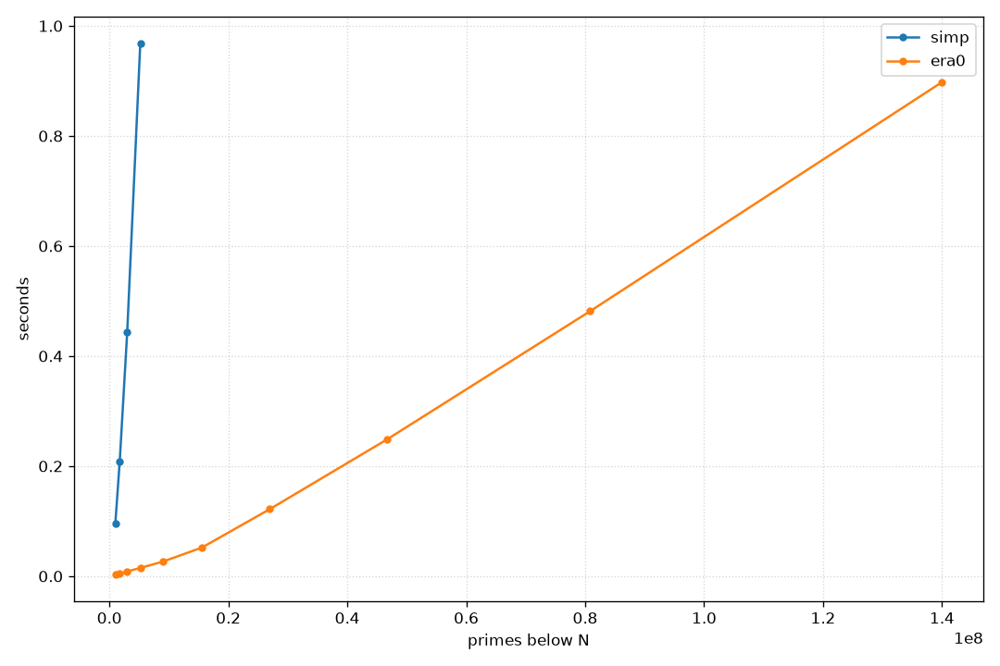
</picture>

## Packing bits

Instead of using a full byte to represent a single bit, how about we
just use a single bit? The general shape of the algorithm doesn't need
to change for this; we just need to replace the getter `E[i]` and the
setter `E[i]=1` with appropriate bit variants.

If `E` is an array of `U`s, then each index `E[i]` holds 64 bits, with
the `j`th bit of `E[i]` representing the decision "is this composite?"
for the number `64*i + j`. To translate a number `n` to its associated
index, we thus just have to integer-divide `n` by 64, use that number to
index into `E`, compute the offset `j` as `n%64`, and select the
appropriate bit using shifts. In formulas, this is

``` c
(E[n/64]) & (1ull<<(n%64))
```

Setting a bit works analogously, only now we actually have to change `E`:

``` c
E[n/64] |= (1ull<<(n%64))
```

All in all, we can create bit-checking and bit-setting macros, as well
as some shorthand for the `E` array.[^33]

``` c
#define E(i)  _(TY(i)$i=(i);E[$i/64]& (1ull<<($i%64)))//bit
#define Es(i) _(TY(i)$i=(i);E[$i/64]|=(1ull<<($i%64)))//bit set
```

With this notation, the packed variant of `era0`, which I'll call
`era1`, looks really quite the same as the original, just that we have
to allocate 8 times less memory:

``` c
F(era1,U*E=M(x/8);I(2,i*i<=x,++i,$(!E(i),J(i*i,j<x,j+=i,Es(j))))
 I(2,i<x,++i,A(i,!E(i))))
```

A direct comparison:[^31]

``` c
F(era0,C*E=M(x)  ;I(2,i*i<=x,++i,$(!E[i],J(i*i,j<x,j+=i,E[j]=1)))I(2,i<x,++i,A(i,!E[i])))
F(era1,U*E=M(x/8);I(2,i*i<=x,++i,$(!E(i),J(i*i,j<x,j+=i,Es(j) )))I(2,i<x,++i,A(i,!E(i))))
```

As it turns out, even though this kind of indexing is much more
expensive than a simple `E[i]`—more on that later—, the memory gains
mean that a lot more of this stuff fits into the smaller, though faster,
regions of memory, which does pay off:

[^23]
<picture>
  <source srcset="../images/primes/01.png" media="(prefers-color-scheme: light)">
  <source srcset="../images/primes/01-dark.png" media="(prefers-color-scheme: dark)">
  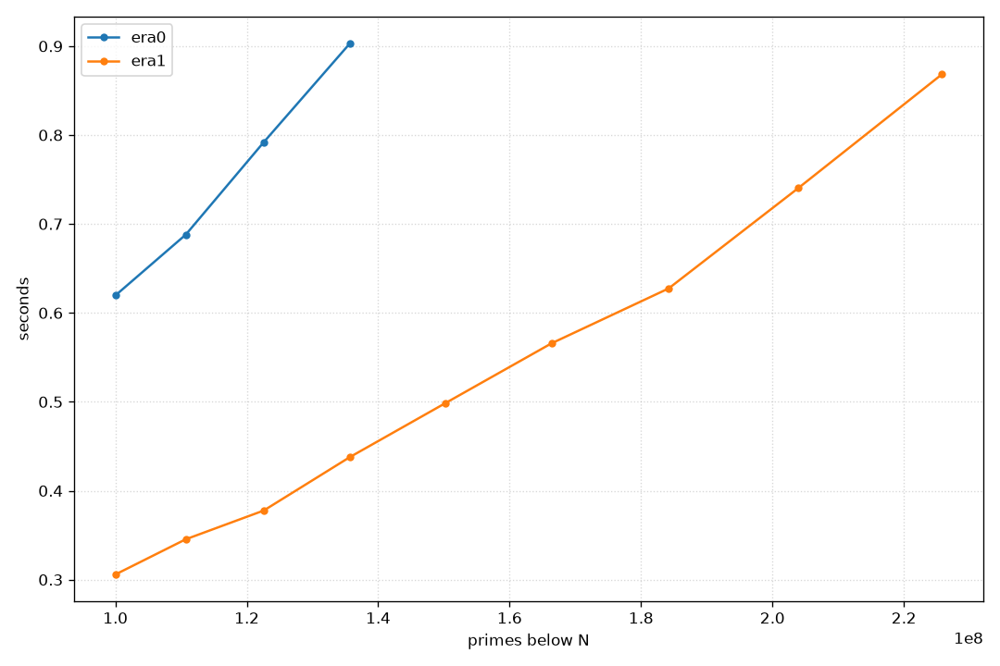
</picture>

## Odds-only

An immediate optimisation that one could do is to throw away all of the
even numbers immediately, just as we did for `simp`. This cuts down the
numbers to check by 50%, which would further improve cache efficiency.
Let's call the version `era2`. I'll use `era1` as a template, since we
certainly want to pack the binary decision into a single bit again.

``` c
F(era2,A1(2);U*E=M(x/16);
```

The implementation starts by allocating memory: `x/8` for the
bit-packing and `x/(8*2)` due to the fact that we are in odds-only
encoding.

``` c
 I(3,i*i<=x,i+=2,$(!E(i/2),J(i*i,j<x,j+=2*i,Es(j/2))))
```

The outer marking loop now starts at the first admissible prime 3, and
goes up in steps of two, so that we only check the odd numbers. Hence
`i` is in reality some number `2*k+1`. As such, `i/2`—being integer
division—extracts the `k`; feeding that into `E()` yields the correct
index in `E`. The inner loop again starts at `i*i`, but increases in
steps of `2*i`: this is because we need to skip `i+i*i`, `3*i+i*i`, and
so on, as these are all even numbers (being the sum of two odd numbers),
which we can't even represent as an index in `E`.[^13]

``` c
 I(3,i<x,i+=2,A(i,!E(i/2)))
)//F(era2...)
```

When going through the primes at the end, we obviously also only walk
over the odd numbers, with the same justification as before.

The wins are quite immediate:

[^24]
<picture>
  <source srcset="../images/primes/012.png" media="(prefers-color-scheme: light)">
  <source srcset="../images/primes/012-dark.png" media="(prefers-color-scheme: dark)">
  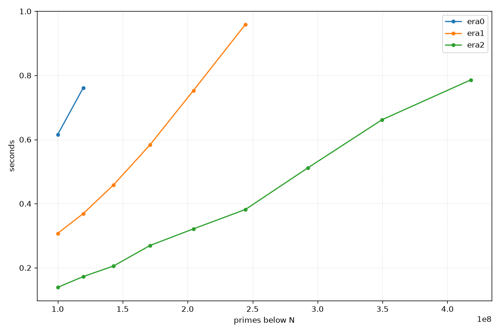
</picture>

# Wheels

So, how can one improve on the odds-only sieve? One approach is to try
and exclude more small primes other than $2$. This is usually called a
*wheel*—the association here being one of those old cart wheels with a
few individual spokes, only picking up a few numbers along the way. For
the first 100 numbers, the difference between an odds-only sieve and a
wheel sieve that also includes `3` is having to examine 50 numbers, vs.
having to look at only 33. Note that this doesn't mean we just skip the
numbers when iterating—this works at the representation level, much like
`era2` already had some additional encoding to represent odd numbers
only. In particular, this will make the data representation the CPU has
to juggle much smaller.

A small complication is that the step between numbers will not be
constant any more, so while for `era2` we could just advance by two every
time, this is not necessarily the case when incorporating more numbers.
However, the step will at least be periodic in the product of the
primes:

``` python
>>> N = [x for x in range(1,101) if x%2!=0 and x%3!=0] # Numbers to investigate
>>> N
[1, 5, 7, 11, 13, 17, 19, 23, 25, 29, 31, 35, 37, 41, 43, 47, 49, 53, 55, 59, 61, 65, 67, 71, 73, 77, 79, 83, 85, 89, 91, 95, 97]
>>> [y-x for (x,y) in zip(N,N[1:])]                    # Differences
[4, 2, 4, 2, 4, 2, 4, 2, 4, 2, 4, 2, 4, 2, 4, 2, 4, 2, 4, 2, 4, 2, 4, 2, 4, 2, 4, 2, 4, 2, 4, 2]
```

So we always advance by 4, then by 2, and then the pattern just repeats.
If there are more primes, this pattern just gets longer, but the general
idea stays the same.

Encoding of the numbers gets a tad more involved: say we just pick $2$
and $3$ as our primes; the first few numbers to be checked are numbers
$1,5,7,11,13,17,19,23,25,29,31,35$. Writing $x/\!\!/y$ for
$\lfloor\frac{x}{y}\rfloor$, every valid number is of the form $6i+1$ or
$6i+5$.[^43] Given some $n=6i+j$, its bit position is $2i$ for $j=1$ and
$2i+1$ for $j=5$, which can be conveniently written as $2i + j/\!\!/3 =
n/\!\!/3$. The addressing scheme we would have to use in this example is
thus `/3` instead of `/2` as we did for the odds-only sieve.


In general, let $N$ be a number that's the product of some distinct
consecutive primes. Suppose there are $R$ integers coprime to $N$ in the
range from $1$ to $N$. This means we form "blocks" of $R$ numbers, each
spanning $N$ numbers (since we don't represent the numbers that aren't
coprime to $N$). Hence, a valid $n$ is inside of block number
$n/\!\!/N$, which is located at bit $n/\!\!/N \cdot R$. Now, all that's
left is to record the offset of $n$, to find it inside of the block.
Since everything is cyclic, we just have to record the offsets of the
first $R$ numbers coprime to $N$, and pick out which one of those fits
$n$ using a lookup table.[^41]

---

Just two and three already give us a big reduction in numbers to look
through, but of course this can be increased by just including more
primes. There is a bit of a balance to be struck between having to
predefine really quite a lot of numbers, and the resulting efficiency
gains. Common wheel sizes are $2 \cdot 3 \cdot 5 = 30$ and $2 \cdot 3
\cdot 5 \cdot 7 = 210$. I chose the former: for size and alignment
reasons, as well as the fact that the gain with the latter is actually
not that big: ~27% (8/30) vs. ~23% (48/210) of numbers that have to be
inspected.

We can apply the general formula for $N=30$ and $R=8$; the lookup table
looks like this:

``` c
C o[30]={[1]=0,[7]=1,[11]=2,[13]=3,[17]=4,[19]=5,[23]=6,[29]=7};
```

Getting the index of `i` would then work via

``` c
i/30*8+o[i%30]
```

However, since the numbers are so small, here's a shortcut I found[^14]
that seems to work:

``` c
i/30*8+o[i%30]  ≡  4*i/15
```

---

Let's actually implement `era3` now.

``` c
#define P5    A1(2);$(x>3,A1(3));$(x>5,A1(5));//add small primes
#define w(x)  (4*(x)/15)                      //wheel index

F(era3,P5;U*E=M(x/30),m=1;C g[8]={6,4,2,4,2,4,6,2};
```

Allocation for the numbers goes from `x/16` to `x/30`. Out of 30
numbers, we only have to check 8, which conveniently fits into one byte.
So it comes down to allocating `8*x/30` bits, or `x/30` bytes.

The gap array `g` is exactly the number of steps between the coprime
numbers that we're checking.

``` c
 I(7,i*i<x,i+=g[m++&7],$(!E(m),U n=m;J(i*i,j<x,j+=i*g[n++&7],Es(w(j)))))
```

The outer and inner marking loops. `m` keeps track of the offset index
*and* is a running counter of which bit we're on. This is because in the
outer loop we're examining each bit in sequence, so there's no need for
complex indexing here, it's just `E(m)`. I guess `i+=g[m++&7]` has to be
read quite slowly, but at the end of the day it's not much different
from weird stuff like `*p++=q` that you see all the time in C. Note
that, if you wanted to use `%8` instead of `&7`, there would need to be
one extra set of parentheses.

Tracing through one iteration, we find that the first number under
consideration is `i=7`, which is exactly at index `m=1`. After whatever
happens in the inner loop, we step forward by the required `g[1]=4`
steps and increase `m` to `2`. Then we do the same thing again with
`11`, and so on.

Once we've found a prime `i`, the inner loop does essentially the same,
starting at `i*i`, and then just crossing off each valid multiple.

``` c
 m=1;I(7,i<x,i+=g[m++&7],A(i,!E(m)))
)//era3
```

For the outer loop, we're again walking every bit in order.

Again, we get a noticeable speedup:

[^25]
<picture>
  <source srcset="../images/primes/123.png" media="(prefers-color-scheme: light)">
  <source srcset="../images/primes/123-dark.png" media="(prefers-color-scheme: dark)">
  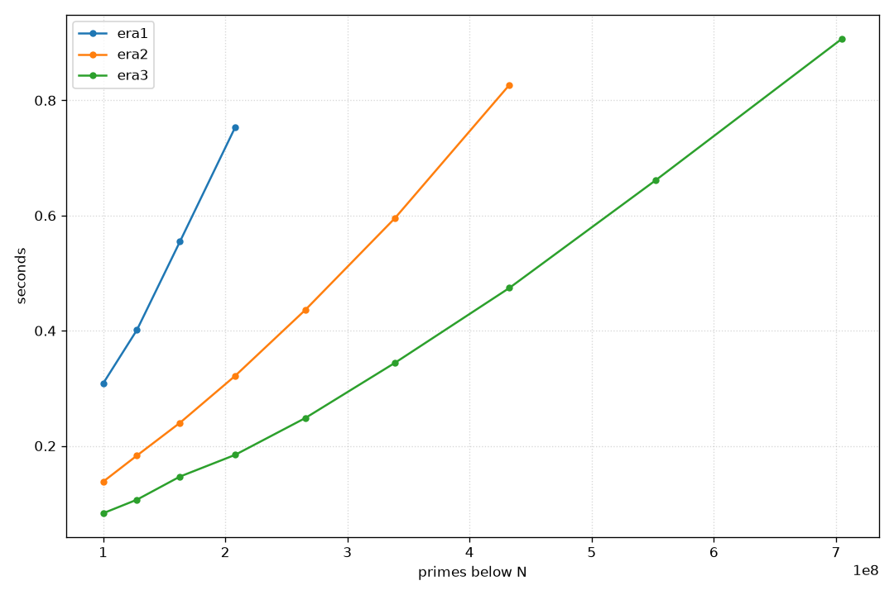
</picture>

We're doing more work in the inner loop with `4*j/15`, instead of just
`j/2`—while both compile down to shifts, the former also has some
multiplications with magic constants added in. This will be much more
noticeable later on, but for now I'm quite happy with the performance
improvements of this simple wheel.

# Segmentation

The wheel optimisation is essentially there to improve memory usage, so
that more data fits into L1. Another way of achieving this is with a
segmented sieve: instead of crossing off all multiples of a prime
immediately, work in chunks so that a single chunk exactly fits into the
L1 cache. The way this works is that we know primes $p$ such that $p^2 >
x$ will not do any crossing out anyways, as all of their relevant
multiples will have been crossed off before. So, run a normal sieve
until $\sqrt{x}$, and then just use those primes to cross off the
remaining numbers in chunks of an appropriate size.

We can create a small helper function `eraH`, which takes care of the
small primes:[^44]

``` c
// sqrt from c.h
// x:x, y:number of primes, z:how much to skip
U*eraH(U x,U*y,U z){U*p=era2(1+sqrt(x),y);p+=z;*y=*y<z?0:*y-z;R p;}
```

The reason for the existence of `z` will become clear soon. Let's roll
with it for now and write `era4`, based on `era2`, meaning we're already
baking in the odds-only sieve. First, a bit more notation:

``` c
#define L1        49152//48kib
#define i(n,e...) {U $n=(n);I(0,i<$n,++i,e)}//simple iteration
#define j(n,e...) {U $n=(n);J(0,j<$n,++j,e)}//simple jteration
#define pi(e...)  i(_P,U p=P[i];e)          //prime iteration
```

Another convention that'll be useful going forward is that, for an array
`X`, the variable `_X` denotes its size:

``` c
F(era4,A1(2);U _P,*P=eraH(x,&_P,1);
```

The `P` array holds all small primes and `_P` is its size. We start by
calling `eraH`, skipping one prime in the resulting array. This is
because the odds-only sieve wants its primes to start at 3, while the
full list that `era2` returns of course includes 2 as well. When we
later widen the segmentation to allow wheel sieves, we'll need to skip
even more numbers, which is why that particular parameter is built into
`eraH`.

``` c
 U s=L1*16,*E=M(L1);for(U l=3;l<x;l+=s){
```

This is where things get interesting. We allocate exactly as many bytes
as fit into the L1 cache on my laptop.[^49] Since each byte holds 8 bits, and
we don't represent even numbers, each iteration through `E` actually
touches `s=L1*16` numbers, so that's the stride length. We start at 3,
since that's the next odd (= representable) number we haven't checked
yet.

``` c
  U h=min(x,l+s);i(L1/8,E[i]=0);
```

Of course, `x` doesn't need to fall exactly on the end of a stride, so
`h` is the upper bound for this iteration. Since we're re-using `E`
every time, we zero it before proceeding.

``` c
  pi(J(max(p,(l+p-1)/p|1)*p,j<h,j+=2*p,Es((j-l)/2)))
```

The outer loop now just iterates over all primes $p$, but the inner loop
is slightly more involved. First, we have to start from the lowest
multiple of $p$ that's at least the lower bound $\ell$; that is, we want
the smallest $k$ with $kp \ge \ell$. This is solved by $\lceil \ell/p
\rceil \cdot p$, which can be implemented as `(l+p-1)/p` in C. The
`max(p,...)` is there since, if `l<p`, then `(l+p-1)/p` would return `1`
(which then becomes `p` by the multiplication following the `max`), but
we actually want to start searching from `p*p` as before. The little
`|1` after getting the index is a hack to make sure we start at an odd
multiple of `p`, since we can't represent even ones in this encoding.

In each step, we readjust `j` when indexing into `E` (since the array
only holds a single segment), and then increase in steps of `2*p`, again
to skip the even multiples.

``` c
  I(l,i<h,i+=2,A(i,!E((i-l)/2)))
 }//for(...)
)//era4
```

We add the numbers for each segment, so we iterate from `l` to `h` in
steps of two, and just need to again make sure to check the correct
element in `E`. The start `l` of each segment is always odd, since we
start at `3` and increase it by an even number, so there's no correction
term to be applied here.

---

Since everything fits into L1 now, how about we switch out the packed
representation for a slightly less packed one? If we represent a boolean
by a `char`, we can profit from fast array access instead of
bit-twiddling, which may or may not improve things. In the language
we've defined, this just amounts to switching out `E(i)` with `E[i]` and
`Es(i)` with `E[i]=1`. Here's the whole thing in two lines, as intended,
aligned with `era4` to showcase the differences:

``` c
F(era4,A1(2);U _P,*P=eraH(x,&_P,1),s=L1*16,*E=M(L1);for(U l=3;l<x;l+=s){U h=min(x,l+s);i(L1/8,E[i]=0);
 pi(J(max(p,(l+p-1)/p|1)*p,j<h,j+=2*p,Es((j-l)/2) ));I(l,i<h,i+=2,A(i,!E((i-l)/2)))})
F(era5,A1(2);U _P,*P=eraH(x,&_P,1),s=L1*2;C*E=M(L1);for(U l=3;l<x;l+=s){U h=min(x,l+s);i(L1,  E[i]=0);
 pi(J(max(p,(l+p-1)/p|1)*p,j<h,j+=2*p,E[(j-l)/2]=1));I(l,i<h,i+=2,A(i,!E[(i-l)/2]))})
```

This does indeed give a pretty nice performance boost:

[^26]
<picture>
  <source srcset="../images/primes/2345.png" media="(prefers-color-scheme: light)">
  <source srcset="../images/primes/2345-dark.png" media="(prefers-color-scheme: dark)">
  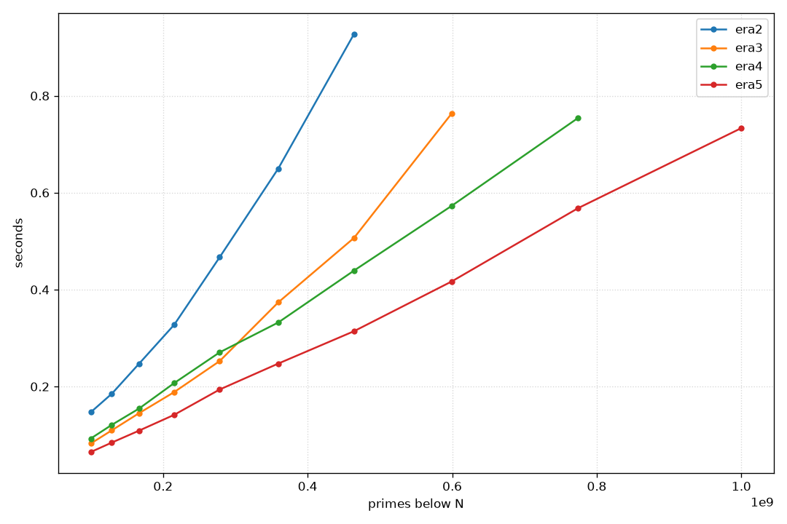
</picture>

I guess array access really is *much* faster than manual bit-twiddling.[^39]
Optimisation is weird.

---

This is a good point to reflect on what we've done so far—I think it's
really quite impressive: we're at ~700ms for all primes under a billion,
in just two lines of code!

Anyway, onwards and upwards.

## Wheeled segmentation

Applying the idea of segmentation to a wheeled sieve is not *that* much
more complicated conceptually, but a bit fiddly in the actual
implementation. Since a wheel very much skews towards bit-packing, let's
also use `era4` as a base, instead of `era5`.[^32]

``` c
F(era6,P5;U _P,*P=eraH(x,&_P,3),s=L1*30,*E=M(L1);for(U l=0;l<x;l+=s){
 U h=min(x,l+s);i(L1/8,E[i]=0);$(l==0,Es(0));
```

We start with essentially the same loop as above, only now `l` is 0.
Since we go up in steps of `s`, which is a multiple of 30, this ensures
that `l` will always be divisible by 30, so that indexing via `w(j-l)`
later on always stays valid. Also, in the very first loop we'll have to
mark `1`, the number at index `0`, as composite. This is a bit of an
annoying special case, but I haven't found a good way around
it—suggestions welcome.

``` c
 C g[8]={6,4,2,4,2,4,6,2},
   o[30]={[1]=0,[7]=1,[11]=2,[13]=3,[17]=4,[19]=5,[23]=6,[29]=7},
   r[30]={1,0,5,4,3,2,1,0,3,2,1,0,1,0,3,2,1,0,1,0,3,2,1,0,5,4,3,2,1,0};
 pi(U f=max(p,(l+p-1)/p);f+=r[f%30];U m=o[f%30];
  J(f*p,j<h,j+=p*g[m++&7],Es(w(j-l))));
```

Okay, the fiddly bit. As above, we've already collected the small primes
less than $\sqrt{x}$ and are now in the marking phase. Also as before,
we need to find the first good multiple of `p` above `l`, so we again
start with `max(p,(l+p-1)/p)`. Not as before, it's now a bit more
complicated to find out when we've hit a "bad" multiple—instead of just
preventing even-ness, we need to disallow any of the 22 numbers not
coprime to 30 in a single interval. Hence, we need to "jump" from any
such number to the next highest one that's coprime to 30, which is
exactly what the `r` lookup table ("round") does. Then, since we might
start on any coprime, we also need to know which index it has in the
wheel. In `era3` we always started at 7, so we would just set `m=1`, but
here we need yet another lookup table `o` ("offset") to jump to the
correct position.

After that, it's business as usual, starting our search at `f*p` and
increasing in steps that are reasonable for the wheel.

``` c
  U m=0;I(l+1,i<h,i+=g[m++&7],A(i,!E(m)))}
)//era6
```

[^29]
<picture>
  <source srcset="../images/primes/3456.png" media="(prefers-color-scheme: light)">
  <source srcset="../images/primes/3456-dark.png" media="(prefers-color-scheme: dark)">
  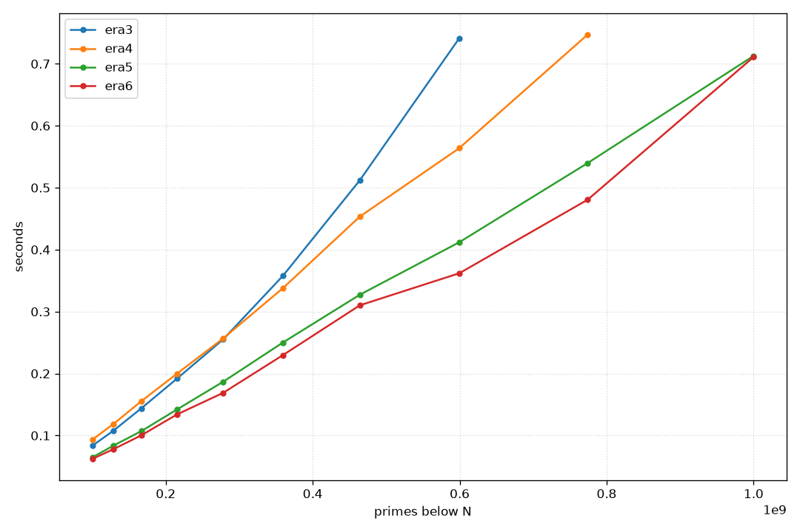
</picture>

It's… not actually that much faster. Sometimes one does see an
improvement at 1e9, but it's quite flaky. I'm not sure why this is true,
but I would imagine that the cost of `4*j/15` over `j/2` is finally
catching up to us.

# Presieving

Another optimisation we might try is to presieve small primes and tile
them into `E` at every segment. The setup here, with a presieved stencil
and another surprise later on, very much lends itself to bit-packing
again.

Let's first look at this for an odds-only sieve, as—at least for my smol
brain—it's much easier to understand than its wheeled relative. For
that, let's introduce just a tad more notation:

``` c
#define P11     P5;$(x>7,A1(7));$(x>11,A1(11));//more primes
#define CTZ(x)  __builtin_ctzll(x)//count trailing zeros
#define W(x,e)  while(x){e;}
```

We'll need to count the trailing zeros to find the rightmost `1` bit in
a bit sequence, and the more compact while loop will allow us to write
down some kind of convergence process in a reasonable way. Let's first
start with the actual function, though:

``` c
F(era7,P11;U _P,*P=eraH(x,&_P,5),_S=3*5*7*11;C*S=M(_S),Q[4]={3,5,7,11};
```

The start is the same as before. The number `_S=1155` is the product of
the small primes that we aren't ignoring outright (like 2).[^17] This
will serve as the period of the prime stencil `S` we'll use. Notice
that, a priori, `_S` is actually a period in *bits*. We can however
still just allocate `_S` bytes for `S`, since 1155 and 8 are coprime, so
it'll also be periodic as a byte length.

``` c
 U _E=42*_S,*E=M(_E),s=16*_E;
```

We allocate roughly what fits into L1 for `E` again: `_S` is $1155 = 3
\cdot 5\cdot 7\cdot 11$, so $42\cdot 1155 = 48510$ bytes neatly fit
into 48KiB. Since this is an odds-only sieve, the stride for each
segment is again `_E*2*8`.

``` c
 i(4,C q=Q[i];J(q/2,j<8*_S,j+=q,S[j/8]|=1<<(j&7)));
```

This is the presieving step: for each of the small primes we want to
presieve, cross off all of its multiples in `S`. Due to the encoding,
the start index of each prime `q` is `q/2`, and each multiple will
exactly be at some index `n*q/2`, so just increasing `q/2` by `q` every
time crosses all of them off. Since `j` is a bit index but `_S` is the
number of bytes, we have to incorporate this into the check for when to
stop. Marking works on a per-byte basis, with the same logic as the `Es`
macro.

``` c
 for(U l=0;l<x;l+=s){U h=min(x,l+s);i(_E,((C*)E)[i]=S[i%_S]);$(l==0,Es(0));
```

Instead of doing `i(_E/8,E[i]=0)`, we now copy over the segment
cyclically, tiling all of `E`. Note the cast to `C*`, since that's what
`S` is.

``` c
  pi(J(max(p,(l+p-1)/p|1)*p,j<h,j+=2*p,Es((j-l)/2)))
```

This looks exactly the same as before, so I won't dwell on it too much.

``` c
  U hb=(h-l)/2;E[hb/64]|=-(1ull<<(hb%64));
```

I added something else while I was at it,[^45] which will be good training
for the denser wheels below. Instead of going through all of the numbers
and checking which one is a prime via `I(l,i<h,i+=2,A(i,!E[(i-l)/2]))`,
we instead use the fact that we already know which numbers are
prime, and can instead reconstruct them from their packed
representation.

We first get the number of valid sieve bits as `hb`. In the `E` array,
composite numbers are assigned `1` and primes get `0`. However, the
array starts off zero-initialised. So if `hb` is not exactly divisible
by `64`, which will probably be the case, it might be that the last
64-bit word of `E` has a few high bits that are `0` because of that
initialisation, not necessarily because the numbers these bits represent
are prime. To fix this, we can do some bit twiddling: get the remainder
of dividing `hb` by `64` and shift it to the correct position;
`1ull<<(hb%64)` will be something like

```
0...010000...0
```

Negating this number, we end up with

```
1...100000...0
```

This can then be used to exclude all of the garbage bits in `E`.

``` c
  i((hb+63)/64,U z=~E[i];W(z,A1(l+1+2*(64*i+CTZ(z)));z&=z-1))
})//F(era7,...)
```

We iterate over `E` in 64-bit chunks, negate the array to turn all zeros
into ones and the other way around, and reconstruct each number in
the chunk: the index of the rightmost `1` is the number of trailing
zeros, which we first shift by `64*i` to get to the correct chunk, then
double it and add one to undo the odds-only compression, and finally add
the segment start `l`. Then just force-add it to the array.

This gives a small boost after a certain point:

[^27]
<picture>
  <source srcset="../images/primes/4567.png" media="(prefers-color-scheme: light)">
  <source srcset="../images/primes/4567-dark.png" media="(prefers-color-scheme: dark)">
  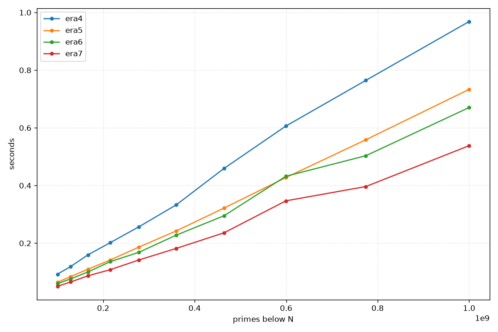
</picture>

# Giving up on rules

At this point, I slowly ran out of ideas on what to do that might have a
measurable impact, without bloating the code size too much. I also
really wanted to do something with wheel sieves—I feel like they've just
been *fine* performance wise, but haven't really wowed me at all. This
is a real shame, as the basic idea seems quite beautiful.

If you measure it, a lot of the work is actually spent building the
array, and at 1e9 the array is, like, 400MiB in size. Completely
unnecessary, and actually not a great comparison with `primesieve`,
which doesn't materialise the whole array at all. In fact, it doesn't
even tell you the highest prime in that range; it just counts![^35] If
we bit-pack the primes, counting can be done much more rapidly with a
popcount instruction, which is quite a bit faster than what we're doing
right now.

So, I'm willing to forgo the rule that the entire array needs to be
materialised for these last two examples, just to see what's possible. I
also won't compute the highest prime, though adding this isn't super
difficult. I'll leave it as an exercise for the interested reader.

These will be wheel sieves, so let's fix the hard-coded stuff
here—nothing new.

``` c
#define Z static
Z C g[8]={6,4,2,4,2,4,6,2},
    o[30]={[1]=0,[7]=1,[11]=2,[13]=3,[17]=4,[19]=5,[23]=6,[29]=7},
    r[30]={1,0,5,4,3,2,1,0,3,2,1,0,1,0,3,2,1,0,1,0,3,2,1,0,5,4,3,2,1,0};
```

Also, let's not use the `F` function template, but create a new one
that correctly signals intent.

``` c
#define G(f,e...)  Z V f(U x,U*y){*y=0;e;}//cheating
#define POP(x)     __builtin_popcountll(x)
```

Instead of adding to the array, for the small primes we then just
increment the count:

``` c
#define P13_ ++*y;$(x>3,++*y);$(x>5,++*y);$(x>7,++*y);$(x>11,++*y);$(x>13,++*y);
```

## Wheeled presieving

As a basis, let's implement a wheeled version of `era7`, without a
backing array.

``` c
G(era8,P13_;U _P,*P=eraH(x,&_P,6),_S=7*11*13;C*S=M(_S),Q[3]={7,11,13};
 U _E=48*_S,s=_E*30,*E=M(_E);
```

Since the wheel already uses 2, 3, and 5 as its primes, the small primes
we'll be sieving are 7, 11, and 13 instead. As such, the sizes move
around a bit, but the numbers here are again chosen so that everything
fits into my L1 cache.

``` c
 i(3,U q=Q[i],m=0;J(q,j<30*_S,j+=q*g[m++&7],S[w(j)/8]|=1<<(w(j)&7)));
```

Presieving looks quite similar to `era7`, only that we now index into
the wheel instead. We start at `q` instead of `q/2`, since it's not as
easy to bake the index into the start, so I'm letting `w()` do all of
that work. As such, we need to take care that `4*j/15` doesn't exceed
`8*_S`, which is the same as checking that `j<30*_S`. The steps are thus
also not constant, but again vary by the gap size.

``` c
 for(U l=0;l<x;l+=s){U h=min(x,l+s); i(_E,((C*)E)[i]=S[i%_S]);$(l==0,Es(0));
  pi(U f=max(p,(l+p-1)/p);f+=r[f%30];U m=o[f%30];J(f*p,j<h,j+=p*g[m++&7],Es(w(j-l))));
```

Exactly the same as before.

``` c
  U hb=w(h-l+r[(h-l)%30]);E[hb/64]|=-(1ull<<(hb%64));i((hb+63)/64,*y+=POP(~E[i]))
})//G(era8, ...)
```

This part actually becomes easier! We still need to kill the extraneous
bits in the last word of `E`, but once that's done, all that's needed is
but a tiny popcount to update `y`. The calculation of `hb` becomes a bit
more involved, but it's essentially just `w(h-l)`, with a small
correction term in case `h-l` is not coprime to 30, as the number
still needs to be representable.

This gives a significant boost—not necessarily due to the wheel, but
mostly just because the array-less approach is so much faster.

[^28]
<picture>
  <source srcset="../images/primes/678.png" media="(prefers-color-scheme: light)">
  <source srcset="../images/primes/678-dark.png" media="(prefers-color-scheme: dark)">
  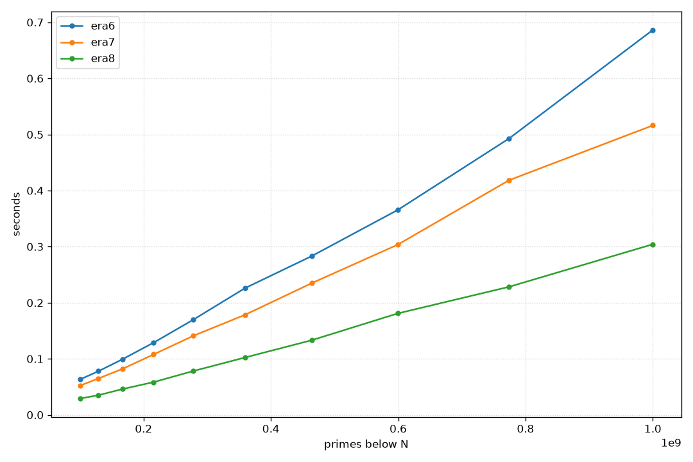
</picture>

## Fixed steps

It's finally time I stop complaining about `4*j/15` being slow, and just
fix it. There's another part of the code that slows us down, though:
instead of a simple constant `2*p`-stride, we have this variable
`j+=p*g[m++&7]` nonsense. Both of those are rather terrible for reading
and for execution; let's try to at least fix the latter.

The necessary insight is that there are constant stride lengths lurking
inside of a wheel, but instead of being global, they're inside of a
residue class. I think I will defer the exact explanation of how this
works until we see the code, as it's a bit involved, so let's just get
right into it.

``` c
G(era9,P13_;U _P,*P=eraH(x,&_P,6),_S=7*11*13,_E=48*_S,*E=M(_E),n=30*_E;
 C*S=M(_S),Q[3]={7,11,13},*cE=(C*)E;
 i(3,U q=Q[i],s=0;J(q,j<30*_S,j+=q*g[s++&7],S[w(j)/8]|=1<<(w(j)&7)))
 for(U l=0;l<x;l+=n){U h=min(x,l+n);i(_E,cE[i]=S[i%_S]);$(l==0,Es(0));
  U hb=w(h-l+r[(h-l)%30]);
```

More names, but they're exactly the same as `era8`, so I won't comment
on them again here. We again try to get as close to the L1 limit as
possible with the size of `E`, and the rest follows. Also, the presieving
step is exactly the same code as in `era8`.

``` c
  pi(U f=max(p,(l+p-1)/p);f+=r[f%30];U m=o[f%30],z=f*p-l;
```

The start of the marking loop looks essentially the same as before, only
we have to give the first multiple `z` a name now (booo!), as we'll
manually increment it.

``` c
  j(8,U b=w(z);B(b>=hb,);U mk=1<<(b&7),B=b/8,hB=(hb+7)/8;
   W(B<hB,cE[B]|=mk;B+=p)
```

The inner marking loop covers all eight residue classes—one for each
number coprime to 30—neatly assembling into one byte. Since `z` is the
first multiple of `p` in this segment, `b` is its bit-, and `B` its
byte-index. Since we're marking one byte at a time, we can use a mask
`mk`, with a `1` at exactly the right place. `hB` is the number of bytes
that are currently set, which'll serve as an upper bound for iteration.

The actual marking loop `W(B<hB,cE[B]|=mk;B+=p)` is what makes this
version fast—compare `cE[B]|=mk` with

``` c
Es(w(j-l))  ≡  _(U $i=4*(j-l)/15; E[$i/64]|=(1ull<<($i%64)))
```

We start at the `f`th multiple of `p`. The next number in the same
residue class is `p*(f+30)`, the next one after that is `p*(f+60)`, and
so on. In other words, all numbers of a single class differ by `30*p`.
Since each byte exactly covers 30 numbers, the next byte with a multiple
of `p` in the same residue class is `B+p`. Marking is just flipping the
bit associated with the current residue class in `E`, which we index
byte-wise via `cE`. The mask itself doesn't change for a single residue
class (more or less by definition), so it's really a constant stride
inner loop.

``` c
   z+=p*g[m++&7]
  )//j(8,...)
 )//pi(...)
```

Advancing the multiples works as before by consulting the gap array.

Actually, to further speed this up, it pays to manually unroll the inner
loop a bit:

``` c
   j(8,U b=w(z);B(b>=hb,);U mk=1<<(b&7),B=b/8,hB=(hb+7)/8;
    W(B+3*p<hB,i(4,cE[B+i*p]|=mk);B+=4*p);W(B<hB,cE[B]|=mk;B+=p);
   z+=p*g[m++&7])
  )//pi(...)
```

We step through four bytes at a time in the first loop, and then just
have to go through what's left in the second. Harder to read, but
consistently faster by around 20ms.

``` c
  E[hb/64]|=-(1ull<<(hb%64));i((hb+63)/64,*y+=POP(~E[i]))
 }//for(...)
)//era9
```

Finally, we again count primes by population counting them, and that's
it.

### Even more precomputation

I swear this is the last optimisation we'll do, which I'll just fold
into `era9` directly: precomputing the offset at which `b` moves. I'll
just highlight the changes. At the start, we have to allocate a gap
array `U *G=M(64*_P)`. The 64 is `8*8`, as we have eight residue
classes. Then, before the main loop over the segments, we precompute the
steps:

``` c
pi(U m=1,n;j(8,n=m,m+=g[j];G[8*i+j]=w(p*m)-w(p*n)))
```

Each prime `p` and index `i` gets the indices `8*i` to `8*i+7`, which
are filled with exactly the step length to the next residue class.

With that in place, the inner marking loop can become

``` c
pi(U*Gp=G+8*i;/*f=...*/;U b=w(f*p-l);
 j(8,B(b>=hb,);U mk=1<<(b&7),B=b/8,hB=(hb+7)/8;
  W(B+3*p<hB,i(4,cE[B+i*p]|=mk);B+=4*p); W(B<hB,cE[B]|=mk;B+=p);
  b+=Gp[m++&7]))
```

Compare `b+=Gp[m++&7]` with the old `z+=p*g[m++&7]`. It seemingly only
saves us that unpredictable multiplication with `p`, but this version is
actually consistently around 10ms faster than the non-precomputed
version. The cognitive overhead when reading the code is around the
same, I think, so I'll keep it in.

---

Here's the final algorithm in all of its glory:

``` c
G(era9,P13_;U _P,*P=eraH(x,&_P,6),_S=7*11*13,*G=M(64*_P),_E=48*_S,*E=M(_E),n=30*_E;
 C*S=M(_S),Q[3]={7,11,13},*cE=(C*)E;i(3,U q=Q[i],s=0;J(q,j<30*_S,j+=q*g[s++&7],S[w(j)/8]|=1<<(w(j)&7)))
 pi(U m=1,n;j(8,n=m,m+=g[j];G[8*i+j]=w(p*m)-w(p*n)))for(U l=0;l<x;l+=n){U h=min(x,l+n);
  i(_E,cE[i]=S[i%_S]);$(l==0,Es(0));U hb=w(h-l+r[(h-l)%30]);pi(U*Gp=G+8*i,f=max(p,(l+p-1)/p);f+=r[f%30];
   U m=o[f%30],b=w(f*p-l);j(8,B(b>=hb,);U mk=1<<(b&7),B=b/8,hB=(hb+7)/8;W(B+3*p<hB,i(4,cE[B+i*p]|=mk);B+=4*p);
   W(B<hB,cE[B]|=mk;B+=p);b+=Gp[m++&7])) E[hb/64]|=-(1ull<<(hb%64));i((hb+63)/64,*y+=POP(~E[i]))})
```

It has a certain brutalist aesthetic, for sure, but I kinda like that.
Some more benchmarks:

[^20]
<picture>
         <source srcset="../images/primes/6789.png" media="(prefers-color-scheme: light)">
         <source srcset="../images/primes/6789-dark.png" media="(prefers-color-scheme: dark)">
         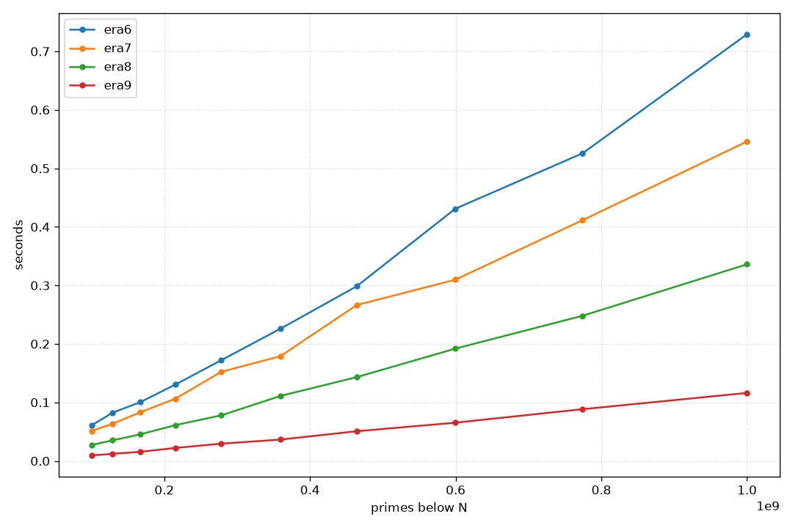
       </picture>

---

I think this is a good time to stop—if only because `era10` would
completely destroy the alignment, and continuing in hex looks weird.
Also, this still neatly fits on my screen without me having to decrease
the font size, or being forced to use overly long lines:

<picture>
  <source srcset="../images/primes/end.png" media="(prefers-color-scheme: light)">
  <source srcset="../images/primes/end-dark.png" media="(prefers-color-scheme: dark)">
  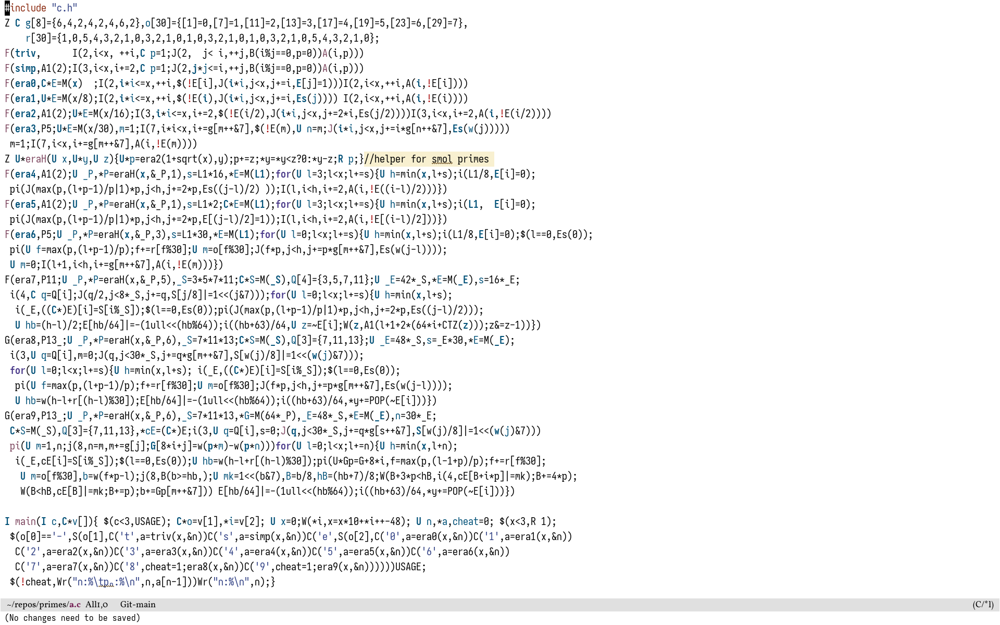
</picture>

# The end

Here are all of the variants:

<picture>
  <source srcset="../images/primes/all.png" media="(prefers-color-scheme: light)">
  <source srcset="../images/primes/all-dark.png" media="(prefers-color-scheme: dark)">
  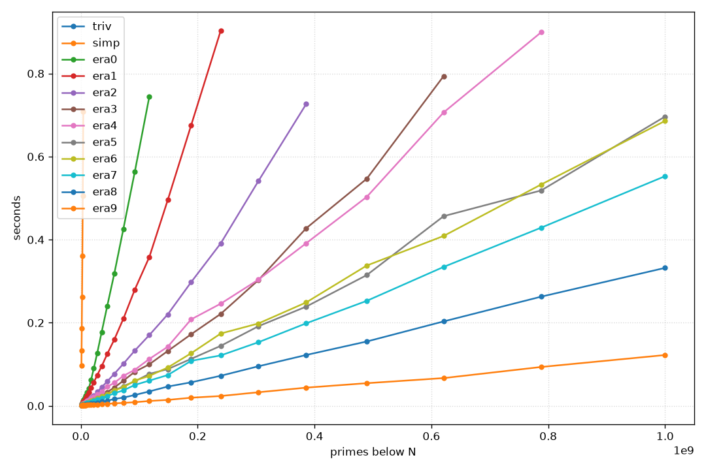
</picture>


<figure><details><summary>The table is entirely too big for a sidenote, so here it is in a drawer.</summary>
```
N           triv     simp     era0     era1     era2     era3     era4     era5     era6     era7     era8     era9
-------  -------  -------  -------  -------  -------  -------  -------  -------  -------  -------  -------  -------
1.0M         >1s    96.45     2.87     2.85     2.44     1.65     1.83     1.62     1.57     1.46     1.56     0.91
1.3M         >1s   133.82     3.40     3.40     2.13     1.83     2.24     1.83     1.95     1.97     1.40     1.06
1.6M         >1s   186.44     4.12     4.05     2.96     1.91     2.70     2.00     2.10     1.73     1.32     1.40
2.0M         >1s   261.25     5.92     5.63     3.00     2.28     2.98     2.25     2.64     1.87     1.46     1.73
2.6M         >1s   360.36     6.96     6.03     4.07     2.49     3.59     2.42     2.61     2.17     1.84     1.06
3.3M         >1s   505.69     9.23     7.19     4.19     3.02     4.31     2.97     2.95     2.63     1.76     1.93
4.2M         >1s   708.60    12.81     9.80     4.82     3.57     5.02     3.48     3.69     3.37     1.93     1.52
5.3M         >1s      >1s    14.79    10.99     5.89     4.53     6.18     4.32     4.18     3.78     2.35     1.79
6.7M         >1s      >1s    19.56    13.99     7.34     4.99     7.65     4.71     5.10     4.30     2.96     1.45
8.5M         >1s      >1s    25.04    17.63     9.13     6.21     9.30     6.18     6.25     5.28     3.12     1.59
10.8M        >1s      >1s    32.48    23.95    11.71     7.71    11.36     7.38     7.66     6.59     4.07     2.06
13.7M        >1s      >1s    42.44    32.40    14.47     8.82    13.80     8.99     9.33     7.51     4.26     2.60
17.4M        >1s      >1s    61.88    42.95    19.19    11.44    17.61    10.89    11.40     9.38     5.21     2.40
22.1M        >1s      >1s    90.01    56.35    24.34    14.56    21.55    14.04    14.26    11.95     6.34     2.97
28.1M        >1s      >1s   127.14    74.00    33.27    18.28    27.41    17.70    18.14    14.97     7.89     3.25
35.6M        >1s      >1s   177.53    95.26    44.61    23.89    33.81    21.75    22.79    19.07     9.68     3.66
45.2M        >1s      >1s   240.48   124.83    58.86    33.11    45.94    27.94    28.37    23.28    12.39     4.82
57.4M        >1s      >1s   318.85   159.92    77.10    44.09    55.48    36.74    37.39    30.27    16.40     6.00
72.8M        >1s      >1s   425.98   209.65   101.14    60.37    72.07    47.26    44.55    37.11    19.81     6.90
92.4M        >1s      >1s   563.49   279.82   132.98    81.96    86.63    58.88    60.64    50.24    25.99     8.67
117.2M       >1s      >1s   744.33   358.16   170.27    99.92   112.75    76.88    71.99    60.64    34.65    11.58
148.7M       >1s      >1s      >1s   495.27   220.13   131.91   142.11    88.22    92.12    73.98    46.31    14.17
188.7M       >1s      >1s      >1s   675.12   297.59   172.19   208.07   112.99   126.48   108.19    56.52    19.46
239.5M       >1s      >1s      >1s   903.49   391.23   221.35   245.96   144.35   174.01   121.32    72.31    23.56
303.9M       >1s      >1s      >1s      >1s   541.06   302.64   303.65   191.49   198.22   153.02    95.13    32.62
385.7M       >1s      >1s      >1s      >1s   726.35   427.34   391.30   238.71   248.83   198.50   122.30    43.70
489.4M       >1s      >1s      >1s      >1s      >1s   546.64   502.92   314.65   337.60   252.66   154.78    54.44
621.0M       >1s      >1s      >1s      >1s      >1s   793.78   706.32   456.51   408.93   334.38   203.16    66.73
788.0M       >1s      >1s      >1s      >1s      >1s      >1s   899.35   518.50   532.83   428.91   262.75    93.48
1000.0M      >1s      >1s      >1s      >1s      >1s      >1s      >1s   696.30   685.83   552.79   331.99   122.19
```
</details></figure>

What did we learn?[^47] Mostly that optimisation is weird and messy, I
guess, but also that some memory is just actually more equal than
others. Almost[^46] every performance improvement came down to that:
pack the sieve into bits so that more of it fits into the smaller
caches, make that even better by not representing numbers that are easy
to reject statically, and make that even *even* better by working in
chunks so that the bulk of the work is always done in L1. Cheating and
just not accessing slow memory much at all by refusing to materialise
the entire array also works. It's quite surprising how much one can
squeeze out of "just look at your hardware, duh" (and I definitely am
still far from doing that to its full extend).

Finally, an actual comparison against `primesieve`:[^48]

``` console
$ primesieve -t1 1e9
Sieve size = 256 KiB
Threads = 1
100%
Seconds: 0.105
Primes: 50847534

$ ./p -e9 1000000000
n:50847534

$ hyperfine 'primesieve -t1 1e9' 'taskset -c 0-3 ./p -e9 1000000000'
Benchmark 1: primesieve -t1 1e9
  Time (mean ± σ):      81.6 ms ±   4.1 ms    [User: 79.5 ms, System: 1.5 ms]
  Range (min … max):    74.5 ms …  94.9 ms    30 runs

Benchmark 2: taskset -c 0-3 ./p -e9 1000000000
  Time (mean ± σ):     117.4 ms ±   4.6 ms    [User: 115.5 ms, System: 1.2 ms]
  Range (min … max):   110.8 ms … 130.5 ms    25 runs

Summary
  primesieve -t1 1e9 ran
    1.44 ± 0.09 times faster than taskset -c 0-3 ./p -e9 1000000000
```

Not too bad for, like, six lines of code!

<div style="text-align: center;">
  
</div>

# Appendix: On the coding style

I guess I can't stop without briefly talking about the elephant in the
room, which is why I chose to ~~obfuscate~~ write this project in
~~brainfuck~~ the style of C that I wrote it in. Honestly, I just
thought it'd be fun. Whitney C has a certain charm
[to](./j-incunabulum.html) [me](./whitney-k.html),[^16] and I figured I
might try it out for something kind of trivial, which I however don't
have a good grasp on, just to see how it works out.

I think it went quite well. It certainly delivered on me being able to
get all variants on a single screen.

Would I use this again? Yes, but probably with some changes. The
complete lack of comments is a bit jarring, especially for this kind of
optimisation project, containing lots of magic numbers—like, what does
`4*j/15` mean and how does it work? However, this seems to have a nice
solution: using [GHC-style
notes](https://gitlab.haskell.org/ghc/ghc/-/wikis/commentary/coding-style#2-using-notes)!
This way, the code can still be clean, and afterwards some notes can
explain some of the more tricky decisions. Maybe I'll come up with
another project to learn about an area of computer science that I've
never played with, and try it out. Or maybe I'll write normal looking
code again at some point, who knows.

[^1]: `perf` yielded a reduction in the branch miss rate from around 6% to 0.7%.
      Very, very worth it.

[^2]: Incidentally, this is one of the tricks that seem very natural
      when looking at this from the point of view of an array
      programmer. Funny how those learnings from 1966 are still
      relevant.

[^3]: Well, at least for some definition of it.

[^4]: Btw, just imagine I had to write

      ``` c
      #define F(f,e...) unsigned long long* f(unsigned long long x,unsigned long long*y){unsigned long long*a=malloc(...); unsigned long long _a=0; *y=0; e; *y=_a; return a;}
      ```

      here; or, *shudder*

      ``` c
      #define F(f,e...) unsigned long long* f(unsigned long long x, unsigned long long *y) { \
        unsigned long long *a = malloc(...);                                                 \
        unsigned long long _a = 0;                                                           \
        *y = 0;                                                                              \
        e;                                                                                   \
        *y = _a;                                                                             \
        return a;                                                                            \
      }
      ```

      This gets slightly better with `uint64_t`, but honestly not really.
      Maybe it's because I'm damaged from doing maths for too long, but I certainly know which macro I'd rather read.

[^9]: A good compromise is probably the `u64` et al that you'd see in Rust.
      For this project, however, that name seems much too long, so I'll go with the shortened version.

[^11]: {-} [Creative Commons BY-SA 3.0](https://en.wikipedia.org/wiki/Sieve_of_Eratosthenes#/media/File:Animation_Sieve_of_Eratosth.gif)

[^12]: {-} I've cut it in half for the website, but it's really meant to be read as if it was on a single line.
       This will also be the case for the other functions shown here, perhaps you'll also need to scroll a bit at some point. Sorry.

[^13]: Yes, this whole project was an incredibly great source of off-by-one errors.

[^14]: There's no theory here, I think, just playing around with numbers a bit.
       It mostly comes down to the fact that $4j/\!\!/15$ is the same as `o[j]` for all residue classes,
       and so for every number $30i+j$, we have that
       $$
         \texttt{8*i+o[j]} = 8i + 4j/\!\!/15.
       $$
       But I'm not a number theorist, maybe there's a "deeper" reason this works.
       It certainly fails for a 210-based wheel, so that's just another reason to choose 30.

[^16]: I sometimes wonder if this is a subconscious act of defiance against the over-commented slop that a lot of LLMs produce en masse nowadays;
       in the spirit of [staying illegible](https://ashwinsundar.com/posts/legibility-and-programming), although I don't think this is what the author had in mind.

[^17]: I could have included 13 here as well, but some preliminary benchmarks tell me that that's not really any faster.
       Really, the most important ones are 3, 5, and 7, the rest is window-dressing.

[^19]: Note in particular that I've written `$(x,e;break);` instead of `$(x,e;break)`—the semicolon is important, as it nullifies the dangling else.
       The project started out using just `if(x){y;}`, but actually the dangling else is quite convenient sometimes.

[^20]: {-} 󠀠

       ```
       N           era6     era7     era8     era9
       -------  -------  -------  -------  -------
       100.0M     60.79    51.19    27.30     9.33
       129.2M     82.47    63.61    35.22    12.11
       166.8M    100.33    82.97    45.32    15.52
       215.4M    130.64   106.52    61.22    22.22
       278.3M    172.20   152.28    77.87    29.48
       359.4M    225.90   178.93   111.02    36.43
       464.2M    298.50   266.34   143.21    50.70
       599.5M    430.99   309.69   191.89    65.28
       774.3M    525.78   411.50   248.11    88.40
       1000.0M   729.23   545.91   336.01   116.19
       ```

[^21]: {-} All times (now and in future) in ms

       ```
       N         triv     simp
       -----  -------  -------
       10K      10.07     1.29
       22K      36.67     1.78
       46K     150.17     2.75
       100K    628.66     5.44
       215K       >1s    13.03
       464K       >1s    34.49
       1.0M       >1s    96.50
       2.2M       >1s   280.83
       4.6M       >1s   817.69
       10.0M      >1s      >1s
       ```

[^22]: {-} 󠀠

       ```
       N          simp     era0
       ------  -------  -------
       1.0M      96.23     3.03
       1.7M     207.72     4.45
       3.0M     444.11     8.52
       5.2M     968.55    15.01
       9.0M        >1s    26.37
       15.6M       >1s    52.06
       27.0M       >1s   121.76
       46.7M       >1s   248.55
       80.8M       >1s   481.66
       140.0M      >1s   897.84
       ```

[^23]: {-} 󠀠

       ```
       N          era0     era1
       ------  -------  -------
       100.0M   619.57   305.78
       110.7M   688.00   345.39
       122.6M   791.96   377.72
       135.7M   903.29   437.96
       150.3M      >1s   498.68
       166.4M      >1s   565.73
       184.2M      >1s   627.49
       203.9M      >1s   740.43
       225.8M      >1s   868.40
       250.0M      >1s      >1s
       ```

[^24]: {-} 󠀠

       ```
       N          era0     era1     era2
       ------  -------  -------  -------
       100.0M   615.43   307.33   138.87
       119.6M   760.60   368.65   172.45
       143.0M      >1s   458.51   205.59
       171.0M      >1s   583.20   269.31
       204.5M      >1s   752.89   321.38
       244.5M      >1s   959.24   381.86
       292.4M      >1s      >1s   511.19
       349.7M      >1s      >1s   661.78
       418.1M      >1s      >1s   786.27
       500.0M      >1s      >1s      >1s
       ```

[^25]: {-} 󠀠

       ```
       N          era1     era2     era3
       ------  -------  -------  -------
       100.0M   308.28   137.73    82.93
       127.7M   401.13   183.09   106.45
       162.9M   554.98   240.11   146.69
       208.0M   752.79   321.40   184.26
       265.5M      >1s   436.01   248.28
       338.9M      >1s   595.49   344.21
       432.7M      >1s   826.98   474.33
       552.3M      >1s      >1s   661.14
       705.0M      >1s      >1s   907.22
       900.0M      >1s      >1s      >1s
       ```

[^26]: {-} 󠀠

       ```
       N           era2     era3     era4     era5
       -------  -------  -------  -------  -------
       100.0M    147.04    82.43    92.83    64.95
       129.2M    185.26   109.76   121.02    84.45
       166.8M    247.19   145.09   154.63   109.07
       215.4M    327.63   188.63   207.25   141.73
       278.3M    466.80   252.52   270.55   193.87
       359.4M    649.83   373.72   332.22   247.44
       464.2M    927.44   506.73   439.30   314.22
       599.5M       >1s   763.87   573.08   417.01
       774.3M       >1s      >1s   754.38   568.20
       1000.0M      >1s      >1s      >1s   733.29
       ```

[^27]: {-} 󠀠

       ```
       N           era4     era5     era6     era7
       -------  -------  -------  -------  -------
       100.0M     92.63    64.47    59.47    50.24
       129.2M    119.35    84.56    76.49    65.66
       166.8M    159.74   109.87   100.30    86.94
       215.4M    201.89   141.78   136.02   108.16
       278.3M    256.99   186.63   168.53   141.88
       359.4M    332.61   242.31   227.74   181.73
       464.2M    459.20   321.82   295.08   235.95
       599.5M    606.25   427.67   432.14   346.90
       774.3M    764.65   558.69   503.31   396.39
       1000.0M   968.54   733.35   670.41   538.10
       ```

[^28]: {-} 󠀠

       ```
       N           era6     era7     era8
       -------  -------  -------  -------
       100.0M     63.13    52.16    29.15
       129.2M     77.90    64.95    35.09
       166.8M     99.21    82.02    46.01
       215.4M    128.58   107.64    58.34
       278.3M    169.85   141.04    78.24
       359.4M    226.03   178.46   102.31
       464.2M    283.17   234.89   133.13
       599.5M    365.55   303.65   180.97
       774.3M    492.92   418.51   228.37
       1000.0M   686.37   516.16   304.23
       ```

[^29]: {-} 󠀠

       ```
       N           era3     era4     era5     era6
       -------  -------  -------  -------  -------
       100.0M     83.38    93.25    64.67    62.21
       129.2M    108.11   118.91    83.91    78.05
       166.8M    143.95   155.49   107.10   100.36
       215.4M    191.96   199.95   142.12   134.07
       278.3M    255.28   256.79   186.89   168.95
       359.4M    357.68   337.80   250.05   229.71
       464.2M    512.11   453.39   327.27   310.18
       599.5M    741.32   563.87   411.95   361.88
       774.3M       >1s   747.24   539.81   480.69
       1000.0M      >1s      >1s   712.80   710.96
       ```

[^30]: {-} Sadly, my CPU doesn't support AVX-512, so I won't get to play around with SIMD stuff much :(

[^31]: Imagine this side-by-side comparison using ordinary C syntax, btw. Notation really does pay off sometimes.

[^32]: From some cursory tests, a byte-based wheel is around 15% slower than a bit-based one. Optimisation is weird.

[^33]: Since `E()` is a function-like macro, the preprocessor only tries to expand it if `E` is followed by an opening parenthesis.
       This way `E` and `E(x)` can unambiguously be parsed as the array/the accessor.

[^35]: Though, as said before, it doesn't use counting-specific algorithms like `primecount` does.

[^38]: The `wait` function is essentially `proc.wait(timeout=...)`, only
       it doesn't poll quite as slowly as that one.

[^39]: `perf` reports around 15 billion instructions for `era4`, but only 10 billion for `era5`!

[^40]: {-} If you're throwing up into your mouth a little bit right now,
       perhaps perusing [the appendix](#appendix-on-the-coding-style)
       helps. Or maybe not, I don't know.

[^41]: We can even recover `era2` from this: for $N = 2$ there is
       exactly one coprime residue, so $R = 1$ and the offset table is
       all zeros. The index of $n$ degenerates to $n/\!\!/2 \cdot 1 + 0
       = n/\!\!/2$.

[^42]: I will go on to immediately break this convention with the
       precomputed tables for the wheel sieve, but what can you do. This
       is the beauty (or curse?) of notation, as opposed to syntax—rules
       can be broken if need be. In this case, it's mostly for æsthetic
       reasons, though; sorry.

[^43]: {-} The other way around, the number at bit $i$ is $6(i/\!\!/2)+k$,
       where $k$ is $1$ if $i$ is even, and $5$ otherwise.

[^44]: Alternatively, you could also hard-code some small primes and
       then run a sort of generation step beforehand, but since we have
       the non-segmented sieves anyways…

       Btw, I'm using `era2` instead of `era3` here since it's prettier.
       Since $\sqrt{10^9} \approx 31623$ is very small, it really doesn't matter.

[^45]: Shamelessly cribbed from ngn's excellent [4.c](https://codeberg.org/ngn/k/src/branch/master/4.c).

[^46]: But see `era5` being faster than `era4` since, once everything fits into L1, other things become important again.

[^47]: Besides the fact that I much rather prefer things that can be proven over things that have to be measured, but I knew that beforehand.
       Feels more "real".

[^48]: {-} 󠀠

       󠀠

       󠀠

       󠀠

       󠀠

       󠀠

       󠀠

       󠀠

       `hyperfine` speeds primesieve up for unknown reasons.

[^49]: Note that this might not be optimal, as the other data structures
       also need to be accessed sometimes, so one might even want a
       slightly smaller allocation here. Playing around with it however,
       it seems that access to `E` actually dominates, so I chose the
       exact size of my L1.
