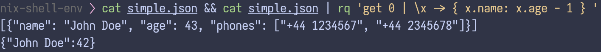

<p></p>
I've just released version 0.1.0 of [`rq`](https://github.com/slotThe/rq),[^12]
a small functional language to manipulate JSON—and my excuse to learn Rust!
This seems as good a time as any to talk about it,
so let's do that.

<!--more-->

# Overview

As the name suggests,
`rq` is heavily inspired by the venerable `jq`,[^10]
and looks quite similar in action:



Another example,
printing out the name of `rq`s direct and transitive dependencies.

``` console
$ cargo metadata | rq '.packages | map .name | filter (!= "rq")'
[ahash, allocator-api2, anyhow, ariadne, cc, cfg-if, chumsky, hashbrown,
libc, once_cell, proc-macro2, psm, quote, stacker, syn, unicode-ident,
unicode-width, version_check, winapi, winapi-i686-pc-windows-gnu,
winapi-x86_64-pc-windows-gnu, yansi, zerocopy, zerocopy-derive]
```

I will try to give a coarse overview of the language,
adding some design considerations,
without repeating too much of what is already in the projects
[README](https://github.com/slotThe/rq?tab=readme-ov-file#the-expression-language).
I would advise you to consult that if you're interested in a more comprehensive description of `rq`.

# The language

The tl;dr is that `rq`—as advertised—is a small functional language with the usual idioms.
There is a small REPL to try out the language,
which can be accessed by executing `rq` with a `repl` argument.[^11]

```
$ rq repl
λ>

λ> const 1 2
1

λ> (\x -> x + 1) 41
42

λ> map (+ 1) [1, 2, 3, 4, 5]
[2, 3, 4, 5, 6]

λ> foldl (+) 0 [9, 3, 13, 17]
42

# `get` gets the i'th index or key from a collection.
λ> get 1 [0, 2, 3, 4]
2
λ> get "name" { name: "Name" }
Name
```

The language has some `jq`-inspired syntactic sugar for working with JSON,
like `x.1` desugaring to `get 1 x`, and `.1` meaning `λx → get 1 x`.
Additionally, `|` designates covariant function composition.[^7]

```
λ> (filter (get "age" | (>= 42)) | map (\x -> { x.name: x.age })) \
     [{"name": "John Doe", "age": 43, "phone": "+44 1234567"},{"name":"Alice"},{"name":"Bob", "age":42}]
[{John Doe: 43}, {Bob: 42}]
```

## Type system

I like statically typed languages,
so why not make `rq` one as well?
For a program whose sole purpose is to receive a one-line expression,
this might seem overkill—and it is!

Currently, the type system is a bit rudimentary and only features the most essential pieces:
universally quantified type variables,
arrows,
as well as `Num` and `JSON` as "basic types",
where the former is a subtype of the latter.
The `JSON` type is to be seen as a black hole of sorts,
swallowing everything and
enabling our statically typed language to come across as quite dynamic indeed.[^9]

In the REPL, types can be queried with `:t`.

```
λ> :t const
∀a. ∀b. a → b → a

λ> :t get
JSON → JSON → JSON

λ> :t \f g x -> f x (g x)
∀j. ∀i. ∀g. (g → i → j) → (g → i) → g → j

λ> :t id
∀a. a → a

λ> :t id 1
Num

λ> :t id 1 :: JSON
JSON

λ> :t "a" :: Num
JSON is not a subtype of Num
```

Implementation wise, one needs something that supports both polymorphism and subtyping.
Sadly, this rules out any Hindley–Milner-inspired type system (at least to my knowledge).
I settled on Dunfield and Krishnaswami's bidirectional
type checking algorithm from their paper[^8] "Complete and easy
bidirectional type checking for higher-rank polymorphism"
[@dunfield13:higher],
as it seemed to be the most straightforward description of exactly what I needed.
The paper is quite readable, actually,
so I encourage you to check it out!

And that's `rq`, pretty much.
besides `map`, `filter`, `foldl`, `get`, and `set`
there are relatively few builtin functions that do interesting things right now.
Someone should definitely do something about that…!

# Performance

Performance is "fine";
a bit slower than `jq`,
though probably not enough to notice very often in practice.
There currently is no streaming parser,
though, so please don't pump gigabytes of JSON through `rq` :)

As a "real world" example,
I ran `cargo metadata` on the
[rust-analyzer GitHub repository](https://github.com/rust-lang/rust-analyzer),
which produces ~1mb of JSON.
On that data, `jq` takes 144ms and `rq` needs around 186ms.

``` console
$ hyperfine "cargo metadata --format-version=1 | jq '.packages | map (.name)'"
Benchmark 1: cargo metadata --format-version=1 | jq '.packages | map (.name)'
  Time (mean ± σ):     144.0 ms ±   3.6 ms    [User: 112.3 ms, System: 36.2 ms]
  Range (min … max):   136.5 ms … 149.5 ms    19 runs

$ hyperfine "cargo metadata --format-version=1 | rq '.packages | map .name'"
Benchmark 1: cargo metadata --format-version=1 | rq '.packages | map .name'
  Time (mean ± σ):     185.7 ms ±   4.0 ms    [User: 139.2 ms, System: 46.6 ms]
  Range (min … max):   178.6 ms … 194.8 ms    16 runs
```

[^3]A cursory analysis reveals that parsing takes about 10ms,
with the type checker and evaluator needing around 20ms each.
The bulk of the time, 130ms, is spent invoking `cargo metadata` and reading its output.

Still, overall I'm quite happy with this,
as I haven't really tried optimising for performance at all,
and yet the result is quite acceptable.

# Future work

- We need more functions to actually do useful things!
  This is both the most important
  and least exciting
  direction,
  so let's see which feeling ends up winning :)

- Guessing at performance improvements,
  I suppose a case could be made to more closely look at the evaluator;
  currently conversion between the semantic and syntactic representation of the expression is done by copious amounts of copying.
  Perhaps a bit of this could be alleviated by making certain functions take mutable references instead,
  though I haven't completely thought this through yet.

- I was initially thinking about implementing the standard library
  using
  [higher-order abstract syntax](https://en.wikipedia.org/wiki/Higher-order_abstract_syntax)
  instead of
  [hard coding](https://github.com/slotThe/rq/blob/4ff7bb1e35dbbde201a069f5e2c588059c79149b/src/eval.rs#L148)
  them into the evaluator itself.
  This would essentially involve a change in the expression type from

  ``` rust
  enum Expr {
    // …
    Builtin(Builtin), // Builtin is a big enum of names
  }
  ```

  to something along the lines of

  ``` rust
  enum Expr {
    // …
    Builtin(dyn Fn(Expr) -> Expr),
  }
  ```

  I reckon hard coding the builtin functions into the evaluator might be a net speed gain,
  though this seems like a fun exercise,
  so perhaps I will explore this on a separate branch.

- Implementing a more complete type system seems advisable;
  in particular list and object types should not be very difficult to add.
  I'm not totally sure how union types[^4] would fit into the current algorithm,
  but this is definitely something I'd like to implement.
  Having a type signature like

  ``` agda
  get : (Num | Str) → (Arr | Obj) → JSON
  ```

  or even

  ``` agda
  get : (Num → Arr → JSON) | (Str → Obj → JSON)
  ```

  would please me.

- I'm also interested to find other (bidirectional) type checking algorithms that may be worth studying more closely.

[^3]: {-} I'm quite surprised—though happy—by the type checker being this fast!
      Likewise, I'm glad that all of the praise I've read about
      [normalisation by evaluation](https://en.wikipedia.org/wiki/Normalisation_by_evaluation)
      was justified.

[^4]: As in, not coproducts but the other ones.

[^7]: As in, `(f | g)(x)` means `g(f(x))`,
      to mirror how shells use pipes.

[^8]: {-} The paper is freely available [on the arXiv](https://arxiv.org/abs/1306.6032).

[^9]: After all, a dynamically typed language is just a statically typed one with a single base type.

[^10]: Though obviously it—right now—only covers a meagre subset of what `jq` can do.

[^11]: {-} 󠀠

       󠀠

       To appease… someone reading this,
       lambdas can also be written in Rust-esque notation,
       and can take multiple arguments:

       ```
       |x, y| x y  ≡  λx y → x y  ≡  \x -> \y -> x y
       ```

[^12]: {-} I would *never* have made a release solely to have an excuse to write about `rq`;
       what are you talking about‽
