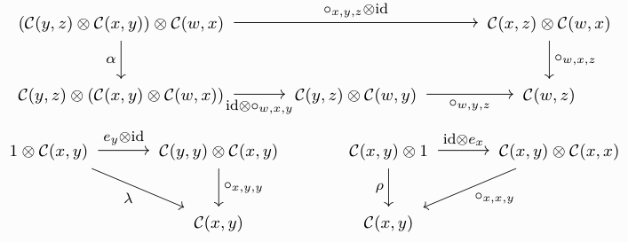

If you've been doing category theory for any amount of time, you'll
probably have stumbled upon enriched category theory as a way of
expressing categorical ideas internal to some context other than
**Set**.  Reading into it, you might have come across these foreign
sounding concepts like weighted (co)limits and wondered what that was
all about—and then got lost for a few days, trying to decipher what
[Kelly][tac:kelly] is talking about and why symbols resembling tensor
products are suddenly being thrown around.  At least that's what
happened to me.

After scouring the internet for good resources, I found two really
enlightening blog posts: one by [Todd Trimble][trimble:blog] and the
other by [John Baez][baez:blog]—and they're too good not to share.
Plus, people always say that you don't understand a concept unless you
can explain it to someone else, so here's my shot at it!

<!--more-->

I will assume familiarity with basic notions of category theory (limits,
colimits, adjunctions, monoidal categories, …), as well as elementary
abstract algebra (in particular, rings and modules).  If you're not
comfortable with these and have a lot of time to kill, I recommend
[Category Theory in Context][riehl:ct] by Emily Riehl for the former and
[A Course in Algebra][vinberg] by Ernest Vinberg for the latter.

Really, it's good if you have heard about enriched category theory
before, as this is where weighted colimits tend to naturally crop; also
because I can't possibly do the topic justice in a single blog post.  I
will still try, of course, but be warned.  However, weighted colimits
also appear in ordinary category theory, so if you don't want to touch
the enriched stuff just insert $\mathsf{Set}$ whenever I write
$\mathcal{V}$ below—it will only get easier.  Further, most of the [main
part](#weighted-colimits) of the text doesn't use enrichment at all, so
don't be too alarmed.

First and foremost I must note that—more-so than elsewhere—these are
very much not my own thoughts.  I'm just retelling the story in order to
understand it better myself.  Sources and resources for everything are
linked [at the end](#resources).  The key insights come from the
mentioned blog posts by [Todd Trimble][trimble:blog] and [John
Baez][baez:blog], as well as the accompanying (resulting) [nLab
article][nlab:weighted-colimit].

# Enriched category theory

As I said, we first turn our attention to *enriched* category theory.
Before diving into the gory details, I will first discuss things a bit
more intuitively.  In short, one studies not ordinary categories—whose
hom*sets* are always sets—but so-called $\mathcal{V}$-categories, whose
hom-*objects* are objects in some "environmental" category
$\mathcal{V}$.  This category is what replaces $\mathsf{Set}$, so it
will usually be assumed to have some _very_ nice properties.  For the
purposes of this blog post, I will assume that $(\mathcal{V}, \otimes,
1)$ is a (small) complete and cocomplete closed symmetric monoidal
category.[^1] If you don't know what some of these words mean, you can
read that as "it's an environment in which we can think about category
theory in an effective way".

In addition, I would also like to fix a $\mathcal{V}$-category
$\mathcal{C}$ for the rest of this blog post.  For the moment, you can
think of this like an ordinary category such that for any two objects
$a$ and $b$ in $\mathcal{C}$, we have that $\mathcal{C}(a, b) ≔
\mathrm{Hom}_{\mathcal{C}}(a, b)$ is an object in $\mathcal{V}$.
Naturally, all the usual axioms of a category—like associativity and
unitality of morphisms—ought to hold in this new setting.  As you can
imagine, this makes certain things more complicated.  The fact that
$\mathcal{C}(a,b)$ is an object in $\mathcal{V}$ means that it is now a
black box—we can't peek into it anymore!  Writing $f \in
\mathcal{C}(a,b)$ is no longer legal, so we somehow have to make do with
not talking about individual morphisms.  A little bit more care has to
be taken for the precise definition of an enriched category to make
sense.  First, however, I will show you a few examples.

Thankfully—lest the world explodes—categories enriched in $\mathsf{Set}$
are exactly ordinary categories.  Likewise, a lot of categories that
people are interested in and you may be familiar with arise in this way:
2-categories (in the strict sense) are categories enriched over
$\mathsf{Cat}$, preadditive categories are those enriched over
$\mathsf{Ab}$, and $k$-linear categories are ones enriched over
$\mathsf{Vect}_k$.  Further, rings can also be seen as categories.
Namely, they have just a single object $\star$ and
$\mathrm{Hom}(\star,\star)$ forms an abelian group—more on that later.

With these examples in mind, let us explore the technical definition of
a category enriched over $\mathcal{V}$.  Formally, such a $\mathcal{C}$
consists of:

  - A collection of objects $\mathrm{ob}\, \mathcal{C}$.
  - For $x, y \in \mathcal{C}$, a hom-object
    $\mathcal{C}(x, y) \in \mathcal{V}$.
  - For $x, y, z \in \mathcal{C}$, a composition map in $\mathcal{V}$:
    $$
      \circ_{x, y, z} \colon \mathcal{C}(y, z) \times \mathcal{C}(x, y)
                      \longrightarrow \mathcal{C}(x, z).
    $$
  - For $x \in \mathcal{C}$ an identities map
    $e_x \colon 1 \longrightarrow \mathcal{C}(x,x)$.

Further, this data has to satisfy appropriate associativity and
unitality conditions:

  

In the above diagrams, $\alpha$, $\lambda$, and $\rho$ respectively
denote the associativity, left, and right unitality constraints of
$\mathcal{V}$.

If these diagrams remind you of a [monoidal
category][nlab:monoidal-category], they absolutely should!  Much like
you can think of ordinary categories as multi-object monoids, a decent
mental model for $\mathcal{V}$-categories is to think of them as
multi-object monoidal categories.

## Functors and natural transformations

We furthermore need analogues for functors and natural
transformations—they now also come with a $\mathcal{V}$- prefix.  The
functor laws get a bit more complicated, as we can't simply say that
$F(f \circ g) = Ff \circ Fg$, for some arrows $f$ and $g$, and need to
draw commutative diagrams instead (remember that we can't talk about
individual arrows anymore).  However, most of the intuition you already
have about functors and natural transformations should carry over just
fine.  I will leave the technical definitions of enriched functors and
natural transformations as exercises to the reader—they are relatively
straightforward to write down and not all that important for what
follows.

The upshot of all of this is that, in order to do enriched category
theory, we not only need analogues for functors and natural
transformations, but also for all the other basic notions of ordinary
category theory.  Since limits and colimits are among the most important
constructions, people naturally started to think about how one could
express them in the enriched language—this is precisely what lead to the
development of weighted colimits!

One interesting thing I want to highlight about enriched functors is the
induced arrow on morphisms that an $F \colon \mathcal{C} \longrightarrow
\mathcal{V}$ always comes with.  Namely, $\mathcal{C}(a, b)
\longrightarrow \mathcal{V}(F a, F b)$.  Because $\mathcal{V}$ is
symmetric monoidal, we can use the tensor-hom adjunction and rewrite the
above to look more like an action:

$$
  \mathcal{C}(a, b) \otimes F a \longrightarrow F b.
$$

Likewise, a $\mathcal{V}$-functor $F \colon \mathcal{C}^{\mathrm{op}}
\longrightarrow \mathcal{V}$ comes equipped with an "action" from the
other side:

$$
  F b \otimes \mathcal{C}(a, b) \longrightarrow F a.
$$

# Copowers

Before we get to the fun stuff, we have to talk about one more important
technical detail: copowers.  The basic idea is that in any ordinary
monoidal category $(\mathcal{A}, \otimes_{\mathcal{A}},
1_{\mathcal{A}})$, we have the tensor-hom adjunction (also called
*currying*) ${-} \otimes b \dashv [b, {-}]$.  In particular, this means
that

$$
  \mathcal{A}(a \otimes_{\mathcal{A}} b, c) \cong \mathcal{A}(a, [b, c]),
  \qquad \text{for } a, b, c \in \mathcal{A}.
$$

If we're in an enriched setting, we want to somehow "switch out" the
tensor product of the monoidal category with some action, say $\cdot
\colon \mathcal{C} \times \mathcal{V} \longrightarrow \mathcal{C}$,
while retaining this nice property.  As such, the *copower* of $c \in
\mathcal{C}$ *by a* $v \in \mathcal{V}$ is an object $c \cdot v \in
\mathcal{C}$, such that for all $b \in \mathcal{C}$, there is a natural
isomorphism

$$
  \mathcal{C}(c \cdot v, b) \cong \mathcal{V}(v, \mathcal{C}(c, b)).
$$

Above I have slightly abused notation; $\mathcal{V}({-}, {-})$ now
denotes the *internal* hom of $\mathcal{V}$, instead of the external
one.  If $\mathcal{V}$ is clear from the context, one also often writes
$[{-},{-}]$ here.  Also do remember that $\mathcal{C}(a,b)$ is an object
in $\mathcal{V}$ now!

The best thing about copowers is their existence when it comes to
$\mathsf{Set}$ and ordinary categories.  If $\mathcal{A}$ has all
coproducts, there is a canonical copower $\cdot \colon \mathsf{Set}
\times \mathcal{A} \longrightarrow \mathcal{A}$.[^4] For all $X \in
\mathsf{Set}$ and $a \in \mathcal{A}$, it is given by

$$
  X \cdot a ≔     \coprod_{x \in X} 1_{\mathcal{A}} \otimes_{\mathcal{A}} a
            \cong \coprod_{x \in X} a.
$$

The fact that this is a copower follows from

$$
  \mathcal{A}(X \cdot a, b) = \mathcal{A}(\coprod_{x \in X} a, b)
  \cong \prod_{x \in X} \mathcal{A}(a, b) \cong \mathsf{Set}(X, \mathcal{A}(a, b)),
$$

for all $b \in \mathcal{A}$.  Because of the closeness to the tensor
product, people sometimes call copowers "tensors" and write them with
the same symbol as they write the tensor product.

# Weighted colimits

Onto the main dish.  The key idea is to reframe an ordinary colimit in
terms of "looking like a monoidal product".  The weighted colimit then
becomes something akin to the tensor product over a k-algebra $R$.  We
like rings and modules, so let's explore this further.

To recap, when looking at bimodules $A$ and $B$ over some $k$-algebra
(ring) $R$ we can define the tensor product of $A$ and $B$ over $R$, in
symbols $A \otimes_R B$, as the coequaliser

$$
  A \otimes_R B
  ≔ \mathrm{coeq} \left(
      A \otimes R \otimes B \rightrightarrows A \otimes B
    \right),
$$

where the two parallel arrows are induced by the left and right actions
$\rhd \colon A \otimes R \longrightarrow A$ and $\lhd \colon R \otimes B
\longrightarrow B$, respectively.

For ease of notation, I will often write coequalisers like the above one
as

$$
  A \otimes R \otimes B \rightrightarrows A \otimes   B
                        \longrightarrow   A \otimes_R B.
                                                            \tag{1}
$$

Categorifying this notion, the ring $R$ can be seen as a one-object
category enriched over $\mathsf{Ab}$ with object $1 \in R$.  The
multiplication is recovered as function composition in $R(1, 1)$ and the
addition is given by the abelian structure.  A right $R$-module $A$ is
then an enriched functor $A \colon R^{\mathrm{op}} \longrightarrow
\mathsf{Ab}$ and a left R-module is an enriched functor $B \colon R
\longrightarrow \mathsf{Ab}$.  Inserting the definition discussed above,
we have that $A$ consists of a single object $A1$ and a single map $A1
\otimes R(1, 1) \longrightarrow A1$.  Likewise, we obtain $B1$ and
$R(1,1) \otimes B1 \longrightarrow B1$ in $\mathcal{V}$.  Thus, we have
induced arrows

$$
    A1 \otimes R(1,1) \otimes B1 \rightrightarrows A1 \otimes B1.
$$

Let us forget about enrichment for a while and just study ordinary
categories now.  The second observation we need is the well-known fact
that any colimit can be represented as a coequaliser.  Suppose
$\mathcal{D}$ to be a (cocomplete) category .  Given a functor $F \colon
\mathcal{J} \longrightarrow \mathcal{D}$ we can express its colimit as

$$
  \coprod_{a, b \in \mathcal{J}}
            \coprod_{f \in \mathcal{J}(a, b)} F a
  \rightrightarrows \coprod_{b \in \mathcal{J}} F b
  \longrightarrow   \mathrm{colim}_\mathcal{J} F.
$$

Note that we can use what we learned about ($\mathsf{Set}$-valued)
copowers above and write $\coprod_{f \in \mathcal{J}(a, b)} F a$ as
$\mathcal{J}(a, b) \cdot F a$, or even $\mathcal{J}(a, b) \times F a$,
as $\mathcal{J}(a,b)$ is a set in this case.  Behold:

$$
  \coprod_{a, b \in \mathcal{J}} \mathcal{J}(a,b) \times F a
  \rightrightarrows \coprod_{b \in \mathcal{J}} F b
  \longrightarrow \mathrm{colim}_\mathcal{J} F.
                                                                \tag{2}
$$

What's left is to define the two parallel arrows.[^5]

  1. One arrow is induced by the "projection" $\pi_2 \colon
     \mathcal{J}(a, b) \times F a \longrightarrow F a$.  Note that
     $\mathcal{J}(a, b) \times F a$ is really a copower and so the
     existence of such an arrow is not immediately clear.  We have a
     functor ${-} \times F j \colon \mathsf{Set} \longrightarrow
     \mathcal{C}$ and so $\pi_2$ is actually the application of the
     unique map[^7]
     $! \colon \mathcal{J}(a, b) \longrightarrow \{\star\}$
     to that functor; i.e.,

     $$
     ! \times F a \colon \mathcal{J}(a,b) \times F a \longrightarrow \{\star\} \times F a \cong F a.
     $$

  2. The other arrow is induced by a collection of actions of
     $\mathcal{J}$ on $F$, indexed by arrows $f \colon a \longrightarrow
     b$ in $\mathcal{J}$; i.e.,

     \begin{align*}
     (\mathcal{J}(a,b) \times F a \longrightarrow F b)
     &= \left( \coprod_{f \in \mathcal{J}(a,b)} F a \longrightarrow F b \right) \\
     &= \langle Ff \colon Fa \longrightarrow F b \rangle_{f \in \mathcal{J}(a,b)}.
     \end{align*}

So that's the story with expressing colimits as coequalisers.  What's
next is that we need to completely reframe this in terms of actions.
For the second arrow we are already done: $F$ can be seen as a left
$\mathcal{J}$-module.

Using the symmetry of the Cartesian product $\times$ of sets, the arrow
$\mathcal{J}(a, b) \longrightarrow \{\star\}$ can be reinterpreted as
the components of a right action of $\mathcal{J}$ on the terminal
functor $\mathbb{T} \colon \mathcal{J} \longrightarrow \mathsf{Set}$
that sends every object to the one-element set $\{\star\}$:

$$
  (\mathbb{T}b \times \mathcal{J}(a,b) \longrightarrow \mathbb{T}a)
  =     (\{\star \} \times \mathcal{J}(a,b) \longrightarrow \{\star\})
  \cong (\mathcal{J}(a,b) \longrightarrow \{\star\}).
$$

Putting these two observations together, we really have two induced
arrows with type signature

$$
  \mathbb{T} b \times \mathcal{J}(a, b) \times F a \longrightarrow \mathbb{T} a \times F a.
$$

Inserting these into Equation $(2)$, this yields

$$
  \coprod_{a, b \in \mathcal{J}} \mathcal{J}(a,b) \times F a
    \cong             \coprod_{a, b \in \mathcal{J}} \mathbb{T} b \times \mathcal{J}(a, b) \times F a
    \rightrightarrows \coprod_{a \in \mathcal{J}} \mathbb{T} a \times F a
    \cong             \coprod_{a \in \mathcal{J}} F a.
$$

This is exactly the way the tensor product of bimodules is defined in
Equation $(1)$, hence it is tempting to write the resulting coequaliser as
$1 \otimes_{\mathcal{J}} F$.  As such, a colimit of a functor $F$ over
$\mathcal{J}$ can be seen as a tensor product of functors with the
terminal functor.  Now, the terminal functor is not very interesting;
what if we replace it with something more complicated?  Well, that's
exactly the point where weighted colimits come into play!  Using a
*weight* $W$ instead of $\mathbb{T}$, we would end up with something
like

$$
  \coprod_{a, b \in \mathcal{J}} W b \times \mathcal{J}(a, b) \times F a \rightrightarrows \coprod_{a \in \mathcal{J}} W a \times F a \longrightarrow W \otimes_{\mathcal{J}} F.
$$

Because this looks like a tensor product—and it's universal, due to it
being a colimit—it should support some sort of currying operation: given
an arrow $W \otimes_{\mathcal{J}} F \longrightarrow c$, for some object
$c \in \mathcal{C}$, we should be able to obtain an arrow $W \implies
\mathcal{C}(F, c)$.  Now's your time to guess what exactly a weighted
colimit will be!

## Definition

Still in the non-enriched setting, let me now give you the formal
definition of a weighted colimit.  Suppose $\mathcal{J}$ to be a small
category.  Let $W \colon \mathcal{J}^{\mathrm{op}} \longrightarrow
\mathsf{Set}$ be a presheaf—the *weight*—and suppose we have a functor
$F \colon \mathcal{J} \longrightarrow \mathcal{A}$.  The *$W$-weighted
colimit of $F$* comprises an object $W \otimes_{\mathcal{J}} F \in
\mathcal{A}$, and a natural (in $a \in \mathcal{A}$) isomorphism

$$
  \mathcal{A}(W \otimes_{\mathcal{J}} F, a)
  \cong
  [\mathcal{J}^{\mathrm{op}}, \mathsf{Set}] (W, \mathcal{A}(F, a)).
$$

Note that, by the [Yoneda lemma][nlab:yoneda], the above isomorphism is
uniquely determined by a natural transformation $W \implies
\mathcal{A}(F, W \otimes_{\mathcal{J}} F)$.  As promised, this is
exactly the representation we arrived at above.

A pair of an object $c \in \mathcal{A}$ and a natural transformation $W
\implies \mathcal{A}(F, c)$ on their own; i.e., without the universal
property, is what one would normally call a *$W$-weighted cocone*.

## Enriched weighted colimits

The enriched definition is now exactly the same!  If $\mathcal{J}$ is a
small $\mathcal{V}$-category and we have $\mathcal{V}$-functors $F
\colon \mathcal{J} \longrightarrow \mathcal{C}$ and $W \colon
\mathcal{J}^{\mathrm{op}} \longrightarrow \mathcal{V}$, then we can
define the *$W$-weighted colimit of $F$* as an object $W
\otimes_{\mathcal{J}} F \in \mathcal{C}$, and a $\mathcal{V}$-natural
(in $c \in \mathcal{C}$) isomorphism

$$
  \mathcal{C}(W \otimes_{\mathcal{J}} F, c)
  \cong
  [\mathcal{J}^{\mathrm{op}}, \mathcal{V}] (W {-}, \mathcal{C}(F {-}, c)).
$$

This is the power of this definition—it extends in a straightforward way
to the enriched setting.  This may now be used to great effect: in case
you know what this means, among other things weighted colimits can be
used to define the right notion of enriched coend.

## Examples

It's probably about time for some examples.  For the first two, let us
focus on cocones only; this is perhaps a little easier to understand
than also throwing the universal property in there.  I learned these
from Richard Garner during [BCQT 2022][leeds].

1. Suppose our diagram category is the category with two objects and one
   non-trivial morphism; i.e., $\mathcal{J} ≔ \{ \varphi \colon a
   \longrightarrow b \}$.  Further, assume that the weight $W$ picks
   out[^3] the unique arrow $\{ 0, 1 \} \longrightarrow \{ 1 \}$ in
   $\mathsf{Set}$.  The functor $F \colon \mathcal{J} \longrightarrow
   \mathcal{C}$ we would like to look at sends $a, b \in \mathcal{J}$ to
   $x, y \in \mathcal{C}$ and $\varphi$ to $\theta \colon x
   \longrightarrow y$.

   Again by the Yoneda lemma we have that a cocone is given by a natural
   transformation $W \implies \mathcal{C}(F, c)$.  In this restricted
   setting, an arrow $Wa \longrightarrow \mathcal{A}(Fb, c)$ just picks
   out two morphisms.  Thus, the whole thing amounts to the
   commutativity of the following diagram:

     

   In more plain language, we have a commutative diagram of the form

   $$
     (x \xrightarrow{\;\;\theta\;\;} y \xrightarrow{\;\;g\;\;} c)
     = (x \xrightarrow{\;\;\theta\;\;} y \xrightarrow{\;\;f\;\;} c),
   $$

2. A slightly more complicated example is the following.  Assume again
   that $\mathcal{J} = \{ \varphi \colon a \longrightarrow b \}$ as
   above, only this time don't work over $\mathsf{Set}$ but over
   $\mathsf{Cat}$.  This means that the weight $W$ is now a functor from
   $\mathcal{A}^{\mathrm{op}}$ to $\mathsf{Cat}$.  Suppose it picks out
   the arrow

   $$
   \{ 0 \;\; 1 \} \hookrightarrow \{ 0 \cong 1 \},
   $$

   where these are understood to be categories.  Now, a weighted cocone
   becomes something 2-categorical.  We still pick out arrows $f$ and
   $g$, but since the category we are looking at is not the terminal
   one, but contains an isomorphism, the commutative diagram also
   becomes more complicated.  Namely, we required the commutativity of

     

   Instead of the requiring $\theta \circ g$ to _equal_ $\theta \circ
   f$, we now only require the existence of an invertible 2-cell that
   mediates between the two.

3. A subcategory $\mathcal{D}$ of $\mathcal{E}$ is said to be *dense* in
   $\mathcal{E}$ if we can, in some sense, approximate the objects of
   $\mathcal{E}$ well enough with only objects in $\mathcal{D}$ (think
   of the density of $\mathbb{Q}$ inside $\mathbb{R}$).  Dense
   categories are nice because they often tell us a lot about their
   super categories and are sometimes easier to reason about.  For
   example, the category of finite-dimensional (left-)comodules of any
   (possibly infinite-dimensional) Hopf algebra is dense inside the
   category of all comodules, which makes them much easier to work with
   than modules.

   Formally, $\mathcal{D}$ is dense in $\mathcal{E}$ if the restricted
   Yoneda embedding along the inclusion functor $\iota \colon
   \mathcal{D} \hookrightarrow \mathcal{E}$

   $$
     \mathcal{E} \longrightarrow [\mathcal{E}^{\mathrm{op}}, \mathsf{Set}]
       \xrightarrow{\;[\iota, \mathsf{Set}]\;} [\mathcal{D}^{\mathrm{op}}, \mathsf{Set}]
   $$

   is still fully faithful.  Another way of saying this is that every
   object $e \in \mathcal{E}$ is the $\mathcal{E}(\iota, e)$-weighted
   colimit of $\iota$.  Indeed, the isomorphism we have for a weighted
   colimit specialised to our situation looks like

   $$
    \mathcal{E}(e, a) \cong [\mathcal{D}^{\mathrm{op}}, \mathsf{Set}] (\mathcal{E}(\iota, e), \mathcal{E}(\iota, a)),
   $$

   for all $a \in \mathcal{E}$.  This is exactly what it means for the
   above arrow to be fully faithful.

_Exercise_: Try to find a weight such that one recovers a normal,
unweighted, cocone.

_Exercise_: As you can imagine 1. and 2. can be used to produce all
kinds of relations between $f$ and $g$.  As such, prove the following
statements:

  - A variant of 1.: in the case of the weight being $\{0, 1\}
    \xrightarrow{\;\;\mathrm{id}\;\;} \{0, 1\}$, we obtain a
    not-necessarily-commutative diagram.

  - A variant of 2.: in the case that the weight is $\{ 0 \}
    \hookrightarrow \{ 0 \longrightarrow 1 \}$ (i.e., we only have an
    arrow between 0 and 1 and not necessarily an isomorphism), we get an
    ordinary (non-invertible) 2-cell as the weighted cocone.

# Conclusion

And that's it!  I've found this intuition very helpful in trying to wrap
my head around these concepts—hopefully other people will too.  As a
parting gift, I leave you with some more things to think about.

First, one of the most important examples of weighted colimits—and
coends, of course—is the [tensor product of
functors][nlab:functor-tensor-prod].  If you ever wanted to be a
[ninja][nlab:coyoneda], now is the time!  It's a fun operation to think
about and play around with, and I would invite you to do just that.

Lastly, the category of weights $[\mathcal{J}^{\mathrm{op}},
\mathcal{V}]$ is actually very special: it is the free cocompletion of
$\mathcal{J}$.  Every functor $G \colon \mathcal{J} \longrightarrow
\mathcal{A}$ extends uniquely (up to unique isomorphism) to a
cocontinuous functor $[\mathcal{J}^{\mathrm{op}}, \mathcal{V}]$ to
$\mathcal{A}$ by the assignment $W \mapsto W \otimes_{\mathcal{J}} G$
(note the tensor product of functors!).

# (Re)sources

- Monoidal Category Theory:

  - Saunders Mac Lane: "Natural associativity and commutativity".
    In: Rice Univ. Stud. 49.4 (1963), pp. 28–46. issn: 0035-4996.

  - Pavel Etingof, Shlomo Gelaki, Dmitri Nikshych, and Victor Ostrik:
    "Tensor categories".  In: Vol. 205. Mathematical Surveys and
    Monographs.  American Mathematical Society, Providence, RI, 2015,
    pp. xvi+343.

  - [nLab: monoidal category][nlab:monoidal-category]

- Enriched Category Theory:

  - Max Kelly: "Basic concepts of enriched category theory".  In: London
    Math. Soc. Lec. Note Series 64, Cambridge Univ. Press 1982, 245
    pp. (ISBN:9780521287029).

    Republished as: Reprints in Theory and Applications of Categories,
    No. 10 (2005) pp. 1-136 ([link][tac:kelly])

  - [nLab: enriched category][nlab:enriched-category]

- Copowers:

  - [nlab: copower](https://ncatlab.org/nlab/show/copower)

- Weighted Colimits:

  - [Todd Trimble on the n-Category Café][trimble:blog]

  - [John Baez on the n-Category Café][baez:blog]

  - [nLab: weighted colimit][nlab:weighted-colimit]

  - Richard Garner: Bicategories; lecture series at [BCQT 2022, Leeds][leeds].

  - Emily Riehl: "Weighted Limits and Colimits"; [lecture notes][riehl:lecture-notes].

[baez:blog]: https://golem.ph.utexas.edu/category/2007/02/day_on_rcfts.html#c007688
[leeds]: https://conferences.leeds.ac.uk/bcqt2022/
[nlab:coyoneda]: https://ncatlab.org/nlab/show/co-Yoneda+lemma
[nlab:enriched-category]: https://ncatlab.org/nlab/show/enriched+category
[nlab:functor-tensor-prod]: https://ncatlab.org/nlab/show/tensor+product+of+functors
[nlab:monoidal-category]: https://ncatlab.org/nlab/show/monoidal+category
[nlab:weighted-colimit]: https://ncatlab.org/nlab/show/weighted+colimit
[nlab:yoneda]: https://ncatlab.org/nlab/show/Yoneda+lemma
[riehl:ct]: https://math.jhu.edu/~eriehl/context.pdf
[riehl:lecture-notes]: https://math.jhu.edu/~eriehl/weighted.pdf
[tac:kelly]: http://www.tac.mta.ca/tac/reprints/articles/10/tr10abs.html
[trimble:blog]: https://golem.ph.utexas.edu/category/2007/02/day_on_rcfts.html#c007723
[vinberg]: https://bookstore.ams.org/gsm-56/

[^1]: This is also sometimes called a *cosmos*.

[^3]: By sending $a$ to $\{0, 1\}$, $b$ to $\{ 1 \}$, and $\varphi$ to
      $\{0, 1\} \longrightarrow \{1\}$.

[^4]: If the category $\mathcal{A}$ is locally small.  I will ignore
      those kinds of technicalities for the purposes of this post.

[^5]: I mostly follow Trimble and the nLab here.  A more explicit
      description—in the case of limits—is given, for example, in
      Riehl's [Category Theory in Context][riehl:ct], Theorem 3.2.13.

[^7]: The one-element set $\{\star\}$ is the terminal object in
      $\mathsf{Set}$, hence by definition there is exactly one arrow from
      any other set to it.
