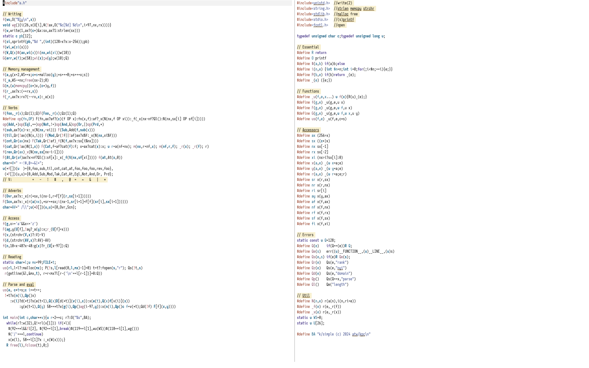

<div class="fullwidth">
Let's try to read some more C code.
</div>

<!--more-->

<div class="fullwidth">

First up, the usual disclaimer: not a single line of code in this
article was written by me. Rather, I'm leaning on the excellent
[kparc/ksimple](https://github.com/kparc/ksimple). Indeed, the
repository contains a super detailed walkthrough of both
[a.h](https://github.com/kparc/ksimple/blob/main/a.h) and
[a.c](https://github.com/kparc/ksimple/blob/main/a.c), with lots of
comments and indentation! Really, I recommend that you rather read that
than whatever I have to say. This post is me trying to learn how to read
this code as if those comments weren't there, and seeing if I can at
least approximately guess intent from just the code alone. Expect
mistakes, and cross-reference with the "real" comments if unsure. Maybe
I'll read them myself at some point, and then update this paragraph. Or
not.

Here's a small, probably incomplete, specification of the language, so
you know what you're getting yourself into.

+ 26 global variables `a` to `z`.
+ 8-bit integers.
+ Refcounted immutable arrays without nesting.
+ Strict [right to left evaluation](https://aplwiki.com/wiki/Right-to-left_evaluation).
+ Some error handling!
+ No tokeniser or parser to speak of, so don't expect to be able to
  enter much more than single digit numbers, single letter variables,
  and the builtin operations. Also, be careful not to hit space by
  accident.
+ Assignment is done with `:`, so `a:1` would assign the global variable
  `a` to `1`. Inline assignment, like `1+a:1` is supported.
+ [Verbs](https://aplwiki.com/wiki/Function) are comprised of any of
  `+-!#,@=~&|*`; they can be [monadic](https://aplwiki.com/wiki/Monadic)
  or [dyadic](https://aplwiki.com/wiki/Dyadic_function) (but not all
  combinations are implemented). There are but two (monadic)
  [adverbs](https://aplwiki.com/wiki/Adverb):
  [fold](https://aplwiki.com/wiki/Reduce) `/` and
  [scan](https://aplwiki.com/wiki/Scan) `\`.
+ Verbs are [pervasive](https://aplwiki.com/wiki/Pervasion) if that
  makes sense (e.g., `1+!9` works); some niceties, like
  [take](https://aplwiki.com/wiki/Take) (dyadic `#`) cycling the vector,
  are also implemented.
+ REPL commands are `\\` to exit, `\w` to print how many bytes are
  currently allocated, and `\v` to print all heap allocated global
  variables.
+ Comments are lines starting with a `/`; no inline comments.

The entire source code easily fits in two Emacs frames, shown side by
side, which is how I read through the whole thing:
</div>
<picture>
  <source srcset="../images/k-incunabulum/code.png" media="(prefers-color-scheme: light)">
  <source srcset="../images/k-incunabulum/code-dark.png" media="(prefers-color-scheme: dark)">
  
</picture>
I think that that's really pretty—reason enough to try and understand it.

---

# a.h

As always with stuff like this, reading through the header file first is
important to not lose one's footing, as this is where most of the macros
are defined. It starts very slowly, just importing some system libraries.

``` c
#include <unistd.h>  //write(2)
#include <string.h>  //strlen memcpy strchr
#include <stdlib.h>  //malloc free
#include <stdio.h>   //(s)printf
#include <fcntl.h>   //open
```

Next, we have the fundamental data types to be used later on. I will
assume that just like in the [J
version](https://tony-zorman.com/posts/j-incunabulum.html), `u` is
opaque, in the sense that it sort of might be anything: an actual
number, a pointer to an array, a pointer to a function… I feel like this
is really fundamental to K's design, in that a lot of the shorthand
developed in this header file heavily builds upon the fact that, to an
outside observer, everything is a uniform integer type. As a type
theorist at heart, this is obviously *really* scary to me, but it is
what it is.

``` c
typedef unsigned char c; typedef unsigned long u;
```

Here come some shorter names for primitives and branching/iteration,
though I can't tell why `O` was chosen for `printf`. I believe dollars
signs being allowed in identifiers is not standard C, but the GCC manual
[says that](https://gcc.gnu.org/onlinedocs/gcc/Dollar-Signs.html) "many
traditional C implementations allow such identifiers", so it's probably
fine.

``` c
#define R return
#define O printf
#define $(a,b) if(a)b;else
#define i(n,e) {int $n=n;int i=0;for(;i<$n;++i){e;}}
```

The `_(e)` macro uses the [statement
expression](https://gcc.gnu.org/onlinedocs/gcc/Statement-Exprs.html) GCC
extension—it turns a compound statement into an expression. According to
the docs

> The last thing in the compound statement should be an expression
> followed by a semicolon; the value of this subexpression serves as the
> value of the entire construct. (If you use some other kind of
> statement last within the braces, the construct has type void, and
> thus effectively no value.)

Better remember that.

The `P` macro is an early return. Spoiling you a bit, it's only
used once when reading the input into a line buffer, so I wouldn't worry
too much about it.

``` c
#define _(e) ({e;})
#define P(b,e) if(b)return _(e);
```

Now this is getting interesting. `_u` is a generic template for defining
functions: we first give it the function name, then the body, and only
then (due to the varargs) the arguments of the function. Instead of
`__VA_ARGS__`, this uses the more old-school [named
varargs](https://gcc.gnu.org/onlinedocs/cpp/Variadic-Macros.html) GCC
extension. What the function does is to call the body inside of the `_`
macro, cast it to `u`, and return it.

``` c
#define _u(f,e,x...) u f(x){R(u)_(e);}
```

With this we can define monadic and dyadic function templates `f` and
`F`. This is a bit like the `V1` and `V2` macros in the [J
Incunabulum](https://code.jsoftware.com/wiki/Essays/Incunabulum), if
you've read through that, only this time they're distinguished by case.

It's a bit confusing that `F` takes arguments `f` and `x`, instead
of `x` and `y`, but that's, I guess, because it's used to both define
dyadic verbs and monadic adverbs, where in the latter case `f` and `x`
are more appropriate, and this naming convention fits better with the
next function.

The `G` function is a template for an adverb, which additionally
takes a (for real this time) pointer `f` to a function to modify, as
well as two arguments. There are no dyadic adverbs in this interpreter,
so `G` is only used as a shorthand to define some utility functions
later on.

Lastly, `us` is a special template for a function getting a string
as an argument. Think something like an evaluation function.

``` c
#define f(g,e) _u(g,e,u x)
#define F(g,e) _u(g,e,u f,u x)
#define G(g,e) _u(g,e,u f,u x,u y)
#define us(f,e) _u(f,e,c*s)
```

Here we get some actual clues as to the memory layout of the whole
thing. The check for atoms `ax` tells us that we're restricted to 8-bit
integers (they're unsigned here since `u` is, but, reading ahead, we'll
have access to signed integers, the check here just doesn't tell us).
The `sx` macro reinterprets `x` as an array of bytes.

``` c
#define ax (256>x)
#define sx ((c*)x)
```

Arrays are implemented as fat pointers: the length of the vector `nx`
(one byte long!) and its reference count `rx` are stored before the start
of the array. `xi` is a simple accessor function that gets the index of
`x` at `i`, or 0 if `i` is larger or equal than the length of the
vector.

It's a bit unfortunate that the language is not entirely consistent
here, I think: In `ax`, `sx`, `nx`, and `rx`, the argument is the last
character (which will be important below, when we'll define some
analogues for other implicit arguments). For `xi`, however, this swaps
around! I feel like it would have been a bit more consistent to call
this `ix`, although I guess it was chosen due to the normal indexing
syntax of C—`xi` is much closer to `x[i]` than `ix` is.

``` c
#define nx sx[-1]
#define rx sx[-2]
#define xi (nx>i?sx[i]:0)
```

These are sort of single-use "renaming" operations; e.g., `x(a,e)` takes
an argument `a`, just decides to call it `x`, and then calls `e`, which,
presumably, makes use of an implicit argument `x`. The whole thing is
wrapped in a `_` macro, to make sure we can assign the result of
`x(a,e)` to something. Same with `y(a,e)` and `r(a,e)`, only the latter
returns `r` instead of the value of the last statement of `e`.

Likewise, `sr`, `nr`, and `ri` are like `sx`, `nx`, and `xi`, but for `r`.

``` c
#define x(a,e) _(u x=a;e)
#define y(a,e) _(u y=a;e)
#define r(a,e) _(u r=a;e;r)
#define sr x(r,sx)
#define nr x(r,nx)
#define ri sr[i]
```

But wait, there's more! Various accessors and tests for different
argument names.

``` c
#define ay x(y,ax)
#define af x(f,ax)
#define nf x(f,nx)
#define rf x(f,rx)
#define sf x(f,sx)
#define fi x(f,xi)
```

We even have some kind of error handling!

Even though it might not look like it, the definition `u Q=128` is
actually super interesting. This interpreter runs on 8-bit integers, so
if we go by normal two's complement rules (instead of thinking we'll use
unsigned longs all the way through), then we can represent numbers from
`-128` to `127` inclusive. In particular, since $128_{10} = 10000000_2$,
this will already wrap around, representing `-128` (you can skip ahead
to the definition of `si` if you're interested). By defining `Q` to be
`128`, we're effectively reducing our range of representable numbers
from `[-128,127]` to `[-127,127]`. But a small price to pay for errors,
I guess.

The `Q` macro[^5] tests if something is an error, and if yes
returns it, `Qe` is sugar for the yet-to-be-defined `err`, which pops up
an error with some additional information, such as the line number. This
uses the `__FUNCTION__` variable and `__LINE__` macro to get the name of
the function where an error occurred, as well as its position in the
source file. `Qs` throws an error with the given string `s` if `e` is
true.

Using this machinery, we can build a bunch of error types, like
*rank* (expecting an array/atom and getting the other type) or *nyi*
(not yet implemented).

``` c
static const u Q=128;
#define Q(e)    if(Q==(e))R Q;
#define Qe(s)   err((u)__FUNCTION__,(u)__LINE__,(u)s)
#define Qs(e,s) if(e)R Qe(s);
#define Qr(e)   Qs(e,"rank")
#define Qz(e)   Qs(e,"nyi")
#define Qd(e)   Qs(e,"domain")
#define Qp()    Qs(Q==x,"parse")
#define Ql()    Qe("length")
```

Apparently—and I admit I had to look this up—`WS` stands for
[workspace](https://course.dyalog.com/Workspaces/), which is a wonderfully ancient APL term. In this case, it just gives us, in bytes, the number of
things allocated in the current REPL session. `U` holds addresses to all
global variables. Since both are declared `static`, both variables are
zero initialised, hence all globals are initially set to `0`.[^1]

``` c
static u WS=0;
static u U[26];
```

This macro (and the following two) use things that are only defined in
`a.c`. The `a` function just allocates an array, so `N(n,e)` allocates
an array of size `n`, calls it `r`, and then iterates over it, executing
the given expression `e` (which presumably uses `i` somewhere inside of
it) in each step, and assigning the result to `r[i]`. For example,
something like `N(5,i)` would generate the array `0 1 2 3 4`.

``` c
#define N(n,e) r(a(n),i(n,ri=e))
```

The `_r` function (to be defined in `a.c`) decreases the reference count
of the given object (and deallocates it if that count ever reaches 0).
As with earlier renaming macros, `_f` and `_x` are essentially just
that, just with another named argument. E.g., `_f(e)` would rename `e`
to `r`, call `_r(f)` (decrementing the reference count of `f`), and then
return `r`.

``` c
#define _f(e) r(e,_r(f))
#define _x(e) r(e,_r(x))
```

The banner that shows up when one starts the REPL.

``` c
#define BA "k/simple (c) 2024 atw/kpc\n"
```

Would you believe me when I told you that that was the most readable
part of the code?

# a.c

We start simple again: `wu` writes a single `u` to stdout. The `wg`
function looks a bit scarier, but it's actually not that bad: it
iterates over all global elements (= `U`) and, if they're an array,
prints name, length, and reference count to stdout. In particular, this
does not show globals that are just assigned to scalars, but just stuff
we've allocated.

This makes heavy use of `x(a,e)` and all of these implicit
arguments we've seen in `a.h`, but now I think it's apparent why they
exist in the first place. As [everyone knows](https://xkcd.com/1053/),
`97` is ASCII `a`, so `i+97` would print `a` for `i=0`, `b` for `i=1`,
and so on.

``` c
f(wu,O("%lu\n",x))
void wg(){i(26,x(U[i],$(!ax,O("%c[%d] %d\n",i+97,nx,rx))))}
```

The next few lines are all about stringifying and printing.

`w` writes the raw byte(s) at the correct address to stdout.

`wi` pretty-prints an integer; the real work is done by the
stringification function `si`, which turns an atom into a string and
takes care of all the horrible casting of 8-bit unsigned integers to
8-bit signed ones. This is actually the only place where we (have to)
take care of this—in all other instances we just add `unsigned long`'s,
and pretend that's what we're doing.

`W` is a more general writing function, which either prints an
integer if `x` is an atom, or prints the entire array, separated by a
space (inserted by `si` automatically). We finish all of that with a
newline (of course you knew that linefeed was ASCII 10, right?)

``` c
f(w,write(1,ax?(c*)&x:sx,ax?1:strlen(sx)))
static c pb[12];
f(si,sprintf(pb,"%d ",(int)(128>x?x:x-256));pb)
f(wi,w(si(x)))
f(W,Q(x)$(ax,wi(x))i(nx,wi(xi))w(10))
```

The first time we see the `G` function used, though not quite for an
adverb! This is the `err` function that was already referenced in `a.h`
before; it essentially prints `f:xy\n`, just filling in values for `f`,
`x`, and `y`. For example, recall that `Qe(s)` was defined as
`err((u)__FUNCTION__,(u)__LINE__,(u)s)`.

``` c
G(err,w(f);w(58);wi(x);w(y);w(10);Q)
```

## Memory management

First, we get to that allocation function we had in an earlier
macro, as well as its destruction counterpart. `a(x)` increases the
workspace size by `x`, allocates `x+2` bytes, fills in the length and
ref count, and returns the finished array.

To me, the most interesting bit here is that the ref counts start
at 0 and not at 1. This means there's a tiny ownership system hidden
inside of this implementation! Every verb immediately owns its value,
and a single call to `_r` (see below) will deallocate a freshly
allocated value.

``` c
f(a,y(x+2,WS+=x;c*s=malloc(y);*s++=0;*s++=x;s))
f(_a,WS-=nx;free(sx-2);0)
```

Another use of `G` for something that's decidedly not an adverb. The `m`
function is a `memcpy` shim, which copies `f` bytes from `y` to `x`, and
the aforementioned ref count increase and decrease, with deallocation
should the count ever be 0. I like the little trick of using the comma
operator in `(++rx,x)`—you don't see something like this very often in
"normal" code.

``` c
G(m,(u)memcpy((c*)x,(c*)y,f))
f(r_,ax?x:(++rx,x))
f(_r,ax?x:rx?(--rx,x):_a(x))
```

## Verbs and adverbs

Now we get to the first actual functions, called *verbs* in K lingo. As
per the file's conventions, monadic verbs will be written lowercase,
while dyadic ones will have their first letter capitalised. The first
two verbs, `foo` and `Foo`, are just placeholders that always error.
`Foo` is unused, so I guess it doesn't matter, but I reckon it should
probably also call `_r(f)`, since it also owns that value.

``` c
f(foo,_r(x);Qz(1);Q)F(Foo,_r(x);Qz(1);Q)
```

`sub` is already quite interesting, I think. It negates an atom—which,
remember, is an `unsigned long`—and then casts it to an `unsigned char`!
This means that the transformation is something like `1 → -1 → 255`.
This is needed, of course, due to the printing setup we've already
defined in `wi`. If `x` is an array instead, we create a *new* array of
the same length where every index is negated, decrease the reference
count of `x`, and return the new array. This might be the first function
that properly shows that immutable arrays are a core part of K.

``` c
f(sub,ax?(c)-x:_x(N(nx,-xi)))
```

More functions, but this time a little less exciting than `sub`: an
[iota](https://aplwiki.com/wiki/Index_Generator), a
[count](https://aplwiki.com/wiki/Tally), an
[enlist](https://aplwiki.com/wiki/Enlist) (make an atom into an array),
and a [reverse](https://aplwiki.com/wiki/Reverse). I'm a bit confused as
to why enlist is called `cat`, which I guess is short for
[catenate](https://aplwiki.com/wiki/Catenate), which I would however
expect to be a dyadic function that concatenates its two arguments.

I do think that I can spot a bug in `cnt`: it explicitly expects
an array—and, as such, gets ownership over it—but never decreases its
refcount. This means that calling `cnt` lots of times will blow up the
refcount of any variable for no discernible reason.

``` c
f(til,Qr(!ax)(N(x,i)))
f(cnt,Qr(ax)nx)
f(cat,Qr(!ax)N(1,x))
f(rev,Qr(ax)_x(N(nx,sx[nx-i-1])))
```

This is certainly a combination of symbols that one could write, and
I've already exploded the view a bit—blame the width of this website.
Imagine reading this on one line.

The function goes through four cases, `atom+atom`, `atom+arr`,
`arr+atom`, and `arr+arr`, with the last case having an extra error case
for arrays of unequal length. The `arr+atom` case implements what's
usually called [scalar pervasion](https://aplwiki.com/wiki/Pervasion) in APL-type languages, and
*broadcasting* everywhere else (numpy, Julia, and R; basically, the
languages that strongly take after the semantics of APL, although not
quite the syntax.)

The `arr+atom` case is interesting, in that it uses the fact that
 addition is commutative to just do a recursive call with the arguments
 swapped, to get to the `atom+arr` case. Hold onto that thought.

``` c
F(Add,ax?af?(c)(f+x):Add(x,f)
        :af?_x(N(nx,f+xi))
           :nx-nf?(_x(_f(Ql()))):_f(_x(N(nx,xi+fi))))
```

Subtraction is addition with the multiplicative inverse of one of the
arguments.

`Mod` is, as usual for these types of languages, defined from
right to left, so `Mod(f,x)` would be $x \mod f$. Again we have some
kind of scalar pervasion in that `x` is allowed to be an array. The
really cool thing about this version of mod is that, since we're working
with unsigned integers under the hood, it automatically has the
*correct* semantics! Gone are the days where `-3%5` evaluates to `-3`,
in K we correctly compute `5!-3` to be `3`.[^3]

`Tak(f,x)` is [take](https://aplwiki.com/wiki/Take). If `x` is an
atom, we just create an array with `x` repeated `f` times, otherwise we
take `f` many things from the array `x`, wrapping around if `f` is
bigger than `nx`. The `_f` here is obviously wrong, since `f` is
explicitly not allowed to be an array. I guess that should have been
`_x`.

``` c
F(Sub,Add(f,sub(x)))
F(Mod,Qr(!f||!af)ax?x%f:_x(N(nx,xi%f)))
F(Tak,Qr(!af)_f(N(f,ax?x:sx[i%nx])))
```

Now there's the catenate I was looking for. First we do some
preprocessing of the arguments: if either `f` or `x` are atoms, they're
enclosed with the monadic variant `cat`. Then we allocate the result
array with the right length and copy over the required data. Lastly,
decrement the ref counters of both `x` and `f`, and return `r`. I guess
this was written in the way it is, and not using `_x` and `_f` like the
other functions, because we'd have to come up with another name for the
result value other than `r` and names are bad.

``` c
F(Cat,f=af?cat(f):f; x=ax?cat(x):x; u r=a(nf+nx);
 m(nx,r+nf,x); m(nf,r,f); _r(x); _r(f); r)
```

Indexing can either be done with an atom, in which case we just get the
index, or with an array, in which case we return back the array of all
indices. Monadic `at` yields the head of the list. Again, I feel like
there's an ownership bug here, in that the case where `f` is an array
and `x` is an atom is just `sf[x]` when I think it should probably be
`_f(sf[x])`.

``` c
F(At,Qr(af)ax?x>nf?Ql():sf[x]:_x(_f(N(nx,sf[xi]))))
f(at,At(x,0))
```

Again, this looks pretty scary, but if you compare it with the
definition of `Add` above, you'll see that it's almost identical. In
particular, this scheme of how to do scalar pervasion, as well as the
array-on-array definition, can be used for any simple commutative
operation one can do on arrays: equality, multiplication, and so on.

``` c
#define op(fn,OP) \
 F(fn,ax?af?(c)(f OP x):fn(x,f)
        :af?_x(N(nx,f OP xi))
           :_f(_x(nx-nf?Ql():N(nx,sx[i] OP sf[i]))))
op(Eql,==)op(Not,!=)op(And,&)op(Or,|)op(Prd,*)
```

Finally, syntax! As explained above, this version of K is composed of
single digit numeric literals, single character globals, and the symbols
you can see in `V`. Each of those has a monadic and dyadic meaning,
which is realised by having an array `f` of monadic function pointers,
and an array `F` of dyadic ones. Not-yet-implemented functionality is
indicated by `foo` or `Foo`.

``` c
char*V=" +-!#,@=~&|*";
u(*f[])(u  )={0,foo,sub,til,cnt,cat,at,foo,foo,foo,rev,foo},
 (*F[])(u,u)={0,Add,Sub,Mod,Tak,Cat,At,Eql,Not,And,Or, Prd};
// V:           +   -   !   #   ,   @  =   ~   &   |   *
```

Having defined our verbs, we still need some adverbs; what better to
implement than a fold and a scan. We use `F` instead of `G` here, since
all of the adverbs are monadic.

Fold, called `Ovr(f,x)` here, works as one might expect. If `x` is
not an array, but an atom, return it. Otherwise, we start at the first
element of `x`, and in each step call the function `f` on both the
current accumulator `r` and the next element `sx[i+1]`. Notice how the
`r(a,e)` macro keeps us from having to manually declare an intermediate
variable, like `u r=*sx`.

The scan works in much the same way, but instead of a single
value, we return each step in the computation. This works by allocating
an array the same size as `x`, and filling it in each step of the
iteration.

``` c
F(Ovr,ax?x:_x(r(*sx,i(nx-1,r=F[f](r,sx[i+1])))))
F(Scn,ax?x:_x(r(a(nx),*sr=*sx;i(nx-1,sr[i+1]=F[f](sr[i],sx[i+1])))))
char*AV=" /\\";u(*D[])(u,u)={0,Ovr,Scn};
```

What follows are some utility functions: `g` checks if something is a
global variable (look at those glorious character literals), and `ag`
sets the global at `f` to `x`, immediately deallocating the old variable
`U[f]` if it was heap allocated (surely this will not come back to bite
us later on!).

`v` gets the index of `x` in the `V` array; and `d` does the same
for `AV`. Both of those last ones use `strchr` with some "let's see what
the pointer offset is" maths, which I think is actually the idiomatic
way to go about that (but I don't know C, so don't quote me on that.)
What's not super standard is `x?:y`, which I believe is a [GCC
extension](https://gcc.gnu.org/onlinedocs/gcc/Conditionals.html) and not
part of any C standard. It's just a shorter way to write `x?x:y`; cute syntactic
~~cocaine~~ sugar.

The [noun](https://aplwiki.com/wiki/A_Dictionary_of_APL) function
`n` (think array, variable, number, …) does something we haven't seen
anywhere else yet—it bumps the ref count of the accessed noun if it's a
global. This makes the whole refcounting scheme work, otherwise we'd
have that defining `a:!9` and doing `1+a` would deallocate `a`
immediately. The check `10>x-48` is decently obscure, until one
[remembers](https://xkcd.com/1053/) that ASCII 48 is `0`, after which it
becomes clear-ish, though I still reckon that a parsing step would
probably greatly improve the clarity of this interpreter.

``` c
f(g,x>='a'&&x<='z')
F(ag,y(U[f],!ay?_a(y):x;r_(U[f]=x)))
f(v,(strchr(V,x)?:V)-V)
f(d,(strchr(AV,x)?:AV)-AV)
f(n,10>x-48?x-48:g(x)?r_(U[x-97]):Q)
```

`l` is our line buffer, in which we'll read a single line of input,
before moving onto parsing and execution. To start, a single line might
at most be `mx=99` characters long (though `getline` can change this
later on). The interpreter also supports reading from a file, which is
what `t` is for.

``` c
static char*l;u mx=99;FILE*t;
```

## Parsing and execution

The read line function. We allocate space for `l` (if we haven't done so
already).

If the argument (remember, `us` creates a string function with
arguments `s` and not `x`) is NULL, we just read up to `mx` characters
from stdin. Read either returns the number of bytes read, or a `-1` in
case of an error, so if everything goes well `l[read(…)-1]` will point
to `\n`, which we'll clean up and change to `\0`. Recall that `P` causes
the function to return (`0` in this case, unless assignment fails), so
the rest of the code is just there in case `s` is present.

If we give an argument to `rl`, try to open it as a file and read
from it. On success, if present, we clean up the extra newline at the
end and return `0`, or `Q` if we've reached the end of the file.

``` c
us(rl,l=l?:malloc(mx);P(!s,l[read(0,l,mx)-1]=0)t=t?:fopen(s,"r");
 Qs(!t,s)r(getline(&l,&mx,t), r=r<mx?l[r-('\n'==l[r-1])]=0:Q))
```

We've reached the evaluation step. As you will probably have guessed
from the likes of the `n` function, lexing and parsing happens
approximately nowhere in this interpreter. Every valid token is exactly
one character, and since the language is so simple it doesn't even allow
parentheses, we can essentially get away without a lexing or parsing
step, and just process character by character. I freely admit to doing
some perhaps unnecessary aligning here, as reading this all on one line
would be quite the exercise. I'll excuse myself with the fact that you'd
then have to scroll the code box on this website, which is probably not
a good experience.

We start by copying the argument `s` into a temp `t`, getting the
first character of `t`, and advancing. What follows is some simple logic
to figure out what we should do. I'll try to enumerate the cases, with
an example in parentheses, before going into it.

1. (`a`/`1`): If we're already done—i.e., the input was only a single
character long—we check if the input is a noun and return it.

2. (`+/!5`,`-1`): In case `*t`, which is the second character, is not
NULL, we check if the first character `i` was a verb. There is some
twiddling happening here, depending on whether the next character is
then an adverb (which acts on the verb) or not, but the important thing
is how we get the argument to `v(i)`: we start one step ahead of where
we currently are, and call the evaluation function recursively on the
rest of the line—thereby forcing right-to-left evaluation order.

3. (`a:5`,`a+3`): Finally, if `i` was not a verb, then only two more
valid operations: assignment, and a dyadic application of a verb. In the
former case, `*t` should be `:`, while in the latter one it should be a
verb.

The way `:` is handled in combination with the way the above `ag`
function works means that `a:b:!5` will not copy the array at all, but
both `a` and `b` point to the same bit of memory. In particular, doing
`b:0` will make `a` point to random memory, since assigning a global to
something else immediately deallocates what it was pointing to. For the
same reason, don't try `a:b:!5` followed by `b:a` :)

``` c
us(e, c*t=s;c i=*t++;
   !*t?x(n(i),Qp()x)
      :v(i)?d(*t)?x(e(t+1),Q(x)D[d(*t)](v(i),x))
                 :x(e(t),Q(x)f[v(i)](x))
           :y(e(t+1),Q(y)
              58==*t?x(g(i),Qp()ag(i-97,y))
                    :x(n(i),Qp()c f=v(*t);Qd(!f) F[f](x,y))))
```

The main function starts off with checking whether an argument was
supplied; if not, we're in REPL mode, so print the startup banner. It's
a bit unfortunate that REPL mode requires `r` to be `0`, but I guess it
is what it is.

After that, it's off to the races. If we're in REPL mode, we print
a single space, so that the input is indented, and try to read the next
line; if there's any error, abort and clean up (notice the comma
operator again).

Once the loop starts, there are some meta characters that one can
insert to get some more information about the session.[^4] The numbers sort
of make this unnecessarily hard to read, but a few `chr` calls later I'm
reminded that `92` is `\`, `119` is `w` and `118` is `v` (why `/` is
written as a char literal is beyond me). So `\\` would exit the REPL,
`\w` would print how many bytes are currently allocated, and `\v` would
print all global variables. This doesn't interfere with using `\` for
scan, since these instructions have to be at the start of the line
(i.e., there's no verb given yet that scan could act upon), and we
further also check via `!l[2]` that they're the only instructions given.

A line starting with a forward slash is ignored as a comment.

Finally, if nothing else matches, we evaluate the line. If the
second character was a `:` (i.e., if the line ended with an assignment)
then don't show anything, otherwise print the results.

If you're a careful reader, you might have noticed that `\\` will
break out of the loop, causing `free(l),fclose(t),0` to be executed.
However, since we were in REPL mode before, the file variable `t` is
either NULL or non-initialised, so this immediately segfaults the
program. A fitting end for the person foolish enough to try and exit K,
I would say!

``` c
int main(int c,char**v){u r=2==c; r?:O("%s",BA);
  while(r?:w(32),Q!=rl(v[1])) if(*l){
   $(92==*l&&!l[2],$(92==l[1],break)$(119==l[1],wu(WS))$(118==l[1],wg()))
   $('/'==*l,continue)
   x(e(l), 58==l[1]?x :_x(W(x)));}
  R free(l),fclose(t),0;}
```

# Conclusion

<div class="fullwidth">
I don't know how well I managed to bring the point across, and maybe it
was lost in me thinking about ownership,[^2] but, man, this really
reminded me just how *fun* programming can be, even—or, really, rather
especially—when it's weird like this. Not as bad as one would initially
think, either: as the opening screenshot shows, all (really all) of the
code fit on a single screen. In particular, forgetting what a certain
function or macro did was no big deal at all, as everything was just
right there in front of me.

I'd definitely recommend you stare at some code similar to this for a
little while, it's quite eye-opening. I'll certainly try my hand at
fixing the bugs I found, and thinking about some of the [recommended
extensions](https://github.com/kparc/ksimple#suggested-exercise).

Now, I've racked my brain a bit about what one can actually do with this
language, so, uh, here you go:

``` k
k/simple (c) 2024 atw/kpc
 a:a,9+a:!9
 b:a,9+9+a
 c:b,9+9+9+8+b
 d:1+b,9+9+9+8+c
 d
1 2 3 4 5 6 7 8 9 10 11 12 13 14 15 16 17 18 19 20 21 22 23 24 25 26 27 28 29 30 31 32 33 34 35 36 36 37 38 39 40 41 42 43 44 45 46 47 48 49 50 51 52 53 54 55 56 57 58 59 60 61 62 63 64 65 66 67 68 69 70 71 71 72 73 74 75 76 77 78 79 80 81 82 83 84 85 86 87 88 89 90 91 92 93 94 95 96 97 98 99 100 101 102 103 104 105 106
 z:0=3!d
 y:2*0=5!d
 z+y
0 0 1 0 2 1 0 0 1 2 0 1 0 0 3 0 0 1 0 2 1 0 0 1 2 0 1 0 0 3 0 0 1 0 2 1 1 0 0 1 2 0 1 0 0 3 0 0 1 0 2 1 0 0 1 2 0 1 0 0 3 0 0 1 0 2 1 0 0 1 2 0 0 1 0 0 3 0 0 1 0 2 1 0 0 1 2 0 1 0 0 3 0 0 1 0 2 1 0 0 1 2 0 1 0 0 3 0
 e:d*0=z+y
 e
1 2 0 4 0 0 7 8 0 0 11 0 13 14 0 16 17 0 19 0 0 22 23 0 0 26 0 28 29 0 31 32 0 34 0 0 0 37 38 0 0 41 0 43 44 0 46 47 0 49 0 0 52 53 0 0 56 0 58 59 0 61 62 0 64 0 0 67 68 0 0 71 71 0 73 74 0 76 77 0 79 0 0 82 83 0 0 86 0 88 89 0 91 92 0 94 0 0 97 98 0 0 101 0 103 104 0 106
 f:e-z
 / -1=Fizz, -2=Buzz, -3=FizzBuzz
 f-y
1 2 -1 4 -2 -1 7 8 -1 -2 11 -1 13 14 -3 16 17 -1 19 -2 -1 22 23 -1 -2 26 -1 28 29 -3 31 32 -1 34 -2 -1 -1 37 38 -1 -2 41 -1 43 44 -3 46 47 -1 49 -2 -1 52 53 -1 -2 56 -1 58 59 -3 61 62 -1 64 -2 -1 67 68 -1 -2 71 71 -1 73 74 -3 76 77 -1 79 -2 -1 82 83 -1 -2 86 -1 88 89 -3 91 92 -1 94 -2 -1 97 98 -1 -2 101 -1 103 104 -3 106
```
</div>

[^1]: Interestingly, for all its terseness, the code does take the time to do a manual `WS=0`—just to make sure.

[^2]: Or writing like 5000 words about around a hundred lines of code.

[^3]: I know, I know, `%` in C is a remainder, and not really a modulo operator. Whatever. I think it's wrong.

[^4]: Be aware that `$(…)` has a dangling else case; the code probably doesn't make much sense otherwise.

[^5]: This is fine to share a name with the `Q` variable, by the way,
      since the preprocessor only expands function-like macros if they're
      followed by an opening parenthesis.
